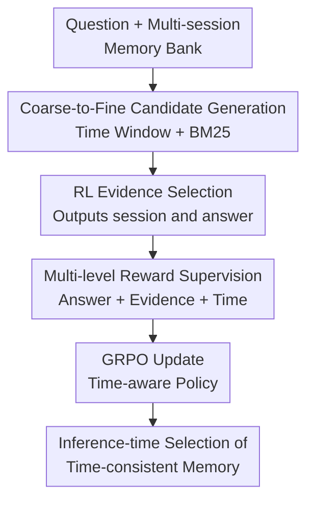

# Memory-T1: Reinforcement Learning for Temporal Reasoning in Multi-session Agents

**Conference**: ICLR2026  
**OpenReview**: [https://openreview.net/forum?id=vQf2YR2Kpd](https://openreview.net/forum?id=vQf2YR2Kpd)  
**Paper**: [OpenReview](https://openreview.net/forum?id=vQf2YR2Kpd)  
**Code**: https://github.com/Elvin-Yiming-Du/Memory-T1/  
**Area**: LLM Agent / Long-term Memory / Reinforcement Learning  
**Keywords**: Multi-session Agent, Temporal Reasoning, Memory Retrieval, GRPO, Reward Design

## TL;DR
Memory-T1 models the problem of "which memory to retrieve" in multi-session dialogues as a time-aware evidence selection task. It employs a coarse-to-fine filtering process using temporal windows and relevance retrieval, followed by a policy model trained with GRPO to select evidence from candidate sessions and generate answers. This allows 3B/7B open-source models to achieve an overall score of approximately 67% on the Time-Dialog temporal reasoning benchmark.

## Background & Motivation
**Background**: Long-term dialogue agents increasingly rely on memory banks to sustain interactions across days, weeks, or even months. When a user asks a question like "Which day did Emi mention the Golden Globes last time?", the model must not only consider the current turn but also return to historical sessions, locate relevant utterances, parse relative temporal expressions (e.g., "last night," "the previous day"), and anchor them to the absolute time of the corresponding session.

**Limitations of Prior Work**: Mainstream long-context LLMs often treat multi-session history as a single piece of flat text. As the context grows longer, the number of segments that are semantically similar but temporally incorrect increases. Models are easily attracted by sentences that "look right" while ignoring the specific time range constrained by the question. Although traditional RAG can shorten the context, it usually ranks by text relevance and cannot guarantee that the retrieved sessions are temporally accurate.

**Key Challenge**: Multi-session temporal reasoning requires both "semantic relevance" and "temporal correctness." Optimizing only the final answer leads to sparse training signals, as it is difficult to determine whether a wrong answer stems from selecting the wrong session, incorrect parsing of relative time, or a failure in reasoning steps. Conversely, purely rule-based temporal filtering may miss ambiguous expressions and cross-session dependencies, failing to handle noise in real dialogues.

**Goal**: The authors aim to train an agent capable of explicitly selecting evidence sessions, narrowing the search space in large and noisy memory banks, and learning to pick time-consistent evidence that truly supports the answer. This goal is decomposed into three sub-problems: achieving high recall for candidate sessions, enabling the model to bind cited evidence with the answer, and utilizing rewards denser than simple answer correctness to guide temporal reasoning.

**Key Insight**: A key observation is that multi-session dialogues naturally carry session timestamps. During the training phase, one can annotate question time ranges, evidence sessions, and utterance-level event times. While these annotations cannot be exposed to the model during inference, they serve as signals for a verifier to train a policy more adept at selecting time-consistent memories.

**Core Idea**: Memory-T1 replaces direct long-context Q&A with a coarse-to-fine framework involving "temporal filtering + text retrieval + RL fine-selection." The memory selection policy is trained using three types of rewards: answer accuracy, evidence grounding, and temporal consistency.

## Method

### Overall Architecture
The input to Memory-T1 is a temporal question $q$ and a multi-session memory bank $M=\{(\tau_i,S_i)\}_{i=1}^{N}$, where each session $S_i$ has its own timestamp $\tau_i$ and several utterances. The model ultimately outputs two components: a set of selected evidence session IDs and an answer derived from those evidences.

The overall process is divided into two stages. The first is candidate generation: the model first predicts the target time range for the question, applies hard filtering based on session timestamps, and then uses BM25 to rank the remaining sessions by textual relevance to select the top-$k$. The second stage is RL fine-selection: the policy model reads the question and the candidate pool to generate a structured output in the form of `{selected_memory: [...], answer: ...}`. During training, a multi-stage reward evaluates whether the selected evidence and the answer are both correct.

The emphasis of this framework is not on making the model remember more context, but on making it see less context more accurately. Temporal filtering removes sessions clearly out of range, BM25 retains semantically relevant candidates, and the RL policy handles finer ambiguities—such as when two sessions mention the same event, but only one's "last night" falls within the time period specified by the question.

### Key Designs
**1. Coarse-to-fine candidate generation: ensuring recall via time windows, then managing context via BM25**

The direct challenge of multi-session memory banks is scale and noise. Instead of exposing the policy model to the full history, Memory-T1 first uses an LLM to predict a target time window $(t_{start},t_{end})$ from the question and retains sessions whose timestamps overlap with this window, resulting in $M_{temp}$. This step excludes "temporally impossible" history, preventing subsequent retrieval from being diluted by irrelevant old fragments.

Following temporal filtering, BM25 is used to rank sessions in $M_{temp}$ by text relevance, selecting the top-$k$ to form the candidate pool $C$: $C=\arg\operatorname{top-k}_{(\tau_i,S_i):t_{start}\leq\tau_i\leq t_{end}}\operatorname{Retriever}(q,S_i)$. This combination is simple but addresses the two necessary conditions: the time window ensures candidates do not deviate from the question's scope, and lexical relevance ensures the candidates contain textual evidence to answer the question. In experiments, with top-$k=10$, evidence recall reached nearly 90%, indicating this stage focuses on "not missing evidence" rather than final judgment.

**2. Structured action space: learning to cite evidence and generate answers simultaneously**

If a model is trained only to output answers, it might provide the correct answer but cite the wrong evidence, or guess correctly based on incorrect evidence. Memory-T1 defines the policy model's action as a composite string containing both `selected_memory` and `answer`. For example, the model generates `{selected_memory: [session_3, session_16], answer: 19 days}`, and the training script parses the evidence set $S\subseteq C$ and answer $a$.

This design explicitly incorporates "why I answered this way" into the learning objective. Once the evidence sessions are included in the output, the verifier can compute grounding and temporal rewards; conversely, the model is forced to learn which sessions must be selected to support the specific answer. In multi-session temporal reasoning, this is critical because errors often stem from conflating people with the same name, similar events, or adjacent dates rather than a lack of language generation ability.

**3. Multi-level rewards: mitigating sparse supervision with answer, evidence, and temporal consistency**

The total reward for Memory-T1 is $R=w_aR_a+w_gR_g+w_tR_t$, with a penalty of $-0.5$ if parsing fails. $R_a$ evaluates answer correctness using different metrics for various question types: exact match for multiple-choice, unit-aware accuracy for timestamps, $\epsilon$-EM (allowing margin of error) for durations, and Hamming accuracy for event ordering. This ensures answer rewards cover diverse temporal Q&A formats without reducing all questions to binary classification.

More discriminative are $R_g$ and $R_t$. $R_g$ compares the model-selected session set with the gold evidence set (using a Jaccard scale in the text and an F1 approach in the appendix), rewarding "correct evidence selection." $R_t$ further assesses temporal consistency, comprising session-level chronological proximity $R_s$ and utterance-level chronological fidelity $R_f$. $R_s$ uses a logistic penalty to measure the distance between the selected session and the question time range $I_Q$, assigning higher scores to neighboring sessions; $R_f$ checks if event times in relevant utterances fall within $I_Q$, awarding $+1$ for full overlap, $+0.5$ for partial, and $-1$ for no overlap. Thus, the model is encouraged not just to find the "same topic" but the "topic within the same temporal context."

**4. Training annotations serve only rewards: inference remains standard multi-session Q&A**

The authors supplemented Time-Dialog with three types of annotations: question target time range $I_Q$, gold evidence sessions/utterances, and utterance-level event times. These annotations, derived from GPT-4 initial labeling and human verification, achieved over 95% accuracy at the session level and 85% at the utterance level. They are not shown to the model during inference and are only used to calculate rewards during training.

This separation makes the method suitable for real-world deployment: the online agent still receives only historical dialogues and the question, without relying on external temporal parsers or manual labels. However, during training, the reward model uses fine-grained annotations to tell the policy, "the evidence you selected is semantically relevant, but the time span is incorrect." This flexibility allows Memory-T1 to handle relative time, event sequences, and co-occurrence relationships within candidates through a learned policy rather than rigid rules.

### A Complete Example
Suppose a user asks: "Fact 1 is Emi mentioned hair care tips discussed the previous day; Fact 2 is Emi suggested Elise stay hydrated, wear comfortable clothes, and not eat too much before yoga class. Which happened earlier?" The full memory bank might contain dozens of sessions mentioning Emi, Elise, hair care, or yoga.

First, temporal filtering estimates a broad time range based on the two facts and context, discarding sessions that are clearly too early or too late. Second, BM25 ranks sessions containing "hair tips," "hydrated," or "yoga class" higher, creating a candidate pool of, say, 10 sessions. Third, the policy model must select the actual evidence sessions: hair care tips might correspond to session 13, and yoga suggestions to session 17. It cannot simply see "previous day" and answer; it must anchor that relative expression to the session's absolute time.

If the model selects session 13 and session 17 and answers that Fact 1 was earlier, it receives the answer reward, grounding reward, and temporal consistency reward. If it selects a session with similar hair care topics but the wrong time, $R_g$ and $R_t$ will penalize the total reward even if the final answer was a lucky guess, pushing the policy to learn to select temporally clean evidence.

### Loss & Training
Memory-T1 uses GRPO to train the policy model. For each question and candidate pool $(q,C)$, the model samples $G$ outputs. Each output is parsed into $(S_j,a_j)$, and $R_j$ is obtained via multi-stage rewards. GRPO uses the group mean as a baseline for the advantage: $\hat{A}_j=R_j-\frac{1}{G}\sum_{j=1}^{G}R_j$, reducing reward variance.

The training objective follows the PPO-style clipped ratio and includes a KL regularization term against a frozen reference policy $\pi_{ref}$ to prevent excessive updates. The implementation is based on VERL, using Qwen2.5-3B-Instruct and Qwen2.5-7B-Instruct as base models. Hyperparameters include a batch size of 32, a learning rate of $1\times10^{-6}$, $K=8$ rollouts per prompt, a KL coefficient of 0.1, and a maximum sequence length of 16k tokens. The optimal reward weight configuration is $(w_a,w_g,w_t)=(0.6,0.2,0.2)$, prioritizing answer correctness while maintaining sufficient supervision for evidence and time.

## Key Experimental Results

### Main Results
The paper primarily evaluates on Time-Dialog, covering 11 types of temporal reasoning subtasks, including localization, duration comparison, sequential reasoning, range reasoning, co-occurrence, and timeline ordering. Both 3B and 7B versions of Memory-T1 achieved an overall score of approximately 67%, outperforming Qwen2.5-14B, MemAgent-7B, Time-R1, and GPT-4 in standard full prompt or ReAct settings.

| Model / Setting | Overall | OR (Sequential) | RR (Range) | CTF (Context Filter) | Co-tmp. (Co-occurrence) | Note |
|--------|--------|--------|--------|--------|--------|------|
| GPT-4 Oracle Evidence | 86.2 | 88.9 | 93.8 | 83.3 | 100.0 | Upper bound with gold evidence |
| GPT-4 Full Prompt | 64.8 | 55.6 | 81.3 | 50.0 | 77.8 | Direct full context |
| GPT-4 ReAct | 62.8 | 72.2 | 70.8 | 68.5 | 84.3 | Tool-based reasoning |
| Time-R1 | 49.4 | 27.8 | 44.4 | 55.6 | 66.7 | Zero-shot temporal model |
| MemAgent-7B | 49.9 | 38.9 | 62.5 | 38.9 | 72.2 | Memory agent baseline |
| Qwen2.5-14B Instruct | 60.7 | 66.7 | 75.0 | 69.7 | 94.4 | Larger base model |
| Memory-T1 3B | 66.9 | 66.7 | 87.5 | 88.9 | 94.4 | 3B outperforms 14B baseline |
| Memory-T1 7B | 67.0 | 83.3 | 87.5 | 88.9 | 94.4 | Strongest non-Oracle model |

OOD generalization also improved on LoCoMo. Memory-T1 3B achieved 37.7% overall in the Non-RAG setting, 4.2 points higher than Qwen2.5-3B Instruct (33.5%). In Temporal subtasks, it improved from 24.5% to 31.5%, indicating that it learned general temporal memory selection capabilities rather than just Time-Dialog formats.

| Model | Setting | Single-Hop | Multi-Hop | Temporal | Adversarial | Overall |
|------|------|------|------|------|------|------|
| Qwen2.5-3B Instruct | Non-RAG | 49.8 | 28.7 | 24.5 | 16.6 | 33.5 |
| Qwen2.5-3B Instruct | RAG | 46.0 | 22.0 | 27.3 | 19.5 | 31.9 |
| Memory-T1 3B | Non-RAG | 51.2 | 30.2 | 31.5 | 26.0 | 37.7 |
| Memory-T1 3B | RAG | 48.9 | 25.8 | 30.7 | 29.8 | 36.7 |

### Ablation Study
Ablation of rewards shows that the performance gain of Memory-T1 stems from multi-level reward synergy rather than simple RL fine-tuning. Using only the answer reward $R_a$ dropped the overall score from 66.9 to 51.9, with complex reasoning in Category B/C collapsing. Removing grounding reward $R_g$ also lowered scores in localization and extraction tasks, as the model became more prone to citing semantically similar but non-supporting sessions.

| Configuration | Category A | Category B | Category C | Overall | Description |
|------|------|------|------|------|------|
| Memory-T1 3B | 49.5 | 79.5 | 80.3 | 66.9 | Full Rewards |
| w/o $R_t$ | 45.6 | 75.1 | 64.3 | 63.5 | Removed temporal consistency; Cat C dropped most |
| remove $R_s$ only | 61.1 | 34.8 | 66.3 | 66.3 | Simple tasks better, sequential reasoning collapsed |
| remove $R_f$ only | 50.0 | 56.5 | 63.0 | 64.8 | Complex tasks dropped without utterance temporal density |
| w/o $R_g$ | 40.9 | 75.3 | 75.9 | 60.8 | Grounding critical for localization/extraction |
| $R_a$ only | 43.6 | 57.5 | 59.0 | 51.9 | Sparse supervision with answer only |

### Key Findings
- The primary value of Memory-T1 lies in complex temporal reasoning rather than simply scaling parameters. The 3B version (66.9) outperformed the Qwen2.5-14B baseline (60.7), suggesting "selecting the right memory" is more effective than "feeding more context to a larger model."
- Temporal consistency rewards are crucial for structured temporal tasks (Category C). Removing $R_t$ dropped Category C from 80.3 to 64.3, indicating that tasks like co-occurrence and timeline ordering require explicit temporal supervision.
- Long-context robustness is a standout feature. In the 64k-128k token range, the standard Qwen2.5 baseline suffered from attention dilution, while Memory-T1 maintained a stable advantage, with the 7B version leading by ~25 F1 points in the longest context segment.
- Sensitivity to temporal label noise is manageable. At 5% noise, the overall score remained 67.0; it decreased to 63.4 and 60.0 at 10% and 20% noise, respectively. CTF and Co-temporality tasks remained above 88.9 even with 20% noise, showing tolerance for realistic annotation errors.

## Highlights & Insights
- This work shifts the core bottleneck of "long-term memory reasoning" from generating answers to selecting evidence. For agent systems, this is a practical perspective: many failures are not due to lack of LLM reasoning ability, but because the memory manager provides a set of temporally conflicting segments.
- The reward design is more instructive than the model architecture. The combination of $R_a$, $R_g$, and $R_t$ links the final answer, interpretable evidence, and temporal consistency, providing a template for other agent tasks where final rewards are sparse.
- The two-level split of temporal rewards (session/utterance) is clever. Session-level proximity addresses date distance, while utterance-level fidelity ensures specific sentences within a session fall within the target range, addressing common errors in relative temporal expressions.
- The engineering approach is restrained. Candidate generation uses only LLM time window prediction and BM25 without complex retrievers; inference retrieval overhead is ~0.01s, allowing it to integrate naturally into existing long-term memory agents.

## Limitations & Future Work
- Training depends on fine-grained annotations. While not needed at inference, constructing Time-Dialog augmented labels requires GPT-4 and human verification. Low-cost acquisition of such labels for real-world products remains a barrier.
- The first step of candidate generation relies on LLM predicted time windows; if the time range of a question is obscure, hard filtering might prematurely discard key sessions.
- Currently, actions focus on session-level evidence selection. For tasks requiring complex combinations across many utterances or maintaining an updatable structured timeline, session granularity might be too coarse.
- Timeline and Comparison tasks remain weak points. Low performance in these areas suggests the current policy is better at finding consistent evidence than performing deep combinatorial sorting or global multi-event planning.
- Compared to real long-term memory systems, the schemas of Time-Dialog are relatively clean. Future work could extend Memory-T1 to online management involving continuous writing, forgetting, conflicting memory correction, and privacy constraints.

## Related Work & Insights
- **vs. Long-context LLMs**: Long-context models feed history directly into the prompt—simple but prone to being "lost in the middle." Memory-T1 trains the model to select time-consistent evidence from a candidate pool instead of attempting to "see everything."
- **vs. Standard RAG**: Standard RAG optimizes for semantic relevance, where time is often only implicit in the query. Memory-T1 adds temporal filtering before RAG and RL fine-selection after, elevating retrieval from "relevant segments" to "sessions supporting temporal answers."
- **vs. TReMu**: Frameworks like TReMu rely more on timeline summaries or explicit temporal processing, making them susceptible to timestamp or summary errors. Memory-T1 learns implicit selection through rewards.
- **vs. Time-R1**: Time-R1 focuses on general LLM temporal reasoning, whereas Memory-T1 targets evidence selection within multi-session unstructured dialogue memory.
- **vs. MemAgent**: MemAgent uses RL for long-term context management, but relying primarily on answer rewards keeps temporal signals sparse. Memory-T1's insight is to add task-specific verifiers to memory agents.

## Rating
- Novelty: ⭐⭐⭐⭐☆ Combines RL memory selection with fine-grained temporal consistency rewards naturally; modules are simple, but the combination addresses a real pain point for multi-session agents.
- Experimental Thoroughness: ⭐⭐⭐⭐☆ Covers Time-Dialog, reward ablation, candidate generation, OOD, long context, noise, and efficiency.
- Writing Quality: ⭐⭐⭐⭐☆ Clear structure and complete reward explanations.
- Value: ⭐⭐⭐⭐⭐ High practical value for long-term memory agents, specifically in "training a model that knows how to select memories" rather than just extending the context window.

<!-- RELATED:START -->

## Related Papers

- [\[ICLR 2026\] Reducing Belief Deviation in Reinforcement Learning for Active Reasoning of LLM Agents](reducing_belief_deviation_in_reinforcement_learning_for_active_reasoning.md)
- [\[ACL 2026\] Temp-R1: A Unified Autonomous Agent for Complex Temporal KGQA via Reverse Curriculum Reinforcement Learning](../../ACL2026/llm_agent/temp-r1_a_unified_autonomous_agent_for_complex_temporal_kgqa_via_reverse_curricu.md)
- [\[ICLR 2026\] MEM1: Learning to Synergize Memory and Reasoning for Efficient Long-Horizon Agents](mem1_learning_to_synergize_memory_and_reasoning_for_efficient_long-horizon_agent.md)
- [\[AAAI 2026\] MoralReason: Generalizable Moral Decision Alignment For LLM Agents Using Reasoning-Level Reinforcement Learning](../../AAAI2026/llm_agent/moralreason_generalizable_moral_decision_alignment_for_llm_agents_using_reasonin.md)
- [\[ICLR 2026\] REMem: Reasoning with Episodic Memory in Language Agents](remem_reasoning_with_episodic_memory_in_language_agent.md)

<!-- RELATED:END -->
