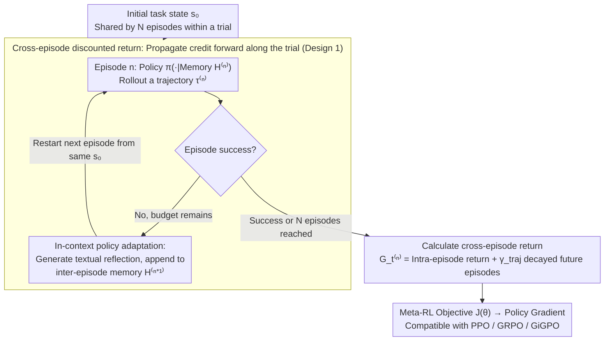

# Meta-RL Induces Exploration in Language Agents

**Conference**: ICLR 2026  
**arXiv**: [2512.16848](https://arxiv.org/abs/2512.16848)  
**Code**: [mlbio-epfl/LaMer](https://github.com/mlbio-epfl/LaMer)  
**Area**: LLM/NLP  
**Keywords**: Meta-RL, LLM Agent, Exploration & Exploitation, Multi-round Interaction, Cross-episode Training, Self-reflection

## TL;DR

The LaMer framework is proposed to introduce Meta-Reinforcement Learning (Meta-RL) into LLM agent training. By optimizing cross-episode rewards and employing reflection-based in-context policy adaptation, the framework enables language agents to actively explore environments, achieving absolute performance improvements of 11%, 14%, and 19% on Sokoban, MineSweeper, and Webshop, respectively.

## Background & Motivation

### Background

Recently, LLMs have transitioned from dialogue systems to decision-making agents (e.g., ReAct, Reflexion), capable of interacting with environments through multi-round text observation-action loops. However, existing RL-trained LLM agents suffer from a core deficiency: **a lack of active exploration capability**. In tasks requiring trial-and-error learning, agents often converge prematurely to sub-optimal policies and fail to adapt to new environments through systematic exploration like humans.

### Limitations of Prior Work

**Prompting Methods** (Zero-shot, ReAct, Reflexion): These rely on frozen LLMs, leading to limited exploration behavior and a low performance ceiling.

**Standard RL Training** (PPO, GRPO, GiGPO): Episodes are sampled independently, resulting in fixed policies that cannot adapt through trial-and-error during testing.

**Offline Distillation Methods**: These rely on offline data and focus on imitation rather than active exploration; most target single-round reasoning rather than multi-round agent tasks.

### Key Insight

Multi-round tasks often provide sparse success signals only at the end of an episode. If **multiple episodes are treated as a single trial**, the balance between exploration and exploitation naturally transforms into a **cross-episode RL problem**—precisely the Meta-RL framework. By training on various different but similar environments, the agent is forced to learn generalized exploration strategies.

## Method

### Overall Architecture

LaMer (LLM Agent with Meta-RL) decomposes a task attempt into a trial $\mathcal{T} = (\tau^{(0)}, \tau^{(1)}, \dots, \tau^{(N-1)})$ consisting of $N$ sequential episodes. The agent explores boldly in early episodes and exploits accumulated experience in later ones. After each episode, if unsuccessful, the agent generates a textual reflection, appends experience to the inter-episode memory, and restarts the next episode from the **same initial state** until success or the budget of $N$ episodes is exhausted. Rewards are not settled within a single episode but are propagated forward along the entire trial to a standard policy gradient optimizer. This mechanism changes neither the number of training trajectories nor the underlying optimizer; it alters the organization of trajectories and reward propagation, turning "exploration" itself into an objective directly optimizable by RL. Two core designs—cross-episode discounted return and reflection-based in-context policy adaptation—address credit assignment across episodes and adaptation without weight updates during testing.

### Key Designs

**1. Cross-episode Discounted Return: Rewarding Exploration Behavior**

Success signals in multi-round tasks are often so sparse they only appear at the end of an episode, preventing standard RL from learning "trial-and-error" strategies—early exploration actions receive almost no reward within their own episode and are suppressed by gradients. LaMer propagates rewards forward along the trial: the return for step $t$ in episode $n$ is defined as:

$$G_t^{(n)} = g_t^{(n)} + \sum_{m=n+1}^{N-1} \gamma_{\text{traj}}^{m-n} g_0^{(m)}$$

The first term $g_t^{(n)} = \sum_{l=t}^{T-1} \gamma_{\text{step}}^{l-t} r_l^{(n)}$ is the standard discounted return within an episode, while the second term accumulates the initial returns $g_0^{(m)}$ of subsequent episodes, decayed by a cross-episode discount factor $\gamma_{\text{traj}}$. Thus, even if an early episode fails, if the information it provides helps a subsequent episode succeed, the exploration receives positive credit. The corresponding meta-reinforcement objective is $J(\theta) = \mathbb{E}_{\mathcal{T} \sim \pi_\theta} \big[ \sum_{n=0}^{N-1} \gamma_{\text{traj}}^n \sum_{t=0}^{T-1} \gamma_{\text{step}}^t r_t^{(n)} \big]$. Here, $\gamma_{\text{traj}} \in [0,1]$ serves as an intuitive exploration-exploitation knob: lower values (e.g., 0.6) favor fast exploitation by devaluing later episodes, while higher values (e.g., 0.9) encourage the agent to spend more budget on strategic exploration. In experiments, Sokoban/Webshop preferred 0.6, while MineSweeper, requiring more exploration, preferred 0.9.

**2. Reflection-based In-context Policy Adaptation: Enhancing Test-time Growth Without Weight Updates**

Classic Meta-RL inner loops rely on implicit memory or gradients for task adaptation, which is cumbersome for LLMs. LaMer leverages the linguistic capabilities of LLMs: after each episode, the agent generates a textual reflection, which, together with the trajectory history, forms the inter-episode memory $\mathcal{H}^{(n)}$. The policy for the next episode is conditioned on this memory, i.e., $\pi_\theta^{(n)}(\cdot) = \pi_\theta(\cdot | \mathcal{H}^{(n)})$. Adaptation occurs entirely in-context without gradient updates, naturally supporting continuous improvement during testing. Crucially, the reflection is not a frozen prompting trick; it is trained via backpropagation from rewards obtained in subsequent episodes, allowing the agent to learn to write reflections that are "actually useful for the next attempt." This distinguishes LaMer from Reflexion, which uses a similar structure but keeps the LLM frozen, preventing reflection optimization. Ablations show that keeping only reflections (removing raw trajectories) is often better than keeping both, as reflections are more concise and avoid crowding the context window with long histories.

### Loss & Training

By substituting the cross-episode return into the policy gradient, the LaMer training objective is derived as $\nabla_\theta J(\theta) = \mathbb{E}_{\mathcal{T}} \big[ \sum_{n=0}^{N-1} \sum_{t=0}^{T-1} \nabla_\theta \log \pi_\theta(a_t^{(n)} | s_t^{(n)}, \mathcal{H}^{(n)}) A_t^{(n)} \big]$, where action probabilities are explicitly conditioned on the inter-episode memory $\mathcal{H}^{(n)}$, and the advantage $A_t^{(n)}$ is calculated from the cross-episode return $G_t^{(n)}$. The only difference from standard RL is that standard RL samples episodes independently for each task, whereas LaMer generates episodes sequentially within a trial, each conditioned on the preceding ones. Consequently, it can directly utilize mainstream optimizers like PPO, GRPO, and GiGPO. This paper uses the state-of-the-art single-episode baseline GiGPO by default.

## Key Experimental Results

### Main Results

The base model used is Qwen3-4B, with $N=3$ episodes and a group size of 8 (RL uses a group size of 24 for fairness).

| Method | Sokoban p@1/p@2/p@3 | MineSweeper p@1/p@2/p@3 | Webshop p@1/p@2/p@3 |
|------|---------------------|--------------------------|---------------------|
| Zero-shot | 6.8/9.8/12.9 | 4.5/6.6/8.6 | 1.4/2.1/2.3 |
| ReAct | 7.2/9.6/12.5 | 6.3/7.0/10.9 | 3.1/4.5/4.5 |
| Reflexion | 6.4/9.8/12.1 | 5.5/7.2/9.8 | 2.7/3.3/3.5 |
| PPO | 12.5/15.4/16.8 | 29.7/34.2/35.5 | 53.1/54.5/54.9 |
| GiGPO | 41.6/43.6/44.1 | 52.0/54.9/55.1 | 73.4/74.6/75.2 |
| **Ours** | **42.4/52.0/55.9** | **44.1/66.4/74.4** | **67.8/84.4/89.1** |

Ours significantly outperforms all baselines at p@3: Sokoban +11.8%, MineSweeper +19.3%, and Webshop +13.9%.

### OOD Generalization Experiment (ALFWorld)

| Method | Pick(i.d.) | Look(i.d.) | Clean(i.d.) | Heat(i.d.) | Cool(o.o.d.) | Pick2(o.o.d.) |
|------|-----------|-----------|------------|-----------|-------------|--------------|
| Prompting | 91.9 | 52.9 | 48.4 | 44.8 | 42.8 | 21.2 |
| RL | 95.5 | 83.0 | 67.9 | 86.6 | 58.1 | 36.0 |
| **Meta-RL** | **97.7** | **100.0** | **90.2** | **89.5** | **81.0** | **50.2** |

On OOD tasks, Meta-RL exceeds RL by 23% (Cool) and 14% (Pick2).

### Ablation Study

**Memory Configuration Ablation** (p@3):

| Memory Content | Sokoban | MineSweeper | Webshop |
|---------|---------|-------------|---------|
| Trajectory only | 34.8 | 69.5 | 89.3 |
| Reflection only | **56.4** | **80.5** | **92.8** |
| Both | 55.9 | 74.4 | 89.1 |

Reflections provide significant gains; "Reflection only" even outperforms the default setting as it is more concise.

**Impact of $\gamma_{\text{traj}}$**:
- Optimal $\gamma_{\text{traj}}=0.6$ for Sokoban/Webshop (balance of immediate and long-term reward).
- Optimal $\gamma_{\text{traj}}=0.9$ for MineSweeper (requires more strategic exploration).

### Key Findings

1. Meta-RL maintains higher trajectory diversity (measured by entropy of experience distribution), achieving a better exploration-exploitation tradeoff.
2. On harder tasks (more boxes/mines), Meta-RL consistently leads RL by a margin of 5-10%.
3. Test-time scaling is more effective: the improvement from p@1 to p@3 in LaMer is far greater than in RL (Sokoban: 13.5% vs <5%).

## Highlights & Insights

1. **First introduction of Meta-RL to LLM Agent training**: Adapts classical Meta-RL cross-task generalization to LLM multi-episode interactions.
2. **Elegant Formulation**: $\gamma_{\text{traj}}$ provides a concise knob for exploration-exploitation control.
3. **Dual Role of Self-Reflection**: Acts as both an adaptation mechanism and a training signal; ablations confirm its critical role.
4. **New Perspective on Test-time Scaling**: Meta-RL can be viewed as amortizing test-time computation through multi-episode training.
5. **No Extra Training Data Required**: Uses the same number of trajectories as RL, only modifying their organization.

## Limitations & Future Work

1. **Training time is approximately double that of RL**: Sequential generation of episodes within a trial limits parallelism.
2. **Validated on a single base model** (Qwen3-4B): Effectiveness on larger models remains to be verified.
3. **Limited environment types**: Primarily text-based games/web environments; complex real-world agent tasks need further exploration.
4. **Context length constraints**: Histories and reflections from multiple episodes can quickly fill the context window.

## Related Work & Insights

- **Reflexion** (Shinn et al., 2023): Uses multi-episode + reflection, but freezes the LLM without training.
- **GiGPO** (Feng et al., 2025): State-of-the-art single-episode RL baseline, which LaMer extends to a multi-episode framework.
- **Test-time compute scaling**: LaMer offers a method to improve test-time scaling through training.
- **Insight**: This framework could be combined with stronger reasoning models (e.g., R1 series) to explore the synergy between Reasoning and Exploration.

## Rating

- **Novelty**: ⭐⭐⭐⭐ — First to adapt Meta-RL for LLM Agents with a concise formulation.
- **Value**: ⭐⭐⭐⭐ — Mature design of cross-episode reward propagation with clear theoretical analysis.
- **Experimental Thoroughness**: ⭐⭐⭐⭐⭐ — 4 environments + OOD generalization + difficulty generalization + detailed ablations.
- **Practical Value**: ⭐⭐⭐⭐ — General framework compatible with mainstream RL algorithms.
- **Overall Recommendation**: ⭐⭐⭐⭐ — Solid work opening a new direction for training LLM Agent exploration capabilities.

<!-- RELATED:START -->

## Related Papers

- [\[ICLR 2026\] Scaling Synthetic Task Generation for Agents via Exploration](scaling_synthetic_task_generation_for_agents_via_exploration.md)
- [\[ICLR 2026\] Go-Browse: Training Web Agents with Structured Exploration](go-browse_training_web_agents_with_structured_exploration.md)
- [\[ICLR 2026\] Dual-Scale World Memory for LLM Agents towards Hard-Exploration Problems](dual-scale_world_memory_for_llm_agents_towards_hard-exploration_problems.md)
- [\[ACL 2026\] Meta-Tool: Efficient Few-Shot Tool Adaptation for Small Language Models](../../ACL2026/llm_agent/meta-tool_efficient_few-shot_tool_adaptation_for_small_language_models.md)
- [\[ICLR 2026\] AgentGym-RL: An Open-Source Framework to Train LLM Agents for Long-Horizon Decision Making via Multi-Turn RL](agentgym-rl_an_open-source_framework_to_train_llm_agents_for_long-horizon_decisi.md)

<!-- RELATED:END -->
