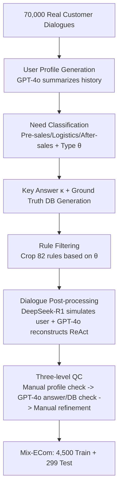

# Mix-ECom: Towards Mixed-Type E-Commerce Dialogues with Complex Domain Rules

**Conference**: ICLR 2026  
**OpenReview**: [https://openreview.net/forum?id=ECTv9t8kTJ](https://openreview.net/forum?id=ECTv9t8kTJ)  
**Code**: Dataset promised to be public (link pending)  
**Area**: LLM Agent / E-commerce customer service dialogue / Benchmark  
**Keywords**: E-commerce Agent, Mixed-type dialogues, Complex domain rules, ReAct, Plan-and-Solve, Tool invocation, Hallucination suppression

## TL;DR
This paper constructs the first customer service benchmark **Mix-ECom**, which features "four dialogue types mixed in a single conversation + 82 real-world e-commerce domain rules." It proposes a **dynamic rule filtering module** placed before ReAct/Plan-and-Solve to suppress hallucinations caused by complex rules, revealing that the current strongest multimodal LLM Agents still achieve a total score of only 62% on real e-commerce service tasks.

## Background & Motivation

**Background**: LLM Agents have become the main force in e-commerce customer service, covering the entire process of pre-sales, logistics, and after-sales. To evaluate these agents, the community has sequentially released benchmarks such as EcomScriptBench, CBYS, RECBENCH-MD, τ-retail, and ECom-Bench.

**Limitations of Prior Work**: Almost all existing benchmarks are "fragmented"—either only measuring product Q&A (CBYS), recommendation (RECBENCH-MD), or utilizing highly simplified domain strategies that are detached from real business (τ-retail). They generally assume "one dialogue solves only one type of task with simple rules," whereas real customer service involves **dynamic switching** of user needs. A single dialogue may start with a complaint (task-oriented), follow with a recommendation request (recommendation), ask about shipping time (Q&A), and finally require emotional comfort (chit-chat).

**Key Challenge**: Real e-commerce rules are extremely complex (this paper identifies 82 fine-grained rules, such as "Shipping insurance subsidizes up to ¥9, user pays the excess" or "Fresh food is refund-only, no returns"). Existing evaluations fail to assess the Agent's ability to handle **mixed-type dialogues** within a single session or its ability to **strictly follow complex domain rules**—the latter being a major area for Agent hallucinations.

**Goal**: Create a benchmark close to real business that stress-tests the triple difficulty of "mixed dialogues + complex rules + multi-modality," while providing an Agent framework baseline capable of alleviating rule-induced hallucinations.

**Key Insight**: ① **Distill** 4,799 high-quality, CoT-labeled, anonymized samples from 70,000 real customer dialogues, where each dialogue naturally combines multiple task types. ② Propose **dynamic rule filtering**—after each user input, the 82 rules are cropped into a "relevant subset" based on the current context before being fed into ReAct/Plan-and-Solve, compressing the search space and reducing interference from irrelevant rules at the source.

## Method

### Overall Architecture
The work consists of two parts: the **dataset construction** (a pipeline cleaning real dialogues into evaluable samples) and the **dynamic e-commerce Agent framework** (adding a rule filtering module to classic Agent paradigms). Each sample is formalized as a seven-tuple $\{\upsilon, \tau, \alpha, o, \delta, \kappa, \theta\}$, representing user profile, reference solution, action chain, action response, database, key answer, and question type. The Agent cannot see the database $\delta$ and can only read/write indirectly through the toolset $T$.

### Key Designs

**1. Seven-tuple Sample Representation and Natural Origin of "Mixed-Types":** The dataset is not synthesized from scratch but selected from real records where "one chat solves multiple demands." Thus, each sample naturally spans Q&A, recommendation, task-oriented, and chit-chat. Each sample uses a seven-tuple: user profile $\upsilon=\{u_a, u_d\}$ (basic info + specific demand) drives the user/agent simulation; question type $\theta$ is derived from the profile and order/logistics status; key answer $\kappa$ is the information the agent **must** convey to the user (e.g., "Return shipping is 10 yuan"); database $\delta$ is invisible to the Agent and only accessible via tools. This representation allows "mixed dialogues" to be both generated and objectively judged—evaluation only requires checking if all $\kappa$ are mentioned and if $\delta$ is correctly updated.

**2. Three-stage Data Construction and QC Pipeline:** Starting from 70,000 dialogues, GPT-4o generates $\upsilon$ combined with history. For logistics, due to simple demands, **multiple needs are manually concatenated** to increase complexity. After-sales retains user photos, and pre-sales retains product details and livestream clips as multimodal files $F$. Next, $\kappa$ and ground truth databases are generated based on $\theta$. Then, dialogue post-processing uses DeepSeek-R1 as the user and GPT-4o (ReAct) as the agent to rewrite real human responses into **ReAct format `<Thought>/<Action_input>/<Observation>/<Final_Answer>` chains** while anonymizing. Final three-level Quality Control: manual removal of low-quality profiles, GPT-4o automatic verification of key answers and database consistency, and manual refinement to correct omissions and remove logical contradictions (e.g., unreasonable pricing). This results in 4,500 training and 299 test samples, with a Fleiss Kappa of 0.76 and 86% of samples receiving full marks in manual scoring.

**3. Dynamic Rule Filtering Module (Mechanism):** A real pain point is that stuffing 82 rules into a prompt causes the model to be "distracted by irrelevant rules," leading to hallucinations. This module is attached **before** the ReAct/Plan-and-Solve reasoning loop. Whenever the Agent performs $\alpha_i = \text{talk\_to\_user}$ and receives new user input, it triggers: input the triple $\{C, P, H_t\}$ (context, full rules, trajectory), and output a **task-focused rule subset** $P_f \subseteq P$ and a **filtered trajectory** $H_f^t$, removing irrelevant rules and previously generated hallucinated steps. The trajectory $H_t = (\tau_0, \alpha_0, o_0, \tau_1, ..., \tau_{t-1}, \alpha_{t-1}, o_{t-1})$ is the cumulative sequence of thought-action-observation. This step repeats after each user interaction for context-adaptive reasoning.

**4. Implementation of E-ReAct and E-Plan&Solve Paradigms:** The dynamic module is embedded in two ways. **E-ReAct** feeds the updated $\{F, Q, P_f, T, H_f^t\}$ back into the ReAct loop, mitigating subsequent hallucinations through both rule and trajectory pruning. **E-Plan&Solve** goes further—it not only crops rules but also **rewrites the plan** $P^f$ when user needs change: given $\{C, P, H_t\}$, it outputs the focused rule subset and a revised plan. This allows the "plan-then-execute" paradigm to dynamically respond to new user requests, particularly in "user changed their mind" scenarios. Both trigger after each `talk_to_user`, forming a context-adaptive plan-execute loop.

## Key Experimental Results

### Main Results (299 test samples, KA=Key Answer score, DB=Database score, Score=Percentage where both are correct, %)

| Model | Framework | Logistics | After-sales | Pre-sales | Total Score |
|---|---|---|---|---|---|
| GPT-4o | ReAct | 46.7 | 32.9 | 49.0 | 43.1 |
| GPT-4o | **E-ReAct** | 54.6 | 36.2 | 55.0 | **49.2** |
| Gemini-2.5-pro | ReAct | 53.7 | 48.3 | 58.0 | 53.5 |
| Gemini-2.5-pro | **E-ReAct** | 67.9 | 50.5 | 62.0 | **60.5** |
| Gemini-2.5-pro | **E-Plan&Solve** | 66.7 | 53.8 | 65.0 | **62.2** |
| Claude-4-Sonnet | E-ReAct | 69.4 | 57.1 | - (Video unsupported) | - |
| Qwen-VL-MAX | E-ReAct | 44.4 | 46.1 | 57.0 | 49.2 |
| Qwen-2.5-VL-7B | ReAct | 0.9 | 0.0 | - | - |
| Qwen-2.5-VL-7B* (SFT) | ReAct | 19.3 | 17.7 | - | - |

The strongest combination (Gemini-2.5-pro + E-Plan&Solve) achieved a total score of only 62.2, indicating the **benchmark is far from solved**. The dynamic module brought consistent improvements to all models, with the largest gain in logistics (clean queries, rare rule deletions).

### Ablation Study (GPT-4o, excluding multimodal/rules, Table 5)

| Multi-modal | Rule | Logistics | After-sales | Pre-sales |
|---|---|---|---|---|
| ✓ | ✓ | 46.7 | 32.9 | 49.0 |
| ✘ | ✓ | 46.7 | 28.9 | 43.0 |
| ✓ | ✘ | **2.2** | 17.6 | 37.0 |

Removing multimodal input only caused a 3.3/6.0 point drop, suggesting models rarely utilize visual cues. Removing rules caused the logistics score to plummet from 46.7 to 2.2 and after-sales by 11.3. **Rules are the lifeblood of task solvability.**

### Key Findings
- **Hallucination root cause is rule violation**: In failure analysis, 63% came from violating fine-grained rules (e.g., changing address requires updating the order address + courier destination + resetting logistics status), 15% from multimodal misinterpretation, 12% from premature handovers to humans, and 5% others.
- **Extremely low multimodal utilization**: Removing images/videos hardly affected scores, exposing current Agents' weakness in understanding complex multimodal content.
- **Dataset validity**: Qwen-2.5-VL-7B scored only 0.9 in logistics "out of the box," rising to 19.3 after SFT with this data, verifying the training set's value.
- **Human Evaluation**: Gemini-2.5-pro scored highest in anthropomorphism, informativeness, and key answers, but remained significantly behind the Ground Truth (82.6/91.8/100).

## Highlights & Insights
- **Merging two neglected dimensions: "Mixed-Type + Complex Rules"**: This is the first benchmark to simultaneously assess four dialogue types, three e-commerce tasks, 82 rules, and image/video multimodality within a single session, with a difficulty setting close to real business.
- **The number of rules is the benchmark's moat**: Ablations show rules are the decisive factor for scores. Structuring 82 real rules moves evaluation from "can it speak" to "can it follow business protocol."
- **Dynamic rule filtering is a lightweight yet universal plugin**: It requires no backbone changes or retraining, merely cropping rules and trajectories before each interaction. It provides stable gains for all models and is transferable to any "long-strategy + multi-round" domain Agent.
- **Honest negative conclusions**: The authors state that even the strongest models are far from solving the benchmark and that multimodality is barely used, pointing to "rule following" and "multimodal decision making" as clear gaps for future research.

## Limitations & Future Work
- **Dynamic module relies on GPT-4o for filtering/judging**: The quality of rule subsets, key answer scoring, and database equivalence checks are all managed by the LLM as a judge, which may introduce evaluation bias and cost.
- **SFT coverage is limited to logistics + after-sales**: Due to video content and resource constraints in pre-sales, Qwen-2.5-VL was not trained on pre-sales, leaving the potential of open-source models under-explored.
- **Small test set**: 299 test samples is somewhat thin for a combination space of four types and three tasks; statistical robustness could be strengthened.
- **Rule filtering may mistakenly delete rules**: In pre-sales/after-sales where queries are more ambiguous, the dynamic module's gain was less than in logistics, implying "cropping" itself might fail in ambiguous scenarios.
- **Prospects**: The authors promise to release the dataset, and future work can proceed on larger scales, stronger multimodal grounding, and boundary judgments like "when to transfer to human."

## Related Work & Insights
- **Agent Frameworks**: Builds directly upon ReAct and Plan-and-Solve for domain customization. Comparison with general frameworks like LangChain and AutoGPT shows that strong rules in e-commerce require a dedicated rule governance layer.
- **E-commerce Benchmarks**: Systematic comparison with EcomScriptBench, CBYS, etc. (Table 1) highlights the coverage of "Mixed-type + Rule count + Multi-modality."
- **Insights**: For researchers building "domain Agents," this paper offers two reusable lessons: (1) structuring business rules and dynamically cropping them by task is effective for suppressing long-strategy hallucinations; (2) evaluation should align directly with business ground truth (key answers + database states) rather than just dialogue fluency to expose real capability gaps.

## Rating
- **Novelty** ⭐⭐⭐⭐: First benchmark to mix four types, 82 rules, and multimodality. Dynamic rule filtering is a lightweight but impactful enhancement targeting rule hallucinations.
- **Experimental Thoroughness** ⭐⭐⭐⭐: Covers 4 closed-source + 1 open-source (with SFT) × 2 frameworks × 3 tasks. Includes rule/multimodal ablation and failure mode attribution. Test set size and judge dependency are minor drawbacks.
- **Writing Quality** ⭐⭐⭐⭐: Clear logic across motivation, data, method, and experiments. Visuals (pipeline and framework) are effective.
- **Value** ⭐⭐⭐⭐: Dataset promised public, business-aligned, and identifies clear gaps in rule following and multimodal decision-making for domain Agents.

<!-- RELATED:START -->

## Related Papers

- [\[ICLR 2026\] Type-Compliant Adaptation Cascades: Adapting Programmatic LM Workflows to Data](type-compliant_adaptation_cascades.md)
- [\[ICLR 2026\] Code Driven Planning with Domain-Adaptive Selector](code_driven_planning_with_domain-adaptive_selector.md)
- [\[ICLR 2026\] OrchestrationBench: LLM-Driven Agentic Planning and Tool Use in Multi-Domain Scenarios](orchestrationbench_llm-driven_agentic_planning_and_tool_use_in_multi-domain_scen.md)
- [\[ICLR 2026\] FeatureBench: Benchmarking Agentic Coding for Complex Feature Development](membership_privacy_risks_of_sharpness_aware_minimization.md)
- [\[ACL 2026\] Shopping Companion: A Memory-Augmented LLM Agent for Real-World E-Commerce Tasks](../../ACL2026/llm_agent/shopping_companion_a_memory-augmented_llm_agent_for_real-world_e-commerce_tasks.md)

<!-- RELATED:END -->
