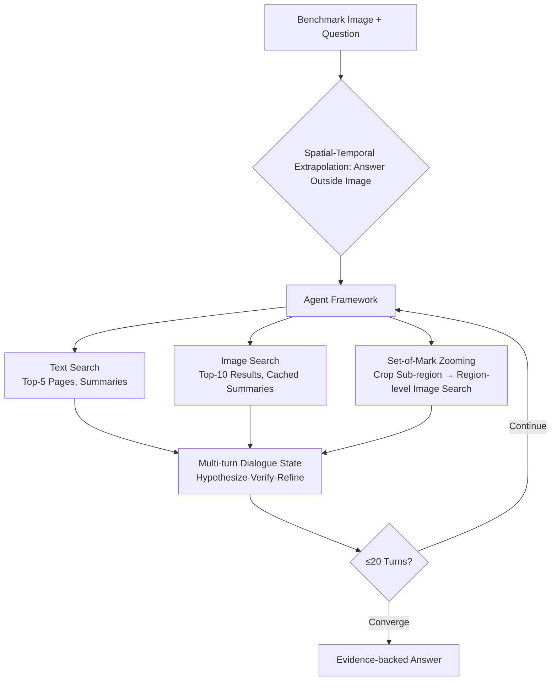

# MMSearch-Plus: Benchmarking Provenance-Aware Search for Multimodal Browsing Agents

**Conference**: ICLR 2026  
**OpenReview**: [https://openreview.net/forum?id=VGYgG2GH0d](https://openreview.net/forum?id=VGYgG2GH0d)  
**Code**: TBD  
**Area**: Multimodal Agents / Agent Benchmark  
**Keywords**: Multimodal Browsing Agents, Set-of-Mark, Spatial-Temporal Extrapolation, provenance-aware search, MLLM Agent  

## TL;DR
MMSearch-Plus introduces a multimodal browsing benchmark comprising 311 questions. By employing "spatial-temporal extrapolation," it mandates that agents extrapolate from fine-grained visual cues to facts outside the image. Accompanying this is a model-agnostic agent framework with Set-of-Mark (SoM) zoom-in retrieval, revealing that the end-to-end accuracy of current state-of-the-art MLLMs is only 36%.

## Background & Motivation
- **Background**: MLLMs are increasingly integrated as agents that combine vision, language, and web search to answer information retrieval queries. Benchmarks like MMSearch have paired images with browsing/image-search tools to evaluate this capability.
- **Limitations of Prior Work**: Existing multimodal browsing benchmarks often suffer from being "multimodal in name only." Many tasks can be resolved using purely text-based heuristics without necessitating the inclusion of vision in the reasoning loop. A single salient entity in an image often allows a robust image search to hit a webpage containing the answer, causing multimodal interaction to degenerate into narrow "image-source cross-validation," where fine-grained visual reasoning remains largely unused.
- **Key Challenge**: Pure-text browsing tasks (e.g., BrowseComp) emphasize persistence, multi-step evidence gathering, and complex search strategies, with SOTA MLLMs scoring less than 2% when equipped with browsing tools. In contrast, multimodal browsing benchmarks are significantly easier than their text-based counterparts, despite real-world multimodal tasks typically requiring deeper reasoning. This difficulty gap exposes a fundamental flaw in benchmark design.
- **Goal**: Construct a multimodal browsing benchmark that matches the long-horizon difficulty of BrowseComp and **cannot be bypassed by a single robust image search**. It aims to force (i) local and exhaustive fine-grained visual reasoning, (ii) robust verification under noisy/conflicting retrieval, and (iii) multi-step tool use interleaving text/image search with region-level visual analysis.
- **Key Insight**: **Spatial-Temporal Extrapolation**—asking not about directly visible content in the image, but about "contextually implied but physically absent" facts (e.g., match dates, the next round, or people outside the frame). This forces models to propagate discrete visual fragments into iterative searches and verify provenance within retrieval noise.

## Method

### Overall Architecture
MMSearch-Plus consists of two components: a hard benchmark of 311 questions constructed via "spatial-temporal extrapolation" (including adversarial filtering to prevent parametric shortcuts) and a model-agnostic web agent framework that interleaves text search, image search, and a Set-of-Mark (SoM) based zoom-retrieval pipeline. Evaluation utilizes LLM-as-a-judge to compare model outputs against an acceptable answer set across five search modes (No Search / Image Search / Text Search / Full Rollout / Full Rollout+SoM) with progressively increasing tool permissions.

### Key Designs

**1. Spatial-Temporal Extrapolation: Pushing Answers Beyond the Frame and Moment.** This is the core of the benchmark. The difficulty in BrowseComp-style tasks stems from "soft fuzzy constraints" that expand the intermediate search space, requiring non-trivial cross-validation to lock onto the target. Instead of remixing text corpora, the authors start from sparse visual fragments tied to real events (similar to GeoGuessr). Agents must hypothesize the underlying source event and verify it through retrieval evidence. Spatial extrapolation targets entities outside the frame, facing away, or obscured (e.g., audience members, hidden signage), while temporal extrapolation targets events before or after the depicted moment (e.g., the next goal, the next episode). Success requires the agent to precisely locate the event (time, match, episode) and integrate broader contextual knowledge from multiple sources. Even a single crop can drastically expand the candidate set, inducing long trajectories of "hypothesize-verify-refine."

**2. Adversarial Filtering + Temporal Drift Maintenance: Securing the "Must-Search" Baseline.** Data collection focused on recent or rare events, yet closed-source models like GPT-4o, GPT-5, and Gemini-2.5-Pro occasionally answer without searching. To combat this, three layers of adversarial filtering were employed: annotators designed questions **outside their own knowledge base** and verified solvable nature on at least two closed-source MLLMs; key visual sub-regions were blurred or obscured; and questions that remained trivially solvable were discarded or refined. Image screenshots must satisfy three conditions: containing noisy information, rare entities, and being unresolvable via a direct Google Image Search. The authors also commit to regularly refreshing the benchmark to suppress internal knowledge shortcuts caused by training data updates (temporal drift).

**3. Set-of-Mark Zoom-in Retrieval: Making Agents "Think with Images."** To achieve precise, provenance-aware visual inspection, the framework introduces an SoM module. Each task image is provided with a list of human-verified bounding boxes. In the first round, both the original image and a version with overlaid boxes and indices are provided (to avoid occlusion while facilitating cross-referencing). Agents can use a zoom tool to inspect a sub-region $r \subseteq I$ and initiate a region-level image search using $r$ as the query. This upgrades "full-image search" to "region-seeded retrieval (zoom-and-retrieve)," anchoring reasoning with fine-grained cues before the search space explodes.

**4. Long-Range Context Management and Compressed Retrieval Summaries.** The framework maintains a threaded dialogue state (tool calls, cropped views, summaries, hypotheses) to support long-horizon reasoning. It caches image search results (sorted URLs/thumbnails) and their MLLM-generated summaries to reduce latency and token costs. Scraped webpages are summarized by Gemini into two fields: `web info` (task-conditioned semantic summary) and `related info` (evidence linking result thumbnails to the query image, such as matching signage, layouts, or micro-text). This summarization is designed to compress interaction history for limited context windows, allowing contextual evaluation within 20 turns.

## Key Experimental Results

### Main Results (End-to-End Accuracy %, Selected)

| Model / Search Mode | Avg | Geo. | Sports | Acad. | Easy | Hard |
|---|---|---|---|---|---|---|
| Human + Browser | 22.8 | 20.3 | 25.9 | 20.0 | 34.0 | 18.0 |
| **o3** Without Search | 15.1 | 31.2 | 14.8 | 6.0 | 50.0 | 0.0 |
| o3 Image Search | 19.3 | 28.1 | 14.8 | 18.0 | 63.8 | 0.0 |
| o3 Text Search | 37.0 | 43.8 | 35.2 | 48.0 | 50.0 | 31.3 |
| o3 Full Rollout | 36.0 | 35.9 | 24.1 | 50.0 | 54.3 | 28.1 |
| **o3 Full Rollout + SoM** | **37.6** | 45.3 | 29.6 | 46.0 | 62.8 | 26.9 |
| GPT-5 Full Rollout + SoM | 35.4 | 35.9 | 27.8 | 48.0 | 56.4 | 26.3 |
| Gemini-2.5-Pro Full Rollout | 23.8 | 39.1 | 14.8 | 12.0 | 46.8 | 13.8 |
| Gemini-2.5-Pro Full Rollout+SoM | 27.7 | 40.6 | 22.2 | 24.0 | 54.3 | 16.1 |
| Qwen-2.5-VL-72B Without Search | 0.0 | 0.0 | 0.0 | 0.0 | 0.0 | 0.0 |
| Qwen-2.5-VL-72B Full Rollout+SoM | 7.1 | 10.9 | 3.7 | 4.0 | 18.1 | 2.3 |

The strongest system (o3 Full Rollout+SoM) achieves an end-to-end accuracy of only 36~37.6%, far from saturation. All models perform poorly on the hard subset.

### Ablation Study

| Setting | Key Conclusion |
|---|---|
| Adding SoM (vs Full Rollout) | Consistent positive gains: o3 +1.6, Gemini **+3.9**, Qwen +1.0. |
| Image Search Alone | Useful for coarse disambiguation (o3 +4.2, GPT-5 +6.1, Gemini +5.8, Qwen +13.5), but multi-hop remains a bottleneck. |
| MMSearch-Plus-lite (239 tasks, unsolvable w/o search) | o3 text search best at 31.4%; most methods align with the y=x diagonal, indicating trends are not due to parametric memory. |
| Easy Subset | Image → Full Rollout **performance dropped**: in 23 tasks, o3 was correct with image search but failed after full expansion (-7.4 points). |

### Key Findings
- **Performance drops on "Easy" tasks due to "under-utilizing image search" rather than "over-searching"**: In 9 out of 10 sampled failure cases, the full rollout trajectories **failed to call image search at all**. Models mistakenly assumed they grasped the image and relied solely on text search or priors, missing fine-grained cues—a strategic tool-use failure.
- **Tool usage patterns vary significantly across models**: o3 can sustain 10+ turns and coordinate 50+ retrieval items, whereas Gemini typically answers before step 9. The probability $P(\text{image}\mid\text{zoom})$ varies greatly: Gemini at 25.37%, Qwen at 10.56%, and o3 at only 2.87%. o3 often zooms merely to "see clearly" without using the zoomed area as a retrieval query.
- **More tool calls $\neq$ higher accuracy**: Error trajectories generally contain more search calls than correct ones.
- **Human-machine complementarity**: Without searching, o3 outperforms humans in Geography (31.2% vs 20.3%), likely due to the vast geographic knowledge retained in closed-source models. However, humans surpass MLLMs in Sports and Vlogs.
- **Qwen tool instability**: 421 invalid image search calls occurred across 45/311 tasks, with idle retries offering no quality improvement.

## Highlights & Insights
- **"Spatial-Temporal Extrapolation" is a clever difficulty engine**: By systematically pushing answers beyond the frame and the specific moment, the shortcut of "one-hop image search hitting answer text" is mechanically eliminated. This ensures multimodal reasoning cannot be bypassed—a substantial improvement over benchmarks like MMSearch.
- **Commitment to "Living Maintenance"**: The authors explicitly recognize that MLLM training updates erode the "must-search" assumption (temporal drift) and commit to regular refreshes, which is crucial for a long-term viable agent benchmark.
- **SoM provides interpretable failure profiles**: By quantifying Markov tool transition probabilities (e.g., whether zooming is followed by image search), the study attributes performance differences to measurable behavioral patterns rather than just endpoint accuracy.
- **Lite subset + y=x visualization** rigorously decouples internal knowledge from external tool contributions, proving observed trends stem from genuine tool use rather than memorization.

## Limitations & Future Work
- **SoM reliance on manual bounding boxes**: Currently, Set-of-Mark uses human-annotated boxes rather than end-to-end automated region proposals, limiting the framework's scalability in open scenarios.
- **Limited scale**: With 311 questions and 441 images, the categories are balanced but the statistical power is limited. Models generally hit the floor on the hard subset, making it difficult to differentiate fine-grained capabilities.
- **Dependency on LLM-as-a-judge**: Although high consistency with GPT-4o human evaluation is noted, the answer sets and judging criteria may still introduce systemic bias.
- **Evaluation only**: The paper focuses on diagnosing the tool-use deficiencies of current MLLMs (especially the failure to use image search when necessary) but does not propose specific training or strategy improvements.
- **Future Work**: Automating SoM, expanding the scale, and treating "tool-use strategy" as a trainable objective are logical next steps.

## Related Work & Insights
- **Multimodal Browsing Benchmarks**: MMSearch (Jiang et al., 2024) is the primary baseline. This paper notes that MMSearch is often solvable via fixed workflows. Concurrent works like BrowseComp-VL and MM-BrowseComp differ in data sources and agent frameworks, whereas MMSearch-Plus emphasizes sustained fine-grained visual reasoning.
- **Text Browsing Benchmarks**: BrowseComp (Wei et al., 2025) provides a long-horizon difficulty reference, which this paper extends to the multimodal domain.
- **Set-of-Mark**: Reutilizes the SoM visual prompting concept from Yang et al. (2023), transforming it into a provenance-aware zoom-retrieval pipeline.
- **Insights**: For researchers building agent benchmarks, this work provides a reusable paradigm: **using "answer extrapolation beyond modality visibility" to force tool-use loops**, supplemented by adversarial filtering and active maintenance against parametric shortcuts.

## Rating
- **Novelty**: ⭐⭐⭐⭐ The combination of spatial-temporal extrapolation and provenance-aware zoom retrieval addresses the "vision bypass" issue in existing benchmarks effectively.
- **Experimental Thoroughness**: ⭐⭐⭐⭐ Extensive coverage of 4 models across 5 search modes, lite subsets, Markov tool transitions, and detailed error analysis; slightly penalized for small scale.
- **Writing Quality**: ⭐⭐⭐⭐ Motivation is logically sequenced, design principles are clear, and failure analyses are insightful.
- **Value**: ⭐⭐⭐⭐ Provides a high-difficulty, shortcut-resistant, and maintainable benchmark for the next generation of agentic MLLMs, exposing "tool-use strategy" as a critical weakness.

<!-- RELATED:START -->

## Related Papers

- [\[ICLR 2026\] MC-Search: Evaluating and Enhancing Multimodal Agentic Search with Structured Long Reasoning Chains](mc-search_evaluating_and_enhancing_multimodal_agentic_search_with_structured_lon.md)
- [\[ACL 2025\] Browsing Like Human: A Multimodal Web Agent with Experiential Fast-and-Slow Thinking](../../ACL2025/llm_agent/browsing_like_human_a_multimodal_web_agent_with_experiential_fast-and-slow_think.md)
- [\[ACL 2026\] BAPO: Boundary-Aware Policy Optimization for Reliable Agentic Search](../../ACL2026/llm_agent/bapo_boundary-aware_policy_optimization_for_reliable_agentic_search.md)
- [\[ICLR 2026\] Towards Multimodal Data-Driven Scientific Discovery Powered by LLM Agents](towards_multimodal_data-driven_scientific_discovery_powered_by_llm_agents.md)
- [\[ICLR 2026\] SimuHome: A Temporal- and Environment-Aware Benchmark for Smart Home LLM Agents](simuhome_a_temporal-_and_environment-aware_benchmark_for_smart_home_llm_agents.md)

<!-- RELATED:END -->
