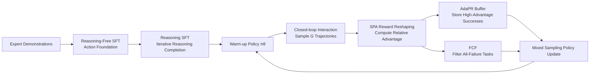

# MobileRL: Online Agentic Reinforcement Learning for Mobile GUI Agents

**Conference**: ICLR 2026  
**OpenReview**: [https://openreview.net/forum?id=C3F0G9nXhl](https://openreview.net/forum?id=C3F0G9nXhl)  
**Code**: [https://github.com/THUDM/MobileRL](https://github.com/THUDM/MobileRL)  
**Area**: LLM Agent / Mobile GUI Agent / Agentic Reinforcement Learning  
**Keywords**: GUI Agent, Agentic RL, GRPO, Difficulty Adaptation, Experience Replay, Curriculum Filtering, Reward Reshaping  

## TL;DR
MobileRL introduces an online agentic RL framework for mobile GUI agents using "two-stage reasoning SFT warm-up + Adaptive GRPO (AdaGRPO)". By combining positive sample replay, failure curriculum filtering, and shortest path rewards, the framework stabilizes multi-step training under sparse rewards. It achieves state-of-the-art (SOTA) results, with a 9B model reaching a 80.2% success rate on AndroidWorld and 53.6% on AndroidLab.

## Background & Motivation
**Background**: Vision-Language Models (VLMs) enable GUI agents to operate web and mobile interfaces zero-shot. However, the dominant scaling approach remains Supervised Fine-Tuning (SFT) or offline imitation learning on static expert demonstrations. These methods suffer from narrow behavioral coverage and a lack of self-recovery capabilities—once the model enters a state not present in the demonstrations, it often fails to recover.

**Limitations of Prior Work**: Reinforcement Learning with Verifiable Rewards (RLVR) appears to be a superior alternative. However, applying "Agentic RL" (requiring multi-step planning and reasoning) to interactive simulators like mobile phones faces three major hurdles:

- **Complex Instruction Following under Sparse Positive Signals**: Running rollouts in mobile simulators is slow and expensive. Base models struggle to consistently output valid GUI action commands, making successful trajectories extremely rare and early exploration highly inefficient.
- **Heavy-Tailed and Unstable Task Difficulty Spectrum**: Some tasks succeed with minimal sampling, while others remain unsolvable for certain models. Naive uniform sampling wastes compute and fails to utilize rare but highly informative successful trajectories.
- **Sampling Bottleneck of Large-Scale Mobile Environments**: Managing hundreds of concurrent mobile instances is resource-intensive and difficult to replicate. Low sampling throughput further limits the scale and efficiency of RL.

**Key Challenge**: Rewards in mobile agent RL are sparse and binary (only awarded upon task completion), while task difficulty follows a heavy-tailed distribution and sampling costs are high. **Standard GRPO's uniform sampling and uniform reward broadcasting are both unstable and inefficient in this setting.**

**Goal**: To build a framework that efficiently, stably, and reproducibly scales agentic RL in mobile interactive environments, transforming open-source VLMs into SOTA mobile GUI agents.

**Core Idea**: The authors propose a **two-stage SFT warm-up (Reasoning-Free + Reasoning)** to provide a strong initial policy for RL. This is followed by **Adaptive GRPO (AdaGRPO)**, which utilizes a triplet of strategies—replaying successful trajectories based on difficulty, filtering unsolvable tasks, and reshaping rewards based on completion length—to address sparse rewards, heavy-tailed difficulty, and expensive sampling simultaneously.

## Method

### Overall Architecture
MobileRL divides training into two phases: **Reasoning Warm-up** (Reasoning-Free SFT + Reasoning SFT, initializing the policy to output actions with intermediate reasoning) and **Online Agentic RL** (using AdaGRPO for closed-loop interaction, trajectory sampling, and updates). Tasks are modeled as finite-horizon MDPs: the state includes screenshots, parsed UI hierarchy XML, and historical think/action text; actions are atomic operations like Tap, Swipe, Type, Launch, Back, or Finish. Rewards are binary (1 for success, 0 otherwise). The RL process is built on the Verl framework, utilizing hundreds of Dockerized Android Virtual Devices (AVDs) to support reproducible sampling across 1000+ environments.

### Key Designs

**1. Two-Stage Reasoning Warm-up: Learn to act, then learn to think.** Starting online RL directly from a base model is inefficient. First, **Reasoning-Free SFT** is conducted using expert demonstrations and the AndroidControl dataset to establish action capabilities. Since these datasets often lack reasoning, the model acts as a "black box." Therefore, **Reasoning SFT** is layered: an Instruct model generates "reasoning-action" candidates $(c_k, a_k)$ for each task $x$, and only those where the action matches the expert answer $(x, c_k, a^*)$ are kept in dataset $D_R$. After training an initial reasoning policy $\pi_0^R$, it is iteratively refined. This ensures a reliable action foundation and transparent intermediate reasoning, reducing expensive on-policy trial-and-error during RL.

**2. Shortest Path Adjustment (SPA): Preventing long trajectories from gaming the reward.** Mobile environments typically provide binary rewards $r \in \{0, 1\}$ at the terminal state. Standard practice broadcasts this to every step $R(s_t, a_t) = r$. However, longer successful trajectories contribute more gradient terms, effectively **rewarding verbosity**. SPA scales success rewards based on trajectory length:

$$R_{\text{SPA}}(s_t,a_t) = r(\tau_i)\left(1 - \alpha\frac{T_i - T_{\min}}{T_i}\right),\quad T_{\min}=\min_{\tau_j\in\mathcal{T}_{\text{succ}}}|\tau_j|,\ \alpha\in(0,1]$$

where $T_i$ is the length of trajectory $\tau_i$, $T_{\min}$ is the shortest successful trajectory length for the current task instance, and $\alpha$ controls the penalty magnitude. This only applies to **successful** trajectories; failed attempts still receive 0. Unlike token-level penalties in text RLVR, SPA guides the policy toward "shorter successful paths" without sacrificing the success rate.

**3. Adaptive Positive Replay (AdaPR): Utilizing rare and valuable successes.** Under sparse rewards, successful trajectories for difficult tasks are rare but contain high information value. AdaPR maintains a replay buffer $B$. In each iteration $t$, the top-$\kappa$ high-advantage successful trajectories from the current sampling $\mathcal{T}_t$ are stored. During updates, each mini-batch is drawn from a mixed distribution:

$$q(\tau) = \gamma\, p_B(\tau) + (1-\gamma)\, p_{\text{on}}(\tau)$$

where $p_{\text{on}}$ is the on-policy distribution and $p_B$ is the buffer distribution. To maintain exploration, $\gamma M$ high-advantage samples are taken from $B$, while the rest remain on-policy. This reinforces rare success signals and stabilizes policy updates.

**4. Failure Curriculum Filtering (FCF): Reserving compute for solvable tasks.** Given the heavy-tailed difficulty distribution, some tasks consistently yield zero rewards. FCF uses online statistics to dynamically down-weight these: if a task yields all-zero rewards for two consecutive epochs, it enters a three-epoch cooling period where its sampling probability decays as $w_{\text{task}} = \exp(-f)$ (where $f$ is the count of failed epochs). If it remains unsolved after cooling, it is **permanently removed** from the training set. This resource-aware curriculum specifically prunes unsolvable tasks in expensive mobile environments while retaining recoverable failure signals. Crucially, FCF **only affects the training sampling distribution; evaluation is always performed on the full test set.**

## Key Experimental Results

### Main Results
Comparison on AndroidWorld (116 tasks/20 apps) and AndroidLab (138 tasks/9 apps) across closed-source and open-source models (success rate %):

| Model | #Params | AndroidWorld | AndroidLab |
|---|---|---|---|
| GPT-4o-2024-11-20 | - | 34.5 | 31.2 |
| Claude-Sonnet-4-thinking | - | 41.0 | 40.6 |
| UI-Tars-1.5 | - | 64.2 | 38.3 |
| AutoGLM-2024-10 | - | – | 36.2 |
| Qwen2.5-VL-7B-Instruct | 7B | 27.6 | 10.1 |
| GLM-4.1V-9B-Thinking | 9B | 41.7 | 24.6 |
| V-Droid | 8B | 59.5 | 38.3 |
| UI-Genie-Agent | 72B | - | 41.2 |
| **MobileRL w/ Qwen2.5-VL-7B** | 7B | **72.0** | **42.5** |
| **MobileRL w/ GLM-4.1V-9B** | 9B | **80.2** | **53.6** |

MobileRL-9B improves the previous SOTA from 64.2% / 41.2% to 80.2% / 53.6%. MobileRL-7B also outperforms the 72B UI-Genie-Agent by approximately 16% on AndroidWorld.

### Ablation Study
**Incremental gains by phase** (success rate %, subscripts denote relative gain):

| Model | AndroidWorld | AndroidLab |
|---|---|---|
| Qwen2.5-VL-7B-Instruct | 27.6 | 10.1 |
| + Reasoning-Free SFT | 50.2 (+22.6) | 36.9 (+26.8) |
| + Reasoning SFT | 56.8 (+6.6) | 38.7 (+1.8) |
| + AdaGRPO (MobileRL-7B) | 72.0 (+15.2) | 42.5 (+3.8) |
| GLM-4.1V-9B-Base | 7.7 | 10.1 |
| + Reasoning-Free SFT | 48.1 (+40.4) | 42.7 (+32.6) |
| + Reasoning SFT | 66.2 (+18.1) | 45.0 (+2.3) |
| + AdaGRPO (MobileRL-9B) | 80.2 (+14.0) | 53.6 (+8.6) |

**AdaGRPO component ablation** (AndroidWorld test set, averaged over 3 runs):

| Variant | AndroidWorld |
|---|---|
| MobileRL (Full) | 71.1 |
| w/o AdaPR | 63.6 |
| w/o SPA | 69.1 |
| w/o AdaPR & SPA | 58.5 |
| w/o FCF | 64.8 |
| w/o AdaGRPO (Reasoning SFT only) | 56.8 |

### Key Findings
- **Every component contributes**: Removing AdaPR drops performance by 7.5 points, FCF by 6.3 points, and SPA by 2 points. Removing both AdaPR and SPA drops it to 58.5. Replay and curriculum filtering are the primary drivers of training stability.
- **SFT warm-up is critical**: Two-stage SFT improved GLM-4.1V from 7.7% to 66.2%. AdaGRPO then contributed an additional +14%. This suggests RL requires a sufficiently strong initial policy.
- **Stable training curves**: The reward curve for the full MobileRL remains consistently higher and more stable than the ablation variants.

## Highlights & Insights
- **Explicitly modeling "Difficulty" in RL**: AdaPR reuses rare successes, FCF prunes dead-end tasks, and SPA favors efficiency. All three target the specific pain points of mobile GUI agents—heavy-tailed difficulty and expensive sampling—rather than blindly applying text-based RLVR.
- **Engineering as a Contribution**: Leveraging Verl to orchestrate thousands of Dockerized AVDs for concurrent sampling solves the long-standing reproducibility and throughput issues of mobile simulators.
- **Scaling Efficiency**: A 7B model outperforming 72B competitors suggests that algorithm and data design are more critical than parameter count for GUI agents.

## Limitations & Future Work
- **Heavily dependent on SFT initialization**: The pipeline requires "Reasoning-Free SFT → Reasoning SFT → RL," where reasoning SFT relies on bootstrapping from an Instruct model. The feasibility of starting RL directly from a base model remains unexplored.
- **Terminal binary rewards**: SPA only scales successful trajectories; it does not replace the need for intermediate reward signals in extremely long or sub-task-heavy missions.
- **Platform Limitation**: The framework and environment are currently tied to Android, leaving cross-platform generalization (iOS, Desktop, Web) for future verification.
- **Aggressive FCF pruning**: The permanent removal of tasks might exclude tasks that appear "unsolvable" early on but could be tackled after the policy improves later in training.

## Related Work & Insights
- **GRPO and RLVR**: This work builds upon GRPO by extending it from single-turn text reasoning to multi-step GUI agents, providing a reusable difficulty-adaptive modification for sparse multi-step settings.
- **Experience Replay and Curriculum Learning**: While AdaPR and FCF borrow from classical RL, their adaptation to the "expensive sampling + sparse reward" constraints of LLM agents demonstrates the necessity of tailored designs when porting RL components to agentic tasks.

## Rating
- **Novelty**: ⭐⭐⭐⭐ While AdaPR/FCF/SPA have conceptual roots, their integration into a difficulty-adaptive framework tailored for mobile GUI RL is a distinctive and practical innovation.
- **Experimental Thoroughness**: ⭐⭐⭐⭐ Dual benchmarks, dual backbones, step-by-step ablations, and stable training curves provide a solid evidence chain.
- **Writing Quality**: ⭐⭐⭐⭐ Clear mapping between challenges and methods. Motivated design choices and well-coordinated formulas/tables.
- **Value**: ⭐⭐⭐⭐⭐ Open-sourcing a framework that refreshes SOTA on multiple benchmarks and enables large-scale mobile RL is highly valuable to the community.

<!-- RELATED:START -->

## Related Papers

- [\[ICLR 2026\] AlphaAgentEvo: Evolution-Oriented Alpha Mining via Self-Evolving Agentic Reinforcement Learning](alphaagentevo_evolution-oriented_alpha_mining_via_self-evolving_agentic_reinforc.md)
- [\[CVPR 2026\] CGL: Advancing Continual GUI Learning via Reinforcement Fine-Tuning](../../CVPR2026/llm_agent/cgl_advancing_continual_gui_learning_via_reinforcement_fine-tuning.md)
- [\[ICLR 2026\] Language Agents for Hypothesis-driven Clinical Decision Making with Reinforcement Learning](language_agents_for_hypothesis-driven_clinical_decision_making_with_reinforcemen.md)
- [\[ACL 2026\] SOLAR-RL: Semi-Online Long-horizon Assignment Reinforcement Learning](../../ACL2026/llm_agent/solar-rl_semi-online_long-horizon_assignment_reinforcement_learning.md)
- [\[ICLR 2026\] M²-Miner: Multi-Agent Enhanced MCTS for Mobile GUI Agent Data Mining](m2-miner_multi-agent_enhanced_mcts_for_mobile_gui_agent_data_mining.md)

<!-- RELATED:END -->
