# Modeling Others' Minds as Code

**Conference**: ICLR 2026  
**OpenReview**: [https://openreview.net/forum?id=vHXo7xIer6](https://openreview.net/forum?id=vHXo7xIer6)  
**Code**: Authors promise to open source (baselines / datasets / human evaluations)  
**Area**: LLM Agent / Theory of Mind / Behavior Prediction  
**Keywords**: Theory of Mind, Program Synthesis, Sequential Monte Carlo, Behavior Modeling, Embodied Agents  

## TL;DR
The paper reformulates "predicting others' next actions" as a **program synthesis problem**—using LLMs to generate a set of Python "behavior scripts" that explain observed trajectories, followed by Sequential Monte Carlo for Bayesian inference to filter the most likely programs. This approach enables efficient, interpretable, and generalizable prediction of human and AI agent behaviors.

## Background & Motivation
- **Background**: Predicting others' behavior (Theory of Mind) is a core capability for social agents. Two mainstream approaches have significant drawbacks: Behavior Cloning (BC) and Inverse Reinforcement Learning (IRL) directly fit "what to do in each state," making them **data-hungry and brittle**, prone to overfitting in specific environments; probabilistic goal inference methods like Bayesian Inverse Planning (BIP) are sample-efficient but require online enumeration of goals/beliefs, making them **computationally expensive and requiring manual specification of priors and hypothesis spaces** for each new domain.
- **Limitations of Prior Work**: There is a difficult trade-off between being "data-intensive + brittle" and "computation-intensive + manually constructed." Neurosymbolic methods using LLMs (e.g., BIP+LLM) improve robustness but often generate thousands of tokens per prediction, making them too slow for rapid inference.
- **Key Challenge**: In real social interactions, humans often **do not infer others' deep goals/beliefs**. Instead, they view others as "acting according to scripts"—routines like "stop at red lights" or "use crosswalks" shaped by social conventions with low cognitive load. However, no current computational model allows machines to represent and reason about others in this "scripted" manner.
- **Goal**: To model others' behavior using a representation that is sample-efficient, requires no manual construction, and is reusable across environments.
- **Core Idea**: **Represent behavior as code rather than "belief/desire-based policies."** Everyday behaviors are essentially predictable scripts that minimize cognitive load, which are naturally suited for representation as programs (e.g., finite state machines). Thus, an **LLM is used as a code synthesizer** to generate candidate behavior programs, and **Bayesian inference** quantifies uncertainty over the program space—a method the authors call **ROTE (Representing Others' Trajectories as Executables)**.

## Method

### Overall Architecture
ROTE formalizes computationally bounded agents as programs with internal states (viewed as finite state machines $\lambda=(S,s_0,\pi,u)$). The objective is to search for the **shortest program** in the program space $\Lambda$ that reproduces observed actions to explain the history $h_{0:t-1}$. The process has two phases: first, use an LLM to convert perceptual inputs (coordinates/scene graphs) into natural language path descriptions and synthesize a set of candidate Python programs, yielding a distribution $\Delta(\Lambda)$; then, use Sequential Monte Carlo (SMC) for Bayesian inference to update the posterior weights of each program. Finally, a weighted combination of the top-$k$ programs is executed to predict the next action.

```mermaid
flowchart LR
    A[Observed Trajectories h_0:t-1<br/>Coordinates/Scene Graphs] --> B[LLM: Optional Conv. to<br/>NL Path Descriptions]
    B --> C[LLM Code Synthesis<br/>Generate Candidate Python Programs Δ&#40;Λ&#41;]
    C --> D[Bayesian Inference SMC<br/>Update Posterior p&#40;λ&#124;h&#41; via Likelihood]
    D --> E[Execute top-k Programs<br/>from Current Observation o_t]
    E --> F[Weighted Combination to<br/>Predict Next Action â_t]
    F -.Observe New Action.-> D
```

### Key Designs

**1. Using LLMs for "Shortest Program" Synthesis with Description Length as a Prior:** Instead of fitting policies, ROTE leverages LLMs to generate multiple Python programs explaining observed behavior from the history, forming a candidate distribution $\Delta(\Lambda)$. Python is chosen for its readability and Turing-completeness, capable of expressing arbitrary decision logic in the worst case ($|S|=|O|$). A key constraint is **encouraging short programs**: this is not just an engineering preference but follows Solomonoff's theory of inductive inference—the shortest algorithm capable of generating the data should be assigned the highest prior, with cumulative prediction error bounded by the Kolmogorov complexity of the true data-generating process. Thus, searching for the minimum program $\arg\min|\hat\lambda|$ is not only computationally efficient but also theoretically optimal for generalization. The prompts also assume that the observed agent performs **deterministic transitions** between finite states and produces **deterministic actions**—even if the actual agent is probabilistic or goal-driven, the LLM first fits a deterministic script, and a noise model handles stochasticity.

**2. Sequential Monte Carlo Bayesian Inference for Program Filtering:** After obtaining the candidate program distribution, ROTE estimates the posterior as $p(\lambda\mid h_{0:t-1})\propto p(h_{0:t-1}\mid\lambda)\,p(\lambda)$. While sharing roots with inverse planning, the difference is that inverse planning fixes an expensive planner (MCTS/Search) and infers over goal space, whereas ROTE condenses all behavioral conventions and scripts into a single program representation $\lambda$. Since $\lambda$ is a deterministic program, the predicted action $\hat a_t$ given observation $o_t$ is assigned a probability of $1-\epsilon$, while other actions share $\frac{\epsilon}{|A|-1}$, allowing deterministic programs to output an action distribution $\Delta(A)$. By multiplying likelihoods $p(\lambda\mid h_{0:t-1})\propto\prod_{o_i,a_i\in h_{0:t-1}}p(a_i\mid o_i,\lambda)\cdot p_\text{prior}(\lambda)$, inference is performed directly in the space of "decision processes encoded as code."

**3. Weighted Combination of top-k Programs + Transferable Scripts:** The most probable $k$ programs are selected based on the refined posterior and executed from the current observation. Their outputs are combined by weight to approximate $\lambda^*\approx\hat\lambda=\sum_{\lambda}p(\lambda\mid h_{0:t-1})\cdot\lambda(\cdot\mid o_t)$. This dynamic representation can be analyzed, modified, and combined across agents and environments. Once a script such as "counter-clockwise patrol" is inferred, it can be **directly reused in new but similar environments without re-generating text**, bypassing the high computational cost of per-step recalculation in NLLM/AutoToM. As shown in Figure 2, as observations accumulate (e.g., picking up a toy then moving to a chair), ROTE shifts weights from scripts like "take toy to bedroom" and converges toward "put toy on chair," enabling rapid extrapolation of future actions.

## Key Experimental Results

### Main Results
- **Environments**: ① Construction—a fully observable 2D grid world where agents navigate obstacles and move colored blocks; ② Partnr—a large-scale embodied robotic simulator (based on Habitat) that is partially observable, perceives via NL scene graphs, and uses tools to assist humans with chores.
- **Baselines**: Behavior Cloning (BC) (LSTM for Construction, fine-tuned Llama-3.1-8b for Partnr), AutoToM (LLM-generated belief/goal hypotheses + Bayesian inverse planning), and Naive LLM (NLLM, direct action prediction via prompting). ROTE uses DeepSeek-Coder-V2-Lite-Instruct, and the highest scores from multiple LLMs are used for baselines to ensure fairness.

| Scenario / Protocol | ROTE vs. Strongest Baseline | vs. Human |
|---|---|---|
| Construction Script Agents (Single/Multi-step) | Significantly outperforms all (single-step NLLM p<0.05, BC/AutoToM p<0.001) | No significant difference (single p=0.31, multi p=0.17) |
| Construction Human Agents (Single/Multi-step) | Significantly outperforms all (single BC p<0.05, NLLM p<0.01, AutoToM p<0.001) | **Reaches human-level** prediction accuracy |
| Partnr Embodied Environment | Significantly outperforms all baselines (p<0.001) | — |
| Zero-shot Cross-environment Generalization | Significantly outperforms all baselines (p<0.001) | — |
| Overall Gain | Up to **~50%** accuracy improvement | — |

### Key Findings
- **Not exploiting data regularities**: ROTE's accuracy has very low correlation with "revisiting states/repeating actions" (0.303 / 0.064), indicating it learns underlying policies rather than simple repetition, which explains its strong multi-step prediction capability.
- **Script Transferability**: After inferring a script from 20 steps in an original environment, ROTE significantly leads in predicting 10 steps in a brand-new environment **without re-generating text**.
- **Efficiency in Multi-step Reasoning**: While ROTE is slower than BC/NLLM for single steps, Figure 6 shows its cumulative computational cost for multi-step prediction is **orders of magnitude lower** as steps increase—once the program is inferred, it is simply executed repeatedly.
- **Capability Boundaries**: ROTE even exceeds human performance on repetitive patterns like "if up fails, go down"; however, humans remain stronger on tasks like "clockwise patrol" or "move pink block to corner," suggesting that stronger LLM reasoning is required to reach human levels across all scenarios.

## Highlights & Insights
- **Paradigm Shift**: Reframing action understanding from "policy fitting/goal inference" to **program synthesis** revives the classic CS idea of "code as behavior representation" (FSMs, production systems) in the LLM era.
- **Solid Cognitive Science Motivation**: Directly aligns with recent cognitive science findings that humans view others as following scripts, providing theoretical and empirical support for why it is not always necessary to infer deep beliefs.
- **Win-Win for Efficiency, Accuracy, and Interpretability**: Using the shortest-program prior (Solomonoff) as regularization leads to good generalization while remaining readable, editable, and composable. Its computational advantage grows with the prediction horizon.
- **Human Study Loop**: The study not only compares against baselines but also recruits humans to generate behaviors and perform predictions, proving ROTE reaches human-level performance.

## Limitations & Future Work
- **Deterministic Assumption**: The core assumption that observed agents perform deterministic transitions between finite states means highly stochastic or strongly adaptive policies can only be approximated via noise models.
- **Dependence on LLM Reasoning**: Performance on patrolling or complex goal-driven tasks still lags behind humans, where the bottleneck is the underlying LLM's code reasoning capability.
- **Action Space Constraints**: In Partnr, only high-level tool actions are predicted, and the model is limited by fixed action spaces required by AutoToM; fine-grained continuous actions remain unverified.
- **Expressiveness Ceiling of Scripts**: Many real-world behaviors are not strictly scripted (e.g., emotions, temporary preferences); the coverage of program representations for these "non-routine" behaviors needs further investigation.

## Related Work & Insights
- **Action Prediction Camps**: Symbolic (BIP, robust but exponentially complex in multi-agent settings) vs. Neural (BC/IRL, prone to overfitting and hard to generalize). Reward machines use FSMs for rewards but do not utilize LLMs. ROTE uses LLMs for open-ended code, making fewer assumptions about the agent and covering everyday decisions that are not necessarily reward-maximizing.
- **LLM-based Behavior Modeling**: Enumerative social reasoning and BIP+LLM frameworks improve robustness but are generally expensive; ROTE avoids the cost of enumerating every goal by using code representations.
- **Program Induction**: Program synthesis has succeeded in world modeling, action selection, and mathematical reasoning. Neurosymbolic + probabilistic program reasoning has allowed agents to master Sokoban/Frostbite with high sample efficiency. The difference is that prior work relies on explicit rewards or domain constraints, while ROTE **assumes no reward signal or domain structure**, inferring causal decision processes directly from observations.
- **Insight**: Modeling "other minds" as executable, composable, and transferable code provides a new path for scalable, adaptive, and interpretable social AI—especially suited for real-world scenarios like autonomous driving for pedestrian prediction and human-robot collaboration.

## Rating
- **Novelty**: ⭐⭐⭐⭐⭐ Reframing ToM/behavior prediction as LLM program synthesis + Bayesian inference, with cognitive science motivation and algorithmic theory (Solomonoff prior) integrated coherently, represents a true paradigm-level innovation.
- **Experimental Thoroughness**: ⭐⭐⭐⭐ Covers grid worlds and large-scale embodied simulations, three strong baselines, and multiple protocols (single/multi-step/generalization), with a human study for closure. A slight limitation is the lack of verification for fine-grained continuous or highly stochastic behaviors.
- **Writing Quality**: ⭐⭐⭐⭐ The link from motivation to method and experiment is clear. Figure 2 provides intuitive examples alongside theoretical derivations, and formulas/code examples are well-placed.
- **Value**: ⭐⭐⭐⭐ Efficient, interpretable, and transferable behavior prediction has direct application value for HRI, autonomous driving, and social agents. The commitment to open source facilitates reproducibility.

<!-- RELATED:START -->

## Related Papers

- [\[ICLR 2026\] MATHMO: Automated Mathematical Modeling Through Adaptive Search](mathmo_automated_mathematical_modeling_through_adaptive_search.md)
- [\[ICLR 2026\] Code Driven Planning with Domain-Adaptive Selector](code_driven_planning_with_domain-adaptive_selector.md)
- [\[AAAI 2026\] Reflection-Driven Control for Trustworthy Code Agents](../../AAAI2026/llm_agent/reflection-driven_control_for_trustworthy_code_agents.md)
- [\[ACL 2026\] CodeStruct: Code Agents over Structured Action Spaces](../../ACL2026/llm_agent/codestruct_code_agents_over_structured_action_spaces.md)
- [\[ICML 2026\] Probabilistic Modeling of Latent Agentic Substructures in Deep Neural Networks](../../ICML2026/llm_agent/probabilistic_modeling_of_latent_agentic_substructures_in_deep_neural_networks.md)

<!-- RELATED:END -->
