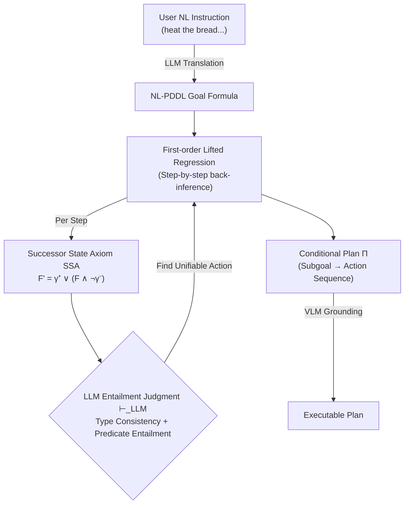

# Natural Language PDDL (NL-PDDL): Open-world Goal-oriented Commonsense Regression Planning in Embodied AI

**Conference**: ICLR 2026  
**Code**: [https://github.com/D3Mlab/NL-PDDL](https://github.com/D3Mlab/NL-PDDL)  
**Area**: LLM Agent / Embodied Planning  
**Keywords**: PDDL, regression planning, open-world planning, commonsense entailment, Embodied AI, lifted planning  

## TL;DR
The symbolic predicates of classical PDDL are replaced with "typed natural language predicates," and first-order regression planning is driven by LLM entailment judgments. This preserves the correctness of symbolic planning while gaining the commonsense generalization of LLMs in partially observable open worlds where goals and action descriptions are misaligned.

## Background & Motivation
- **Background**: For embodied agents planning in open worlds (partially observable + incomplete domain knowledge), two main paths exist: direct plan generation via LLM/VLM or classical PDDL symbolic planners.
- **Limitations of Prior Work**: LLMs/VLMs lack mechanisms to track state changes and deduce action consequences, leading to hallucinations in long-horizon tasks, failures with complex multi-constraint goals, and unverifiable black-box outputs. Classical PDDL is provably correct but assumes a complete model, relies on exhaustive grounding of all objects, and cannot bridge semantic misalignments between "goal descriptions" and "action descriptions" (e.g., goal "heat the bread" vs action "toast the bread"), nor is it cross-modal.
- **Key Challenge**: A trade-off between **Correctness vs. Flexibility/Commonsense**—symbolic planning is guaranteed but rigid, while neural planning is flexible but unreliable.
- **Goal**: Construct an open-world planning framework that leverages the reliability of symbolic regression planning, utilizes LLM commonsense entailment to resolve goal-action misalignment, and avoids exhaustive grounding.
- **Core Idea**: **Replace symbolic PDDL predicates with natural language predicates**, allowing the regression step of "action effect $\vdash$ goal literal"—which traditionally requires exact matching—to be relaxed into an "LLM-judged entailment relationship." By retaining first-order variables for lifted regression, the complexity is decoupled from the number of objects.

## Method

### Overall Architecture
NL-PDDL follows the formal structure of classical PDDL (predicates, variables, objects, action preconditions/add/delete effects) but replaces all symbols with **typed natural language strings**. For instance, `isToasted(bread)` is represented as `"the (bread) is toasted" | "bread":"food"`, and its lifted form as `"the (?o:food) is toasted"`. Planning is performed as top-down regression: starting from the goal, it back-steps to find subgoal formulas that must hold before each action, recursively constructing a conditional plan $\Pi$ that maps "subgoal formulas $\to$ action sequences." Foundation models are integrated at three points: LLMs translate user NL instructions into NL-PDDL goals, LLMs judge entailment during regression, and VLMs ground NL object names in lifted plans to specific entities in initial state images.

### Key Designs

**1. Typed Natural Language Predicate Replacement: Upgrading Symbolic PDDL to NL-PDDL.** Classical PDDL uses rigid symbols for predicates/objects/variables. NL-PDDL replaces them with typed natural language strings: `?o:food` denotes variable `?o` of type food. An NL-PDDL problem is defined as $P = \langle G, A, F, h\rangle$, where $G$ is the goal conjunction, $F$ is the set of lifted NL predicates, each action $a(\vec{y})$ contains `pre`, `add`, and `del` effects, and $h$ is the planning horizon. This replacement is foundational: because predicates are now natural language, LLMs can perform commonsense reasoning (e.g., inferring that `isToasted(bread)` entails `isHeated(bread)`, which a classical solver cannot do without manual encoding). It also reduces the burden on non-expert users and tolerates incomplete or syntactically imperfect domain/state descriptions.

**2. Entailment-based Unification + SSA-driven Lifted Regression.** The engine of regression planning is the Successor State Axiom (SSA): a predicate $F$ is true after action $a_i$ if and only if it was made true by a positive effect, or was already true and not made false by a negative effect:
$$F'_{a_i}(\vec{x}) \equiv \gamma^+_{F,a_i}(\vec{x}) \lor \big(F(\vec{x}) \land \lnot\gamma^-_{F,a_i}(\vec{x})\big).$$
In classical PDDL, a goal predicate can only match an exact action effect name. NL-PDDL relaxes "unification" from syntactic equivalence to **commonsense entailment unification**: a predicate $F(\vec{z})$ unifies with goal $P'(\vec{x})$ if (i) every corresponding type pair satisfies $t_x \vdash_{LLM} t_z$, and (ii) after substitution, $F(\vec{z})\theta \vdash_{LLM} P'(\vec{x})\theta$. Thus, regression for a positive predicate is written as $\mathrm{Regr}_\vdash(P'(\vec{x}), a_i) \equiv F'_{a_i}(\vec{z})\theta$. This is key to how a "heat the bread" goal can regress to a "toast" action—the LLM bridges the semantic gap that symbolic planners cannot.

**3. Entailment Direction Reversal for Negative Predicates.** When regressing a negative predicate $\lnot P'(\vec{x})$ resulting from a delete effect, the entailment direction for unification condition (ii) is **reversed**: it requires $P'(\vec{x})\theta \vdash_{LLM} F(\vec{z})\theta$ (goal entails effect, rather than effect entails goal). The regression result is negated: $\mathrm{Regr}_\vdash(\lnot P'(\vec{x}), a_i) \equiv \lnot F'_{a_i}(\vec{z})\theta$. Intuitively, to ensure the agent "no longer holds the bread," an action whose effect entails "holding the bread" (like put) is required; the logic is dual. This directionality ensures that regression with delete effects remains sound under NL entailment.

**4. Multi-entailment Aggregation + DNF Regression.** A goal predicate may be entailed by multiple predicates (e.g., "cooked" could be entailed by "toasted" or "boiled"). NL-PDDL aggregates all entailing predicates into a disjunction: $\mathrm{Regr}_\vdash(P'(\vec{x}), a_i) \equiv \bigvee_{j=1}^m F'_{a_i,j}(\vec{x})$ (similarly for negative predicates with reversed entailment). Full first-order formulas are handled via Algorithm 1: converting to Disjunctive Normal Form (DNF), regressing each literal within each disjunct, and incrementally merging back to DNF. Crucially, this process operates entirely on **lifted variables** ("there exists some x that can toast bread") rather than specific objects ("toaster1"), which are instantiated only when a suitable object is found. Thus, complexity is **decoupled from the number of objects, states, and actions**, avoiding the exhaustive grounding explosion of classical PDDL.

## Key Experimental Results

Three domains: closed-world Blocksworld (including Mystery/Randomized/Misalignment variants), open-world ALFWorld Text, and ALFWorld Vision. Metrics are Success Rate (SR) and token consumption.

### Main Results (RQ1, No Misalignment)

| Dataset | Method | Token | Expert Trajectories | SR |
|---|---|---|---|---|
| ALFWorld Text | GPT-4o (Direct) | 1.36M | 0 | 21% |
| | ReAct (w examples) | 5.51M | 0 | 81% |
| | Reflexion-10 | NA | 0 | 91% |
| | BUTLER (Fine-tuned) | NA | 100K | 26% |
| | **Ours** | **443K** | **0** | **94%** |
| ALFWorld Vision | GPT-4o (Direct) | 1.82M | 0 | 8% |
| | EMMA-10 (Fine-tuned) | NA | 15K | 82% |
| | **Ours** | **679K** | **0** | **84%** |

Closed-world Blocksworld: NL-PDDL achieves a stable **70% SR with 0 tokens** across Blocksworld / Mystery / Randomized variants; direct LLM planners score $\le 1\%$ on Mystery/Randomized (GPT-4o 0%); Fast Downward scores 100% on all three (but fails in misalignment scenarios).

### Ablation Study / Misalignment (RQ2, Goal-Action Misalignment)

| Method | ALFWorld Text | ALFWorld Vision | Misaligned Blocksworld |
|---|---|---|---|
| GPT-4o | 17% (↓5%) | 7% (↓1%) | 27% (↓7%) |
| ReAct w/ model | 23% (↓11%) | N/A | N/A |
| Fast Downward | N/A | N/A | **0%** |
| **Ours** | **91% (↓3%)** | **80% (↓4%)** | **70%** |

### Key Findings
- **Ours** achieves 94% SR on ALFWorld Text using **1/10 of the tokens and zero expert trajectories**, outperforming all fine-tuned models and reflective planners (Reflexion-10 requires 10 attempts per task, which is impractical).
- **Misalignment is the watershed**: Fast Downward achieves 100% on aligned symbolic tasks but drops to 0% on Misaligned Blocksworld as it lacks commonsense entailment. NL-PDDL shows minimal degradation (only ↓3~4%).
- **Complexity Robustness** (RQ3): NL-PDDL is perfect for optimal plan depths $\le 6$, drops to 84% at depth 8, and fails at depth 10+ due to runtime limits; however, LLM planners degrade continuously at all depths. NL-PDDL drops only 3% on average as goal constraints increase.
- **Cross-modal Generalization**: The same regression framework works for both Text and Vision. The vision version simply replaces text matching for object grounding with VLM grounding; the framework itself requires no retraining, demonstrating the modality-decoupling nature of NL representation.

## Highlights & Insights
- **Outsourcing "semantic matching" to LLMs while keeping the "logical skeleton" in symbolic regression** represents a clean neuro-symbolic division of labor: LLMs handle local entailment decisions (verifiable, explainable small decisions), while global correctness is guaranteed by the regression framework.
- **Explicitly modeling and solving "misalignment"**—the fact that user instructions and system action names rarely match in reality—addresses a genuine barrier to deploying classical planning.
- **Lifted regression decouples complexity from object count.** Combined with 0-token closed-world planning, it crushes neural baselines in token efficiency, making it attractive for cost-sensitive embodied applications.

## Limitations & Future Work
- **Depth Scalability**: Planning fails at depth 10+ under runtime limits; long-horizon tasks are still limited by the combinatorial explosion of regression search (Cartesian products in DNF expansions for multi-entailment are a clear bottleneck).
- **Dependence on LLM Entailment Reliability**: The soundness of each regression step rests on the $\vdash_{LLM}$ accuracy. LLM misjudgments in entailment direction or type consistency propagate errors.
- **VLM Grounding as a Separate Bottleneck**: The vision version relies on VLMs to match NL object names to image entities. Perception errors independently drag down the success rate (Vision 84% vs Text 94%).

## Related Work & Insights
- **LLM Reasoning Enhancement** (CoT / ToT / ReAct / Reflexion): Relying on prompting and self-reflection to stimulate reasoning often proves unreliable for multi-constraint, long-horizon tasks and is sensitive to prompts.
- **LLM + Symbolic Planners**: Some works have LLMs generate PDDL for classical solvers. This work differs by keeping NL throughout the regression process, using entailment unification to resolve misalignment directly.
- **Insight**: In neuro-symbolic systems, "what decision is given to the LLM" is critical—restricting the LLM to local, framework-verifiable entailment judgments is far more stable than end-to-end plan generation.

## Rating
- **Novelty**: ⭐⭐⭐⭐ Embedding NL predicates into first-order regression and using LLM entailment to relax unification while handling misalignment is a clean, formally grounded combination.
- **Experimental Thoroughness**: ⭐⭐⭐⭐ Three domains + dual modalities (Text/Vision) + misalignment variants + depth/constraint dimensions. Comparisons cover direct/reflective/fine-tuned/classical planners with both SR and token metrics.
- **Writing Quality**: ⭐⭐⭐⭐ Formal definitions are clear, and diagrams (regression flow, misalignment examples) are helpful, though symbolic density is high.
- **Value**: ⭐⭐⭐⭐ Provides a reliable, low-cost, and misalignment-resilient solution for open-world embodied planning, offering practical reference for agents and robotics.

<!-- RELATED:START -->

## Related Papers

- [\[CVPR 2025\] TANGO: Training-free Embodied AI Agents for Open-world Tasks](../../CVPR2025/llm_agent/tango_training-free_embodied_ai_agents_for_open-world_tasks.md)
- [\[ICLR 2026\] ChinaTravel: An Open-Ended Travel Planning Benchmark with Compositional Constraint Validation for Language Agents](chinatravel_an_open-ended_travel_planning_benchmark_with_compositional_constrain.md)
- [\[ICLR 2026\] OmniActor: A Generalist GUI and Embodied Agent for 2D&3D Worlds](omniactor_a_generalist_gui_and_embodied_agent_for_2d3d_worlds.md)
- [\[ACL 2026\] GOAT: A Training Framework for Goal-Oriented Agent with Tools](../../ACL2026/llm_agent/goat_a_training_framework_for_goal-oriented_agent_with_tools.md)
- [\[ICLR 2026\] GTool: Graph Enhanced Tool Planning with Large Language Model](gtool_graph_enhanced_tool_planning_with_large_language_model.md)

<!-- RELATED:END -->
