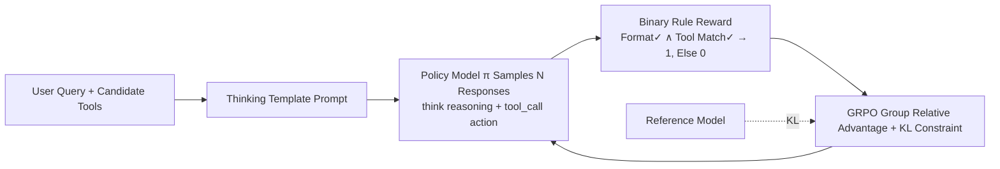

# Nemotron-Research-Tool-N1: Exploring Tool-Using Language Models with Reinforced Reasoning

**Conference**: ICLR 2026  
**OpenReview**: [https://openreview.net/forum?id=yiE16lWzDj](https://openreview.net/forum?id=yiE16lWzDj)  
**Code**: Open-sourced (NVIDIA)  
**Area**: LLM Agent / Tool Use / Reinforcement Learning  
**Keywords**: Tool calling, Rule-based RL, GRPO, Reasoning, Binary reward, BFCL  

## TL;DR
By using a binary reward that only checks "format compliance + precise tool-calling match" for R1-style GRPO training, the authors trained Qwen2.5-7B/14B into tool-calling reasoning models that outperform GPT-4o without any distilled reasoning trajectories.

## Background & Motivation
**Background**: Enabling LLMs to call external tools (Search, Python interpreter, APIs) is a mainstream approach to extending model capabilities. The standard practice involves using stronger models to synthesize large amounts of tool-call trajectories followed by Supervised Fine-Tuning (SFT) on student models.

**Limitations of Prior Work**: Synthetic data often only labels the "tool-calling action" step, lacking explicit reasoning processes. Even when reasoning trajectories are distilled for SFT, student models often merely imitate surface patterns, resulting in "pseudo reasoning"—memorizing trajectories without internalizing decision logic, which limits generalization. Furthermore, SFT relies on next-token exact matching, treating semantically equivalent tool calls with different parameter orders as errors, forcing models into rigid string-level imitation.

**Key Challenge**: Tool calling requires "functional correctness" rather than "character-level consistency." SFT supervision signals are both expensive (requiring distilled reasoning) and rigid (forcing token alignment), creating a fundamental misalignment.

**Goal**: To answer two questions—Can rule-based RL effectively train tool-calling models? How should this RL pipeline be designed?

**Key Insight**: **Replace SFT supervision with binary rule-based rewards.** Rewards only evaluate reasoning format compliance and precise tool-calling matches (allowing parameter reordering), without supervising any intermediate reasoning trajectories. This allows the model to autonomously acquire reasoning strategies under GRPO. **Lightweight supervision + structural flexibility** are the root causes of its superiority over SFT.

## Method

### Overall Architecture
Starting from standard SFT tool-calling data (user query + candidate tools), the model is prompted to reason within `<think>` tags and then output the call within `<tool_call>` tags. After rollout, a binary reward function scores the response (1 if the format is correct and the tool call matches precisely, 0 otherwise). GRPO is used for policy optimization based on relative group advantage. The entire pipeline requires no reasoning-annotated trajectories.

### Key Designs

**1. Binary Rule Reward: Rewarding only "complete correctness" is most stable.** The reward function $r(c_t, O_t)\in\{0,1\}$ grants 1 only when two conditions are met: correct format (output properly wrapped in `<think></think>` and `<tool_call></tool_call>`) and precise tool-call match (predicted tool name and all parameter key-value pairs match the ground-truth exactly). Formally: $r=\mathbb{1}[\text{FormatCorrect}(O_t)\wedge \text{ToolCallMatch}(a_t,a_t^*)]$. This "all-or-nothing" design might seem harsh, but it outperforms fine-grained rewards (e.g., 0.2 for format, 0.2 for tool name). The authors attribute this to fine-grained rewards inducing "reward hacking," where models learn to satisfy surface cues without ensuring overall execution correctness. In ablations, binary rewards significantly outperformed others on the Live subset (80.38% vs. 76.61%).

**2. Dict-level Matching instead of Character-level Alignment: Unbinding rigid token supervision for functional correctness.** Tool-call outputs are parsed into dictionaries and matched structurally against the ground-truth. This only verifies if the tool name is correct and if all mandatory parameters are present with correct values. Unlike SFT's next-token prediction, dictionary matching naturally allows parameter order variations, forcing the model to focus on "correct calling semantics" rather than "memorizing token sequences," which enhances generalization on OOD inputs.

**3. Explicit Reasoning Format Constraint: Thinking before calling to induce emergent reasoning.** The thinking template forces the model to put reasoning in `<think>` tags and the tool call in `<tool_call>` tags within the same response. This structural constraint prevents the model from "taking shortcuts to the answer" and encourages explicit reasoning. Ablations show this constraint is vital: removing the reasoning format requirement under binary rewards dropped Live subset performance from 80.38% to 76.24%. The template is kept lightweight to avoid overfitting to specific prompt patterns and to facilitate integration with complex strategies like ReAct.

**4. GRPO Group Relative Advantage Optimization: Stable RL without a Value Network.** For each input, $N$ candidate responses are sampled to get rewards $\{r_1,...,r_N\}$. Advantages are calculated via group standardization $A_i = (r_i - \text{mean})/\text{std}$, and the policy is updated using a PPO-style clipped objective with KL regularizer: $L_{\text{GRPO}}=\mathbb{E}[\min(\rho_i A_i, \text{clip}(\rho_i,1-\epsilon,1+\epsilon)A_i) - \beta\,\text{KL}(\pi_\theta\|\pi_{\text{old}})]$. No separate value network is needed; binary rewards combined with group comparisons provide a stable learning signal. Data is unified from xLAM and ToolACE subsets, filtered for invalid tool calls or JSON failures, and multi-turn trajectories are sliced into single-step prediction instances.

## Key Experimental Results

Backbones are Qwen2.5-7B/14B-Instruct, trained using Verl (batch 1024, lr 1e-6, temperature 0.7, KL coefficient 1e-3, 4 nodes × 8×H100).

### Main Results (BFCL Overall Accuracy)

| Model | Non-live | Live | Overall |
|------|---------:|-----:|--------:|
| GPT-4o | 88.10 | 79.83 | 83.97 |
| GPT-4o-mini | 86.77 | 76.50 | 81.64 |
| Gemini-2.0-Flash | 84.48 | 81.39 | 82.94 |
| DeepSeek-R1 | 87.35 | 74.41 | 80.88 |
| Hammer2.1-7B (FC) | 88.65 | 75.11 | 81.88 |
| ToolACE-8B (FC) | 87.54 | 78.59 | 82.57 |
| xLAM-2-70b-fc-r | 88.44 | 72.95 | 80.70 |
| **Ours-7B** | 89.25 | 80.38 | **84.82** |
| **Ours-14B** | 90.52 | 81.42 | **85.97** |

The 7B model surpasses GPT-4o (+0.85%) and the specialized Hammer2.1-7B (+2.97%); the 14B model outperforms GPT-4o by ~2%. Similar leads were observed on API-Bank (7B 81.28 vs GPT-4o 77.16) and ACEBench (14B 87.00 vs GPT-4o 87.00).

### Ablation Study

**Training Recipe (5,518 DeepSeek-R1 distilled trajectories, equal data budget)**

| Recipe | Non-Live | Live | Avg |
|------|---------:|-----:|----:|
| No-Reason SFT (100%) | 86.40 | 76.54 | 81.47 |
| Reason-SFT (100%) | 87.54 | 77.87 | 82.71 |
| Reason-SFT+RL (50/50) | 88.19 | 78.16 | 83.17 |
| **RL (100%)** | 88.23 | 78.24 | **83.24** |

**Reward Design (Ours-7B)**

| Reward Scheme | Non-Live | Live | Avg |
|----------|---------:|-----:|----:|
| Fine-grained (Partial format) | 87.83 | 79.64 | 83.74 |
| Fine-grained (+Partial func name) | 88.54 | 76.61 | 82.58 |
| Binary w/o Reasoning Format | 87.63 | 76.24 | 81.94 |
| **Binary w/ Reasoning Format** | 89.25 | 80.38 | **84.82** |

### Key Findings
- **Finding 1**: R1-style training yields higher gains as model scale increases (almost no gain for 0.5B/1.5B, significant for 7B/14B), and generalizes well across backbones (Qwen outperforms LLaMA).
- **Finding 2**: The "SFT-then-RL" paradigm, often considered best practice, is **not superior to pure RL** for tool calling (83.17% vs 83.24%). SFT might even hinder performance by inducing pseudo reasoning.
- **Finding 3**: Binary rewards > fine-grained rewards (especially for real inputs), and forced structured reasoning is critical (dropping it loses 4 percentage points).
- Response lengths did not grow continuously during training—longer reasoning chains do not necessarily yield better tool calls; there exists a "sufficient" length.

## Highlights & Insights
- **"Less is More" Reward Philosophy**: Simplistic 0/1 binary rewards are most resistant to reward hacking. Fine-grained rewards can mislead the model into focusing on surface cues—an anti-intuitive but practical lesson for rule-based RL.
- **Challenging the SFT-then-RL Dogma**: In verifiable scenarios like tool calling, pure RL outperforms the "distill-then-SFT-then-RL" pipeline, questioning cross-domain training assumptions.
- **Recycling SFT Data as Verifiable Signals**: The core contribution is transforming standard tool-calling data (without reasoning labels) into fully verifiable RL signals with near-zero additional labeling cost.
- **Engineering via Dict Matching**: Using structured dictionary matching to unbind parameter order ensures functional correctness while providing generalization space, proving more elegant than string matching.

## Limitations & Future Work
- **Single-turn/Single-step Evaluation**: benchmarks used (BFCL/API-Bank/ACEBench) largely exclude multi-turn scenarios. The effectiveness of rule-based rewards for long-term dependencies and error recovery remains unverified.
- **Dependency on Matchable Ground-Truth**: Binary rewards require a gold standard for dict matching, making them hard to apply to open-ended tasks without a unique correct call.
- **Backbone Dependency**: High reliance on Qwen's innate reasoning capability. Performance on LLaMA was noticeably lower, suggesting RL "excites" rather than "creates" reasoning from scratch.
- **Diminishing Returns for Small Models**: 0.5B/1.5B models show limited improvement, with benefits concentrated in medium-to-large models.

## Related Work & Insights
- **R1 / DeepSeek-R1 (Guo et al. 2025)**: This work migrates the R1 idea of "rewarding only final answers + format" from math to tool calling.
- **GRPO (Shao et al. 2024)**: Provides the optimization framework for relative advantage within groups without a value network.
- **ToolACE / xLAM**: Provides data sources. This paper proves RL outperforms the original SFT models on the same data (+6.36% over xLAM, +1.62% over ToolACE).
- **Insight**: Any capability with "programmatically verifiable answers" (Code, SQL, Extraction) can likely use binary rule rewards + GRPO to bypass expensive trajectory distillation and recycle existing supervised data.

## Rating
- **Novelty**: ⭐⭐⭐⭐ — Applying rule-based RL is not a brand-new paradigm, but the systematic findings on "binary rewards being optimal" and "SFT-then-RL being unnecessary" are highly valuable.
- **Experimental Thoroughness**: ⭐⭐⭐⭐⭐ — Multiple benchmarks + ablations on recipes, rewards, data, scaling, and backbones. Clear findings and solid evidence.
- **Writing Quality**: ⭐⭐⭐⭐ — Logical flow from motivation to findings; good use of charts, with only minor typos.
- **Value**: ⭐⭐⭐⭐⭐ — A 7B model surpassing GPT-4o with a transparent recipe and open-source code offers direct, reproducible guidance for industrial tool-calling model training.

<!-- RELATED:START -->

## Related Papers

- [\[ICLR 2026\] ToolWeaver: Weaving Collaborative Semantics for Scalable Tool Use in Large Language Models](toolweaver_weaving_collaborative_semantics_for_scalable_tool_use_in_large_langua.md)
- [\[ACL 2026\] Meta-Tool: Efficient Few-Shot Tool Adaptation for Small Language Models](../../ACL2026/llm_agent/meta-tool_efficient_few-shot_tool_adaptation_for_small_language_models.md)
- [\[ICLR 2026\] Benchmarking LLM Tool-Use in the Wild](benchmarking_llm_tool-use_in_the_wild.md)
- [\[ICLR 2026\] GTool: Graph Enhanced Tool Planning with Large Language Model](gtool_graph_enhanced_tool_planning_with_large_language_model.md)
- [\[ICLR 2026\] The Tool Decathlon: Benchmarking Language Agents for Diverse, Realistic, and Long-Horizon Task Execution](the_tool_decathlon_benchmarking_language_agents_for_diverse_realistic_and_long-h.md)

<!-- RELATED:END -->
