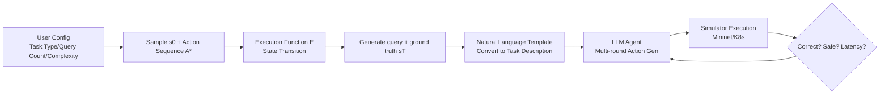

# NetArena: Dynamic Benchmarks for AI Agents in Network Automation

**Conference**: ICLR 2026  
**OpenReview**: [https://openreview.net/forum?id=BPVPOtzoOz](https://openreview.net/forum?id=BPVPOtzoOz)  
**Code**: [https://github.com/Froot-NetSys/NetArena](https://github.com/Froot-NetSys/NetArena)  
**Area**: LLM Agent / Network System Automation / Dynamic Benchmark Evaluation  
**Keywords**: AI Agent, Network Automation, Dynamic Benchmark, State-Action Abstraction, Safety Evaluation, Network Simulator  

## TL;DR
NetArena utilizes a unified "state-action" abstraction and network simulator integration to transform network operation and maintenance tasks into a live benchmark that can infinitely generate dynamic queries and automatically verify correctness, safety, and latency in simulation, revealing that current AI agents achieve only 13–38% accuracy on realistic large-scale network tasks.

## Background & Motivation

**Background**: LLM agents are expanding into high-risk domains such as network/system operations—ranging from data center capacity planning and routing fault root cause analysis to policy synthesis. These tasks serve as excellent "stress tests" for agent capabilities, requiring agents to reason under constraints of partial observability and operational risk, pursuing not only correctness but also robustness and efficiency.

**Limitations of Prior Work**: Existing network operation benchmarks are **static and manually annotated by experts**, often yielding fewer than 300 queries even after months of effort. Small and static benchmarks present three problems: (1) high statistical variance, where the confidence intervals between agents overlap significantly, making it impossible to reliably distinguish performance; (2) vulnerability to pre-training data contamination; (3) questionable generalizability—an agent that succeeds on one task might fail entirely when the topology, location, or load changes, and static datasets struggle to enumerate rare but critical edge cases.

**Key Challenge**: A natural solution is **dynamic query generation**, but existing dynamic generation works (e.g., DyVal, KIEval, LatestEval) are primarily oriented toward tasks with "deterministic symbolic structures" (like arithmetic, logic, or program synthesis) and cannot be transferred to the network domain. First, network problems lack a deterministic structure, making it difficult to synthesize realistic queries and reliable ground truth (troubleshooting is not a single step but a multi-round observation-hypothesis-action process). Second, "success" in network tasks involves more than just output matching; agents must also avoid harmful side effects and adhere to safety and latency constraints—a single misconfigured command could paralyze a healthy path and trigger cascading failures.

**Goal**: Construct a dynamic benchmark framework capable of **generating infinite realistic network operation queries on demand** and **automatically verifying correctness, safety, and latency across multiple rounds** in a simulation environment.

**Core Idea**: **Unified State-Action Abstraction + Simulator Execution Verification**—Heterogeneous network tasks are unified and modeled as finite state transition systems. Query and ground truth generation are automated through "action sequence execution." Agents are then deployed into high-fidelity simulators (Mininet, Kubernetes) for end-to-end execution, using simulation feedback rather than preset answers to evaluate each step.

## Method

### Overall Architecture

The core of NetArena is the compression of diverse network operation tasks into a shared structure: all tasks run on a specific network/system topology (graph), and each interaction involves analyzing or modifying the state of that topology. Thus, tasks are modeled as finite state transition systems $(S, A, E)$, where $S$ is the state space, $A$ is the set of atomic action functions, and $E$ is the application-specific execution function. To integrate a new task, developers only need to define $S$ (e.g., a routing topology with connectivity states) and $A$ (e.g., $\text{IP}(u)$ representing an IP error on link $u$). A query is an "execution script" starting from an initial state $s_0$ and applying a sequence of parameterized actions to push the system to a target state. At runtime, infinite queries are generated by randomly sampling initial states and actions, and each step of the agent is verified via real execution in the simulator.

### Key Designs

**1. Unified State Transition Abstraction**: This serves as the foundation of the framework. Task objectives are formulated as $(S, A, E)$ triplets. Each action $a_t \in A$ is parameterized by task-related operands $\theta_t$, denoted as $a_t(\theta_t)$. A query defines an execution episode starting from $s_0$ applying $T$ parameterized actions: $s_{t+1} = E(s_t, a_t(\theta_t))$ for $t=0,\dots,T-1$. The key advantage is that ground truth is no longer manually labeled but **deterministically calculated by the execution function itself**, allowing task complexity to scale continuously by controlling the length and type of action sequences.

**2. Distinction between Constructive and Reactive Tasks**: Since the interaction patterns of network tasks differ, NetArena designs two generation logics. **Constructive (White-box)** tasks have clear intent (e.g., "find the optimal location for a new switch" in data center planning). Starting from $s_{init}$, the ground truth is a predefined action sequence $A^* = \{a_0^*, \dots, a_{T-1}^*\}$, and the target state is $E(s_0, A^*) \triangleq (E(\cdot, a_{T-1}^*) \circ \cdots \circ E(\cdot, a_0^*))(s_0) = s_T$. Scoring compares whether the agent's final state equals $s_T$. **Reactive (Black-box)** tasks (e.g., "h1 cannot connect to h4, fix it") reverse this: a fault injection sequence $A_{inj}$ (hidden from the agent) is applied to a healthy state $s_0$ to produce $s_{faulty}$. The agent must restore the system to $s_0$. Since restoration paths are not unique, scoring only checks if the state is restored, without forcing a match with the specific injection sequence.

**3. Three-Dimensional Verification (Correctness, Safety, Latency)**: NetArena embeds agents into high-fidelity simulators like Mininet or Kubernetes for end-to-end runs. **Correctness** is measured as $\text{CORRECT}(Q) = \mathbb{I}(\hat{s}_{LLM} \equiv s_T^*)$, where $\equiv$ denotes application-specific state equivalence. **Safety** decouples step-wise safety from final correctness: $\text{SAFE}_{all}(Q) = \mathbb{I}\big(\forall t \in [1,T],\, s_t = E(s_{t-1}, \hat{a}_{t-1}(\hat{\theta}_{t-1})) \wedge s_t \models C_Q\big)$, where $C_Q$ covers structural invariants and operational guarantees. **Latency** tracks the number of commands and end-to-end time.

**4. Configuration-Driven Random Sampling**: Users provide high-level configurations (query count, complexity, task type). NetArena dynamically generates new query sets for each evaluation round, ensuring broad coverage and keeping the agent on "unseen" tasks, thereby reducing data contamination risk from High to Low/Dynamic.

## Key Experimental Results

### Main Results

| Benchmark | Scale | Accuracy (95% CI) | Safety/Latency | Contamination Risk | Generalizability |
|---|---|---|---|---|---|
| NeMoCopilot | 33 | 94% [-] | N/A | High (Static) | Low (Admin) |
| AI4OpsLab | 48 | 59% [-] | N/A | High (Static) | Low (DevOps) |
| NetConfEval | 3200 | 100% [-] | N/A | High (Static) | Low (Config) |
| **NetArena (Ours)** | **9,250 (Infinite)** | **44% [0.01, 0.14]** | **35% / 18s** | **Low (Dynamic)** | **High (Admin/K8s/Routing etc.)** |

### Ablation Study (Effect of Query Scale on Statistical Reliability)

| Setting | Small Query Set | Large Query Set | Effect |
|---|---|---|---|
| CP | 100 | 5000 | CI overlap decreased from >50% to 0 |
| Routing | 150 | 2250 | Error bars narrowed significantly |
| K8s | 150 | 2000 | Revealed significantly lower safety rate for GPT+ReAct |
| Overall | <200 | >4000 | CI overlap decreased from 85% to 0% |

### Key Findings
- **Agent performance is poor**: The average accuracy across three tasks was only 24%, with the best agent below 60%. Under large-scale realistic queries, agents averaged 13–38%.
- **Small benchmarks are unreliable**: With <200 queries, accuracy appeared artificially high (38%) and error bars overlapped heavily. Expanding to 5000 queries allowed GPT+ReAct to emerge as a clear winner.
- **Accuracy alone is insufficient**: On K8s:150, GPT+ReAct and Qwen+Fewshot were indistinguishable, but on K8s:2000, GPT+ReAct showed significantly lower safety rates.
- **Diverse failure modes**: These included safety violations (e.g., deleting running pods), control logic errors (e.g., incorrect command ordering), and operational errors (e.g., hallucinating node attributes).

## Highlights & Insights
- **Dynamic benchmarks in the network domain**: Addresses the "lack of deterministic structure" hindrance by using execution functions to automate ground truth generation.
- **Decoupling safety and correctness**: In high-risk operations, process safety is as critical as final correctness; this design targets the core requirement for real-world deployment.
- **Rigorous statistical reliability**: Uses Bernoulli SEM to quantitatively demonstrate that small benchmarks are untrustworthy (CI overlap reduced from 85% to 0%).

## Limitations & Future Work
- **Task and Agent scale**: Currently validated on three tasks (CP/Routing/K8s) and two base models (GPT-4o/Qwen). Coverage of complex scenarios like cross-domain routing remains limited.
- **Engineering cost**: Defining the $(S, A, E)$ space requires manual effort, and the quality of modeling directly impacts the benchmark.
- **Simulation vs. Production**: High-fidelity simulators cannot perfectly replicate all hardware failures or performance jitters found in real production environments.

## Related Work & Insights
- **General agent benchmarks** (SWE-Bench, etc.) measure coding/ML engineering but lack network deployment reliability.
- **Network/System LLM evaluation** (AIOpsLab, NetConfEval) are mostly static with high contamination risks.
- **Insight**: For any "high-risk, multi-round, side-effect sensitive" agent evaluation (Ops, robotics, finance), the methodology of "Unified state-action abstraction + environment verification + safety-correctness decoupling" is highly reusable.

## Rating
- **Novelty**: ⭐⭐⭐⭐ First systematic application of dynamic benchmark generation to network operations.
- **Experimental Thoroughness**: ⭐⭐⭐⭐ Solid quantitative analysis of confidence intervals; performance across varying complexities is effectively demonstrated.
- **Writing Quality**: ⭐⭐⭐⭐ Clear formalization of the abstraction and well-coordinated figures/tables.
- **Value**: ⭐⭐⭐⭐ Provides a foundation for infinite query generation and safety verification, facilitating RL fine-tuning and reliability research.

<!-- RELATED:START -->

## Related Papers

- [\[ICLR 2026\] CoLLMLight: Cooperative Large Language Model Agents for Network-Wide Traffic Signal Control](collmlight_cooperative_large_language_model_agents_for_network-wide_traffic_sign.md)
- [\[ICLR 2026\] LongHorizonUI: A Unified Framework for Robust Long-Horizon Task Automation of GUI Agent](longhorizonui_a_unified_framework_for_robust_long-horizon_task_automation_of_gui.md)
- [\[CVPR 2025\] Visual Agentic AI for Spatial Reasoning with a Dynamic API](../../CVPR2025/llm_agent/visual_agentic_ai_for_spatial_reasoning_with_a_dynamic_api.md)
- [\[ICLR 2026\] EXP-Bench: Can AI Conduct AI Research Experiments?](exp-bench_can_ai_conduct_ai_research_experiments.md)
- [\[ICLR 2026\] Gaia2: Benchmarking LLM Agents on Dynamic and Asynchronous Environments](gaia2_benchmarking_llm_agents_on_dynamic_and_asynchronous_environments.md)

<!-- RELATED:END -->
