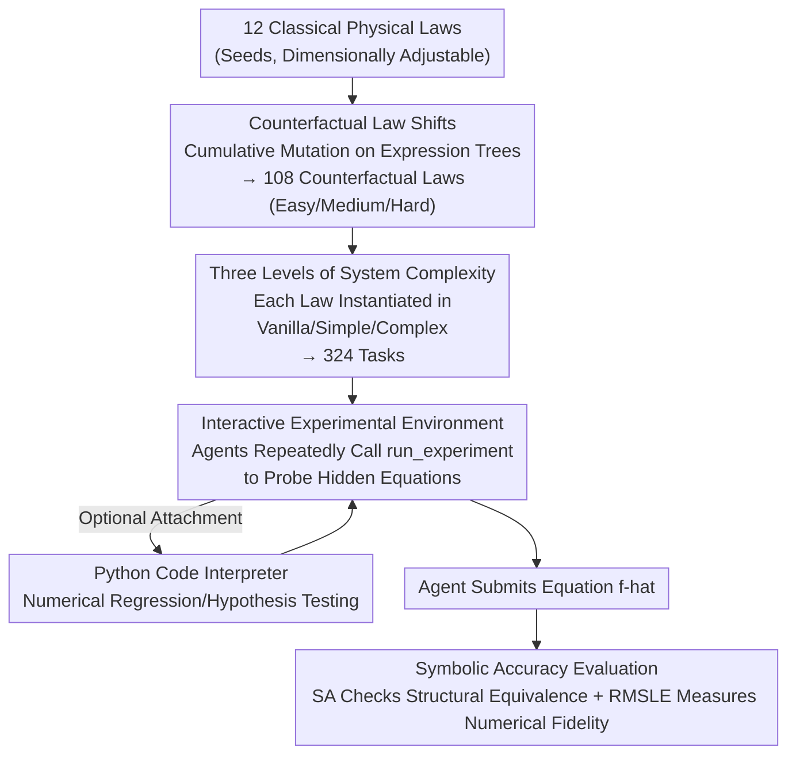

# NewtonBench: Benchmarking Generalizable Scientific Law Discovery in LLM Agents

**Conference**: ICLR 2026  
**arXiv**: [2510.07172](https://arxiv.org/abs/2510.07172)  
**Code**: Available  
**Area**: LLM Agent  
**Keywords**: Scientific discovery, benchmark, counterfactual physical laws, symbolic regression, interactive exploration

## TL;DR
NewtonBench is proposed as a benchmark for scientific law discovery featuring 324 tasks across 12 physical domains. It generates novel, memorization-resistant tasks via "counterfactual law shifts," requiring agents to discover hidden physical equations through interactive experimental exploration. Results show GPT-5 performs best (75.9% symbolic accuracy) but degrades sharply in complex systems (40.3%), and code tools unexpectedly yield negative effects for strong models.

## Background & Motivation

**Background**: LLM-driven scientific discovery is a frontier area, yet existing benchmarks (e.g., SRBench) face a "methodological trilemma"—the inability to simultaneously achieve scientific relevance, scalability, and memorization resistance.

**Limitations of Prior Work**:
   - Existing benchmarks are mostly static function fitting tasks that do not require interactive exploration.
   - Synthetic benchmarks are scalable but lack scientific grounding.
   - Real physical equations may be memorized by LLMs from training data.
   - There is a lack of hierarchical evaluation for system complexity.

**Key Challenge**: The need to satisfy scientific grounding, memorization resistance, and scalability simultaneously. Using real laws directly cannot prevent memorization, while purely synthetic laws lack scientific significance.

**Goal**: To solve the trilemma by constructing an interactive scientific discovery benchmark through counterfactual law shifts.

**Key Insight**: Systematically mutate expression trees (operator/constant mutation) of known physical laws to generate novel laws that have scientific foundations but have never been seen by LLMs.

**Core Idea**: Build the first memorization-resistant and scalable scientific discovery benchmark by combining counterfactual physical laws generated via expression tree mutation with an interactive experimental environment.

## Method

### Overall Architecture
The core problem NewtonBench addresses is how to evaluate an LLM agent's capability to "discover physical laws" without allowing it to cheat by recalling real equations from training corpora. It constructs the benchmark as a three-dimensional difficulty grid. Starting from 12 classical physical laws, it performs cumulative mutations on expression trees to derive 108 "counterfactual" laws (categorized as Easy/Medium/Hard). Each law is then instantiated into three levels of system environments (Vanilla/Simple/Complex), totaling 324 tasks. Each task contains a hidden target equation invisible to the agent. Agents must use the `<run_experiment>` tool to input variable values and receive system outputs, iteratively probing like real experiments to infer the hidden equation form. Success is determined by whether the submitted equation is mathematically equivalent to the hidden one using symbolic accuracy.

### Key Designs

**1. Counterfactual Law Shifts: Scientifically Grounded Equations Absent from Training Data**

Real physical equations (e.g., Newton's gravitation, heat conduction) are likely memorized by LLMs. Direct testing cannot distinguish between "discovery" and "recall," yet purely synthetic equations lack scientific meaning. NewtonBench represents each classical law as an expression tree and performs **cumulative mutations**: operator mutations (e.g., replacing addition $+$ with multiplication $\times$) and constant/exponent mutations (e.g., changing a square term to a cubic term). Difficulty is controlled by the number of mutations—Easy performs 1–2 mutations on the original law, Medium adds 1–2 more to Easy, and Hard continues from Medium. Mutations may break dimensional consistency, so each target equation contains at least one physical constant that is adjusted to recover dimensional balance. The resulting equations remain rooted in real physics but their specific forms have never appeared in training corpora.

**2. Three Levels of System Complexity: Placing Target Equations in Increasingly Noisy Systems**

Controlling equation difficulty alone is insufficient; real scientific discovery involves isolating target patterns from coupled variables. NewtonBench treats "target law difficulty" and "peripheral system complexity" as independent axes. Each target equation is paired with three system environments: Vanilla exposes only the target equation without confounding variables; Simple embeds the target into a small system with auxiliary equations; Complex involves multiple coupled equations with maximum confusion. Agents must decouple confounding variables using auxiliary equations to lock onto the target. This dimension allows the benchmark to measure the impact of "system complexity" independently.

**3. Interactive Experimental Environment: Active Exploration vs. Passive Fitting**

The only path to discovering the hidden equation is interaction. Agents call `<run_experiment>` to assign values to input variables, the simulator evaluates the complete system and returns outputs, and the agent designs the next experiment based on these results. The environment can optionally attach a Python code interpreter (Code Assistance) for numerical regression or hypothesis testing. This is intended to move the model from being "computation-limited" to "discovery-limited."

**4. Symbolic Accuracy Evaluation: Determining "Structural Equivalence" Rather Than Numerical Fit**

Discovery tasks should not rely solely on prediction values. NewtonBench's primary metric is **Symbolic Accuracy (SA)**, a binary metric determining if the agent's equation $\hat{f}$ is mathematically equivalent to the target $f_{\text{target}}$. The equivalence check **intentionally ignores specific values of physical constants** (which are hard to fit precisely from limited observations) and focuses on the structural form. Equivalence is decided by LLM-as-judge, achieving 98.3% agreement with human expert annotations. The auxiliary metric is RMSLE ($\text{RMSLE}=\sqrt{\frac{1}{n}\sum_i\big(\log(1+\hat{y}_i)-\log(1+y_i)\big)^2}$), measuring the prediction fidelity.

## Key Experimental Results

### Main Results (11 Models)

| Model | Vanilla Easy | Vanilla Hard | Complex Hard | Average SA |
|------|-------------|-------------|-------------|--------|
| GPT-5 | 90.3% | 87.5% | **40.3%** | **75.9%** |
| Gemini-2.5-pro | 96.5% | 69.4% | 16.7% | 65.4% |
| o4-mini | 88.9% | 52.8% | 2.8% | 47.8% |
| DeepSeek-R1 | 88.2% | 36.8% | 2.8% | 43.4% |
| GPT-4.1 | 16.7% | 1.4% | 0.7% | 5.8% |

### Ablation Study

| Configuration | Key Findings |
|------|---------|
| Code tools for strong models | GPT-5: 75.9% → Decrease 2-3%; GPT-5-mini: 53.1% → 48.1% **Code is harmful** |
| Code tools for weak models | Models with <40% SA see significant improvement with code |
| Noise 0.0001 | Accuracy drops 12-16% for all models |
| Increasing noise | Performance degrades proportionally to noise levels |

### Key Findings
- **Reasoning capability is the threshold**: Non-reasoning models (e.g., GPT-4.1) all have <10% accuracy.
- **Complexity Collapse**: GPT-5 drops from 90.3% (Vanilla Easy) to 40.3% (Complex Hard); second-order complexity or higher is a core bottleneck.
- **Paradoxical Effect of Code Tools**: Strong models exhibit a sharp decline in exploration rate (over-exploitation) when using code, while weak models benefit from offloading computation.
- **Large Cross-domain Variance**: Bose-Einstein distribution is the hardest (18.1%), while heat conduction is the simplest.
- **Scaling of Reasoning Tokens**: Reasoning models significantly increase token consumption as task complexity grows, whereas non-reasoning models do not.

## Highlights & Insights
- **Counterfactual law shift is an elegant solution to memorization**: Instead of creating entirely synthetic equations (losing scientific grounding), it performs controlled variations on real equations, maintaining scientific meaning while preventing memory-based recall.
- **Discovery of the exploration-exploitation trade-off in code tools**: Strong models tend towards local numerical fitting (exploitation) and abandon global exploration when given code. This is a profound behavioral insight echoing classic dilemmas in reinforcement learning.
- **Interactive Evaluation Paradigm**: Shifts the focus from "fitting equations to data" to "designing experiments to discover laws," which is closer to the actual process of scientific discovery.

## Limitations & Future Work
- Currently only covers physics; generalization to chemistry or biology remains unverified.
- While counterfactual laws have scientific foundations, they do not correspond to real phenomena.
- Tiny amounts of noise (0.0001) lead to a 12-16% accuracy drop, raising questions about applicability in real-world scenarios.
- Only tested single-target equation discovery with scalar outputs.

## Related Work & Insights
- **vs SRBench**: Traditional symbolic regression benchmarks rely on static data fitting without interactive exploration or anti-memorization designs.
- **vs AI Feynman**: Uses real Feynman equations but faces memorization risks; NewtonBench solves this via counterfactual shifts.
- **vs BALSA/Funsearch**: Program search methods that are complementary to NewtonBench's equation discovery paradigm.

## Rating
- Novelty: ⭐⭐⭐⭐⭐ Counterfactual law shifts and interactive discovery benchmarks are novel contributions; the code paradox effect is a profound finding.
- Experimental Thoroughness: ⭐⭐⭐⭐ Extensive analysis across 11 models and 12 domains, though improvement paths for non-reasoning models are lacking.
- Writing Quality: ⭐⭐⭐⭐ Clear motivation for benchmark design and in-depth experimental analysis.
- Value: ⭐⭐⭐⭐⭐ Provides a rigorous evaluation tool for LLM scientific discovery capabilities and offers important insights for agent design regarding code tools.

<!-- RELATED:START -->

## Related Papers

- [\[ICLR 2026\] Towards Multimodal Data-Driven Scientific Discovery Powered by LLM Agents](towards_multimodal_data-driven_scientific_discovery_powered_by_llm_agents.md)
- [\[ICLR 2026\] SR-Scientist: Scientific Equation Discovery With Agentic AI](sr-scientist_scientific_equation_discovery_with_agentic_ai.md)
- [\[ICLR 2026\] Gaia2: Benchmarking LLM Agents on Dynamic and Asynchronous Environments](gaia2_benchmarking_llm_agents_on_dynamic_and_asynchronous_environments.md)
- [\[ICML 2025\] Evaluating Retrieval-Augmented Generation Agents for Autonomous Scientific Discovery in Astrophysics](../../ICML2025/llm_agent/evaluating_retrieval-augmented_generation_agents_for_autonomous_scientific_disco.md)
- [\[ICLR 2026\] PolySkill: Learning Generalizable Skills through Polymorphic Abstraction for Continual Agents](polyskill_learning_generalizable_skills_through_polymorphic_abstraction_for_cont.md)

<!-- RELATED:END -->
