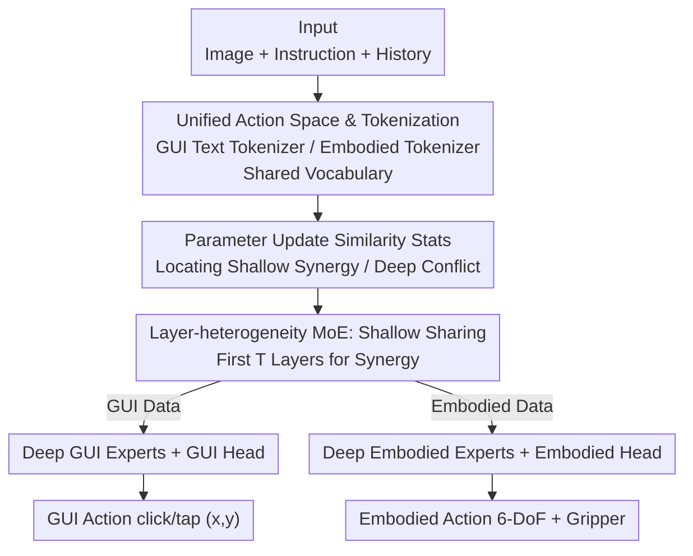

# OmniActor: A Generalist GUI and Embodied Agent for 2D&3D Worlds

**Conference**: ICLR 2026  
**OpenReview**: [https://openreview.net/forum?id=oJAIjUDxkZ](https://openreview.net/forum?id=oJAIjUDxkZ)  
**Code**: None  
**Area**: Agent / Multimodal VLM  
**Keywords**: Generalist Agent, GUI Agent, Embodied AI, MoE, Parameter Conflict

## TL;DR
Addressing the phenomenon where joint training of GUI and embodied data leads to mutual interference, this paper discovers that these two data types synergize in shallow layers but conflict in deep layers (analogous to the "cerebrum-cerebellum" division in the human brain). The authors propose Layer-heterogeneity MoE, which shares parameters in shallow layers to exploit synergy and separates them in deep layers to avoid conflict. By unifying the action spaces and collecting large-scale data, they develop OmniActor, a generalist agent that outperforms specialized SOTA models in both GUI and embodied tasks.

## Background & Motivation
**Background**: Multimodal Large Language Models (MLLMs) are evolving from "observing and speaking" to "active" multimodal agents. Current research follows two disconnected paths: GUI Agents, which perform operations like clicking buttons and filling forms in 2D digital worlds (e.g., UI-TARS, OS-Atlas, Aguvis); and Embodied Agents, which control robotic arms for grasping and placement in 3D physical worlds (e.g., OpenVLA, $\pi_0$). Both fields are advancing within their respective benchmarks.

**Limitations of Prior Work**: Real-world tasks often require agents to switch between these two worlds—for example, "ordering groceries via a mobile App, then having a robotic arm take the groceries out of the bag." While existing generalist agents (Magma, GEA, NaviMaster) can handle both types of tasks, their performance on individual tasks is generally lower than that of specialized agents. Preliminary experiments by the authors showed that simple joint training of GUI and embodied data causes performance degradation in both domains.

**Key Challenge**: The root cause lies in the simultaneous synergy and conflict between the two data types, which existing methods fail to handle distinguishably. Conflict arises from huge differences in action modalities—GUI actions are text-described discrete operations (e.g., `click(x, y)`), while embodied actions are continuous 6-DoF end-effector displacements. Synergy comes from the identical task structure—both involve "observing the environment + understanding instructions + outputting actions," where environment and instruction understanding should ideally enhance each other. Shared or separated parameter strategies both fail to capture both aspects.

**Goal**: To build a generalist agent that exploits synergistic benefits while avoiding conflicts, ensuring it remains competitive with specialized models in both GUI and embodied tasks.

**Key Insight**: The authors quantify conflict and synergy from the perspective of optimization via "parameter update directions." If the update directions for a parameter from GUI and embodied data are consistent, they should be shared; if they are contradictory, they should be separated. Statistical analysis reveals that **updates for shallow parameters are highly consistent, while those for deep parameters diverge significantly**. This corresponds to the brain's "cerebrum-cerebellum" mechanism: the cerebrum (shallow layers) near sensory input performs general understanding, while the cerebellum (deep layers) near motor output handles specific execution.

**Core Idea**: Shallow sharing and deep separation—using a layer-heterogeneous MoE structure to leverage synergy and avoid conflict, combined with a unified action space for large-scale data training.

## Method

### Overall Architecture
OmniActor uses Qwen2-VL / Qwen2.5-VL as the base MLLM, modified from both "data" and "structural" perspectives. Data side: GUI and embodied samples are unified into a single format (system prompt + image + task instruction + action). GUI actions are processed by the text tokenizer, while embodied actions are discretized via a specialized "embodied tokenizer" and mapped to the same vocabulary, forming a unified action space. Structural side: The Transformer is split by depth—parameters in the first $T$ layers (shallow) are shared across all data; after $T$ layers (deep), the Attention, FFN, LayerNorm, and even the prediction heads are split into two sets of experts (GUI experts / embodied experts). During inference, the task type is known, and the corresponding branch is selected.

The data flow is a clear serial pipeline:

### Key Designs

**1. Layer-heterogeneity MoE: Shallow Sharing for Synergy, Deep Separation for Conflict Avoidance**

This is the core structure addressing the "joint training performance drop." The $L$ layers of the base LLM are split by a depth threshold $T$. In **shallow layers** $\ell \in \{1,\dots,T\}$, all parameters are shared:

$$x'_\ell = \mathrm{MSA}(\mathrm{LN}(x_{\ell-1})) + x_{\ell-1}, \qquad x_\ell = \mathrm{FFN}(\mathrm{LN}(x'_\ell)) + x'_\ell$$

In **deep layers** $\ell \in \{T+1,\dots,L\}$, data is routed to independent parameters—GUI data uses $\mathrm{MSA}_{gui}/\mathrm{FFN}_{gui}/\mathrm{LN}_{gui}$, while embodied data uses the $\mathrm{rob}$ versions. Prediction heads $h_{gui}$ and $h_{rob}$ are also separated. This works because shallow layers perform common understanding (environment/instructions), where sharing data is beneficial; deep layers perform divergent action generation (click coordinates vs. continuous displacement), where separation prevents gradient interference.

**2. Parameter Update Similarity: Data-driven Identification of the Split Point**

The threshold $T$ is not arbitrary. The authors propose **parameter update similarity** to quantify whether a parameter should be "shared or separated." Specifically, for a parameter, the update $d_{gui}$ is calculated using only GUI data, and $d_{robot}$ using only embodied data. The cosine similarity between them indicates the consistency. High similarity suggests sharing; low similarity suggests separation. Analyzing FFN and Attention projections layer-by-layer (Figure 4) revealed that shallow layers have significantly higher similarity than deep layers, leading to an empirical threshold of $T=8$.

**3. Unified Action Space and Embodied Tokenization: One Vocab for Both Worlds**

To train on massive mixed data, GUI and embodied actions must be compatible. Samples are unified into ShareGPT format. GUI actions (e.g., `pyautogui.click(x=0.634, y=0.927)`) use the base MLLM's text tokenizer. Embodied actions are 7D vectors—6-DoF poses $(pos_x,pos_y,pos_z,rot_x,rot_y,rot_z)$ and one gripper dimension, normalized to $[-1,1]$. This range is discretized into $K$ bins, and $K$ **least frequent** token IDs from the base vocabulary are assigned to these bins to avoid semantic overlap. Thus, an embodied action is mapped to a sequence of tokens. This allows joint training on 706K GUI samples and 669K embodied samples (re-sampled 5x to a ~1:5 ratio).

### Loss & Training
Two-stage training: first, training on GUI grounding data (~3.4M samples) to learn precise element localization. Second, trajectory training to become an executable agent using Aguvis (GUI) and LIBERO (Embodied), totaling ~4.1M samples. Embodied data is **re-sampled 5 times** to ensure sufficient learning given the complexity of continuous point sequences compared to text. Task types are assumed known during inference for branch selection.

## Key Experimental Results

### Main Results
LIBERO-90 is the embodied benchmark; AndroidControl and GUI Odyssey are GUI benchmarks. Metrics are success rates (%).

| Agent | LIBERO-90 | AndroidControl-Low | AndroidControl-High | GUI Odyssey |
|--------|-----------|--------------------|--------------------|-------------|
| UI-TARS-7B (GUI specialized, closed) | - | 90.8 | 72.5 | 87.0 |
| ScaleTrack-7B (GUI specialized) | - | 86.6 | 77.9 | 65.3 |
| $\pi_0$ (Embodied specialized) | 87.3 | - | - | - |
| OpenVLA (Embodied specialized) | 73.5 | - | - | - |
| Magma (Generalist) | 34.7 | 52.1 | 32.7 | 51.0 |
| GEA (Generalist) | - | - | 57.3 | - |
| OmniActor-GUI (GUI only) | - | 88.4 | 74.5 | 63.0 |
| OmniActor-EA (Embodied only) | 63.4 | - | - | - |
| **OmniActor** | **69.5** | **87.5** | **77.1** | **66.0** |

**Main Comparison**: Compared to OmniActor-EA (embodied only), OmniActor improves success by 6.1% (63.4 → 69.5). Compared to OmniActor-GUI (GUI only), OmniActor improves by an average of 1.3%, with notable gains in long-chain tasks like AndroidControl-High (74.5 → 77.1) and GUI Odyssey (63.0 → 66.0), indicating synergy helps long-term planning.

### Ablation Study
Comparison of sharing/separation strategies (Avg is the mean of four tasks):

| Configuration | LIBERO-90 | AndroidControl-Low | AndroidControl-High | GUI Odyssey | Avg |
|------|-----------|--------------------|--------------------|-------------|-----|
| OmniActor-EA&GUI (Direct mix) | 50.5 | 86.3 | 71.0 | 60.8 | 67.2 |
| OmniActor hard (Full sep) | 59.5 | 85.6 | 75.2 | 63.9 | 71.1 |
| **OmniActor (Shallow-shared/Deep-sep)** | **69.5** | **87.5** | **77.1** | **66.0** | **75.0** |
| OmniActor router (MoE with router) | 64.0 | 86.0 | 72.6 | 66.1 | 72.2 |

### Key Findings
- **Direct mixing is the worst solution** (Avg 67.2): Embodied performance plummeted from 63.4 to 50.5, proving that conflict entails significant costs.
- **Full separation avoids conflict but loses synergy** (Avg 71.1): Better than mixing, but inferior to the full model because the shallow layers cannot share synergistic data.
- **The full model is optimal** (Avg 75.0): It captures both synergistic gains and conflict avoidance.
- **Gains stem from task partitioning, not MoE capacity**: The router version (72.2) performed worse than the task-specific hard split, indicating the importance of the correct inductive bias.
- **Generalization across bases**: Switching to Qwen2.5-VL 7B increased the average to 79.3 (+4.3%), approaching closed-source SOTA UI-TARS.

## Highlights & Insights
- **Dual justification via "Brain Analogy" and "Quantifiable Metrics"**: By using parameter update similarity to prove "shallow synergy, deep conflict" and providing the "cerebrum-cerebellum" analogy, the design is both data-backed and intuitive.
- **Insightful router experiment**: While many MoE works assume autonomous routing is superior, this paper shows that for this domain, hard task-specific routing is better, highlighting that benefits come from structural priors rather than just capacity.
- **Action space trick**: Using the least frequent tokens for embodied actions is a practical way to reuse the vocabulary without corrupting common semantic tokens.
- **Measurable "Share vs. Separate"**: The use of cosine similarity in update directions provides a transferable paradigm for locating conflict layers in any multi-task or multi-domain joint training.

## Limitations & Future Work
- **Assumed task type at inference**: The model relies on knowing whether the task is GUI or embodied. Real-world seamless interleaving requires an automatic task identification mechanism.
- **Limited to two worlds**: Currently only GUI/Embodied. Whether "shallow sharing and deep separation" holds as more modalities (navigation, games) and experts are added is unverified.
- **Empirical threshold $T=8$**: Although supported by stats, the split point is a manually set single threshold. Finer-grained or adaptive splitting wasn't explored.
- **Small synergy gains for GUI**: The average GUI gain is only +1.3%, with benefits concentrated in long-chain tasks; synergy is less pronounced for short-chain GUI tasks.

## Related Work & Insights
- **vs Magma**: Magma uses set-of-mark / trace-of-mark and video augmentation. This work focuses on **network architecture** (layer-heterogeneous MoE) to address optimization conflicts, yielding much higher scores (e.g., LIBERO-90 34.7 → 69.5).
- **vs GEA**: GEA uses continuous multi-modal tokenizers and online RL. This work uses pure SFT and architecture design, making it more lightweight than RL-based approaches.
- **vs NaviMaster**: NaviMaster models tasks as MDPs with RL. This work identifies conflict via offline "parameter update similarity" to guide design, a "diagnose-then-treat" approach.

## Rating
- Novelty: ⭐⭐⭐⭐ The "update similarity quantification + shallow-share/deep-sep" is a clean and insightful design.
- Experimental Thoroughness: ⭐⭐⭐⭐ Covers GUI/Embodied/Generalist baselines and cross-base validation, though lacks evaluation on truly interleaved tasks.
- Writing Quality: ⭐⭐⭐⭐ Clear logic chain (motivation -> diagnosis -> design), intuitive figures.
- Value: ⭐⭐⭐⭐ Provides a quantifiable paradigm for reconciling conflicts in multi-domain joint training.

<!-- RELATED:START -->

## Related Papers

- [\[ICLR 2026\] ROGA: Scaling Generalist Agents for Office Productivity Tasks via Tool Generation](roga_scaling_generalist_agents_for_office_productivity_tasks_via_tool_generation.md)
- [\[ICLR 2026\] GTA1: GUI Test-time Scaling Agent](gta1_gui_test-time_scaling_agent.md)
- [\[ICLR 2026\] M²-Miner: Multi-Agent Enhanced MCTS for Mobile GUI Agent Data Mining](m2-miner_multi-agent_enhanced_mcts_for_mobile_gui_agent_data_mining.md)
- [\[ICLR 2026\] AgentSynth: Scalable Task Generation for Generalist Computer-Use Agents](agentsynth_scalable_task_generation_for_generalist_computer-use_agents.md)
- [\[ICLR 2026\] LongHorizonUI: A Unified Framework for Robust Long-Horizon Task Automation of GUI Agent](longhorizonui_a_unified_framework_for_robust_long-horizon_task_automation_of_gui.md)

<!-- RELATED:END -->
