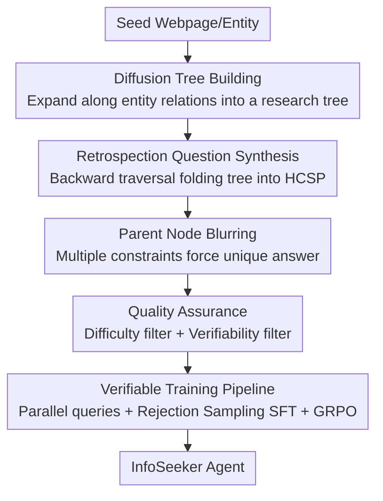

# Open Data Synthesis for Deep Research

**Conference**: ICLR 2026  
**OpenReview**: [https://openreview.net/forum?id=2c9TjRbAib](https://openreview.net/forum?id=2c9TjRbAib)  
**Code**: Open source (the paper claims to release the accompanying code and datasets)  
**Area**: Agent / LLM Reasoning / Data Synthesis  
**Keywords**: Agentic Search, Deep Research, Data Synthesis, Hierarchical Constraint Satisfaction, Verifiable QA

## TL;DR
This paper proposes the InfoSeek data synthesis framework, formalizing the "deep research" task as a **Hierarchical Constraint Satisfaction Problem (HCSP)**. Using a two-stage "Diffusion–Retrospection" approach, it automatically grows research trees from seed webpages and retroactively weaves them into QA pairs requiring multi-layer reasoning with unique, verifiable answers. By training an InfoSeeker agent of only 3B parameters with 50k+ synthesized QA pairs and 16.5k trajectories, the model outperforms numerous larger open-source and even some closed-source systems on benchmarks like Multi-hop QA and BrowseComp-Plus.

## Background & Motivation

**Background**: LLMs are becoming the primary entry point for information acquisition, with RAG (Retrieval-Augmented Generation) proven effective for factoid QA. However, facing complex tasks that require iterative retrieval, sub-question decomposition, and multi-step reasoning across heterogeneous evidence, single-turn RAG is insufficient. Consequently, the **agentic search** paradigm has emerged: allowing LLMs to act like researchers, iteratively performing "Plan–Retrieve–Refine–Integrate" to approach the answer. A increasingly mainstream approach is to optimize agents end-to-end via Reinforcement Learning (RL), enabling models to improve through reward feedback during the exploration of reasoning trajectories.

**Limitations of Prior Work**: The RL path is extremely sensitive to training data—data must be **sufficiently deep** (to incentivize models to "dig deep" rather than just skim the surface) and answers must be **verifiable** (to provide reliable rewards). However, existing resources lack both: classic datasets like Natural Questions and HotpotQA provide supervision signals that are too shallow (single-hop or simple multi-hop); recent synthetic data either remains at the multi-hop QA level or is simply not publicly available. As Table 1 illustrates, prior to this work, there was almost a void for frameworks providing large-scale QA, reasoning trajectories, and an open-source framework simultaneously.

**Key Challenge**: The structural complexity of real deep research tasks (multi-layered, nested parallel/serial constraints) cannot be characterized by "flat constraints" or "linear multi-hop" structures. Existing synthesis methods can only produce these two simple categories, resulting in agents that fail to learn genuine deep search capabilities.

**Goal**: ① Provide a unified, complexity-controllable formal definition for complex information retrieval tasks; ② Construct a framework to automatically and scalably produce "structurally complex yet realistic" training data based on this definition; ③ Validate the value of the data itself using the most straightforward and transparent training pipeline (SFT + lightweight RL).

**Key Insight**: The authors observe that answers to true deep research are "not directly accessible"; they must satisfy layer-dependent constraints and prune candidates contradicting accumulated evidence at each layer, eventually converging to a unique solution—this is naturally a tree. Since the target structure is a tree, one can **first grow the tree forward (diffusion) and then fold it back into a question (retrospection)**.

**Core Idea**: Use "Diffusion–Retrospection" based on webpage relationships (similar to a knowledge graph) to **generate forward and compose questions backward**, constructing each question as a Hierarchical Constraint Satisfaction Problem (HCSP). This explicitly controls the structural complexity of tasks and ensures answers are uniquely verifiable.

## Method

### Overall Architecture

The core of InfoSeek is first defining "deep research" mathematically and then synthesizing data around this definition.

**Formalization (HCSP)**: Given a question $x$, it contains a set of constraints $C_x=\{c_1,\dots,c_k\}$ and a set of sub-questions $Y_x=\{y_1,\dots,y_m\}$. The hierarchical decomposition is defined as:

$$H(x)=\bigcap_{i=1}^{k} S(c_i)\ \cap\ \bigcap_{j=1}^{m} H(y_j),\qquad \bigcap \varnothing := U,$$

where $S(c_i)$ is the set of entities satisfying constraint $c_i$, $U$ is the universal set, and the final answer is $A=H(q_H)$. This definition unifies two classic problems: when all constraints are flat and independent, it degrades to a **Constraint Satisfaction Problem (CSP)** $A=\bigcap_i S(c_i)$ (e.g., the intersection of "PhD at Princeton in 1938 + born in London + graduated from Cambridge" points uniquely to Alan Turing); when constraints form a dependency chain, it degrades to a **Multi-hop Problem (MHP)** $A=S^{(k)}(c)$ (e.g., locate "the scientist who cracked Enigma" → his birthplace London → London is the capital of which country). HCSP nests both parallel and serial dependencies, aligning more closely with real deep research.

**Data Synthesis (Diffusion–Retrospection)**: Once defined, InfoSeek generates HCSP instances in two stages. The **Diffusion Stage** starts from a seed entity and expands outward along entity relationships to neighboring webpages, growing a research tree $T=(V,E)$, where nodes are entities or facts and edges are semantic relations. The **Retrospection Stage** samples subtrees and traverses them backward, weaving structural dependencies and hierarchical constraints into a natural language question while "blurring" parent nodes to increase difficulty. Finally, after quality assurance filtering, HCSP questions with uniquely verifiable answers are obtained. These are then fed to the model using parallel query templates + rejection sampling SFT + GRPO reinforcement learning.

### Key Designs

**1. HCSP Formalization: A unified definition for "deep research" with controllable complexity**

Addressing the pain point that "existing synthesis methods only create flat CSPs or linear multi-hops," this paper abstracts complex information retrieval as an HCSP: answers are not directly reachable and must satisfy inter-dependent constraints layer by layer, pruning candidates until converging to a unique solution. The beauty of the decomposition $H(x)=\bigcap_i S(c_i)\cap\bigcap_j H(y_j)$ is that CSP (flat independent constraints) and MHP (chain dependencies) become special cases. HCSP explicitly requires both parallel constraints and serial dependencies by recursively nesting "sub-questions." This is not just a change in terminology—it makes "task difficulty/structure" a **designable and measurable** quantity (later measured by the number of vertices), serving as the foundation for the framework to "create deep questions on demand."

**2. Diffusion Tree Building: Growing research trees rich in hierarchical dependencies from seeds**

To systematically create wide and deep dependency structures, the diffusion stage starts from a single seed root $r$, recursively sampling new entities $w$ related to existing entities $v$ and attaching new edges: $T'=(V\cup\{w\},\,E\cup\{(v,w)\})$. Two operators control the shape: **Blurring Parent Node**—when a node $v$ has only a single child or insufficient constraints to uniquely identify it, $k$ claims with non-empty and non-overlapping candidate sets ($S(c_i)\not\subseteq S(c_j),\ \forall i\neq j$) are picked from $v$'s source page to generate child nodes, forcing the "joint satisfaction of all child constraints to lock $v$," which increases the **width of parallel constraints**; **Expanding Depth**—attach a brand new child $w$ to an entity node based on a relation $r(v,w)$ extracted from its document, lengthening the reasoning chain to create **depth in serial dependencies**. These two operators—one for width, one for depth—correspond exactly to the two types of dependencies in the HCSP definition.

**3. Retrospection Question Synthesis: Folding the research tree backward into uniquely verifiable HCSP tasks**

To transform the tree into a question that truly forces multi-layer reasoning, the retrospection stage operates in the opposite direction of diffusion—shrinking inward and traversing the tree in reverse order. For node $v$, its leaf children $\{w_1,\dots,w_k\}$ produce constraints $C_v$, and internal children produce recursive sub-questions, thus:

$$q_v=Q\big(C_v\cup\{Q(w_j)\mid w_j\ \text{is an internal child of }v\}\big),$$

where $Q(\cdot)$ is a recursive function mapping a set of constraints/sub-questions to a natural language question. Reaching the root $r$ yields the complete HCSP instance $q=Q(r)$. The blurring step ensures sufficient parallel constraints while depth expansion ensures serial dependencies, resulting in questions that require hierarchical reasoning and converge to unique answers via joint constraints.

**4. Dual Quality Assurance: Closing the "under-determined" and "over-determined" loops**

To address two quality issues inherent in tree-based construction—**under-determined** (multiple answers remaining after all constraints) and **over-determined** (a single constraint being sufficient to lock the answer, rendering hierarchical reasoning moot)—the paper designs two filters. **Difficulty Filter**: Using Qwen2.5-32B-Inst to answer questions without retrieval context; only 2% were correct, proving questions are hard to guess by parametric memory. These 2% are removed to further increase difficulty. **Verifiability Filter**: Gemini 1.5 Flash is provided with ground-truth supporting webpages + distractor documents and asked to derive the answer. Any question returning incorrect, multiple, or no solutions is filtered—this step blocks under-determined cases and ensures every remaining question has a uniquely verifiable solution. Using DeepSeek-V3 as the operator model, 50k+ samples were produced at a total cost of only \$571.8, with most questions falling in the 4–6 vertex range.

### Loss & Training

Model optimization follows a transparent two-stage "Imitation followed by Reinforcement":

- **Verifiable Rollout Template**: Each step uses `<think>` to reflect on evidence and identify gaps, followed by `<search>` to produce multiple diverse queries for **parallel retrieval**. Retrieval results are not directly injected; they are first processed by a lightweight refiner (Qwen2.5-7B-Inst) to extract key points into a summary aligned with query intent inside `<information>`. Only when sufficient information is gathered is the final answer provided in `<answer>`. This unifies reasoning traces and reduces noise from raw retrieval.
- **Rejection Sampling SFT**: A teacher model (Qwen2.5-72B) answers questions according to the template. Only trajectories that **actually complete the task with the correct final answer** are kept. Gemini 1.5 Flash is then used to filter out trajectories that took shortcuts, resulting in a clean supervised set that provides a stable starting point for RL (mitigating the instability of cold-starting RL with sparse rewards).
- **GRPO Reinforcement**: Starting from the SFT checkpoint, Group Relative Policy Optimization is used with a minimalist reward design—$R=1$ if both formatting and extracted answer are correct, otherwise $R=0$. Because InfoSeek answers are inherently verifiable, this binary reward is sufficiently reliable.

## Key Experimental Results

### Main Results

Classic knowledge-intensive QA (Single-hop NQ/TQA/PopQA + Multi-hop HQA/2Wiki/MSQ/Bamb), metric is Exact Match:

| Model | NQ | TQA | PopQA | HQA | 2Wiki | MSQ | Bamb | Avg |
|------|----|-----|-------|-----|-------|-----|------|-----|
| Vanilla RAG | 34.8 | 54.4 | 38.7 | 25.5 | 22.6 | 4.7 | 8.0 | 27.0 |
| AutoRefine-3B | 43.6 | 59.7 | 44.7 | 40.4 | 38.0 | 16.9 | 33.6 | 39.6 |
| InForage-3B | 42.1 | 59.7 | 45.2 | 40.9 | 42.8 | 17.2 | 36.0 | 40.6 |
| **InfoSeeker-3B** | 41.7 | 56.1 | **46.5** | **44.6** | **50.0** | **20.5** | **39.2** | **42.7** |

InfoSeeker-3B averages 42.7, outperforming all baselines, with significant advantages in multi-hop tasks (Best results on 2Wiki 50.0 and Bamb 39.2).

The more challenging BrowseComp-Plus (830 questions, fixed 100k webpage corpus):

| Model | Retriever | Acc | Avg. Calls |
|------|--------|-----|-----------|
| GPT-4o-mini | BM25 | 14.6 | 11.22 |
| Claude-3.5-Sonnet | BM25 | 14.3 | 9.95 |
| Qwen2.5-32B | BM25 | 3.5 | 0.92 |
| SearchR1-32B | BM25 | 3.9 | 1.78 |
| **InfoSeeker-3B** | BM25 | **15.3** | 8.24 |

InfoSeeker-3B reaches 15.3%, surpassing closed-source systems like GPT-4o-mini and Sonnet 3.5, and far exceeding much larger open-source baselines like Qwen2.5-32B (3.5) and SearchR1-32B (3.9).

### Ablation Study

| Configuration | Phenomenon | Explanation |
|------|------|------|
| Vanilla RAG | Lowest on all benchmarks | Lacks agentic search |
| + SFT (InfoSeek) | Significantly better than RAG | SFT provides strong initialization, easing cold start |
| + RL (InfoSeeker-3B) | Comprehensive improvement | Further strengthens model on top of SFT |
| InfoSeeker-7B | Further gain | Validates scalability |
| NQ+HQA Training Only | Almost no deep search on BrowseComp | Shallow data fails to induce deep search behavior |
| <5 Vertex Subset | Increase in both accuracy and calls | Complexity itself drives deep search |

### Key Findings
- **Data complexity directly determines deep search behavior**: Training only on NQ+HotpotQA gives the model no incentive to develop true "deep search," resulting in poor performance and fewer search calls on BrowseComp-Plus. With InfoSeek, as more complex samples are introduced, search behavior progressively deepens—even subsets with <5 vertices yield gains in both accuracy and call frequency.
- **Data quality/structure can be as important as model architecture**: InfoSeeker outperforms numerous agent baselines that use meticulously designed optimization tricks simply via a basic training protocol, indicating that "creating good data" has a leverage no less than "tuning models."
- **Small models can be distilled with deep research capabilities**: A 3B model outperforms tens-of-billions of parameter open-source models and some closed-source systems on search-heavy BrowseComp-Plus, highlighting the efficiency of the pipeline in compressing deep research capabilities into compact LLMs.

## Highlights & Insights
- **Elevating "data synthesis" to "problem structure synthesis"**: The true value of HCSP is not just another dataset, but making the structural complexity of tasks a designable and measurable quantity (vertex count), controlling how deep an agent learns from the source—this "define structure then generate forward/backward" approach can be transferred to any agentic task requiring complexity-controllable training data.
- **The symmetry of Diffusion–Retrospection is clever**: Forward diffusion ensures evidence is realistic and traceable (each constraint comes from actual webpages), and backward retrospection ensures the question is uniquely verifiable (constraints jointly converge). Growing then folding naturally solves the dilemma of synthetic data requiring both realism and verifiability.
- **Parent node blurring is key to forcing joint reasoning**: Requiring that the candidate sets of $k$ claims do not overlap forces the model to conclude that no single constraint is sufficient to lock the answer, mechanically eliminating "over-determined" shortcuts.
- **Rewards can be minimalist if data is verifiable**: Simple binary rewards $R\in\{0,1\}$ work for GRPO because InfoSeek answers are uniquely verifiable—this suggests the burden of "reward engineering" can be shifted forward to "data construction."

## Limitations & Future Work
- **The authors acknowledge**: Currently, only the most basic RL (GRPO + binary reward) is used, whereas the intermediate steps and retrieval labels preserved in the dataset could support more granular RL objectives, left for future work.
- **Dependency on strong operator models and external judges**: Building trees requires DeepSeek-V3, verifiability filtering requires Gemini 1.5 Flash, difficulty filtering requires Qwen2.5-32B, and teacher trajectories require Qwen2.5-72B—the overall pipeline is heavily dependent on large model APIs, and the cost of migrating to resource-constrained scenarios is not fully discussed.
- **Verifiability assumes a "unique short answer"**: Answers average only 5–6 tokens; the framework naturally favors questions with unique entity answers, having limited coverage for open-ended, non-unique real research tasks (e.g., summaries, trade-off judgments).
- **Fact noise and timeliness of Web/Wikipedia corpora**: Constraints are extracted directly from webpage claims; if source pages are incorrect or outdated, errors may be injected into "verifiable" answers. While the framework claims extensibility beyond the web, cross-domain validity is argued rather than fully empirically validated.

## Related Work & Insights
- **vs. Classic QA Datasets (NQ / HotpotQA)**: These only provide flat supervision for single or shallow multi-hop tasks; InfoSeek uses HCSP to explicitly create hierarchical dependencies with significantly greater depth and complexity control.
- **vs. Multi-hop Synthetic Data (WebShaper / WebSailor, etc.)**: Most remain at the multi-hop QA level or are not public. InfoSeek is the first fully open-source framework (code + 50k QA + 16.5k trajectories) in this field to explicitly control structural complexity.
- **vs. RL Agentic Search (Search-R1 / ZeroSearch / AutoRefine / InForage)**: These works focus on optimization algorithms, rewards, or refining tokens. InfoSeek places leverage on "training data structure and quality," proving that basic SFT+light RL can outperform them with superior data.

## Rating
- Novelty: ⭐⭐⭐⭐⭐ HCSP formalization + Diffusion–Retrospection generation elevates deep research data synthesis to new heights of structural control.
- Experimental Thoroughness: ⭐⭐⭐⭐ Covers various benchmarks (single-hop, multi-hop, BrowseComp) plus complexity and scale ablations, though RL uses only basic settings.
- Writing Quality: ⭐⭐⭐⭐⭐ Logical progression from definition to framework to method to experiments; clear comparison of CSP/MHP/HCSP.
- Value: ⭐⭐⭐⭐⭐ First open-source deep research data synthesis framework; 3B model outperforms large models; data and code are released, providing strong reproducibility and extensibility.

<!-- RELATED:START -->

## Related Papers

- [\[ICLR 2026\] A Benchmark for Deep Information Synthesis (DeepSynth)](a_benchmark_for_deep_information_synthesis.md)
- [\[ICLR 2026\] WebWeaver: Structuring Web-Scale Evidence with Dynamic Outlines for Open-Ended Deep Research](webweaver_structuring_web-scale_evidence_with_dynamic_outlines_for_open-ended_de.md)
- [\[ICLR 2026\] Deep Ignorance: Filtering Pretraining Data Builds Tamper-Resistant Safeguards into Open-Weight LLMs](deep_ignorance_filtering_pretraining_data_builds_tamper-resistant_safeguards_int.md)
- [\[ICML 2026\] Hunt Instead of Wait: Evaluating Deep Data Research on Large Language Models](../../ICML2026/llm_agent/hunt_instead_of_wait_evaluating_deep_data_research_on_large_language_models.md)
- [\[ICLR 2026\] Expanding the Capability Frontier of LLM Agents with ZPD-Guided Data Synthesis](expanding_the_capability_frontier_of_llm_agents_with_zpd-guided_data_synthesis.md)

<!-- RELATED:END -->
