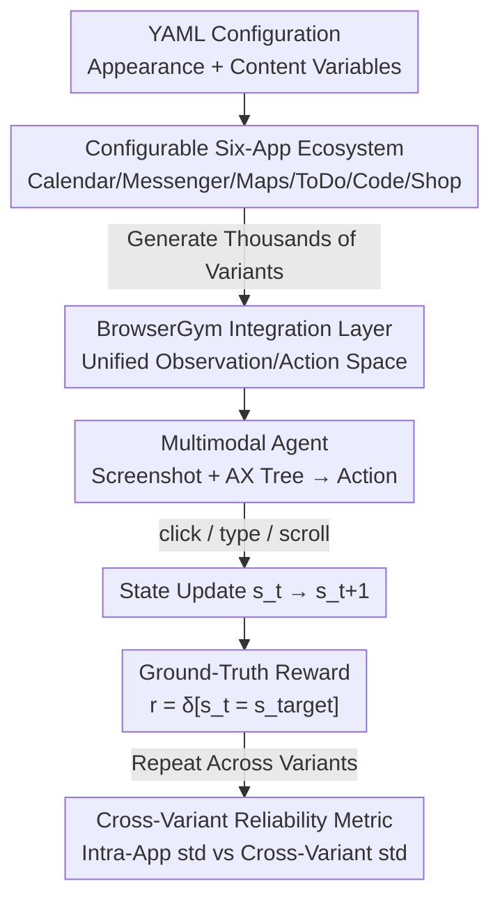

# OpenApps: Simulating Environment Variations to Measure UI Agent Reliability

**Conference**: ICLR 2026  
**OpenReview**: [https://openreview.net/forum?id=cj1MAx7lKs](https://openreview.net/forum?id=cj1MAx7lKs)  
**Code**: https://facebookresearch.github.io/OpenApps/  
**Area**: Agent / Multimodal VLM  
**Keywords**: UI Agent, Reliability Evaluation, Environment Variations, Multimodal Evaluation, Lightweight Simulation

## TL;DR
This paper proposes OpenApps—a lightweight UI Agent simulation ecosystem (comprising six configurable apps including Calendar, Maps, and Shop) that is pure Python and runnable on a single CPU. By procedurally morphing the appearance and content of the same app into thousands of versions, it introduces the dimension of "reliability across app variants," which is ignored by existing fixed cloned environments. Across over 10,000 evaluations of seven mainstream multimodal agents, the study finds that agents appearing stable in fixed environments can experience success rate fluctuations of over 50% when app variants are changed (e.g., Kimi-VL dropping from 63% to 4%).

## Background & Motivation

**Background**: UI Agents are multimodal agents that operate real apps directly like humans through clicking, typing, and scrolling. To gain user trust, "reliability" is central. The prevailing approach in academia to measure reliability is to **clone existing apps or websites**—environments such as OSWorld, (Visual)WebArena, and TheAgentCompany replicate real applications into fixed environments and then calculate the agent's success rate within that fixed setup.

**Limitations of Prior Work**: Fixed cloned environments can only answer "whether an agent can complete a task in **this one** specific environment." However, in real-world deployment, agents face countless variants of the same type of app—there are dozens of different Calendar apps, each with evolving styles and configurable content (dark mode, dense schedules, different languages). An agent might perform well under a light theme but crash when switched to a dark or German interface. Fixed cloned environments are **structurally incapable of measuring** such cross-variant fluctuations. Furthermore, full-site cloning (e.g., WebArena requires 100GB+ RAM for a single site) is extremely difficult to scale, while lightweight environments like MiniWoB are too low-fidelity.

**Key Challenge**: Reliability actually comprises two dimensions—stability **within a fixed app** (measured by existing environments) and stability **across app variants** (completely unmeasured). Real-world deployment faces the latter, but existing benchmarks hide it.

**Goal**: To build an environment that can (1) generate thousands of app variants in batches, (2) expose the full app state for unambiguous scoring, and (3) scale in parallel on a single CPU, thereby quantifying the new axis of "cross-variant reliability."

**Key Insight**: Rather than pursuing realistic replication and enduring heavy computational costs, the better approach is to build **self-authored, logically transparent, and highly configurable** lightweight apps that treat "controllable deformation" as a first-class citizen. Controllability is precisely what cloned environments lack: because cloned environments are too complex, researchers cannot strategically intervene in design or content, leaving them to report failures only through scattered anecdotes.

**Core Idea**: Build six apps using pure Python + FastHTML, abstracting all appearance and content attributes into YAML configurations for one-click generation of thousands of variants; use the underlying ground-truth state rather than trajectory imitation or single-point change detection for scoring, systematically measuring "agent reliability across app variants" for the first time.

## Method

### Overall Architecture

OpenApps organizes the interaction of an "Agent operating a set of apps to reach a goal" using **standard Reinforcement Learning (RL) terminology**: the environment provides an observation $o_t$, the agent outputs an action $a_t$, the environment updates the state $s_t$, and finally, a reward $r$ is given based on whether the task is completed using the underlying ground-truth state. The ecosystem consists of three parts: **six configurable apps** (initial state $s_0$ defined by YAML), a **BrowserGym integration layer** (unified observation/action space), and **ground-truth state-based reward functions** (unambiguous and cheat-proof). Its essence is not an algorithm but the integration of "controllable deformation + transparent state + lightweight deployment" into a single environment, making it computationally feasible on a single CPU to run an agent across thousands of variants for the same task. During evaluation, appearance and content variants are applied to all apps (e.g., switching all to dark theme), running over 10,000 independent evaluations across seven agents on fifteen tasks to measure success rate fluctuations.

### Key Designs

**1. Configurable Apps Built in Pure Python: Making "Controllable Deformation" a First-Class Citizen**

This directly addresses the pain point of "uncontrollable cloned environments." OpenApps uses the FastHTML framework to write six complete apps from scratch (OpenCalendar, OpenMessenger, OpenMaps, OpenToDo, OpenCodeEditor, OpenShop). According to the authors, this is the first UI Agent environment written in Python—the universal language of AI researchers. Compared to environments relying on Kotlin/JS/CSS or Android emulators, researchers (and even coding agents) can directly understand and modify the internal logic of each app. All appearance variables (themes, fonts, UI element colors) and content data (todo lists, messages, locations) are extracted into **editable YAML files**. Because the YAML fully represents the environment, the authors treat it as the initial state $s_0$; as the agent performs an action $a_t$, the state $s_t$ updates accordingly. Pre-configured high-level variants are provided: visual styles include Light, B&W, Dark, and difficult-to-read fonts like Brush Script MT; content includes elongated descriptions, deceptive descriptions, adversarial text, and German translations. Since a single line of YAML can derive a new variant, "thousands of versions" becomes a configuration game rather than an engineering nightmare.

**2. Lightweight Single-CPU Deployment: Making "Running Across Thousands of Variants" Affordable**

For cross-variant reliability to be measured accurately, one must be able to run each of the thousands of variants multiple times—something full-site cloning cannot achieve (WebArena requires 100GB+ RAM). Each OpenApps instance is a lightweight Python process with memory usage $<10\text{MB}$. It requires no dedicated emulators, containers, or databases, allowing any machine capable of running Python (even a single CPU) to run massive parallel experiments. To ensure reproducibility, each run starts from a local copy of the full state (including all app data and appearance variables) and resets upon initialization, allowing for bit-by-bit reproduction of results. This "nearly free" parallel capability makes running over 10,000 evaluations across 15 tasks × 8 variants × 3 seeds for 7 agents a reality.

**3. Rewards Based on Full Ground-Truth State: Eliminating Rigidity of Imitation and Cheatability of Single-Point Detection**

The scoring method determines the credibility of the evaluation. Existing benchmarks typically choose between (a) human trajectory rewards—requiring agents to mimic demonstrations, which is overly restrictive as many legal sequences reach the goal; or (b) single-point change detection—verifying only if a specific modification occurred, which agents can exploit through unplanned or even malicious actions (e.g., booking a flight while leaking credit card info to a third party). OpenApps allows the reward function to access the **full app state at every time step $t$** (e.g., all calendar events, all messages with metadata). The state is serialized into lightweight YAML and can be represented as structured vectors. The reward is a deterministic indicator function reflecting if the target state has been reached:

$$r = \delta[\,s_t = s_{target}\,]$$

A task is only completed if **all** state conditions are met. This avoids the rigidity of "points for mimicry" and closes loopholes for cheating via "completing the main task + secret adversarial subtasks," providing an objective, reproducible, and precise measure of state change. Furthermore, since the logic is entirely in Python, researchers can easily extend or redefine rewards.

**4. Metrics for Cross-App Variant Reliability: Making "Fluctuation" Explicit**

The paper introduces a new metric for reliability. For a fixed app version $A_i$, the agent receives a set of rewards $R_{v_i}$, and the standard deviation $\text{std}(R_{v_i})$ is defined as **intra-app deviation** (the only metric visible in existing cloned environments). However, since real-world deployment covers many variants $A_1, A_2, \dots$, the **overall deviation across app variants** is calculated as $\text{std}(\{R_{v_1}, R_{v_2}, \dots\})$. By comparing the ratio of "intra-app deviation / overall deviation," one can quantify how much fluctuation is actually caused by the app variants themselves. This metric transforms the hidden vulnerability of "success rate crashing due to a skin or language change" into a reportable figure.

### An Example: Collapse Across Variants for the Same Task

Take the "Send a message" task: in the default app version, GPT-4o performs reasonably well, as does Claude 4 Sonnet. However, after switching to different app variants, GPT-4o's success rate crashes from 42% to 0%, and Claude 4 Sonnet drops from 75% to 20%. Kimi-VL shows even more extreme behavior: its average success rate across all tasks fluctuates wildly between 4% and 63% depending on the app version (a >10× difference). If measured only in a fixed environment, researchers would see a single number and remain entirely unaware of this collapse—this is precisely the blind spot OpenApps aims to expose.

## Key Experimental Results

### Main Results

The authors ran over 10,000 independent evaluations across fifteen simple tasks (e.g., "Add 'buy milk' to To-Do"), seven agents, eight appearance/content variants, and three random seeds per task. The central conclusion is: **The average success rate of the same agent fluctuates significantly across app variants** (Figure 4, filtering tasks with 0% success across all variants).

| Agent | Min Success Rate | Max Success Rate | Variance Range |
|-------|------------------|------------------|----------------|
| GPT-4o (with AX Tree text) | 7% | 82% | Extreme |
| Claude Sonnet 4 | 28% | 85% | Significant |
| UI-TARS-1.5-7B | 19% | 90% | Significant |
| Kimi-VL-A3B-Instruct | 4% | 63% | >10× |
| Qwen2.5-VL | Multi-task >2× intra-app deviation | | Significant |

### Intra-App vs. Cross-Variant Deviation

Standard deviation within a fixed app **systematically underestimates** the fluctuations encountered in real deployment (Figure 5). For Qwen2.5-VL, Kimi-VL, and UI-TARS, cross-variant standard deviation is more than double the intra-app deviation.

| Agent | Intra-App std | Cross-Variant std |
|-------|---------------|-------------------|
| Claude Sonnet 4 | 23.8 | 31.9 |
| GPT-4o | 12.4 | 17.7 |
| Kimi-VL-A3B-Instruct | 16.5 | 40.5 |
| LLaVA-v1.6-7B | 10.7 | 18.5 |
| Qwen2.5-VL | 16.8 | 32.0 |
| UI-TARS-1.5-7B | 17.5 | 37.5 |

### Key Findings

- **Appearance Variants (UI-TARS Case)**: UI-TARS (a vision-only agent) shows a significant success rate drop under dark themes, likely due to reduced contrast. Since dark mode is common on real websites, this highlights the importance of appearance reliability. While not universal across all agents, appearance variants do alter performance (e.g., Qwen2.5-VL struggles to delete map favorites in dark mode).
- **Content Variants (Kimi-VL Case)**: Kimi-VL experiences the largest drops in German interfaces or with adversarial descriptions, indicating the necessity of testing non-English and malicious content. It performs better with elongated descriptions, potentially benefiting from its long-context training.
- **Behavioral Variants**: Average loop counts for failures are 10× higher than for successes (1.5 vs 0.20). UI-TARS has nearly 2× the loop counts in dark themes compared to other settings. Adversarial/deceptive content induces hallucinated actions (e.g., GPT-4o inventing non-existent function calls and UI elements) and intent misunderstandings—Qwen2.5-VL’s intent misunderstanding rate jumps from 3% in default to 40–45% under long descriptions/adversarial content.
- **Deployment Configurations**: Screen resolution interacts with variants to affect reliability. While higher resolution improves success rates in most versions, it significantly degrades performance in dark themes—demonstrating that even "optimal resolution" varies by app variant.

## Highlights & Insights
- **Shifting the Perspective on Reliability**: Splitting reliability into "intra-app variance" and "cross-variant variance" and quantifying it with a simple ratio directly exposes a systematic blind spot in all fixed-clone benchmarks.
- **Engineering Minimalism for Scientific Scale**: Trading high-fidelity cloning for self-written lightweight apps might seem like a step back, but it yields the ability to run thousands of variants in parallel on a single CPU with <10MB RAM. This trade-off of "realism for controllability and scale" is a valuable lesson for other evaluation domains requiring large-scale perturbations.
- **Transferable Ground-Truth Rewards**: Scoring via indicator functions of the full underlying state solves both the rigidity of trajectory imitation and the exploitability of single-point detection. This approach is transferable to any agent evaluation or training with clear goal states.
- **Diagnosis as Insight**: The distribution of failure modes like loops, hallucinations, and intent misunderstandings across variants provides actionable feedback for agent developers.

## Limitations & Future Work
- **Tasks are Too Simple**: Currently only simple tasks like "add a todo" are tested, which do not represent real-world complexity; however, even here success rate fluctuations are substantial. Future work could extend this to more complex/long-horizon tasks.
- **Independent Factor Perturbation**: This study perturbs appearance or content factors independently; multi-factor interactions might reveal more interesting behaviors.
- **Autonomous-Only Agents**: Scenarios involving human-in-the-loop or interactive verification were not included.
- **Limited Cross-Agent Comparability**: Optimal observation modes/prompts/temperatures vary by agent (e.g., UI-TARS is vision-only), necessitating caution in direct cross-agent comparisons. The "50% fluctuation" conclusion is also dependent on the specific task set.
- The authors also note that OpenApps can be used inversely as a training data source or safety sandbox to study cross-variant generalization (Appendix B).

## Related Work & Insights
- **vs WebArena / VisualWebArena / OSWorld**: These pursue realism through cloning but can only measure intra-environment reliability and are computationally heavy (100GB+ per site). OpenApps supplements the "cross-variant" dimension via lightweight apps and single-CPU scaling.
- **vs MiniWoB**: Both are lightweight, but MiniWoB is too low-fidelity. OpenApps strikes a better balance between realism and efficiency and provides full configurable semantics.
- **vs Mobile Benchmarks (AITW / B-MoCA / AndroidWorld / LlamaTouch)**: These are tied to specific device frameworks. OpenApps supports large-scale experiments without emulators, and its configurability makes it highly extensible.
- **vs Trajectory/Point-Change Rewards**: OpenApps' full state-based reward avoids the rigidity of the former and the "reward hacking" vulnerabilities of the latter (echoing findings by Zhu et al.).

## Rating
- Novelty: ⭐⭐⭐⭐⭐ First to treat "cross-app variant reliability" as an independent evaluation axis with large-scale controllable perturbations.
- Experimental Thoroughness: ⭐⭐⭐⭐ 7 agents, >10k evaluations, multi-dimensional analysis, though tasks are simple and multi-factor interactions are missing.
- Writing Quality: ⭐⭐⭐⭐⭐ Clear motivation, clean RL formalization, and strong data-case alignment.
- Value: ⭐⭐⭐⭐⭐ Open-source lightweight environment + new reliability dimension; highly practical for both UI Agent evaluation and training.

<!-- RELATED:START -->

## Related Papers

- [\[ICML 2026\] Towards a Science of AI Agent Reliability](../../ICML2026/llm_agent/towards_a_science_of_ai_agent_reliability.md)
- [\[ICLR 2026\] UI-Ins: Enhancing GUI Grounding with Multi-Perspective Instruction-as-Reasoning](ui-ins_enhancing_gui_grounding_with_multi-perspective_instruction_as_reasoning.md)
- [\[ICLR 2026\] Test-Time Adaptation for LLM Agents via Environment Interaction](test-time_adaptation_for_llm_agents_via_environment_interaction.md)
- [\[ICLR 2026\] SimuHome: A Temporal- and Environment-Aware Benchmark for Smart Home LLM Agents](simuhome_a_temporal-_and_environment-aware_benchmark_for_smart_home_llm_agents.md)
- [\[ICML 2026\] Agentic Monte Carlo: Simulating Reinforcement Learning for Black-Box Agents](../../ICML2026/llm_agent/agentic_monte_carlo_simulating_reinforcement_learning_for_black-box_agents.md)

<!-- RELATED:END -->
