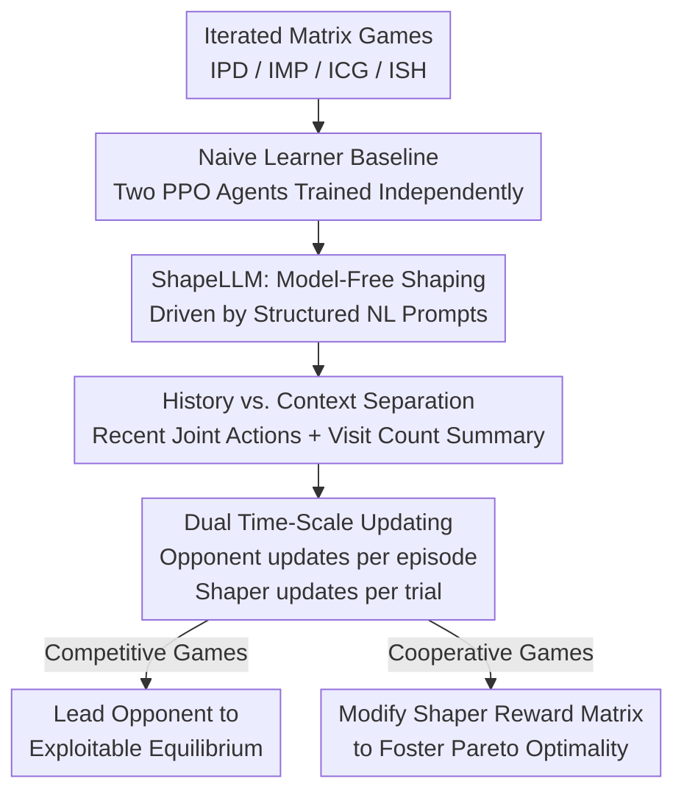

# Opponent Shaping in LLM Agents

**Conference**: ICLR 2026  
**OpenReview**: [https://openreview.net/forum?id=yJoHTqUNry](https://openreview.net/forum?id=yJoHTqUNry)  
**Code**: https://github.com/martaemili/shape-llm  
**Area**: LLM Agent / Multi-Agent / Game Theory  
**Keywords**: Opponent Shaping, Multi-Agent Reinforcement Learning (MARL), LLM Agent, Iterated Matrix Games, PPO

## TL;DR
This paper presents the first investigation of "opponent shaping" between LLM Agents, introducing ShapeLLM—a model-free shaping algorithm trained via PPO. By compressing "history" and "context" into structured natural language prompts, ShapeLLM demonstrates that LLM Agents can actively manipulate an opponent's learning dynamics to lead them toward exploitable equilibria (maximizing individual gain in competitive games) or foster cooperation to enhance collective welfare.

## Background & Motivation

**Background**: LLMs are increasingly deployed as autonomous agents, making interactions, collaborations, or competitions within shared environments inevitable. However, most existing multi-agent LLM research treats LLMs as static entities, observing their cooperation, rationality, or strategic reasoning while neglecting the strategic dynamics that emerge as agents continuously adapt to one another.

**Limitations of Prior Work**: In multi-agent reinforcement learning (MARL), independent learners often treat others as static parts of the environment, leading to poor collective outcomes—such as reliably converging to the "mutual defection" equilibrium in the Iterated Prisoner's Dilemma (IPD). While MARL has developed "opponent shaping" to anticipate and influence an opponent's learning (e.g., LOLA, M-FOS, SHAPER), these methods either require high-order derivatives (LOLA) or rely on architectural components absent in transformers (e.g., SHAPER's RNN-bound independent memory streams, or M-FOS's difficult-to-scale dual-agent architecture). Consequently, they **cannot be directly applied to LLMs**.

**Key Challenge**: LLMs process rich semantics, possess complex reasoning abilities, and adapt behavior via in-context learning. This paradigm differs fundamentally from the "explicit parameter updates + specific memory architectures" required by traditional shaping methods. Whether opponent shaping can be transferred to LLM Agents remains an open question.

**Goal**: This study decomposes the problem into two sub-questions: (1) Can a model-free shaping algorithm be designed that is compatible with transformers without requiring high-order derivatives or specialized memory architectures? (2) Can an LLM shaper effectively alter an opponent's learning trajectory in both competitive and cooperative games?

**Key Insight**: The authors observe that the essence of shaping lies not in specific architectures but in the shaper's access to two types of information: intra-episode "history" (to implement conditional strategies like Tit-for-Tat) and inter-episode "context" (cross-episode information regarding the opponent's learning dynamics). Since LLMs naturally excel at processing structured natural language, both memory types can be encoded into prompts.

**Core Idea**: Merge "history + context" into a single information stream using structured natural language prompts, enabling an LLM shaper fine-tuned with PPO to influence an opponent's learning dynamics through pure interaction.

## Method

### Overall Architecture

Experiments are organized into "trials." Each trial consists of $N$ parallel environments. In each environment, agents play $E$ episodes, where each episode is a $T$-round 2×2 matrix game. The baseline consists of two **naive learners (NL)** independently trained with PPO to maximize their own rewards, treating the opponent as static. To study shaping, one agent is replaced by a **shaper** trained using ShapeLLM to alter the opponent's learning dynamics.

The fundamental asymmetry lies in the **update timing**: the opponent (NL) updates parameters via PPO at the **end of every episode** to maximize that episode's return. In contrast, the shaper only updates at the **end of the entire trial** to maximize the trial's cumulative return. Thus, within one trial, the shaper experiences $E$ instances of opponent updates. Instead of observing opponent parameters directly, the shaper perceives the opponent's evolution through a "joint action summary" accumulated across episodes, learning how to guide the opponent today for long-term gains later.

At each step $\tau$, the shaper receives an observation $c^\tau_j$ consisting of two parts: the most recent joint action $a^{\tau-1}$ (history) and a compressed natural language representation of all prior joint actions in the trial $f(a^1,\dots,a^{\tau-2})$ (context). The shaper samples an action $a^\tau_j \sim \rho_{\theta_j}(w \mid c^\tau_j)$, receives a reward, and proceeds.

### Key Designs

**1. ShapeLLM: Reframing Opponent Shaping as a Model-Free NL Prompting Algorithm**

To address the inability to port traditional shaping to transformers, ShapeLLM avoids high-order derivatives, dual-agent architectures, and RNN memory streams. It follows the model-free meta-learning approach of M-FOS/SHAPER, formalizing shaping as a POMDP $(\bar{S}, \bar{A}, \bar{P}, \bar{R}, \bar{\Omega}, \bar{O}, \bar{\gamma})$. Here, the meta-state $\bar{s}^\tau = \{\theta^{\tau-1}_i, c^{\tau-1}_i\}_{i\in I}$ encodes all agents' parameters and prompts from the previous step. The action space $\bar{A}$ and reward $\bar{R}$ are identical to the underlying game, while the observation $\bar{o}^\tau = f(a^1,\dots,a^{\tau-1})$ is a function of past joint actions. The agent's strategy is the distribution $\rho_\theta(w\mid c)$ of a single token given context $c$ (the authors force $L=1$ generation where each action corresponds to one token, relying on text instructions for formatting instead of constrained decoding). This embeds shaping capabilities into a standard transformer + PPO training loop.

**2. History and Context Separation: Compressing Memories into a Prompt Stream**

Shaping requires two types of information: intra-episode **history** allows agents to implement conditional strategies (like TFT), while inter-episode **context** carries signals about how the opponent's learning dynamics are shifting. While SHAPER used RNN input streams and hidden states for this, ShapeLLM writes both into a structured natural language prompt: History is represented by the most recent joint action $a^{\tau-1}$, and context is represented by **cumulative state visit counts** (e.g., "CC: 1, CD: 1, DC: 2, DD: 3" in IPD). Using visit counts instead of full trajectories is a crucial engineering choice, ensuring prompt length does not scale linearly with rounds, which would otherwise exceed the context window. Ablation studies confirm that shaping fails if either information type is removed.

**3. Dual Time-Scale Updating: Opponent learns per episode, Shaper per trial**

This is the source of the shaping effect. The opponent updates parameters at the end of each episode to maximize $J_i = \sum_{t=1}^T r^t_i$. The shaper updates only at the end of the trial, maximizing the cumulative return:

$$\bar{J}_j = \sum_{e=1}^{E} J^e_j = \sum_{e=1}^{E}\sum_{t=1}^{T} r^{(e,t)}_j = \sum_{\tau=1}^{E\times T} r^\tau_j$$

Because the shaper’s optimization spans $E$ opponent updates, it learns to optimize the "trajectory of the opponent's parameters" rather than immediate rewards. In IPD, the shaper exhibits a three-stage behavior: initially dropping cooperation sharply, then maintaining a plateau to stabilize opponent cooperation, and finally slowly reducing cooperation again to maximize exploitation.

**4. Unifying Competition and Cooperation: Switching Goals via the Reward Matrix**

The same mechanism can either exploit or cooperate; the difference lies solely in the shaper's reward signal. In exploitation scenarios (IPD/IMP/ICG), the shaper and opponent share the same payoff matrix. In cooperative scenarios, the authors construct Cooperative IPD (C-IPD): the opponent keeps its original payoffs, but **the shaper's reward matrix is modified** so its highest reward comes from mutual cooperation. The shaper then actively pulls the system from a "mutual defection" Nash Equilibrium to "mutual cooperation." This demonstrates that opponent shaping is a neutral capability guided by the shaper's reward function.

### Loss & Training

The base model is `gemma-2-2b-it`, trained via QLoRA: 4-bit quantization (`BitsAndBytes`), rank $r=2$ LoRA adapters on query/value projections, and a trainable value head. PPO is a custom implementation based on `TRL`. Training lasts 200–300 trials with $N=5$ environments, $E=5$ episodes, and $T=20$ rounds per episode. Invalid action tokens $a_{null}$ are penalized with $r_{null}$ and excluded from history. Training was performed on a single 40G A100 per run.

## Key Experimental Results

### Main Results

Evaluated on four 2×2 matrix games: IPD, IMP (Matching Pennies), ICG (Chicken), and ISH (Stag Hunt). Scores are mean rewards per step over 100 evaluation games with $T=20$.

| Game | Baseline P1 / P2 (Reward/Step) | Shaper | Opponent |
|------|------|------|------|
| IPD | 1.00 / 1.00 (Mutual Defection) | **3.96** | 0.10 |
| IMP | −0.03 / 0.03 (Mixed Eq. Oscillation) | **0.99** | −0.99 |
| ICG | 2.00 / 2.00 (Standard Pure Eq.) | **2.98** | 1.01 |

In IPD, the shaper achieves 3.96, exceeding the upper limit of Zero-Determinant extortion or TFT, while the opponent drops to 0.1. In IMP, the shaper steers state visits to its favored outcomes (H,H) and (T,T). In ICG, the shaper sharply reduces its swerve probability early on to force the game toward its preferred equilibrium.

Cooperation results (Table 3):

| Game | Baseline P1 / P2 | Shaper | Opponent |
|------|------|------|------|
| ISH | 1.30 / 1.30 (90% converge to "Rabbit") | **3.96** | 3.96 |
| C-IPD | 1.00 / 1.00 (Mutual Defection) | **5.88** | 2.86 |

In ISH, all runs with a shaper converge to the Pareto-optimal "Stag" equilibrium. In C-IPD, all runs achieve mutual cooperation, with the shaper and NL both far exceeding the defection baseline.

### Ablation Study

| Configuration | Conclusion |
|------|------|
| Rich Observation for Opponent (full trajectory summaries) | Rich observation alone does not result in shaping; shaping is not merely a consequence of a larger observation space. |
| Removing Intra- + Inter-episode History / Removing Inter-episode History only (IPD) | Shaping fails in both cases; both "history" and "context" are necessary and sufficient. |
| Different Opponent Initial Strategies ($p^0_{NL}(a_1)\approx$ 0.75 / 0.5 / 0.25) | Shapers successfully exploit across all types; more cooperative opponents are eventually exploited more severely. |
| Prompt Variations (reversed action order, phrasing) + Cross-Model (Llama-3.2-1B-Instruct) | Shaping remains robust across different configurations and model architectures. |

### Key Findings
- **History + Context are essential for shaping**: Ablations show rich observations are insufficient; missing either type of history causes shaping to collapse.
- **Shapers adapt to opponent initial strategies**: Against cooperative opponents, shapers reduce cooperation faster; against defect-prone opponents, they use longer "cooperation baits" before exploiting.
- **IMP is insensitive to initialization**: While mixed-strategy opponents are theoretically harder to shape, the shaper converged to near-optimal (0.96+) across all tests.
- **Rewards dictate intent**: Modifying the shaper’s reward to favor cooperation seamlessly switches the algorithm from exploitation to fostering collective welfare.

## Highlights & Insights
- **Natural Language as "Memory Architecture"**: Instead of relying on RNN internal states to separate history and context, this work uses structured text for a transformer. This is a clever transfer of LLM linguistic capabilities to replace specialized neural structures.
- **Visit Counts vs. Full Trajectories**: A simple yet critical engineering trick that prevents token counts from scaling linearly, allowing long-term interactions to fit within finite context windows.
- **Dual Time-Scale is the Essence of Shaping**: By updating only after several opponent updates, the shaper is forced to optimize the "opponent parameter trajectory" rather than immediate payoffs.
- **Neutrality of Capability**: The mechanism is both a security risk (LLM agents being strategically exploited without awareness) and a coordination tool, providing a warning for the deployment of continually learning LLM agents.

## Limitations & Future Work
- **Small Model Scale**: Primarily tested on `gemma-2-2b-it`. The scaling behavior of shaping—whether larger models are more potent shapers or harder to shape—remains unknown.
- **Homogeneous Architectures**: Only LLM-to-LLM interactions were explored. Cross-architecture shaping (e.g., LLM shapers influencing non-LLM agents) is an open area.
- **Fixed Token Actions**: While making evaluation controllable, this limits the ways LLMs influence each other. Real-world agents can communicate, signal, or negotiate before acting.
- **2×2 Matrix Games**: These provide clear incentives but lack the nuance of real-world interactions where goals overlap and cooperation/competition are not binary.

## Related Work & Insights
- **vs. LOLA**: LOLA explicitly incorporates the opponent's learning rule but assumes it is known and relies on high-variance high-order derivatives. ShapeLLM is model-free and naturally fits transformers.
- **vs. M-FOS**: M-FOS uses a dual-agent architecture (inner/outer) that is difficult to scale. ShapeLLM collapses this into a single LLM prompt stream.
- **vs. SHAPER**: SHAPER uses a single RNN's input/hidden state to partition history/context, binding it to RNN structures. ShapeLLM migrates this principle to transformers via structured natural language.

## Rating
- **Novelty**: ⭐⭐⭐⭐⭐ First to introduce opponent shaping to LLM agents with a transformer-native model-free algorithm.
- **Experimental Thoroughness**: ⭐⭐⭐⭐ Covers various games and initializations, though focused on small models and simple payoff structures.
- **Writing Quality**: ⭐⭐⭐⭐⭐ Clear progression from motivation to methodology, with a lucid distinction between history and context.
- **Value**: ⭐⭐⭐⭐⭐ Opens a new dimension for strategic dynamics and safety in multi-agent LLM systems.

<!-- RELATED:START -->

## Related Papers

- [\[ICLR 2026\] Test-Time Adaptation for LLM Agents via Environment Interaction](test-time_adaptation_for_llm_agents_via_environment_interaction.md)
- [\[ICLR 2026\] Social Agents: Collective Intelligence Improves LLM Predictions](social_agents_collective_intelligence_improves_llm_predictions.md)
- [\[ICLR 2026\] ChatInject: Abusing Chat Templates for Prompt Injection in LLM Agents](chatinject_abusing_chat_templates_for_prompt_injection_in_llm_agents.md)
- [\[ICLR 2026\] FutureX: An Advanced Live Benchmark for LLM Agents in Future Prediction](futurex_an_advanced_live_benchmark_for_llm_agents_in_future_prediction.md)
- [\[ICLR 2026\] FingerTip 20K: A Benchmark for Proactive and Personalized Mobile LLM Agents](fingertip_20k_a_benchmark_for_proactive_and_personalized_mobile_llm_agents.md)

<!-- RELATED:END -->
## Related Papers

- [\[ICLR 2026\] Test-Time Adaptation for LLM Agents via Environment Interaction](test-time_adaptation_for_llm_agents_via_environment_interaction.md)
- [\[ICLR 2026\] Social Agents: Collective Intelligence Improves LLM Predictions](social_agents_collective_intelligence_improves_llm_predictions.md)
- [\[ICLR 2026\] ChatInject: Abusing Chat Templates for Prompt Injection in LLM Agents](chatinject_abusing_chat_templates_for_prompt_injection_in_llm_agents.md)
- [\[ICLR 2026\] FingerTip 20K: A Benchmark for Proactive and Personalized Mobile LLM Agents](fingertip_20k_a_benchmark_for_proactive_and_personalized_mobile_llm_agents.md)
- [\[ICLR 2026\] Towards Multimodal Data-Driven Scientific Discovery Powered by LLM Agents](towards_multimodal_data-driven_scientific_discovery_powered_by_llm_agents.md)

<!-- RELATED:END -->
