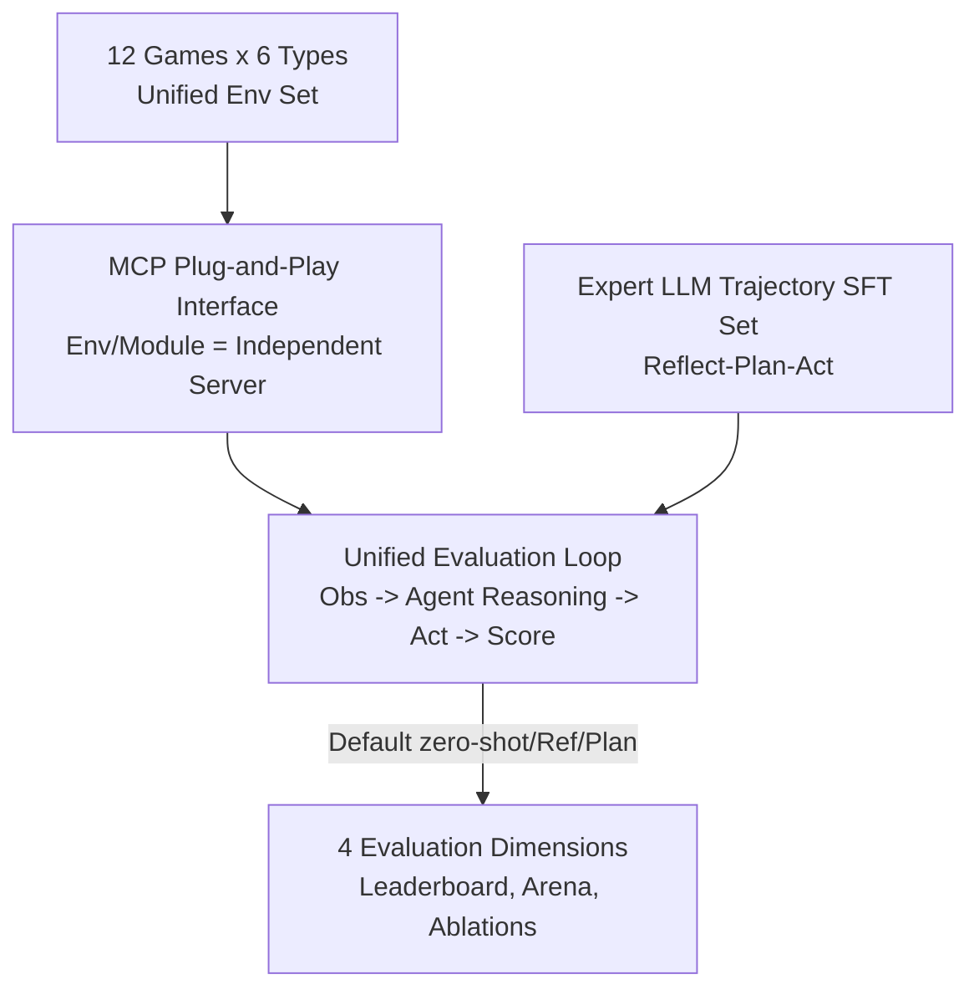

# Orak: A Foundational Benchmark for Training and Evaluating LLM Agents on Diverse Video Games

**Conference**: ICLR 2026  
**OpenReview**: [https://openreview.net/forum?id=H1ncX6O6Yh](https://openreview.net/forum?id=H1ncX6O6Yh)  
**Code**: https://github.com/krafton-ai/Orak (Including HuggingFace dataset KRAFTON/Orak)  
**Area**: Agent / Datasets & Benchmarks  
**Keywords**: LLM Agent, Game Benchmark, MCP Interface, Agentic Modules, Fine-tuning Dataset

## TL;DR
Orak encapsulates 12 real video games covering all 6 major genres into a unified benchmark using Model Context Protocol (MCP) plug-and-play interfaces. It enables systematic evaluation of LLM agentic modules (reflection/planning/tools) and provides a fine-tuning dataset of expert LLM gameplay trajectories to transform general LLMs into effective game agents.

## Background & Motivation
**Background**: Using games to evaluate LLMs has become a popular direction, ranging from early text adventures (Jericho, Zork) and 2D grid games (Chess, NetHack, Crafter) to recent applications of agentic workflows in complex games like Minecraft, StarCraft, and Pokémon. Games serve as natural, dynamic, and uncertain real-world simulators particularly suitable for assessing high-level decision-making and "System 2" reasoning in agents.

**Limitations of Prior Work**: The authors identify three critical flaws in existing game benchmarks. First, most are limited to pure text or 2D grid simulators rather than complex video games, distancing them from practical applications. Second, evaluation of agentic modules (self-reflection, memory, tool use) is insufficient; these modules are crucial for complex gameplay, yet controlled ablation studies are rare. Third, there is a lack of fine-tuning datasets specifically designed to adapt pre-trained LLMs into game agents, hindering deployment.

**Key Challenge**: Prior attempts to apply agents to games often involve hand-crafting bespoke workflows for each game, making the development of "universal game agents" non-reusable and non-scalable. Furthermore, games lack the structured states of web, programming, or math tasks; their state spaces are large, dynamic, and partially observable, requiring agents to generalize across contexts and learn diverse behavioral patterns.

**Goal**: The work addresses three sub-problems: (1) providing a set of game environments covering all major genres with unified access; (2) creating a plug-and-play, reproducible interface for evaluating agentic modules; and (3) generating a fine-tuning dataset to bridge general LLMs and game agents.

**Key Insight**: Leveraging the Model Context Protocol (MCP) for "function calling wrappers," each game environment and agentic module is implemented as an independent MCP server. This allows LLMs to interact with them uniformly as tools. Evaluation only requires specifying the game, LLM, and agent strategy in the configuration to run any combination.

**Core Idea**: Abstracting "game mechanics" and "agentic strategies" as callable tools via MCP, combined with a comprehensive game suite and expert trajectory fine-tuning set, identifies a unified infrastructure for both training and evaluating game agents.

## Method

### Overall Architecture
Orak's methodology is a benchmark infrastructure rather than a single algorithm. It ensures any rapidly iterating LLM can be evaluated across 12 real games in a consistent, reproducible manner. The architecture consists of three layers: the bottom layer comprises **12 game environments** (covering Action, Adventure, RPG, Simulation, Strategy, and Puzzle), each with defined states, action spaces, and normalized scores; the middle layer utilizes the **MCP interface** to encapsulate environments and agentic modules (reflection, planning, memory, etc.) as independent servers; the top layer features a **unified evaluation loop** and **four evaluation dimensions** (leaderboard, arena, and ablations).

During evaluation (`eval.py`), the system retrieves observations from the environment server, converts them to text (`obs2text`), passes them to the agent strategy for LLM reasoning (e.g., reflection → planning → action), converts output text to actions (`text2act`), and executes them (`step`). This loop continues until game termination or max steps, concluding with normalized scoring.

### Key Designs

**1. Comprehensive Real Game Set + 7-Dimension Capability Profiling**

To address the narrow coverage of existing benchmarks, Orak includes 12 real video games: Street Fighter III, Super Mario Bros, Ace Attorney, Her Story, Pokémon Red, Darkest Dungeon, Minecraft, Stardew Valley, StarCraft II, Slay the Spire, Baba Is You, and 2048. Based on game design principles, each game is rated (Level 1–3) across 7 dimensions by 8 human annotators: Rule Following (RF), Logical Reasoning (LR), Spatial Reasoning (SR), Long-term Context Understanding (LTU), Long-range Planning (LP), Error Handling (EH), and Stochastics/Randomness (OH). This allows for objective performance profiling.

**2. MCP Plug-and-Play Interface: Agentic Modules as Controlled Tools**

Orak abstracts game mechanics (state retrieval, execution, scoring) and agent strategies (reflection, planning, memory, retrieval) into independent MCP servers. This design allows agentic strategies to become pluggable variables. Researchers can conduct controlled experiments—such as studying the isolated impact of reflection versus planning—by simply swapping agent server combinations while maintaining a consistent structure across different games.

**3. Expert Trajectory Fine-tuning Set: Distilling Meta-Knowledge**

Using expert LLMs (e.g., GPT-4o, o3-mini), the authors collected interaction trajectories $T=\{\tau_1,\dots,\tau_T\}$. Each step is recorded as $\tau=\{(X_{a_i}, S, Y_{a_i})\}_{i=1}^{n}$, where $a_i\in\{\text{reflection},\text{planning},\dots,\text{action}\}$ represents the $i$-th agentic module, $X_a$ is the prompt, $S$ is the state, and $Y_a$ is the response. This structure encodes meta-knowledge of *when* and *how* to invoke specific strategies. The final processed dataset contains roughly 11k samples across 12 games, augmented 10x via prompt paraphrasing to enhance linguistic diversity.

**4. Four-Dimensional Unified Evaluation**

Orak uses normalized scores (actual score / max possible score) and benchmarks against 3 human novices. Dimensions include: **Game Leaderboard** (cross-comparison of 15 LLMs); **LLM Battle Arena** (pairwise Elo for multi-player games like StarCraft II and Street Fighter III); and three types of **Ablation Studies** (agentic strategy combinations, visual modality, and fine-tuning generalization).

## Key Experimental Results

### Main Results
Benchmark of 15 LLMs using default strategies (Normalized scores, excerpt):

| Model | AceAttorney | Pokémon | StarCraft2 | BabaIsYou | 2048 | Avg Rank |
|------|------|------|------|------|------|------|
| Gemini-2.5-pro | 55.7 | 83.3 | 100.0 | 73.3 | 5.1 | **3.5** |
| GPT-4o | 85.3 | 38.9 | 100.0 | 20.0 | 5.6 | 3.6 |
| GPT-5 | 59.1 | 88.9 | 25.0 | 100.0 | 10.2 | 3.6 |
| o3-mini | 91.7 | 0.0 | 25.0 | 73.3 | 25.3 | 4.0 |
| Llama-3.2-1B | 1.3 | 0.0 | 0.0 | 6.7 | 0.0 | 13.5 |
| Human (Novice) | 87.8 | 86.1 | 33.3 | 100.0 | 22.7 | - |

Closed-source models significantly outperform open-source models. Gemini-2.5-pro holds the best average rank, while GPT-5 excels in logic-heavy puzzles like Baba Is You. Smaller open-source models (<8B) struggle significantly with complex RPG and Strategy titles.

### Ablation Study
Agentic module ablation (Avg Rank, lower is better):

| Configuration | GPT-4o Rank | Llama-3.2-3B Rank | Note |
|------|------|------|------|
| Zero-shot | 3.4 | 6.4 | Direct Action |
| Reflection | 3.0 | **5.6** | Best for small models |
| Planning | 3.3 | 6.2 | |
| Reflection-Planning | **2.2** | 6.1 | Best for large models |

Fine-tuning Generalization (Llama-3.2-3B, ✗ No SFT / ✓ SFT):

| Scenario | Game/Task | ✗ | ✓ |
|------|------|------|------|
| Intra-game | SF3 | 12.0 | 40.0 |
| OOD-game | 2048 | 0.1 | 3.1 |
| Non-game | WebShop-H | 0.0 | 12.6 |

### Key Findings
- **Agentic module gains depend on backbone capability**: While adding modules (Reflect+Plan) helps GPT-4o, Llama-3.2-3B performs best with "Reflection" only. Complex planning prompts can overwhelm smaller models, suggesting that optimal agentic strategies are coupled with model capacity.
- **Arena vs. Leaderboard reversal**: Minitron-8B achieved the highest Elo in Street Fighter III arena, outperforming larger models. This indicates that leaderboard performance in single-player modes does not always translate to competitive multi-agent environments.
- **Vision is currently an overhead**: Pure visual input frequently causes performance drops. While vision helps in detail-oriented games like Street Fighter, it introduced noise in narrative-heavy games like Ace Attorney, where GPT-4o performance dropped 31.8 points.
- **Fine-tuning quality over quantity**: High-score trajectory data is most effective. Low-score data can be detrimental. Interestingly, game-based fine-tuning transfers to non-game tasks (e.g., Llama-3.2-3B WebShop-H success rate improved from 0% to 12.6%).
- **Real-time latency is a barrier**: Switching StarCraft II to real-time mode dropped almost all models to zero score on Hard difficulty. GPT-4o maintains the best balance between latency and decision accuracy.

## Highlights & Insights
- **MCP as Evaluation Middleware**: Treating game mechanics and agent strategies as tools allows for rapid integration of new LLMs and strategies without re-writing adapter code for every game.
- **Quantifiable Ability Profiling**: The 7-dimension profile moves game difficulty assessment from intuition to empirical evidence.
- **Optimal Strategies are Backbone-Specific**: The finding that "more agentic modules $\neq$ better performance" for small models is a crucial insight for agent system design.
- **Cross-Domain Generalization**: Trajectories from games can improve general decision-making patterns (Reflection-Planning) in non-game areas like web navigation.

## Limitations & Future Work
- **States as Text**: Orak pre-processes game states into structured text, removing irrelevant clutter. Providing raw, un-curated multimodality states remains a harder, more realistic challenge.
- **SFT Only**: The fine-tuning dataset currently supports supervised learning; reinforcement learning from environmental feedback is left for future work.
- **Visual Nuance**: The negative findings on vision might be due to the high quality of text states rather than inherent vision failure, making it difficult to isolate the exact cause of performance drops.

## Related Work & Insights
- **Comparison with SmartPlay/Balrog**: Orak moves beyond text or grid games to real video games and provides systematic module ablations and SFT data.
- **Comparison with Cradle/V-MAGE**: While those focus on visual agents or specific genres (Action/Strategy), Orak is the only benchmark covering all genres while supporting multimodal inputs, agentic ablations, and fine-tuning.
- **Agent Fine-tuning**: Unlike FireAct/CodeAct which focus on structured web/coding tasks, Orak applies similar distillation principles to high-entropy, dynamic game environments.

## Rating
- Novelty: ⭐⭐⭐⭐ (MCP for game/agent encapsulation; comprehensive genre coverage).
- Experimental Thoroughness: ⭐⭐⭐⭐⭐ (15 LLMs, 12 games, multi-dimensional ablations).
- Writing Quality: ⭐⭐⭐⭐ (Clear structure and well-founded insights).
- Value: ⭐⭐⭐⭐⭐ (Provides plug-and-play architecture and transferable data recipes).

<!-- RELATED:START -->

## Related Papers

- [\[ICLR 2026\] ST-WebAgentBench: A Benchmark for Evaluating Safety and Trustworthiness in Web Agents](st-webagentbench_a_benchmark_for_evaluating_safety_and_trustworthiness_in_web_ag.md)
- [\[ICLR 2026\] FutureX: An Advanced Live Benchmark for LLM Agents in Future Prediction](futurex_an_advanced_live_benchmark_for_llm_agents_in_future_prediction.md)
- [\[ICLR 2026\] WebFactory: Automated Compression of Foundational Language Intelligence into Grounded Web Agents](webfactory_automated_compression_of_foundational_language_intelligence_into_grou.md)
- [\[ICLR 2026\] FingerTip 20K: A Benchmark for Proactive and Personalized Mobile LLM Agents](fingertip_20k_a_benchmark_for_proactive_and_personalized_mobile_llm_agents.md)
- [\[ICLR 2026\] Agent Data Protocol: Unifying Datasets for Diverse, Effective Fine-tuning of LLM Agents](agent_data_protocol_unifying_datasets_for_diverse_effective_fine-tuning_of_llm_a.md)

<!-- RELATED:END -->
