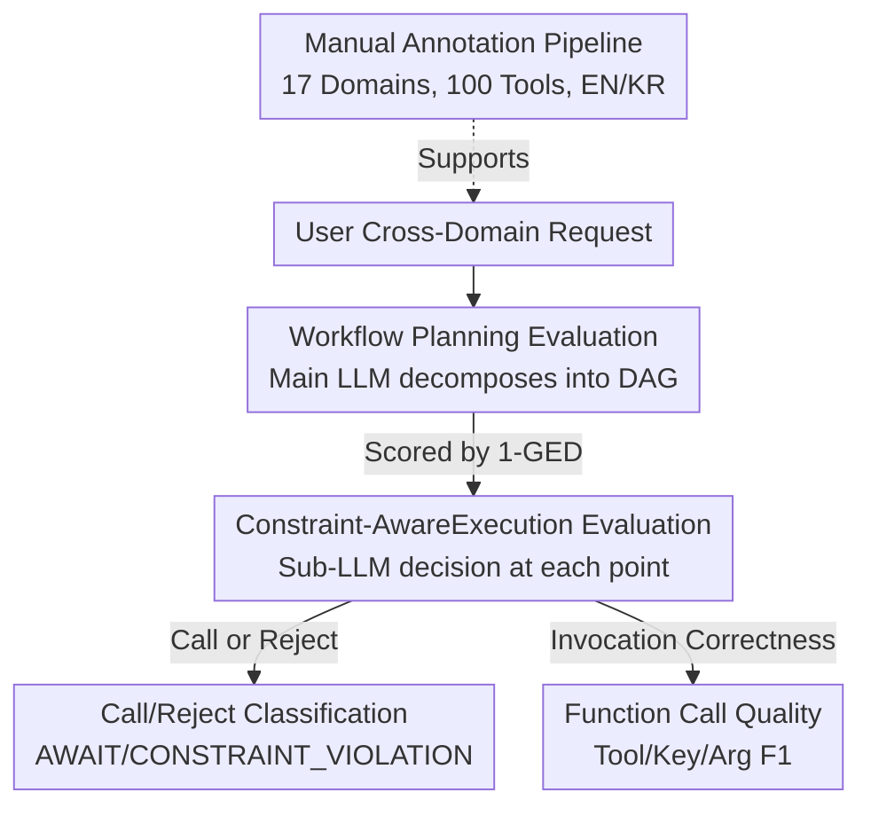

# OrchestrationBench: LLM-Driven Agentic Planning and Tool Use in Multi-Domain Scenarios

**Conference**: ICLR 2026  
**OpenReview**: [https://openreview.net/forum?id=Oljnxmf4pc](https://openreview.net/forum?id=Oljnxmf4pc)  
**Code**: https://github.com/kakao/OrchestrationBench  
**Area**: Agent / Tool Use / Benchmark  
**Keywords**: Multi-Agent Orchestration, Workflow Planning, Tool Use, Constraint Validation, Bilingual Evaluation

## TL;DR
OrchestrationBench is proposed—a fully manually annotated English/Korean bilingual benchmark. It decomposes service-level orchestration (where a "Main LLM decomposes requests $\rightarrow$ assigns to Sub-LLMs $\rightarrow$ Sub-LLMs call tools") into two independent dimensions: **Workflow Planning** and **Constraint-Aware Tool Execution**. Findings indicate that while function calling capabilities are similar across major models, the gap in planning capability is significant.

## Background & Motivation
**Background**: LLMs have evolved from "text generators" into agents capable of multi-step reasoning, structured planning, and invoking external tools. The industry increasingly seeks to deploy them as "service agents" capable of assisting users with interdependent sub-tasks across multiple domains (e.g., booking flights, checking weather, scheduling meetings).

**Limitations of Prior Work**: Existing agent benchmarks either remain in simplified settings of single-domain/single-agent (e.g., TaskBench for single LLM task decomposition + API calling; $\tau$-bench or GAIA for single-agent end-to-end tasks) or conflate planning and tool execution into a single end-to-end score. While flexible, end-to-end evaluation **obscures specific failure points** in multi-step complex tasks—indicating failure without identifying whether it stemmed from poor planning or incorrect tool invocation.

**Key Challenge**: In real-world service scenarios, "orchestration" is a hierarchical process where a **Main LLM coordinates multiple expert Sub-LLMs**. This involves managing task dependencies, refining requirements mid-dialogue, and validating business constraints before tool invocation (e.g., reservations allowed only on the hour or half-hour). This **LLM-to-LLM** coordination capability differs fundamentally from the **LLM-to-API** paradigm where a single agent directly calls APIs and is largely uncovered by existing benchmarks.

**Goal**: To construct a benchmark that can (1) independently evaluate the quality of workflow planning, (2) independently evaluate the quality of constraint-aware tool execution, and (3) cover multi-domain, bilingual, and realistic constraints.

**Key Insight**: The authors explicitly disentangle orchestration into two lines: planning is formalized as a Directed Acyclic Graph (DAG) and quantified using Graph Edit Distance; execution is further split into the decision of "whether to call/reject" and the quality of the function call itself.

**Core Idea**: By utilizing "hierarchical Main-Sub LLM orchestration + planning/execution decoupled diagnostic evaluation," a vague end-to-end agent success rate is replaced with a fine-grained capability profile that identifies failure points.

## Method

### Overall Architecture
OrchestrationBench is an **evaluation framework + a fully manually annotated dataset**. The simulated operational scenario involves a user submitting a cross-domain request; the **Main LLM** decomposes the request into several **workflows**, which are further split into **steps** and assigned to appropriate **Sub-LLMs (agents)**. Sub-LLMs utilize refined queries to **invoke virtual tools**, and the results are returned to the Main LLM for aggregation and response. The process supports sequential/parallel execution, user clarification, and mid-dialogue workflow revisions.

During evaluation, the framework segments this chain into two parts: the **Planning Phase** evaluates the correctness of the DAG-formed workflow, and the **Execution Phase** evaluates the Sub-LLM's decisions and parameter quality at each tool invocation point. The dataset is produced via a five-step manual pipeline (domain selection $\rightarrow$ tool design $\rightarrow$ scenario construction $\rightarrow$ workflow/tool definition $\rightarrow$ cross-validation), covering 17 domains, nearly 100 virtual tools, and both English and Korean.

### Key Designs

**1. Workflow Planning: Formalizing Orchestration with DAG and Scoring via Graph Edit Distance**

To address the ambiguity of failure points in planning, each orchestration objective is formalized as a **Directed Acyclic Graph (DAG)**. Each workflow is a node containing `status` (pending/running/waiting_for_input/completed/paused/canceled), `type` (independent/dependent), and `depend_on` (previous workflows). Within a workflow, ordered steps record progress, assigned Sub-LLM names, and refined queries. For example, "Book flight + Book hotel near COEX + Share itinerary" would result in workflow_1 and workflow_2 being independent, while workflow_3 depends on both.

Scoring utilizes **Graph Edit Distance (GED)**: the minimum number of operations to transform the model-generated graph into the ground truth, normalized to 0–1, and calculated as $1-\text{GED}$ so higher scores are better. The authors apply **hierarchical weighting**: structural scores reflect topology, while component scores reflect step-level Sub-LLM assignments. A weight of 0.8 is assigned to "incorrect tool/agent selection" and 0.2 to "incorrect status judgment" (reasoning that tool selection errors are more critical than status misjudgments). This design provides a structured, comparable continuous metric for planning quality.

**2. Constraint-Aware Tool Execution: Determining "Should Call" Before "How to Call"**

Real-world services require models to understand **when not to invoke a tool**. Execution evaluation is split into two sequential stages. The first is **Call/reject classification**: the model must identify two types of "rejections"—requesting clarification via `AWAIT_FOR_USER_INPUT` when information is insufficient (e.g., "Transfer money to Minji" when multiple Minjis exist) and issuing `TOOL_CONSTRAINT_VIOLATION` when business constraints are breached (e.g., booking at 4:10 when only 30-minute intervals are allowed). The C/R accuracy is the ratio of correct decisions (correct rejections + correct invocations) over all cases.

The second stage, **Function Call Quality**, is only evaluated for cases that correctly proceed to invocation, using three F1 metrics: Tool Selection F1, Key F1, and Argument F1. Parameter validation follows three levels: exact match, type/pattern validation based on tool descriptions, and semantic validation. A panel of **three LLM judges (GPT-4.1, Claude Sonnet 4, Gemini 2.5 Flash)** at temperature 0.3 provides an arithmetic mean to reduce bias. Human-LLM agreement (Cohen’s Kappa) is 0.63.

**3. Multi-Domain Virtual Tools + Manual Annotation + Bilingual Adaptation**

To avoid the simplicity and bias of existing benchmarks, authors used 17 representative service domains covering three workflow types: information query, transactional action, and planning coordination. Each domain features virtual tools with realistic constraints—97 in English and 99 in Korean (differences due to cultural specifics like address romanization or fortune-telling).

Crucially, the dataset utilizes a **fully manual annotation pipeline**. All dialogues, workflows, and tool calls were handwritten by trained annotators rather than synthesized. Initial tool descriptions and call results were drafted by GPT-4o and then human-refined. Each scenario underwent cross-validation by at least 3 annotators, with ambiguous cases removed to maintain clear task dependencies. The initial construction in Korean followed by expansion to English provides valuable resources for planning/tool-use evaluation in non-English contexts.

## Key Experimental Results

### Main Results
Evaluations included GPT (4.1/4o/5/mini/nano), Claude Sonnet 4, Gemini 2.5 Pro/Flash, Qwen3 series, and Korean open-source models (A.X-4.0, kanana-1.5, EXAONE-4.0). Each model ran 3 times per scenario at temperature 0.2. Selected English results (Plan = $1-\text{GED}$, C/R = Call/Reject Accuracy, FC = Function Call, Score = Composite):

| Model | Plan | C/R | FC | Score |
|------|------|------|------|------|
| gemini-2.5-pro-preview | **0.850** | 0.724 | 0.836 | 0.803 |
| claude-sonnet-4 | 0.773 | **0.868** | **0.885** | **0.842** |
| gpt-4.1 | 0.744 | 0.860 | 0.861 | 0.822 |
| Qwen3-235B-A22B | 0.768 | 0.876 | 0.880 | 0.842 |
| Qwen3-32B | 0.792 | 0.857 | 0.808 | 0.819 |
| gpt-5 | 0.583 | 0.791 | 0.804 | 0.726 |
| gpt-4.1-nano | 0.462 | 0.725 | 0.752 | 0.646 |
| EXAONE-4.0-32B | 0.057 | 0.653 | 0.534 | 0.415 |

Key Observation: **Function Calling (FC) performance is relatively stable** (0.75–0.89 for most), whereas **Planning (Plan) shows a massive gap**—from Gemini's 0.850 down to EXAONE's 0.057. This suggests planning is the "watershed" capability for distinguishing models. Dense open-source models are competitive, with Qwen3-235B-A22B matching top closed models.

### Ablation Study
Correlation analysis reveals a "Planning-Execution Gap":

| Dataset | Corr(C/R, Plan) | Corr(C/R, FC) | Corr(Plan, FC) |
|--------|------|------|------|
| English | 0.583 | 0.726 | 0.922 |
| Korean | 0.448 | 0.577 | 0.775 |

The correlation between C/R decisions and Planning scores is noticeably weaker (0.583 EN / 0.448 KR). This implies **models can generate high-quality workflows yet fail at execution decisions** (knowing when to call/reject).

### Key Findings
- **Planning is the most discriminative capability**: Most models handle FC well, but Plan scores vary wildly.
- **Planning-Execution Gap**: Strong planning does not inherently lead to correct invocation/rejection decisions under constraints.
- **Language Dependency**: Model rankings shift significantly between languages; Claude excels in English decision-making, while Gemini performs better in Korean.
- **Family Strengths**: Gemini excels in planning but is weaker in FC; Claude is superior in FC; GPT-4.1 is the most balanced.

## Highlights & Insights
- **Decoupling orchestration into planning and execution** is the core methodological contribution, turning the "agent failure" black box into a diagnostic report.
- **Using DAG + GED to quantify planning quality** is an effective way to transform open-ended generation into a structured, comparable continuous metric.
- **Isolated C/R dimensions** highlight a neglected capability: being able to call a tool does not mean knowing when to refuse. `AWAIT` and `VIOLATION` signals are where real-world services most frequently fail.
- **Bilingual and cultural adaptation** fills a gap in non-English agent evaluation resources and proves that language choice dictates model selection.

## Limitations & Future Work
- **Limitations**: (1) Limited to 17 domains and two languages; (2) Uses virtual rather than real tools (e.g., lack of MCP), which distances it from full end-to-end reality; (3) **Step-by-step evaluation assumes success at each prior stage**, which may overestimate performance compared to real-world cascade errors.
- **Refinement**: Scoring weights (0.8/0.2) were empirically set without experimental derivation.
- **Future Work**: Implementing end-to-end evaluation with error propagation; designing training methods specifically for the planning-execution gap.

## Related Work & Insights
- **vs TaskBench / UltraTool**: Those focus on **single LLM** task decomposition and API calling (**LLM-to-API**). This work evaluates **Main LLM coordination of sub-LLMs** (**LLM-to-LLM**), prioritizing coordination over individual performance.
- **vs $\tau$-bench / GAIA**: These are end-to-end benchmarks; this work **decouples and diagnoses** to locate specific failure points.
- **vs ToolEmu / SafeToolBench**: Those evaluate **safety** (refusing harmful requests); this work evaluates **functional feasibility** (Main LLM refusing infeasible requests based on sub-agent descriptions).

## Rating
- Novelty: ⭐⭐⭐⭐ Decoupling planning/execution and introducing DAG+GED is a novel combination.
- Experimental Thoroughness: ⭐⭐⭐⭐ 16 models across two languages, though lacks real-world tool cascading.
- Writing Quality: ⭐⭐⭐⭐ Clear framework and well-defined metrics.
- Value: ⭐⭐⭐⭐ Strong practical guidance for evaluating service-level agent orchestration.

<!-- RELATED:START -->

## Related Papers

- [\[ICLR 2026\] Code Driven Planning with Domain-Adaptive Selector](code_driven_planning_with_domain-adaptive_selector.md)
- [\[ICLR 2026\] Benchmarking LLM Tool-Use in the Wild](benchmarking_llm_tool-use_in_the_wild.md)
- [\[ICLR 2026\] GTool: Graph Enhanced Tool Planning with Large Language Model](gtool_graph_enhanced_tool_planning_with_large_language_model.md)
- [\[ICLR 2026\] ToolTree: Efficient LLM Agent Tool Planning via Dual-Feedback Monte Carlo Tree Search and Bidirectional Pruning](tooltree_efficient_llm_tool_planning_via_dual-feedback_monte_carlo_tree_search_a.md)
- [\[ACL 2026\] Feedback-Driven Tool-Use Improvements in Large Language Models via Automated Build Environments](../../ACL2026/llm_agent/feedback-driven_tool-use_improvements_in_large_language_models_via_automated_bui.md)

<!-- RELATED:END -->
