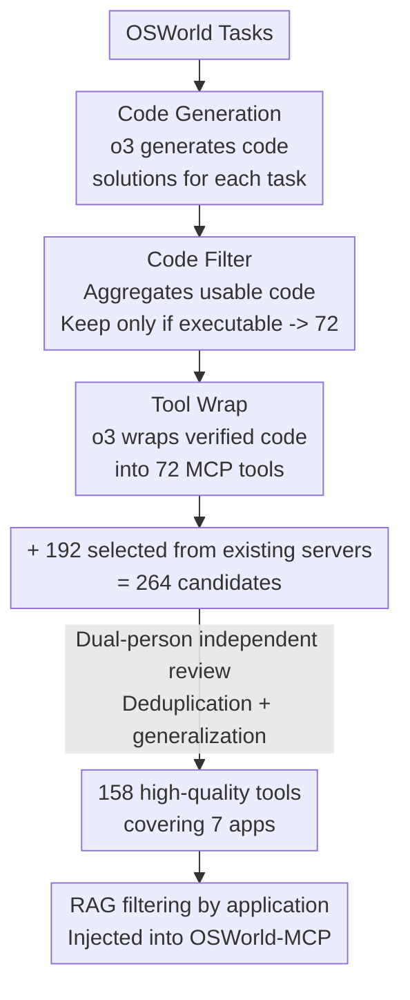

# OSWorld-MCP: Benchmarking MCP Tool Invocation in Computer-Use Agents

**Conference**: ICLR 2026  
**OpenReview**: [https://openreview.net/forum?id=rceD6wwt4B](https://openreview.net/forum?id=rceD6wwt4B)  
**Code**: https://osworld-mcp.github.io  
**Area**: Agent / Multimodal VLM / Benchmark  
**Keywords**: Computer-use Agents, MCP Tool Invocation, GUI-Tool Mixed Decision Making, Automatic Tool Generation, Evaluation Benchmark

## TL;DR
OSWorld-MCP injects 158 high-quality MCP tools into the OSWorld real-world computer environment, enabling multimodal agents to autonomously choose between "invoking a tool" and "interacting with the GUI" at each step. This marks the first time tool invocation, GUI operation, and mixed decision-making capabilities are evaluated within a unified framework. Results show that MCP tools generally improve success rates (e.g., OpenAI o3 improves from 8.3% to 17.6% within 15 steps), but the highest tool invocation rate among models is only 33.3%, indicating that existing agents are far from mastering tool usage.

## Background & Motivation
**Background**: Multimodal Large Language Models (MLLMs) have made rapid progress in "computer-use" scenarios. Several dynamic interactive benchmarks like OSWorld, WindowsAgentArena, and WebArena have emerged to evaluate whether agents can complete desktop tasks through GUI operations (clicking, typing, dragging).

**Limitations of Prior Work**: These benchmarks almost exclusively focus on a predefined set of GUI actions, **completely ignoring tool invocation capabilities**—particularly the Model Context Protocol (MCP) introduced by Anthropic in 2024. MCP is a standardized client-server interface that allows agents to directly access external resources like files, databases, search engines, and calculators. For many tasks, MCP is significantly more efficient than pure GUI interaction; for instance, installing an "autoDocstring" plugin in VS Code takes at least four GUI steps but can be completed in one step via an MCP tool, which is also more robust.

**Key Challenge**: Some recent agents (e.g., CoAct, GUI-Owl) already have built-in autonomous tool invocation. **Comparing them with agents that only perform GUI interaction is inherently unfair** due to the misalignment of capability dimensions. Currently, no benchmark can simultaneously and fairly measure GUI operation, tool invocation, and decision-making within a unified framework. Furthermore, text-only tool evaluations (MCPEval, MCP-Radar, LiveMCPBench) either suffer from low task diversity or rely on LLMs as judges, making them unsuitable for tasks requiring real-time state tracking.

**Goal**: Establish a unified standard to fairly compare the tool utilization capabilities of different models while preserving GUI operations and complex decision-making in real computer environments. Specifically, the study addresses: (1) how to generate a large volume of high-quality MCP tools reflecting real-world needs; (2) how to let tools and GUI coexist dynamically for agent trade-offs; and (3) what metrics can quantify "tool usage proficiency."

**Core Idea**: Mount a set of 158 rigorously verified MCP tools onto the OSWorld environment. **At each step, the agent autonomously chooses between an MCP tool and a GUI action**. Two new metrics, TIR and ACS, are introduced to explicitly measure tool invocation tendency and decision efficiency.

## Method

### Overall Architecture
OSWorld-MCP is not a new model but an **evaluation benchmark + supporting tool production pipeline**. Built upon OSWorld (covering Ubuntu/Windows/macOS, 9 applications, and 369 real-world tasks involving GUI and CLI interaction), its core modification involves **injecting 158 additional MCP tools** into an action space originally limited to 11 basic GUI actions (key, type, click, drag, scroll, terminate, etc.). Consequently, the agent must decide at each step whether to invoke an MCP tool or issue a GUI action.

The workflow consists of **offline tool production** and **online task evaluation**. The production stage uses an automatic code generation pipeline (Code Generation → Code Filter → Tool Wrap) to mass-produce tools, supplemented by curated tools from existing MCP servers, filtered through two rounds of manual review. The evaluation stage provides tools to the model via RAG-based application filtering to avoid context overflow. The model performs mixed decision-making, scored by three metrics.

The offline tool production pipeline is shown below:

### Key Designs

**1. Automatic Code Generation Pipeline: Solidifying Task Solutions into Tools via o3**

Existing MCP tools are often overly simplistic or redundant, lacking the high quality needed for real-world scenarios. The authors designed a three-module pipeline. **Code Generation Module**: Given a target task, OpenAI o3 automatically generates code solutions for OSWorld tasks. **Code Filter Module**: o3 aggregates usable code from multiple interaction rounds, and **only code that successfully passes the task is retained**, yielding 72 verified solutions. **Tool Wrap Module**: o3 automatically encapsulates these 72 code segments into MCP tools. The "retain only if executable" constraint ensures tools are functional units rather than non-executable APIs.

**2. Dual Verification: From 264 Candidates to 158 Selected Tools**

Automatic generation alone is insufficient, as some tools may be overfitted to specific tasks. The authors merged 72 generated tools with 192 curated tools to form 264 candidates. These underwent **fine-grained manual verification**: each tool was independently evaluated by at least two reviewers with GUI agent experience. **A tool was retained only if both judged it qualified**, while redundant or overly task-specific items were removed. The final set includes 158 tools (25 from external servers). Additional validation confirmed that 133 tools effectively improve efficiency and 131 were invoked at least once by SOTA models.

**3. Dynamic GUI-Tool Mixed Decision Making: Autonomous Step-by-Step Choice**

The most distinctive feature of OSWorld-MCP is putting tools and GUI into **dynamic competition within the same action space**. At every step, the agent can choose to invoke an MCP tool or perform a direct GUI action. This shifts the challenge from just "selecting the right tool" to "identifying the most efficient execution path." Tasks were manually categorized into **Tool-Beneficial Tasks** (250 tasks, 69%) and **Non-Tool-Beneficial Tasks** (111 tasks). Notably, 153 tasks (42%) require multiple tool invocations, significantly increasing difficulty.

**4. TIR and ACS: Quantifying Tool Usage Proficiency**

Task Accuracy alone fails to distinguish whether an agent uses tools appropriately. Two new metrics were introduced. **Tool Invocation Rate (TIR)** is defined as $\text{TIR} = (n_t + n_g)/(N_t + N_g)$, where $N_t$ is the total number of Tool-Beneficial tasks and $n_t$ is the count of such tasks where tools were used successfully; $N_g$ is the total of Non-Tool-Beneficial tasks and $n_g$ is the count where the agent correctly refrained from using tools and succeeded. Thus, TIR captures judgment in "whether to invoke." **Average Completion Steps (ACS)** is $\text{ACS} = \sum_{i=1}^{N} S_i / N$ (where $S_i$ is steps for task $i$); more accurate decisions and frequent correct tool usage lead to lower ACS, reflecting efficiency.

## Key Experimental Results

### Main Results
Evaluations were conducted on six end-to-end models (Qwen2.5-VL-72B, Qwen3-VL-Plus, Seed1.5-VL, Claude 4 Sonnet, OpenAI o3, Gemini-2.5-Pro) and one multi-agent framework (Agent-S2.5) using a GUI-Owl agent configuration. The following table summarizes overall results (GUI-only vs. +MCP):

| Model | Steps | GUI Acc | +MCP Acc | +MCP TIR | ACS Change |
|------|------|---------|----------|----------|----------|
| OpenAI o3 | 15 | 8.3 | **17.6** | 9.3 | 14.0→11.9 |
| OpenAI o3 | 50 | 12.8 | **24.1** | 16.0 | 44.8→33.0 |
| Claude 4 Sonnet | 15 | 30.2 | **36.1** | 27.4 | 11.9→10.5 |
| Claude 4 Sonnet | 50 | 38.9 | **45.0** | 33.3 | 25.0→20.0 |
| Gemini-2.5-Pro | 50 | 13.3 | **25.7** | 16.8 | 40.0→31.0 |
| Qwen3-VL-Plus | 50 | 33.8 | **39.5** | 26.1 | 25.6→18.6 |
| Agent-S2.5 (Multi-agent) | 50 | — | **49.5** | — | — |

Claude 4 Sonnet achieved the highest LMM accuracy (36.1/45.0) and highest TIR. Qwen3-VL-Plus achieved the lowest ACS (10.0 at 15 steps). The multi-agent Agent-S2.5 was the strongest overall (49.5% at 50 steps).

### Ablation Study / Analysis

| Phenomenon | Key Data | Description |
|------|---------|------|
| Universal Utility | All models except Qwen2.5-VL saw Acc↑ and ACS↓ with MCP | Tools deliver a win-win for accuracy and efficiency |
| Qwen2.5-VL Counterexample | 50-step Acc 13.9→15.6 but ACS 30.5→39.0↑ | Weak tool decision-making led to more wasted steps |
| Low Invocation Rates | Max Claude 33.3%, Min Qwen2.5-VL 9.3% | Models have not yet learned to actively use tools |
| Multi-step Difficulty | On 4-step tool tasks: Claude GUI=0, +MCP=19.5% | Chaining tools is the primary bottleneck |

### Key Findings
- **MCP tools simultaneously improve accuracy and efficiency**: Most notably, OpenAI o3 and Gemini-2.5-Pro showed significant gains in success rates and reductions in ACS.
- **TIR correlates positively with accuracy**: Models better at tool usage (Claude, Agent-S2.5) also perform better overall; however, low TIR across the board suggests latent potential remains untapped.
- **Multi-tool composition is the greatest challenge**: Performance drops sharply as the number of required tools increases; models struggle to select the correct tool from a list and combine them effectively.

## Highlights & Insights
- **"Machine-generated + Manually-selected" is a scalable paradigm**: Using o3 for "Generation → Executability Filter → Encapsulation" followed by independent human review commercializes the creation of high-quality toolsets.
- **Fairness through "Capability Dimension Alignment"**: The authors highlight a flaw in current evaluations where tool-enabled agents are compared against GUI-only agents. Putting both in the same action space makes comparisons meaningful.
- **TIR captures the "dual-nature" of decision making**: It rewards both correct tool usage and "correct restraint," exposing decision-making flaws (e.g., Qwen2.5-VL's over-reliance on tools).
- **The "zero accuracy" in multi-step GUI tasks** is a powerful data point, proving that tools are a necessity rather than just an optional boost for complex real-world tasks.

## Limitations & Future Work
- **Toolsets constrained by OSWorld versions**: Applications like GIMP and Thunderbird lacked MCP servers due to versioning issues.
- **Dependency on RAG**: Using RAG to filter tools for the context window introduces retrieval error which was not isolated in this analysis.
- **Dependency on o3**: The production pipeline relies heavily on OpenAI o3; whether weaker models can replicate this quality remains unverified.
- **Multi-step chaining remains open**: The benchmark exposes the bottleneck in tool chaining and long-list selection but does not provide a direct solution.

## Related Work & Insights
- **vs. OSWorld**: OSWorld only defines GUI actions; this work adds 158 MCP tools and allows dynamic selection, expanding evaluation from "pure GUI" to "GUI + Tools + Mixed Decision."
- **vs. Text-based MCP Benchmarks**: Prior benchmarks had limited tool variety or relied on LLM judges; this work evaluates in a visual GUI environment requiring multi-modal perception and real-world execution.
- **vs. Static GUI Benchmarks**: Static benchmarks (e.g., Mind2Web) cannot evaluate new action paths created by tools; this work uses a dynamic environment with real reward signals.

## Rating
- Novelty: ⭐⭐⭐⭐⭐ First to fairly evaluate GUI + Tool + Mixed Decision in a real computer environment.
- Experimental Thoroughness: ⭐⭐⭐⭐⭐ Covers 6 LMMs + 1 multi-agent framework, multiple step counts, and fine-grained task analysis.
- Writing Quality: ⭐⭐⭐⭐ Clear motivation and metrics, though some pipeline implementation details are slightly brief.
- Value: ⭐⭐⭐⭐⭐ Sets a new standard for tool-use evaluation in computer-use agents; environment and tools are fully open-sourced.

<!-- RELATED:START -->

## Related Papers

- [\[ICLR 2026\] MCP-Bench: Benchmarking Tool-Using LLM Agents with Complex Real-World Tasks via MCP Servers](mcp-bench_benchmarking_tool-using_llm_agents_with_complex_real-world_tasks_via_m.md)
- [\[ICLR 2026\] MCPMark: A Benchmark for Stress-Testing Realistic and Comprehensive MCP Use](mcpmark_a_benchmark_for_stress-testing_realistic_and_comprehensive_mcp_use.md)
- [\[ICLR 2026\] MCP Security Bench (MSB): Benchmarking Attacks Against Model Context Protocol in LLM Agents](mcp_security_bench_msb_benchmarking_attacks_against_model_context_protocol_in_ll.md)
- [\[ICLR 2026\] SCUBA: Salesforce Computer Use Benchmark](scuba_salesforce_computer_use_benchmark.md)
- [\[ICLR 2026\] AgentSynth: Scalable Task Generation for Generalist Computer-Use Agents](agentsynth_scalable_task_generation_for_generalist_computer-use_agents.md)

<!-- RELATED:END -->
