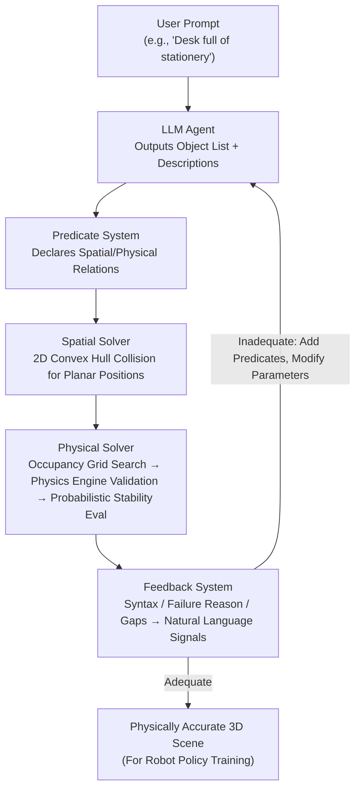

# PhyScensis: Physics-Augmented LLM Agents for Complex Physical Scene Arrangement

**Conference**: ICLR 2026  
**arXiv**: [2602.14968](https://arxiv.org/abs/2602.14968)  
**Code**: [Project Page](https://physcensis.github.io)  
**Area**: LLM Agent  
**Keywords**: 3D scene generation, physics engine, LLM agent, physical plausibility, predicate-based placement, probabilistic programming, robotic manipulation

## TL;DR

Ours proposes PhyScensis, an LLM agent framework integrated with a physics engine. By utilizing a solver driven by spatial and physical predicates, it generates high-complexity, physically accurate 3D scenes. It significantly outperforms prior methods in visual quality, semantic correctness, and physical precision, and has been successfully applied to robot manipulation policy training.

## Background & Motivation

Automatic generation of interactive 3D environments is crucial for large-scale robotic simulation data collection. However, existing methods suffer from multiple deficiencies:

**Procedural Methods** (e.g., ProcTHOR): Limited by designer-defined rules and cannot cover open-ended scenarios.

**Data-Driven Methods** (e.g., Transformer/Diffusion): Limited by the scarcity of 3D datasets, especially lacking fine-grained placement of small objects.

**LLM Agent Methods** exhibit critical flaws:
   - Image-driven methods (e.g., Architect, SceneTheis) are affected by occlusion and lack fine-grained control.
   - Direct position prediction methods (e.g., LayoutGPT, 3D-Generalist) are limited by the 3D spatial reasoning capabilities of LLMs.
   - Predicate + Solver methods (e.g., LayoutVLM) utilize only 2D AABB collision detection and lack feedback loops.

**Neglect of Physical Interactions**: Physical relationships like stacking, containment, and support are not modeled, leading to object interpenetration and unstable configurations.

The **Key Challenge** lies in complex physical scenes requiring (a) high object density, (b) rich support relationships, and (c) simultaneous modeling of spatial positions and physical attributes.

## Method

### Overall Architecture

PhyScensis aims to enable LLMs to generate high-density 3D scenes that are both visually plausible and physically stable, rather than merely scattering objects loosely on a surface. The **Core Idea** is to decouple "semantic understanding" and "physical calculation"—tasks that LLMs are respectively good and bad at. Given a user prompt (e.g., "set up an office desk full of stationery"), the LLM agent first produces an object list, textual descriptions for each object (for mesh retrieval from assets), and a set of **predicates** declaring the spatial/physical relationships to be satisfied. Subsequently, a solver translates these predicates into concrete coordinates: a spatial solver first resolves 2D planar position constraints, then a physical solver invokes a physics engine to handle 3D stacking and containment. Finally, a feedback system checks the results, feeding signals like syntax errors, solver failures, and crowding/gaps back to the LLM agent for predicate adjustment or parameter modification. The LLM only "declares intent," while the precise coordinate calculations are handled by the solvers and physics engine.

### Key Designs

**1. Predicate System: Declaring Relations Instead of Direct Coordinates**

LLMs have consistently struggled with precise 3D spatial reasoning; asking them to output $(x, y, z, yaw)$ often results in penetration or incorrect stacking. PhyScensis shifts the LLM's output to predicates—structured relational declarations—while actual coordinates are calculated by backend solvers. Predicates are categorized into two types. Spatial predicates govern 2D planar relations: positional types include `left/right/front/back-of` (with specific distances) and `place-on-base`; alignment types include `align-left/right/front/back` and `align-center`; rotation types include `facing-to`, `facing-same-as`, and `random-rot`; additionally, `symmetry-along` manages symmetry, `group` creates virtual groups, and `copy-group` duplicates groups while preserving internal structure. Physical predicates govern 3D interactions: `place-in` places objects into containers with gravity simulation, `place-on` handles stacking with controlled stability, and `place-anywhere` randomly places objects ensuring no penetration and valid support.

**2. Spatial Solver: Using Convex Hulls Instead of AABB and Determinedness Checks**

Prior works like LayoutVLM used 2D AABB (Axis-Aligned Bounding Boxes), which are inaccurate for tilted or irregularly shaped objects. The spatial solver uses 2D convex hulls for overlap detection—more precise than AABB and faster than full 3D mesh intersection. During solving, it checks if an object is "fully determined," meaning $x, y, yaw$ are either defined or inferrable; if an object is under-determined, this gap is fed back to the LLM agent. The parameters are optimized via **coordinate-wise iterative optimization**, where the **Goal** is to minimize a penalty term comprising convex hull overlap area and boundary violation distance. If the penalty remains above a threshold after fixed steps, the case is reported as unsolvable.

**3. Physical Solver: Occupancy Grid Search → Physics Engine Validation → Probabilistic Stability Evaluation**

Once planar positions are set, 3D stacking and containment rely on real physics. `place-in` simulates objects being released and stabilized under gravity. More complex `place-on` / `place-anywhere` (Figure 4) operations follow three steps: First, an **occupancy grid heuristic** voxelizes the scene and candidates to find positions that avoid penetration and ensure the center of mass projection falls within the support hull. Second, **physics engine validation** filters candidates that exhibit large displacements after simulation. Finally, **probabilistic stability evaluation** is performed by sampling perturbations (3D position, Euler angles, mass, friction) around the current state and using a Bayesian approach to estimate stability probability. This probability serves to select stable configurations and supports fine-grained stability control—allowing for the generation of "unstable but not yet collapsed" solutions for challenging robotic scenarios.

**4. Feedback System: Translating Failures and Gaps into Actionable Signals**

If the solver fails, simply reporting "failure" is insufficient for LLM iteration. Feedback is divided into three types. **Syntactic feedback** checks if predicate formats are valid and objects are fully determined. **Solver failure feedback** diagnoses specific reasons—penetration, out-of-bounds, stacking failure—and identifies empty regions via natural language (e.g., "empty space on the left side of the desk behind the laptop"). **Success feedback** provides quality assessments once a scene is valid, including stability scores, VQA scores for neatness/clutter, and heuristic metrics like surface coverage and compacteness.

### Loss & Training

This paper presents a generation framework rather than a training method. Optimization occurs in two places: the penalty term in the spatial solver (minimizing overlap and boundary violation) and the maximization (for stability) or minimization (for instability) of stability probability in the physical solver.

## Key Experimental Results

### Main Results

**Quantitative Comparison (Table 1)**:

| Method | VQA Score↑ | GPT Ranking↓ | Settle Distance↓ | Reaching (10 trials) | Placing (10 trials) |
|------|-----------|-------------|-----------------|----------------|---------------|
| Architect | 0.493±0.392 | 2.607±0.673 | 0.405±0.471 | 3/10 | 0/10 |
| 3D-Generalist | 0.578±0.399 | 1.946±0.731 | 0.033±0.048 | 4/10 | 1/10 |
| **Ours** | **0.704±0.425** | **1.429±0.562** | **0.003±0.008** | **9/10** | **3/10** |

PhyScensis leads significantly across all metrics:
- VQA Score +21.8% (vs 3D-Generalist)
- Settle Distance reduced by 91% (Physical precision)
- Robot reaching success rate 9/10 vs 4/10

**User Study (Table 4, 20 participants, 18 cases, scale 1-5)**:

| Method | Text Alignment↑ | Naturalism & Physics↑ | Complexity↑ |
|------|---------|------------|--------|
| Architect | 2.68 | 2.65 | 2.69 |
| 3D-Generalist | 2.54 | 2.72 | 3.04 |
| **Ours** | **4.04** | **3.98** | **3.82** |

### Ablation Study

**Feedback System Ablation (Table 2)**:

| Variant | Retries↓ | Time Consumption↓ |
|------|---------|---------|
| No Feedback | 1.69±1.92 | 132.29±78.38 |
| No Empty Region Report | 1.43±1.55 | 126.09±59.19 |
| Added Visual Feedback | **0.95±0.91** | 120.65±53.62 |
| Full Framework | 1.04±1.41 | **106.41±55.53** |

The full feedback system reduces time consumption from 132s to 106s (20% speedup).

**Predicate/Solver Ablation (Table 3)**:

| Variant | VQA Score↑ | GPT Ranking↓ | Settle Distance↓ |
|------|-----------|-------------|-----------------|
| Random Placement | 0.415±0.363 | 2.706±0.666 | 0.004±0.003 |
| LLM-Only (Direct Pred.) | 0.592±0.401 | 1.882±0.676 | 0.154±0.133 |
| **Ours** | **0.704±0.425** | **1.411±0.492** | **0.003±0.008** |

### Key Findings

1. Integration of a physics engine reduces Settle Distance by two orders of magnitude (0.003 vs 0.405).
2. Predicate-based methods significantly outperform direct LLM position prediction (VQA +19%).
3. The feedback system (especially empty region identification) significantly enhances iteration efficiency.
4. Generated scenes can effectively be used for robot policy training and generalize to human-designed scenes.

## Highlights & Insights

1. **Elegant Integration of Physics and LLM Agents**: The LLM handles high-level semantic reasoning and predicate generation, while the physics engine ensures low-level physical accuracy.
2. **Stability Control via Probabilistic Programming**: Not only can it generate stable scenes, but it can also intentionally produce extremely unstable arrangements for challenging robot scenarios.
3. **Rich Predicate System**: The hierarchical design of spatial and physical predicates covers the vast majority of real-world arrangement scenarios.
4. **Practical Robotics Validation**: Beyond scene generation metrics, imitation learning experiments demonstrate the actual value of the generated scenes.
5. **Convex Hull Collision Detection**: Provides a superior balance between the precision of 3D meshes and the efficiency of AABB.

## Limitations & Future Work

1. Dependency on BlenderKit and text-to-3D pipelines limits asset quality and diversity.
2. The resolution of the occupancy grid in the physical solver limits the precision of continuous placement.
3. Robotic placing success rate is only 3/10; although superior to baselines, the absolute value remains low.
4. Generation speed (~106s/scene) might be insufficient for massive-scale data generation.
5. Currently limited to local scenes (desks/shelves/boxes) rather than room-level panoramas.

## Related Work & Insights

Compared to the point-by-point VLM specification in 3D-Generalist (Sun et al., 2025b), PhyScensis bypasses the spatial reasoning weaknesses of VLMs via its predicate system. Relative to Architect (Wang et al., 2024b), it avoids penetration issues caused by depth estimation errors. Compared to ClutterGen (Jia & Chen, 2024), PhyScensis supports more complex stacking and semantic instructions.

**Key Insight**: Positioning the LLM as a "predicate generator" rather than a "coordinate predictor" is a pivotal design philosophy. Decoupling these capabilities via an intermediate predicate representation is a general paradigm for LLM and physical system collaboration.

## Rating

- Novelty: ⭐⭐⭐⭐ (First systematic combination of physics engine, LLM agent, and probabilistic programming for scene arrangement)
- Experimental Thoroughness: ⭐⭐⭐⭐ (Comprehensive coverage: quantitative, qualitative, user studies, and robotics)
- Writing Quality: ⭐⭐⭐⭐ (Clear methodology, high-quality figures, and insightful analysis)
- Value: ⭐⭐⭐⭐ (Direct value for robot simulation and embodied AI)

<!-- RELATED:START -->

## Related Papers

- [\[CVPR 2026\] VULCAN: Tool-Augmented Multi Agents for Iterative 3D Object Arrangement](../../CVPR2026/llm_agent/vulcan_tool-augmented_multi_agents_for_iterative_3d_object_arrangement.md)
- [\[ICLR 2026\] Exploratory Memory-Augmented LLM Agent via Hybrid On- and Off-Policy Optimization](exploratory_memory-augmented_llm_agent_via_hybrid_on-_and_off-policy_optimizatio.md)
- [\[ICLR 2026\] MCP-Bench: Benchmarking Tool-Using LLM Agents with Complex Real-World Tasks via MCP Servers](mcp-bench_benchmarking_tool-using_llm_agents_with_complex_real-world_tasks_via_m.md)
- [\[ICLR 2026\] R-WoM: Retrieval-augmented World Model for Computer-use Agents](r-wom_retrieval-augmented_world_model_for_computer-use_agents.md)
- [\[ICLR 2026\] FeatureBench: Benchmarking Agentic Coding for Complex Feature Development](membership_privacy_risks_of_sharpness_aware_minimization.md)

<!-- RELATED:END -->
