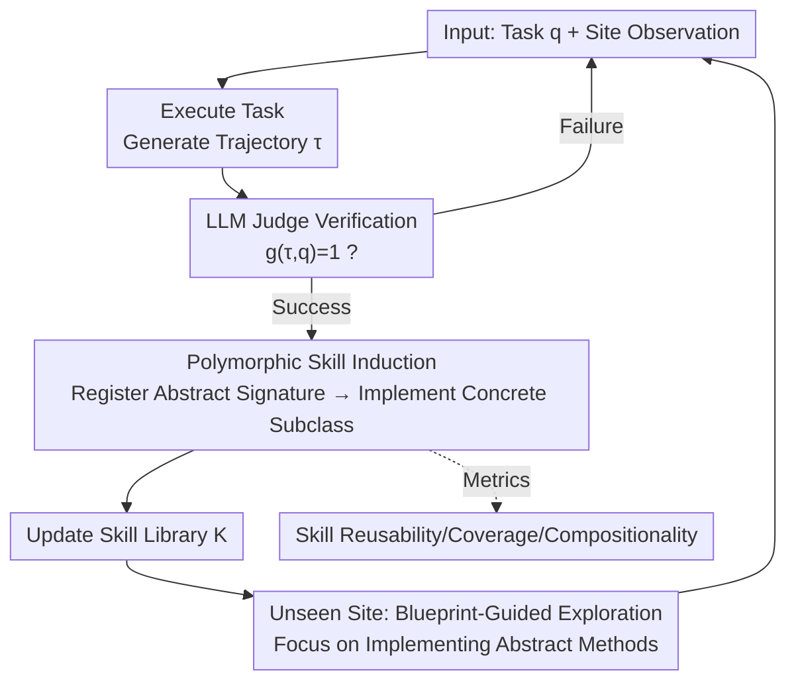

# PolySkill: Learning Generalizable Skills through Polymorphic Abstraction for Continual Agents

**Conference**: ICLR 2026  
**OpenReview**: [https://openreview.net/forum?id=KdEsujyiSV](https://openreview.net/forum?id=KdEsujyiSV)  
**Code**: https://github.com/simonucl/PolySkill  
**Area**: Agent  
**Keywords**: Web Agents, Skill Induction, Continual Learning, Polymorphic Abstraction, Cross-site Generalization

## TL;DR
PolySkill introduces the concept of "polymorphism" from software engineering into Web agent skill learning: using an abstract domain class to define "what to do" (e.g., `search_product`), while site-specific subclasses implement "how to do it." This approach enables cross-site skill reuse—improving skill reusability by 1.7x on known sites, increasing success rates by up to 13.9% on unseen sites, and reducing steps by over 20%, while successfully mitigating catastrophic forgetting in continual learning.

## Background & Motivation

**Background**: LLM-driven Web agents perform user-specified tasks on various graphical user interfaces (GUIs). A promising direction is "skill induction"—extracting reusable skills from past successful interaction trajectories. Voyager first validated this in open environments, Agent Workflow Memory introduced it to Web agents (using natural language descriptions), and subsequently, ASI (Agent Skill Induction) and SkillWeaver further structured skills as executable code for improved robustness.

**Limitations of Prior Work**: Existing methods almost exclusively focus on "same site, cross-task" settings. To maximize performance on familiar sites, they generate skills that are heavily "overfitted" to specific sites—hard-coding element localization logic for specific pages, which fails immediately on sites with different layouts. Empirical tests by the authors show that ASI's skill reusability on unseen sites is below 9%, and SkillWeaver's is less than 3%. Moreover, as SkillWeaver continues to explore, it generates increasingly complex and specialized tasks, leading to unstable or regressive learning curves.

**Key Challenge**: There is a fundamental tension between skill "specificity" and "generalizability." Existing methods store skills as isolated scripts, lacking a mechanism to decouple "semantic intent" from "concrete implementation." A hard-coded script serves as both the goal and the implementation, making it impossible to modify or recombine in a principled way.

**Goal**: (1) Induce skills capable of migrating across different websites; (2) Quantitatively measure skill migration and reuse beyond simple task success rates.

**Key Insight**: The authors leverage the enduring concept of "polymorphism" from object-oriented design, which was inherently created to "manage implementation differences while maintaining stable interfaces." Mapping this to agent skills: the goal of "searching for a product" on a shopping site remains stable; only the specific buttons to click or boxes to fill on Amazon versus Target change.

**Core Idea**: Replace "hard-coded monolithic scripts" with a polymorphic hierarchy of "abstract goals / concrete implementations." This allows agents to operate at the abstract level while adapting at the concrete level, resulting in cross-site reusable and composable skills.

## Method

### Overall Architecture

PolySkill models the agent in a Partially Observable Markov Decision Process (POMDP) $\langle S, A_p, T, \Omega, O \rangle$: $A_p$ represents atomic actions on the page (e.g., `click`, `type`). The agent only receives observations $o_t$ (accessibility tree + screenshot) rather than the full state $S$. Driven by an LLM policy $\pi_L$, its action space is expanded by a dynamic skill library $K_t$: $A_t = A_p \cup K_t$, where each skill $k(\text{args}) := a_1 \oplus \cdots \oplus a_n$ is a parameterized sequence of actions. The objective is to induce an efficient skill library that maximizes reward with a trajectory length penalty: $\max_{\pi_L, K} \mathbb{E}_{q \sim Q}[g(\tau, q) - \gamma|\tau|]$. The penalty $\gamma|\tau|$ encourages the creation of compact, reusable skills.

The pipeline consists of three complementary stages: **Skill discovery via polymorphic abstraction → Skill refinement via compositional verification → Skill deployment via adaptive execution**. Specifically (see Algorithm 1), the agent executes tasks sequentially. For each task, it generates a trajectory $\tau$ using the current $A_t$. An LLM judge $V_L$ verifies success. Only upon success does "polymorphic skill induction" occur: the successful trajectory is refined into hierarchical skills (registering method signatures in an abstract class, then filling implementations in site subclasses). If the task fails, the library remains unchanged. When the agent encounters a new site in a known domain, it invokes the existing abstract blueprint to focus its exploration on "how to implement these abstract methods on the new site."

### Key Designs

**1. Polymorphic Skill Abstraction: Decoupling Goals from Implementation via Classes**

This is the core of the work. Existing scripts bound to specific site UIs are useless when the site changes. PolySkill organizes skills into "domain-driven hierarchies": an abstract class (e.g., `AbstractShoppingSite`) defines high-level method signatures—`search_product(query)`, `add_to_cart(item_id, quantity)`, `checkout()`—acting as the "schema/blueprint" for the domain. Specific sites like Amazon and Target act as concrete subclasses (`AmazonSite`, `TargetSite`) that inherit and provide site-specific implementations. The key advantage is that "compositional skills" only need to be defined once in the abstract parent class: e.g., `purchase_item` calls `find_and_add_to_cart` then `checkout`, which in turn call the abstract `search_product`. Consequently, **compositional logic does not need to be re-implemented when switching sites**; only the underlying abstract methods need new implementations.

**2. Polymorphism-Guided Skill Induction: Registering Signatures Before Implementations**

Providing the data structure is insufficient; the induction process must follow it. PolySkill builds on ASI's robust verification pipeline. After a task succeeds using atomic actions, an LLM module proposes programmatic skills. Before inclusion, the agent "verifies" the new skill by re-executing the task; only if it succeeds is the skill added. PolySkill "polymorphizes" this: if the agent enters a new domain, it must first induce `AbstractShoppingSite` to provide common signatures. When inducing skills for a specific site (e.g., amazon.com), it is guided to **first register the corresponding function signature in the abstract class, then define the concrete implementation in the site subclass**. This forces the agent to learn "structurally consistent implementations" of domain-level concepts rather than locally valid fragments.

**3. Blueprint-Guided Exploration on Unseen Sites: Abstract Methods as Curricula**

The polymorphic structure makes learning on new sites in known categories much more efficient. If the agent has already formed an `AbstractShoppingSite` from amazon.com and then visits walmart.com, it identifies Walmart as a shopping site and retrieves the abstract blueprint. This provides a clear set of exploration goals—the agent doesn't need to try actions randomly; it knows it needs to figure out how to implement `search_product` and `add_to_cart` on this specific site. Once documented, the standard induction process creates the `WalmartSite` subclass. In "task-agnostic continual learning," this structured exploration is crucial: learned abstract domain classes act as schemas, providing strong priors for which skills are worth discovering.

**4. Three New Evaluation Metrics: Quantifying Skill Reuse**

The authors argue that "final task success rate" masks whether the agent successfully reused skills or solved the task from scratch. Beyond "Success Rate (SR)" and "Steps," they introduce: **Skill Reusability**, measuring how often skills are reused in new tasks; **Task Coverage**, measuring the proportion of tasks where at least one skill was used; and **Skill Compositionality**, measuring how frequently existing skills are used as building blocks for complex tasks. These metrics revealed that prior methods have less than 18% skill reusability on unseen sites, while PolySkill reaches 31%.

### A Complete Example

In a shopping domain continual learning scenario: The agent initializes its library on WebArena shopping tasks and induces the `AbstractShoppingSite` class. As it updates online to Amazon and Target, it uses the abstract blueprint to focus exploration on implementing `search_product`. Since the `purchase_item` compositional skill is in the parent class and depends only on abstract methods, it doesn't need re-writing. In Mind2Web Cross-task settings, PolySkill + Update achieves a 63.2% success rate with only 47 skills, whereas ASI + Update requires 66 skills to reach 59.4%. Furthermore, after adapting to Amazon and Target, PolySkill maintains its performance on the original WebArena tasks, whereas ASI suffers from catastrophic forgetting, giving PolySkill a +4.9% advantage.

## Key Experimental Results

### Main Results

Evaluated on Mind2Web (137 sites, 31 domains, 2350 tasks across cross-task/cross-website/cross-domain levels) using GPT-4o (Success Rate Acc↑ / Skill Count #Skill↓):

| Method | Cross-task Acc | Cross-task #Skill | Cross-Website Acc | Cross-Domain Acc |
|------|------|------|------|------|
| Baseline (No Skills) | 53.8 | – | 56.2 | 62.3 |
| ASI (Static) | 52.3 | 50 | 54.9 | 57.3 |
| **PolySkill (Static)** | **55.4** | **43** | **57.6** | **60.1** |
| ASI + Update | 59.4 | 66 | 58.7 | 62.1 |
| **PolySkill + Update** | **63.2** | **47** | **61.3** | **63.4** |

PolySkill consistently outperforms ASI with fewer skills. The online update version achieves SOTA across all settings, with the most significant gains in the difficult Cross-Domain setting. On Qwen2.5-Coder, PolySkill + Update improves Cross-task Acc from 41.5% to 47.5%, proving the method is not limited to closed-source models.

### Continual Learning / Task-Agnostic Exploration

| Setting (Shopping Domain, SR% / Skill Usage%) | WA Shopping | AMZ | Target |
|------|------|------|------|
| Baseline | 37.4 / – | 47.3 / – | 60.5 / – |
| Single-domain Expert (Target only) | 38.0 / 2.1 | 48.5 / 3.5 | 77.0 / 52.1 |
| SkillWeaver* (150 rounds) | 39.8 / 8.6 | 64.4 / 25.2 | 74.2 / 18.3 |
| **Self-guided Exploration (PolySkill)** | **43.1 / 14.6** | 66.7 / 36.4 | 75.2 / 19.4 |

Self-guided PolySkill achieves the highest generalized success rate (43.1%) on the held-out WA Shopping domain. In developer platforms (GitLab/GitHub), it similarly outperforms others, proving it can master multiple domains simultaneously.

### Key Findings
- **Negative correlation between reusability and steps**: As skill reusability increases from 0% to 20%+, average steps drop from approx 6.1 to 3.3–4.4.
- **Fewer skills + Higher accuracy = True Polymorphism**: PolySkill achieves higher accuracy with a smaller library, distilling logic into reusable polymorphic skills rather than memorizing redundant subroutines.
- **Anti-catastrophic forgetting**: Performance remains stable on original tasks after adapting to new sites, outperforming ASI by +4.9% due to knowledge being stored in stable abstract interfaces.

## Highlights & Insights
- **Mapping "Polymorphism" to Agent Skills**: The analogy is not just decorative; it is directly integrated into induction prompts and data structures, making generalization an architectural necessity rather than an accident.
- **Diagnostics via Metrics**: Skill Reusability/Coverage/Compositionality pull the "black box" of skill usage into the light, allowing the quantitative diagnosis of overfitting in prior work.
- **Structured Exploration replaces Manual Curricula**: Abstract blueprints provide strong priors for autonomous discovery, making self-generated goals more directed than the unstructured exploration of SkillWeaver.

## Limitations & Future Work
- **Dependency on category identification**: Benefits rely on correctly categorizing a site. In entirely new structures with no shared schema, blueprint guidance is less effective.
- **Induction Quality**: The quality of abstract classes depends on LLM induction. Poor signature design (too coarse/fine) can contaminate subsequent subclass implementations.
- **Judge Dependency**: Success verification relies on the GPT-4o judge (approx. 85% agreement with humans).
- **Efficiency as a Prompt, not a Loss**: The trajectory length penalty is used to guide prompts rather than as a true optimized loss function.

## Related Work & Insights
- **vs ASI (Agent Skill Induction)**: PolySkill improves on ASI's flat script storage by enforcing "signature first, implementation second" induction, resulting in fewer skills and better accuracy.
- **vs SkillWeaver**: PolySkill uses abstract blueprints to structure exploration, leading to more transferable skills compared to SkillWeaver's increasingly specialized tasks.
- **vs Voyager**: Unlike Voyager's concrete fragments, PolySkill introduces polymorphic layers for principled combination and cross-site reuse.

## Rating
- Novelty: ⭐⭐⭐⭐⭐ Systematically applies polymorphism to agent skill induction with new quantifiable metrics.
- Experimental Thoroughness: ⭐⭐⭐⭐ Covers multiple benchmarks and models, though some results are presented via charts rather than raw values.
- Writing Quality: ⭐⭐⭐⭐ Clear chain of logic from motivation to method.
- Value: ⭐⭐⭐⭐⭐ Provides a robust, composable, and anti-forgetting skill representation for continual Web agents.

<!-- RELATED:START -->

## Related Papers

- [\[ICML 2026\] Position: Modular Memory is the Key to Continual Learning Agents](../../ICML2026/llm_agent/position_modular_memory_is_the_key_to_continual_learning_agents.md)
- [\[ICLR 2026\] WebSeer: Training Deeper Search Agents through Reinforcement Learning with Self-Reflection](webseer_training_deeper_search_agents_through_reinforcement_learning_with_self-r.md)
- [\[CVPR 2026\] CGL: Advancing Continual GUI Learning via Reinforcement Fine-Tuning](../../CVPR2026/llm_agent/cgl_advancing_continual_gui_learning_via_reinforcement_fine-tuning.md)
- [\[ICLR 2026\] GUI-Shift: Enhancing VLM-Based GUI Agents through Self-supervised Reinforcement Learning](gui-shift_enhancing_vlm-based_gui_agents_through_self-supervised_reinforcement_l.md)
- [\[ICLR 2026\] NewtonBench: Benchmarking Generalizable Scientific Law Discovery in LLM Agents](newtonbench_benchmarking_generalizable_scientific_law_discovery_in_llm_agents.md)

<!-- RELATED:END -->
