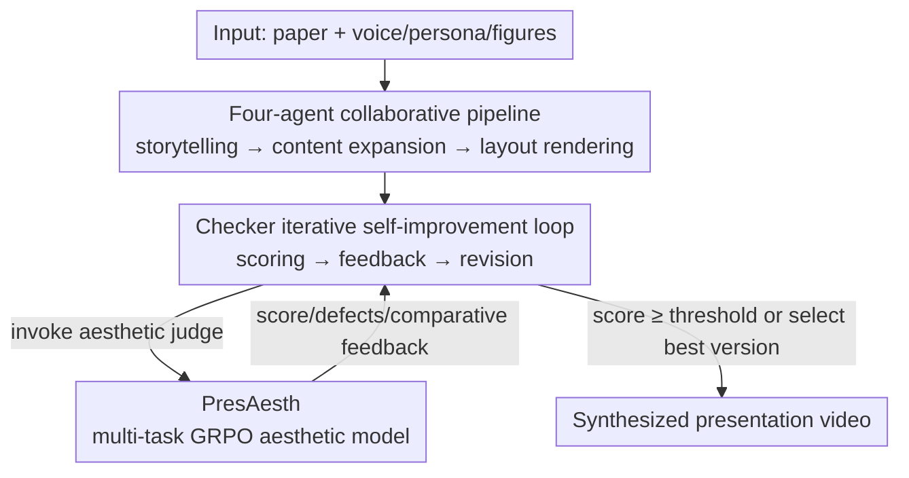

# Presenting a Paper is an Art: Self-Improvement Aesthetic Agents for Academic Presentations

**Conference**: ICLR 2026  
**OpenReview**: [https://openreview.net/forum?id=8NXCwNjFNR](https://openreview.net/forum?id=8NXCwNjFNR)  
**Project Page**: [https://evopresent.github.io/](https://evopresent.github.io/)  
**Code**: To be confirmed  
**Area**: Agent / Multimodal / Reinforcement Learning  
**Keywords**: Academic Presentation Generation, Multi-Agent, Aesthetic Evaluation, Multi-task GRPO, Self-improvement

## TL;DR
EvoPresent connects four agents—Storyline, Scholar, Design, and Checker—into a "draft-feedback-revision" self-improvement pipeline, transforming papers into narrative-driven, aesthetically pleasing presentation videos with virtual explanations. Its core is PresAesth, an aesthetic model trained via multi-task reinforcement learning, which provides reliable scoring, defect diagnosis, and comparative feedback, enabling the system to iterate autonomously with minimal labeled data.

## Background & Motivation
**Background**: As academic communication increasingly moves online, creating slides, posters, and presentation videos to expand research visibility has become essential. Existing automation work generally follows two paths: paper-to-slide (e.g., PPTAgent, PresentAgent) and paper-to-poster (e.g., Paper2Poster), which extract content into templates.

**Limitations of Prior Work**: The authors identify three primary issues with current methods. First, **Stiff Narratives**: they directly extract text segments without re-organizing them into a coherent storyline, making it hard for the audience to follow the logic. Second, **Rigid Designs**: reliance on fixed templates leads to inflexible layouts and poor aesthetics. Third, **Lack of Self-improvement Mechanisms**: systems either lack a checker or use a simple VLM-as-judge, which possesses weak aesthetic perception and unstable judgment, making the system highly dependent on manual adjustments.

**Key Challenge**: The authors point out a simple yet critical principle: "there is no way to improve it when you cannot evaluate it right." The bottleneck of presentation quality lies not in "generation capability" but in "reliable evaluation of aesthetics." Existing aesthetic evaluation methods are mostly designed for natural images and perform poorly in the highly subjective and complex design space of slides. Consequently, the self-improvement loop lacks a crucial "referee."

**Goal**: To develop a presentation generation system that ensures narrative coherence and aesthetic beauty while being capable of self-iteration with minimal aesthetic annotations, accompanied by a benchmark to systematically measure "generation quality" and "aesthetic perception."

**Core Idea**: Train a standalone multi-task reinforcement learning model, PresAesth (integrating scoring, defect diagnosis, and pairwise comparison), and embed it into a four-agent pipeline. This "draft-feedback-revision" closed-loop drives system self-improvement—accurate evaluation leads to successful refinement.

## Method

### Overall Architecture
The input to EvoPresent is a paper (PDF) plus optional voice, persona, or image assets. The output is an academic presentation video with scripts and virtual explanations. The pipeline connects four agents in sequence with an iterative self-improvement loop: the **Storyline Agent** deconstructs the paper into thematic chapters and re-organizes them into a coherent narrative with scripts; the **Scholar Agent** supplements academic information and visual materials using external knowledge retrieval and image generation tools; the **Design Agent** handles layout planning and style rendering to produce initial slides and video frames; the **Checker Agent** calls the PresAesth model to score slides, diagnose defects, and provide revision feedback for several iterations until the aesthetic threshold is met. PresAesth is trained offline using multi-task GRPO as the presiding "referee" throughout the checking process.

### Key Designs

**1. Four-Agent Collaborative Draft-Feedback-Revision Pipeline: Decoupling Generation into Specialized Roles**

Addressing the "stiff narrative" and "rigid design" issues, the authors abandoned the single large model approach in favor of three serial generation agents. The **Storyline Agent** uses Marker to extract text and tables into a unified repository, then performs four tasks: segmenting the paper by theme, re-synthesizing text into chapters with key arguments, associating visual elements with content, and generating full scripts—addressing narrative coherence. The **Scholar Agent** enhances the storyline with arXiv metadata and citation-parsing tools (MCP) for knowledge expansion, while using GPT-4o and Qwen-Image to generate impactful visuals. The **Design Agent** consists of a Layout Planner and a Style Render. The Planner creates a balanced initial layout (to prevent unguided layout drift), while the Render selects styles from a CSS library to apply colors, fonts, and backgrounds, maintaining design flexibility. The choice of HTML over PPTX provides the necessary layout agility and aesthetic control.

**2. PresAesth: Transforming "Subjective Aesthetics" into Verifiable Rewards via Multi-task GRPO**

This is the core of the paper, directly addressing the principle that "evaluation precedes improvement." The authors define slide aesthetic perception through three shared-principle tasks: **Scoring** (overall quality from 1–10); **Defect Adjustment** (identifying specific issues in composition, typography, or visualization and providing feedback); and **Comparison** (judging the better version between two revisions). Built on Qwen-2.5-VL-7B, it uses GRPO (Group Relative Policy Optimization) for joint multi-task training. The authors emphasize using RL over SFT, as RL allows the model to explore and form reasoning chains that provide both judgments and rationales; furthermore, GRPO's group comparison naturally aligns with how humans perform aesthetic judgment. The rewards are two-fold: **Format Rewards** for following `<think>` and `<answer>` tag structures, and **Accuracy Rewards** $r_{acc}$ specific to the task:

$$r_{acc}=\begin{cases}\mathbb{I}(o_{comp}=y_{comp}) & \text{Comparison Task}\\ \mathbb{I}(F_1(f(o_{def}),y_{def})>\alpha) & \text{Diagnosis Task}\\ \mathbb{I}(|o_{score}-y_{score}|<\zeta) & \text{Scoring Task}\end{cases}$$

where $\mathbb{I}(\cdot)$ is the indicator function, $f(\cdot)$ parses textual feedback into defect categories, and $\alpha, \zeta$ are tolerance thresholds. The total reward for the $i$-th response is $r^{(i)}=r^{(i)}_{fmt}+r^{(i)}_{acc}$. This allows the model to provide reliable scores and actionable feedback, turning "subjective aesthetics" into a signal for agent self-improvement.

**3. Checker Agent’s Iterative Loop: Ensuring Convergence via Scoring Gating, Rollback, and Best-Selection**

PresAesth is embedded into a stable iteration mechanism. Per Algorithm 1: in each round, the current slide $S^{(t)}$ is scored. **If the score exceeds a threshold (default 8.0), it terminates early**; otherwise, it is passed to the Layout Planner for revision. Two robustness features are used—**Rollback**: if the current score is lower than the previous one ($Score^{(t)} < Score^{(t-1)}$), it reverts to the previous version to avoid deterioration; and **Best-Selection**: if the target score is not met after $T$ rounds, the version with the highest historical score $S_{best}$ is output. The final slides are synchronized with TTS audio for video synthesis.

**4. EvoPresent Benchmark: Evaluating Generation Quality and Aesthetic Perception**

To address existing evaluation gaps, the authors developed a dual-track benchmark. The **Generation Quality** part covers 650 top-tier conference papers (13,000 slides across CV/NLP from 2023–2025), each with professional annotations. Evaluation occurs at both a global level (Perplexity, ROUGE-L for content; Layout Balance, PresAesth score for design) and a fine-grained level (VLM-as-judge on eight dimensions). The **Aesthetic Perception** part uses 2,000 slide pairs (6,000 slides) with controlled perturbations (layout/style changes) to support the joint training and testing of the scoring, diagnosis, and comparison tasks.

### Loss & Training
PresAesth follows the GRPO loss function (consistent with Shao et al. 2024, including KL regularization). Based on Qwen-2.5-VL-7B, it is optimized on 1,600 training pairs. The generation agents are not trained; they use off-the-shelf LLMs (GPT-4o, Claude-4, etc.) as backbones, driven by the pipeline structure and PresAesth feedback.

## Key Experimental Results

### Main Results (Generation Quality, excerpt from Table 2)

| Method | PPL ↓ | ROUGE-L ↑ | Balance ↑ | Aesth. ↑ | Overall ↑ |
|------|-------|-----------|-----------|----------|-----------|
| Slides+Scripts (Oracle) | 16.64 | 20.53 | 0.82 | 8.50 | 4.01 |
| GPT-4o (End-to-End HTML) | 24.32 | 12.59 | 0.70 | 7.05 | 3.58 |
| PresentAgent-4o (Multi-agent) | 22.80 | 12.69 | 0.68 | 7.42 | 3.75 |
| Paper2Poster-4o | 22.23 | 13.64 | 0.71 | 7.65 | 3.76 |
| **Ours-4o** | 20.00 | 14.68 | 0.67 | 7.82 | 3.82 |
| **Ours-claude-4** | **18.57** | **16.78** | **0.78** | 8.05 | **3.90** |

Compared to the base GPT-4o, EvoPresent-4o reduces perplexity by ~17% and increases the overall score from 3.58 to 3.82. Using Claude-4 as a backbone achieves an overall score of 3.90 and an aesthetic score of 8.05, approaching the Oracle upper bound. A trade-off was observed: reasoning models (DeepSeek-R1, GPT-5) excel visually but produce more redundancy, resulting in higher perplexity.

### Aesthetic Perception (Table 3, 400 test pairs)

| Method | Scoring MAE ↓ | Adjustment Avg-F1 ↑ | Comparison Acc ↑ |
|------|---------------|---------------------|------------------|
| GPT-4o | 1.64 | 0.386 | 0.771 |
| Claude-4-sonnet | 1.61 | 0.386 | 0.695 |
| GPT-5 | 1.39 | 0.386 | 0.597 |
| **PresAesth (Ours, 7B)** | **1.33** | **0.389** | **0.878** |

The 7B PresAesth model outperforms closed-source models across all tasks: Scoring MAE is ~18% lower than GPT-4o/Claude, and Comparison Accuracy reaches 87.8%, ~40 percentage points higher than competitors.

### Ablation Study

| Scholar | Design | Checker | Content ↑ | Design ↑ | Aesth ↑ |
|---------|--------|---------|-----------|----------|---------|
| ✗ | ✓ | ✓ | 3.40 | 3.73 | 7.53 |
| ✓ | ✗ | ✓ | 3.91 | 3.35 | 7.03 |
| ✓ | ✓ | ✗ | 3.91 | 3.54 | 6.40 |
| ✓ | ✓ | ✓ | 3.91 | 3.73 | 7.53 |

| Training Strategy | Scoring MAE ↓ | Adjustment F1 ↑ | Comparison Acc ↑ |
|----------|---------------|------------------|------------------|
| Scoring Only (GRPO) | 1.42 | 0.370 | 0.550 |
| Comparison Only | 1.79 | 0.373 | 0.719 |
| Multi-Task SFT | 1.73 | 0.334 | 0.872 |
| **Multi-Task GRPO** | **1.33** | **0.389** | 0.878 |

### Key Findings
- **Specialized Roles**: Removing Scholar drops content scores from 3.91 to 3.40; removing Design drops design scores by ~10.2%; removing Checker drops design by ~5.1% and aesthetics by ~15%.
- **Multi-task Synergies**: Single-task GRPO underperforms PresAesth, confirming that aesthetic principles like balance and consistency are shared across tasks; Multi-task SFT fails to provide actionable feedback despite decent comparison accuracy.
- **Feedback Quality**: High-quality feedback enables faster convergence with fewer iterations; a model's intrinsic generation capability does not necessarily correlate with its self-correction capability.

## Highlights & Insights
- **"Evaluation Precedes Improvement" as an Architectural Principle**: The system bottleneck is precisely localized to "aesthetic refereeing," which is then resolved via a dedicated RL-trained model.
- **Multi-task RL for Subjective Reward**: By turning subjective aesthetic principles into verifiable 0/1 signals for GRPO, this methodology can be transferred to other "hard-to-quantify" generation tasks like web or UI design.
- **Robust Iteration Loop**: Features like rollback and best-selection ensure that multi-round iterations proceed monotonically, preventing the system from diverging.
- **Benchmark Value**: The large-scale benchmark containing 650 papers and 2,000 perturbed slide pairs fills a significant gap in the field.

## Limitations & Future Work
- **Reliance on VLM-as-Judge**: Fine-grained 8-dimensional evaluation still depends on general VLMs, which remain somewhat unstable for aesthetic perception.
- **Backbone Dependency**: The agents are not fine-tuned, meaning the system's quality ceiling is heavily influenced by the capabilities of the underlying LLM (e.g., Claude-4 vs GPT-4o).
- **Subjectivity of Aesthetic Annotation**: The 1,600 pairs relied on a small pool of annotators; cross-cultural and cross-domain aesthetic consistency requires further validation.

## Related Work & Insights
- **vs PPTAgent / PresentAgent**: These rely on direct extraction and fixed templates, leading to stiff narratives and rigid layouts. EvoPresent uses a Storyline Agent for reorganization and a Design Agent for flexible layout.
- **vs Paper2Poster**: While it has a VLM checker, it requires heavy manual intervention and is limited to static posters. EvoPresent utilizes a specialized PresAesth referee and generates full video presentations.
- **vs General Photographic Aesthetic Assessment**: Existing methods are suited for natural images but fail in the complex design and information hierarchy required for slides. PresAesth is specifically optimized for academic visual design through multi-task RL.

## Rating
- Novelty: ⭐⭐⭐⭐⭐ First self-improvement multi-agent framework for academic presentations with RL-based aesthetic verification.
- Experimental Thoroughness: ⭐⭐⭐⭐⭐ Large-scale benchmark, multiple backbone comparisons, dual-level ablations, and human preference studies.
- Writing Quality: ⭐⭐⭐⭐ Clear framework and motivation; logic is well-sustained.
- Value: ⭐⭐⭐⭐⭐ The "eval-first" paradigm and aesthetic RL recipe provide universal insights for generative tasks.

<!-- RELATED:START -->

## Related Papers

- [\[CVPR 2026\] Paper2Figure: A Multi-Agent Collaborative System for Figure Generation Towards Academic Research Paper](../../CVPR2026/llm_agent/paper2figure_a_multi-agent_collaborative_system_for_figure_generation_towards_ac.md)
- [\[ACL 2025\] PaSa: An LLM Agent for Comprehensive Academic Paper Search](../../ACL2025/llm_agent/pasa_an_llm_agent_for_comprehensive_academic_paper_search.md)
- [\[ICLR 2026\] Darwin Gödel Machine: Open-Ended Evolution of Self-Improving Agents](darwin_gödel_machine_open-ended_evolution_of_self-improving_agents.md)
- [\[ICLR 2026\] ReVeal: Self-Evolving Code Agents via Reliable Self-Verification](reveal_self-evolving_code_agents_via_reliable_self-verification.md)
- [\[ACL 2025\] Gödel Agent: A Self-Referential Agent Framework for Recursive Self-Improvement](../../ACL2025/llm_agent/gödel_agent_a_self-referential_agent_framework_for_recursive_self-improvement.md)

<!-- RELATED:END -->
