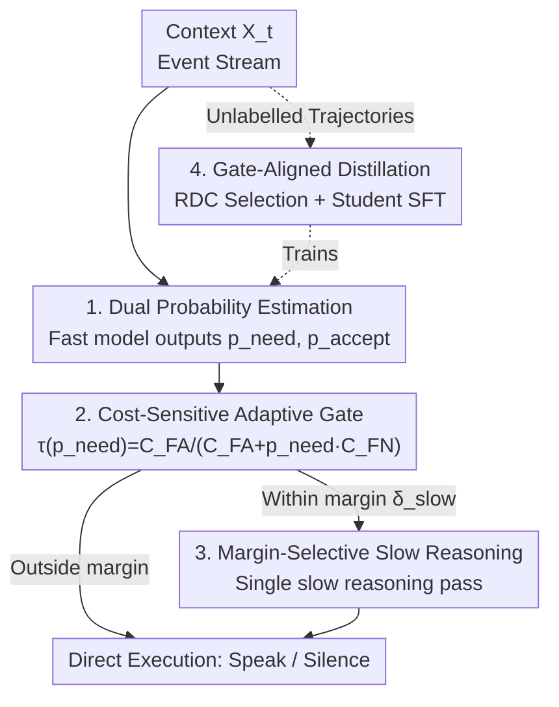

# PRISM: Festina Lente Proactivity—Risk-Sensitive, Uncertainty-Aware Deliberation for Proactive Agents

**Conference**: ICLR 2026  
**OpenReview**: [https://openreview.net/forum?id=rH6IsmeJrv](https://openreview.net/forum?id=rH6IsmeJrv)  
**Code**: https://prism-festinalente.github.io/  
**Area**: Agent  
**Keywords**: Proactive agents, cost-sensitive gating, selective slow reasoning, calibrated probabilities, knowledge distillation

## TL;DR
PRISM models the decision of "whether a proactive agent should speak" as a **cost-sensitive selective intervention problem**. It first estimates two calibrated probabilities—"whether the user needs help" and "whether the user will accept"—and uses an adaptive threshold derived from false alarm/missed detection costs for gating. A single "slow reasoning" pass is triggered only near the decision boundary. By employing gate-aligned distillation to train student models, PRISM reduces the false alarm rate by 22.78% and improves F1 by 20.14% on PROACTIVEBENCH.

## Background & Motivation
**Background**: Proactive agents act before being prompted by the user, yet they must avoid being intrusive. this constitutes a sequential decision of "speak or remain silent," where the costs of false alarms (interrupting the user/eroding trust) and missed detections (missing opportunities to help) are asymmetric.

**Limitations of Prior Work**: Existing systems typically rely on **fragile ad hoc thresholds** to decide when to intervene or **default to long chain-of-thought reasoning** for all events. The former lacks controllable knobs for the cost-benefit trade-off, while the latter wastes expensive compute on simple, obvious scenarios.

**Key Challenge**: Current methods **decouple "acceptability optimization" and "timing control" into independent logics**—prompts and output formats are tuned offline, followed by an additional layer of heuristic rules for "when to speak." This blurs the boundary between the learned policy and product control knobs, weakening controllable guarantees for the quality-efficiency trade-off. Ultimately, timing has not been integrated into a unified, interpretable decision framework.

**Goal**: To unify proactive intervention into a decision-theoretic problem where "need" and "acceptance" are modeled simultaneously. This ensures gating, costs, and slow reasoning follow the same set of explicit rules and aligns the training objective with the deployment architecture.

**Key Insight**: Borrowing the concept of *festina lente* ("make haste slowly"), the agent should be **gated by expected utility** and only invoke slow reasoning within a narrow, ambiguous, high-risk margin near the decision boundary, concentrating compute where it is most likely to change the outcome.

**Core Idea**: Timing decisions are expressed as selective decisions based on two calibrated probabilities ($p_{\text{need}}$, $p_{\text{accept}}$), gated by cost-derived adaptive thresholds, with a single slow reasoning pass triggered only near the boundary. Training reuses the same costs, gating, and margins to shape learning signals.

## Method

### Overall Architecture
PRISM (Proactive Risk Sensitive Intervention with a Slow mode Margin) treats proactive intervention at each time step $t$ as a cost-sensitive selective decision. Given context $X_t$, a **fast model** estimates two calibrated probabilities: $p_{\text{need},t} = \Pr(\text{Needs help} \mid X_t)$ and $p_{\text{accept},t} = \Pr(\text{Offer accepted} \mid X_t, \text{Intervention})$. A **cost-sensitive gate** then compares the acceptance probability with a dynamic threshold $\tau(p_{\text{need},t})$ to decide whether to intervene. Only when the fast model's initial estimate **falls within a narrow margin $\delta_{\text{slow}}$ near the decision boundary** (indicating ambiguity or high risk) is a stronger **slow reasoning** pass triggered for re-evaluation. On the training side, a teacher model running the full PRISM pipeline generates executable supervision on unlabelled interaction trajectories. The student model is trained via "Decision Consistency Filtering + Supervised Fine-Tuning" (SFT), where the student's response strategy is explicitly decoupled from the intervention gate for post-hoc adjustability and auditing.

### Key Designs

**1. Decoupling Need and Acceptance: Distinguishing "Should Help" from "Want Help"**

A common failure mode for proactive agents is "over-proactivity"—providing suggestions that are **correct but ill-timed**, leading users to accept them while finding them annoying. PRISM attributes this to conflating "whether help is needed" with "whether it will be accepted." It explicitly estimates two separate probabilities $p_{\text{need}}$ and $p_{\text{accept}}$: the former captures objective intervention necessity, while the latter captures subjective user acceptance. Ablation studies (Table 5) show that using only $p_{\text{accept}}$ leads to a catastrophic false alarm rate of 62.50%, whereas using only $p_{\text{need}}$ is safer but overly conservative. **Combining both balances timing and acceptability**, reducing false alarms to 22.94%. This decoupling is key to filtering out "correct but unwanted" proposals.

**2. Cost-Sensitive Adaptive Gating: Dynamic Thresholds Based on Need and Cost**

Static thresholds fail to represent the reality of asymmetric costs between false alarms and missed detections. PRISM uses a dynamic threshold derived explicitly from costs: let $C_{\text{FA}}$ be the cost of a false alarm and $C_{\text{FN}}$ be the cost of a false negative (missed detection). The agent intervenes only if the acceptance probability exceeds the threshold:

$$p_{\text{accept},t} \ge \tau(p_{\text{need},t}) \triangleq \frac{C_{\text{FA}}}{C_{\text{FA}} + p_{\text{need},t}\cdot C_{\text{FN}}}.$$

The elegance of this rule lies in its monotonicity: as the certainty of needing help ($p_{\text{need}}$) increases, the threshold $\tau$ decreases, allowing the agent to **intervene even with a lower acceptance probability**. Conversely, in benign scenarios with low $p_{\text{need}}$ (e.g., a user performing harmless configuration edits), $\tau$ is raised, keeping the gate silent and preventing user interruption. The authors characterize how the threshold shifts monotonically with cost and $p_{\text{need}}$, creating a compact and interpretable mapping from cost knobs to metrics.

**3. Margin-Selective Slow Reasoning: Invoking System 2 Only at Boundaries**

Slow reasoning (counterfactual checks, scratchpad deliberation) is high-quality but expensive and slow. PRISM adopts a dual-process architecture: the fast model provides initial estimates $(p^F_{\text{need},t}, p^F_{\text{accept},t})$. **A single slow reasoning pass is triggered only if the initial estimate falls within a margin near the decision boundary**:

$$|p^F_{\text{accept},t} - \tau(p^F_{\text{need},t})| \le \delta_{\text{slow}},$$

where $\delta_{\text{slow}}$ is a configurable margin. This concentrates extra compute precisely on the boundary zone where it is most likely to change the outcome. With $\delta = 0.1$, only approximately 11% of samples are routed to slow reasoning, yet F1 improves from 83.09% (Fast-only) to 88.15% (+5.06), with P95 latency increasing by only about 20ms—effectively achieving "System 2 quality at System 1 speeds" and defining a Pareto frontier for efficiency.

**4. Gate-Aligned Decision-Consistency Distillation (RDC-SFT): Syncing Training and Deployment**

PRISM ensures that training and deployment share the **same costs, same gating logic, and same slow reasoning margin** to close the sim-to-real gap. A teacher model running the full PRISM pipeline generates dense, executable supervision on unlabelled trajectories. Training data is filtered using a Decision Consistency score $R_{\text{DC}}$, which rewards the teacher for "accepted interventions" and penalizes "miscalibrated probability estimations":

$$R_{\text{DC}} = y_{\text{accept}} - \left(q_{\text{need}} - y_{\text{need}}\right)^2 - \mathbb{1}\{y^{(\text{pred})}_{\text{need}}=1\}\left(q_{\text{accept}} - y_{\text{accept}}\right)^2,$$

where $(q_{\text{need}}, q_{\text{accept}})$ are teacher probabilities and $(y_{\text{need}}, y_{\text{accept}})$ are ground truth labels. The student performs full-parameter SFT on the highest-ranking subset $D^\star$ with the objective $L = L_{\text{need}} + L_{\text{acc}} + L_{\text{burden}}$. $L_{\text{need}}$ and $L_{\text{acc}}$ (using inverse propensity weighting for selection bias) ensure the two probabilities are well-calibrated, while $L_{\text{burden}}$ regularizes false alarm burden and excessive slow reasoning. Crucially, the student's response strategy is **explicitly decoupled from the intervention gate**, allowing the gate to be adjusted or audited at deployment without retraining. Ablation (Table 4) shows RDC-SFT improves F1 by 10.52 points compared to standard SFT on unfiltered data, confirming that data quality and objective structure are the primary drivers.

### Loss & Training
The student model, QWEN3-8B-PRISM, underwent full-parameter SFT on a subset of 1,800 records (less than 1/3 of the original) filtered via RDC from the official training set. The AdamW optimizer was used with a learning rate of $1\times10^{-5}$, a 0.1 warm-up ratio, and a cosine schedule over 3 epochs. The training utilized the Qwen chat template, a 4096-token context, and bf16 precision, with an effective batch size of 4 (per-device 1, gradient accumulation 4) on a single device. Training took approximately 2.5 hours on an A100 (80GB).

## Key Experimental Results

### Main Results
Evaluated on PROACTIVEBENCH (comprising coding, writing, and daily life domains with 233 held-out test clips), using a majority vote of DeepSeek-R1, GPT-4o, and Claude-3.5-Sonnet as the LLM-as-Judge (demonstrating 89.1% agreement with humans, Cohen’s $\kappa = 0.71$).

| Model | Recall ↑ | Precision ↑ | False-Alarm ↓ | F1 ↑ |
|------|------|------|------|------|
| GPT-4o | 98.11% | 48.15% | 51.85% | 64.60% |
| Qwen2-7B-Proactive (Prev. SOTA) | 100.00% | 49.78% | 50.22% | 66.47% |
| DeepSeek-R1 (Teacher) | 98.12% | 72.35% | 27.64% | 83.28% |
| **Qwen3-8B-PRISM** | **98.88%** | **77.05%** | **22.94%** | **86.61%** |

Compared to the previous SOTA, Qwen2-7B-Proactive, F1 improved by over 20 points (66.47 to 86.61), and the false alarm rate was reduced by nearly 54% (50.22 to 22.94) with minimal loss in Recall. Most notably, **the student outperformed the teacher**: with a smaller backbone, it exceeded DeepSeek-R1's Precision by 4.70 points ($p<0.001$) and achieved a significantly lower false alarm rate, a finding corroborated by human expert evaluation (PRISM F1 84.85% vs. Teacher 82.05%).

### Ablation Study

| Configuration | F1 ↑ | False-Alarm ↓ | Note |
|------|------|------|------|
| Only $p_{\text{accept}}$ ($p_{\text{need}}=1$) | 63.19% | 62.50% | Catastrophic false alarm spike |
| Only $p_{\text{need}}$ | 81.72% | 29.10% | Safe but suboptimal |
| Dual signals · Uncalibrated | 85.12% | 25.23% | Already strong |
| **Dual signals · Calibrated (Ours)** | **86.61%** | **22.94%** | Full model |
| Fast-only | 83.09% | 28.92% | No slow reasoning |
| Slow-only (Full Slow) | 86.79% | 24.83% | P95 Latency 312ms |
| **Slow-on-margin ($\delta=0.1$)** | **88.15%** | **21.19%** | ~11% slow reasoning, P95 196ms |

### Key Findings
- **Dual signals are central to reducing false alarms**: Relying solely on $p_{\text{accept}}$ results in a 62.50% false alarm rate because users often accept helpful but ill-timed suggestions; $p_{\text{need}}$ is essential for containment.
- **Margin-selective slow reasoning is a Pareto improvement**: Routing only ~11% of boundary samples to slow reasoning yields quality comparable to full slow reasoning, while P95 latency is only ~20ms higher than Fast-only.
- **Data quality and objective structure dominate training**: RDC selection plus explicit $(p_{\text{need}}, p_{\text{accept}})$ supervision yields an F1 10.52 points higher than standard SFT; techniques like post-hoc reweighting (Weighted-SFT) or probability rescaling (DFT) are less effective under acceptance/timing noise.
- **Cost-sensitive gating requires calibrated signals**: On base models without RDC-SFT, the dynamic $\tau(p_{\text{need}})$ actually underperforms a fixed threshold (F1 70.29 vs. 80.74) due to high noise in $p_{\text{need}}$ near boundaries. Dynamic strategies only surpass fixed thresholds once probabilities are well-calibrated.

## Highlights & Insights
- **Elevating "When to Intervene" to a Decision-Theoretic Problem**: By using an adaptive threshold formula derived from costs, PRISM unifies false alarm/missed detection costs and necessity certainty into an interpretable gate. This paradigm provides better guarantees than "prompt tuning + heuristics."
- **Elegant "Festina Lente" Compute Allocation**: Rather than uniform savings or spending, PRISM uses a margin to concentrate expensive slow reasoning precisely on ambiguous samples. This philosophy is transferable to any system featuring "Dual-process + Selective Deliberation."
- **Training-Deployment Alignment**: Reusing costs, gates, and margins during training isolates real gains from timing/calibration improvements, preventing "phantom gains" caused by interface or prompt mismatches.
- **Student Surpassing Teacher**: By using RDC selection to provide "decision-consistent" trajectories and explicit probability supervision, the small model exceeds its larger teacher in Precision. This suggests that "what is taught" is more critical than "the size of the model teaching it."

## Limitations & Future Work
- Evaluation relies heavily on LLM-as-Judge (despite 89.1% human agreement), and judge bias or overconfidence may propagate into the "ground truth" labels for $p_{\text{need}}$ and $p_{\text{accept}}$.
- Costs ($C_{\text{FA}}$, $C_{\text{FN}}$) and the margin ($\delta_{\text{slow}}$) are human-defined knobs. While the paper identifies "sweet spots" (e.g., $\delta=0.1$), automated tuning for different deployment scenarios remains to be explored.
- The training utilized only 1,800 RDC-selected samples and a single Qwen3-8B backbone. Scalability across larger models/domains and stability under distribution shift require broader validation.
- Slow reasoning is currently limited to a "single re-evaluation." It is unclear if this is sufficient for complex scenarios requiring multi-step reasoning to determine timing.

## Related Work & Insights
- **vs. Proactive Agent / ProactiveBench**: While the latter formalized intervention with acceptance supervision, PRISM goes further by sharing gates, costs, and schemas between training and inference to isolate real timing gains.
- **vs. Reject-Option / Selective Prediction**: PRISM adapts classical cost-sensitive learning principles for proactive timing by "operator-izing" thresholds into slow reasoning zones.
- **vs. Standard RLHF**: RLHF typically optimizes a scalar reward. PRISM estimates dual probabilities $(p_{\text{need}}, p_{\text{accept}})$ and combines them into structured objectives, moving beyond binary rewards to directly parameterize cost-sensitive gates.
- **vs. Protocol-Aligned Distillation**: By using teacher-synthesized event-conditional decisions and invoking slow reasoning scratchpads when uncertain, PRISM ensures reliability gains stem from better timing and calibration rather than format drift.

## Rating
- Novelty: ⭐⭐⭐⭐⭐ Unifies proactive intervention into cost-sensitive selective decision-making with margin-selective slow reasoning; the framework is both concise and original.
- Experimental Thoroughness: ⭐⭐⭐⭐ Includes main results, four sets of ablations, human validation, and Pareto efficiency analysis. However, the backbone and domains are somewhat limited.
- Writing Quality: ⭐⭐⭐⭐ Clear motivation; symbols and knobs are well-explained; the *festina lente* metaphor is effectively integrated.
- Value: ⭐⭐⭐⭐⭐ Highly practical for real-world deployments by making proactive agents precise, compute-efficient, and auditable.

<!-- RELATED:START -->

## Related Papers

- [\[ICLR 2026\] FingerTip 20K: A Benchmark for Proactive and Personalized Mobile LLM Agents](fingertip_20k_a_benchmark_for_proactive_and_personalized_mobile_llm_agents.md)
- [\[NeurIPS 2025\] ContextAgent: Context-Aware Proactive LLM Agents with Open-World Sensory Perceptions](../../NeurIPS2025/llm_agent/contextagent_context-aware_proactive_llm_agents_with_open-world_sensory_percepti.md)
- [\[ICLR 2026\] SimuHome: A Temporal- and Environment-Aware Benchmark for Smart Home LLM Agents](simuhome_a_temporal-_and_environment-aware_benchmark_for_smart_home_llm_agents.md)
- [\[ICLR 2026\] MMSearch-Plus: Benchmarking Provenance-Aware Search for Multimodal Browsing Agents](mmsearch-plus_benchmarking_provenance-aware_search_for_multimodal_browsing_agent.md)
- [\[ICLR 2026\] DreamPhase: Offline Imagination and Uncertainty-Guided Planning for Large-Language-Model Agents](dreamphase_offline_imagination_and_uncertainty-guided_planning_for_large-languag.md)

<!-- RELATED:END -->
