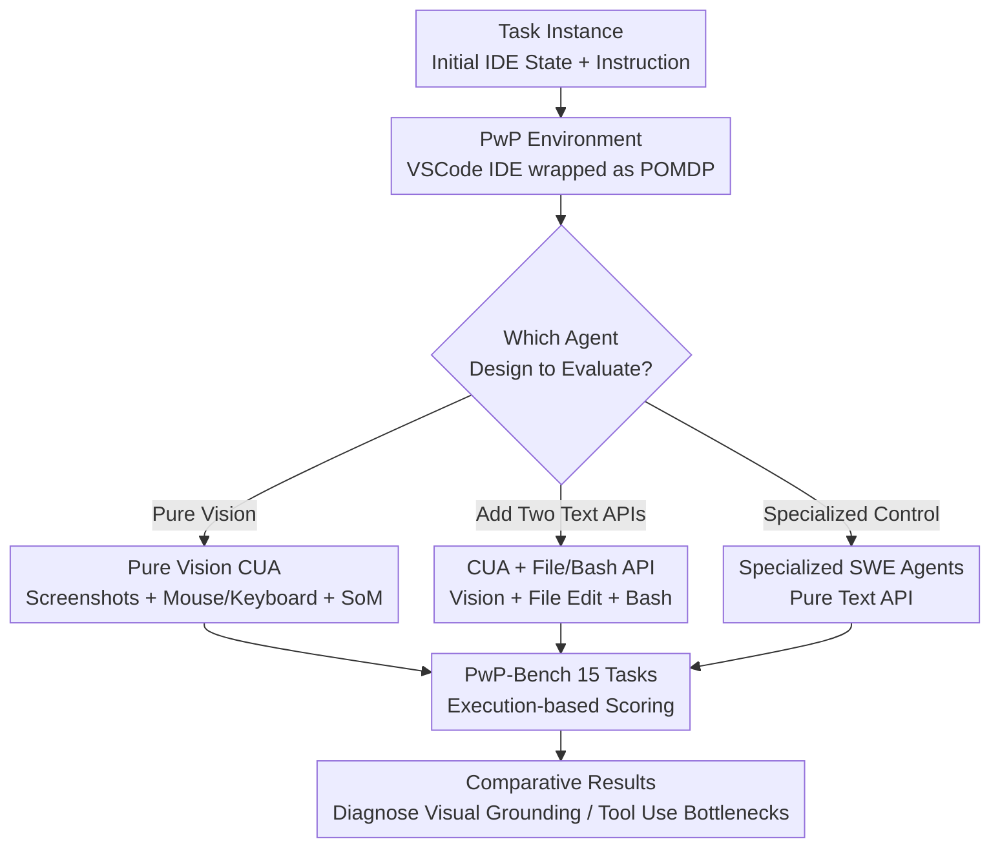

# Programming with Pixels: Can Computer-Use Agents do Software Engineering?

**Conference**: ICLR 2026  
**OpenReview**: [https://openreview.net/forum?id=9N4Ps9Psfr](https://openreview.net/forum?id=9N4Ps9Psfr)  
**Code**: https://programmingwithpixels.com  
**Area**: Agent / Computer-Use Agents / Software Engineering Evaluation  
**Keywords**: Computer-Use Agents, IDE environments, software engineering, visual grounding, benchmark

## TL;DR
The authors constructed PwP (Programming with Pixels), the first "computer-use" environment for software engineering where agents operate VSCode via keyboard/mouse by viewing the screen like humans, and the accompanying 15-task benchmark, PwP-Bench. Systematic evaluation reveals that general Computer-Use Agents (CUA) using pure vision achieve only 22.9% accuracy, significantly underperforming specialized SWE agents; however, providing them with just two text APIs (file editing + bash) jumps accuracy to 50.7%, nearing specialized agents. This indicates the bottleneck is not coding ability, but poor visual grounding and failure to utilize existing IDE tools.

## Background & Motivation

**Background**: Computer-Use Agents (CUA) are highly anticipated for their potential to complete various tasks using only raw actions like clicking, typing, and viewing the screen, thereby eliminating the need for manually designed action interfaces for every task. However, current evaluations are mostly restricted to simple scenarios like web navigation, document editing, or OS setting adjustments (e.g., OSWorld, AndroidWorld, WindowsAgentArena).

**Limitations of Prior Work**: It remains unknown whether performance on these simple tasks transfers to truly complex and professional domains. Simultaneously, the software engineering field has developed numerous "specialized SWE agents" (SWE-agent, Agentless, OpenHands, etc.) that operate via **handcrafted specialized APIs**—SWE-agent uses language-specific parsers and editing commands, while Agentless depends on Python-specific ASTs. Adding tools to these scaffolds requires significant engineering effort and domain knowledge.

**Key Challenge**: General CUAs follow the "operate all tools via the same visual interface like a human" route, while specialized agents follow the "customized text APIs for every operation" route. The former is general but potentially clumsy, while the latter is powerful but non-transferable. These two paradigms have never been directly compared in a fair environment, leaving a fundamental question unanswered: Can general computer-use agents match specialized agents in complex domains like software engineering?

**Goal**: Use software engineering as a litmus test to answer "whether CUAs can do software engineering" and identify their key bottlenecks. SWE was chosen because (1) it has high economic value and practical difficulty, and (2) strong specialized agents exist as control baselines.

**Key Insight**: Rather than creating another text-API agent, the authors build a **real IDE environment** where agents, human developers, and specialized agents access the **exact same** toolset (debuggers, linters, code suggestions, extensions). The only difference is that CUAs access them through a visual interface. This cleanly tests whether visual interaction is sufficient for software engineering.

**Core Idea**: Wrap the entire VSCode IDE as a POMDP environment (PwP), allowing agents to operate via keyboard/mouse and screen observations. Pair this with PwP-Bench, covering 15 SWE task categories across 14 languages with multimodal support, to conduct a unified comparative evaluation of pure-vision CUAs, text-API-augmented CUAs, and specialized SWE agents.

## Method

The "Method" of this paper is essentially a set of **environment + benchmark + evaluation protocols** rather than a specific new model or training algorithm. The overall approach involves abstracting a real IDE into a standard Reinforcement Learning-style environment (input: screenshots/instructions, output: mouse/keyboard actions, reward: test execution results), populating it with 15 task categories, and running three agent designs on the same tasks to diagnose CUA capabilities and bottlenecks based on result differences.

### Overall Architecture

PwP models the IDE and operating system as a Partially Observable Markov Decision Process (POMDP) $\langle S, A, O, T, R\rangle$: state $S$ describes the IDE and OS context (open files, active editor panels, cursor position); action space $A$ comprises all mouse and keyboard events provided by `xdotool` raw syntax; observation $O$ varies by agent configuration (screenshots for pure vision, text output for API-augmented); transitions $T$ are mostly deterministic (typing characters changes the state), though background processes introduce temporal randomness; reward $R$ is defined by the task, such as scores from a test suite after a bug fix. A trajectory mimics real development: the agent fixes bugs in a repo, calls suggestion tools to write code, generates documentation, while the environment tracks changes, runs tests, and returns reward signals.

Above the environment is PwP-Bench: each task provides the agent with an initial IDE state $S_i$ and an instruction $I$, with the goal of reaching an end state $S_f$ evaluated by **execution-based** standards (e.g., unit tests). Tasks are defined by setup scripts for initial states, instructions, and evaluation logic; adding new tasks only requires modifying configuration files. During evaluation, three agent designs run the same tasks for performance comparison.

### Key Designs

**1. PwP Environment: Wrapping a real IDE into a "complete expression, fully-toold" POMDP**

To fairly test if CUAs can perform SWE, the environment must satisfy two conditions: complete expression (agents can complete any SWE task performable in an IDE without language/domain-specific modifications) and fully-toold (agents can access all IDE features like humans, including debuggers, linters, refactoring tools, and extensions). PwP satisfies these using a VSCode-based IDE—since "using IDE features" is essentially "executing a sequence of raw operations," exposing keyboard/mouse actions makes all IDE tools naturally accessible. Implementation-wise, the environment runs in an isolated Docker sandbox, connecting to VSCode via four channels for real-time screen capture, DOM information extraction, and configuration (resolution, CPU/memory limits). It also implements state checkpoints (useful for search/backtracking and RL training) and exposes a gymnasium-style Python API available via `pip install`. This design is "future-adaptive": as IDEs gain stronger tools, the environment automatically incorporates these capabilities without architectural changes.

**2. PwP-Bench: 15 task categories covering SWE depth and breadth**

Measuring only code completion does not represent software engineering; the benchmark must be broad in language, modality, and skill. PwP-Bench contains 15 tasks and 5,400 instances derived from 13 existing code datasets and 2 newly created tasks, spanning 14 programming languages. Selection criteria were: heavy interaction with SWE tools, multi-step nature, and coverage of multiple languages and modalities. Tasks are grouped into four categories: **Code Generation & Editing** (n=6, including HumanEval, SWE-Bench, SWE-Bench-Multilingual, DSBench, Res-Q/CanItEdit); **Multimodal Code Synthesis** (n=4, including Design2Code for UI, Chart2Mimic for chart-to-Python, SWE-Bench-MM, and image/PDF-dependent DSBench); **Domain-Specific Programming** (n=3, including CTF ethical hacking and miniCTX interactive theorem proving, requiring continuous monitoring of IDE goal states, extension installation, and running executables); **IDE-Exclusive & General SWE** (n=2, newly created—IDE Configuration for themes/extensions/preferences, and General-SWE for non-coding activities like profiling, refactoring, standard library bug fixing, UI sketching, and code recovery). Due to the high cost of evaluating 5,400 instances, the authors provide **PwP-Bench-Lite**: a subset of 300 instances (20 random samples per benchmark) that maintains complexity for rapid experimentation.

**3. Three Agent Designs: Isolating bottlenecks via "controlled variables"**

This is the most critical experimental design. The authors evaluate three progressive agents in the same environment: **Pure Vision CUA** only observes screenshots and issues keyboard/mouse actions turn-by-turn; since vision-language models without GUI training fail at raw pixel coordinates, Set-of-Marks (SoM) is added—providing the model with the original image plus parsed UI element representations to allow interaction via element IDs. **CUA + File/Bash API** adds two text APIs to pure vision: file editing (`read file`, `string replace`) and bash command execution; screenshots are obtained on-demand (via a screenshot action), strictly following the Anthropic computer-use implementation. **Specialized SWE Agents** (mini-swe-agent, OpenHands) rely entirely on text APIs, serving as a "ceiling" control; multimodal tasks feed images directly into the prompt. The differences between these designs map exactly to "what capability was added → how much score increased," allowing precise bottleneck attribution: the massive jump from Pure Vision to +Text API indicates the bottleneck is not coding ability, but "visual operation + tool usage." A unified constraint of 20 steps per instance is applied, with final states judged by task metrics upon completion or a stop command.

### A Complete Example

Using Design2Code (convert a UI design image to webpage code) as an example of design differences: **Pure Vision CUA** receives a screenshot, creates a new file in the IDE, locates the editor via keyboard/mouse, types HTML/CSS line-by-line, and opens the VSCode built-in browser live preview to compare its generated page with the reference image for fine-tuning. Claude-Sonnet-4.0 can use basic tools like live preview, achieving 37.3% on multimodal tasks, but clumsy pure-vision editing limits its ceiling. **CUA + File/Bash** still performs 87.5% of interactions via computer-use on this task (due to frequent live preview comparisons), with only 12.5% via file APIs, but accuracy rises to 48.1%. **Assisted (Manual IDE tool calls)** further provides ready-made tool calls for live preview, repo structure, and symbol outlines, pushing Design2Code to 79.5%. The performance nearly doubles for the same model and task based solely on effective tool usage, concretizing the finding that "bottlenecks lie in tool usage rather than coding ability."

## Key Experimental Results

### Main Results

Evaluation of the three agent categories on PwP-Bench-Lite (300 instances, max 20 steps) (values are averages across the four categories):

| Agent Design | Represented Model | Code Gen&Edit | Multimodal | Domain-Spec | General SWE | Overall Avg |
|:---|:---|:---|:---|:---|:---|:---|
| Pure Vision CUA | Claude-Sonnet-4.0 | 14.3% | 37.3% | 6.7% | 40.0% | 22.3% |
| Pure Vision CUA (Best reported) | Claude-Sonnet-4.0 | — | — | — | — | 22.9% |
| CUA + File/Bash | Claude-Sonnet-4.0 | 53.5% | 57.8% | 43.9% | 38.3% | **50.7%** |
| Specialized SWE Agent | mini-swe-agent | 49.4% | 60.3% | 40.0% | 37.5% | 48.8% |
| Specialized SWE Agent | OpenHands | 50.4% | 50.8% | 43.3% | 25.0% | 45.7% |

Core Conclusion: Pure vision CUA peaks at only 22.9%, far below the specialized agent's 48.8%; however, adding two text APIs jumps the score to 50.7%, **outperforming** mini-swe-agent, proving CUAs do not lack coding ability but rather the execution capability to map intentions to the interface.

### Key Analysis Experiments

| Analysis | Key Numbers | Explanation |
|:---|:---|:---|
| Visual Grounding Errors | GPT-4o 20% / Claude-Sonnet-4.0 95% of trajectories have at least one grounding error | CUAs frequently click wrong elements, misinterpret UI states, or hallucinate screen content. |
| Tool Use Prompting (Refactoring) | 25% → 75% | In General-SWE refactoring tasks, accuracy tripled when explicitly prompted to "use rename/move to file". |
| Assisted vs CUA (SWE-Bench/Design2Code/Chartmimic/BIRD) | 0/23.5/2.7/0% → 15/48.1/25.3/7% (+File/Bash) → 19/79.5/61.6/17% (Assisted) | Manually supplementing IDE tool calls increases scores by up to an additional 13.3%. |
| CUA Improvement over Time | Claude-Sonnet 3.5→3.7→4.0: 10.5%→17.7%→22.9% | Pure vision performance doubled within 7 months; the gap with the API version narrowed from 35.0% to 27.8%. |

### Key Findings
- **Bottleneck is visual operation, not coding ability**: In simple function completion like HumanEval, CUA with File API reaches 100% relying purely on the file API, while pure vision reaches only 25%—pure vision struggles even with "typing code into a file."
- **Visual grounding is the primary weakness**: Even Claude Computer Use, trained specifically for UI interaction, shows grounding errors in 95% of trajectories, and Set-of-Marks does not solve the problem (it often leads to selecting the wrong element). IDEs have high information density likely not covered by computer-use training data.
- **Inability to use advanced IDE tools**: Many tasks in General-SWE require only 4-5 steps if the right tool is used, yet CUA scores are extremely low; not a single successful use of a profiler or debugger was observed (even when explicitly instructed).
- **Emergence of task adaptation**: CUA + API uses the file API exclusively for HumanEval, pure vision for VSCode settings, and a mix for Design2Code, indicating it can choose between "vision vs. API" based on the task.

## Highlights & Insights
- **Turning vague questions into falsifiable conclusions via "controlled variables"**: The three-step ladder (Pure Vision → +Text API → Assisted) decouples "Can CUA do SWE" into "coding ability" vs. "execution capability," cleanly proving the bottleneck is the latter. This experimental design is more valuable than any single number.
- **"Future-adaptive" philosophy of Environment-as-Benchmark**: Because the environment is a real IDE and actions are raw keyboard/mouse events, the benchmark automatically becomes more advanced as IDEs upgrade with new tools, preventing PwP from saturating like static benchmarks.
- **The "Prompt-to-gain-50-points" contrast**: Accuracy for refactoring tasks jumped from 25% to 75% just by saying "please use the rename tool," showing capability exists but agents are not proactive in using environment features—pointing toward "training agents to explore and exploit environment features" as a clear future direction.
- **Transferable trick**: The paradigm of wrapping any GUI application as a gymnasium POMDP with checkpoints and execution-based rewards can be applied to other professional software evaluations (e.g., CAD, Office, professional design tools).

## Limitations & Future Work
- **Author Admission**: The current CUA bottleneck resides in poor visual grounding and failure to utilize rich environment tools; aids like Set-of-Marks do not fundamentally resolve grounding issues.
- Evaluation was budget-constrained; main results were run on the 300-instance Lite subset with a 20-step limit (only SWE-Bench variants were tested with 250 steps in the appendix). Performance ceilings under high-step budgets are not fully explored.
- Specialized agent controls were limited to mini-swe-agent / OpenHands; task difficulty varies significantly, and direct comparison across categories requires caution (e.g., General-SWE has only 2 tasks).
- Clear improvement paths: Training CUAs to proactively explore/call IDE tools (rather than memorizing action sequences), strengthening visual grounding in high-density interfaces, and injecting specialized tools into CUAs in an IDE-accessible format.

## Related Work & Insights
- **vs. OSWorld / AndroidWorld / WindowsAgentArena**: These benchmarks test simple OS/Web tasks like document editing or calendar management, failing to show if performance transfers to complex professional domains. PwP-Bench is the first to specifically test if CUAs can perform software engineering with specialized agent baselines.
- **vs. SWE-agent / Agentless / OpenHands**: These specialized agents achieve strong performance via language/task-specific handcrafted APIs (parsers, ASTs, IPython kernels) but are non-transferable; Ours asks if general CUAs using human visual interfaces can match them and directly compares both designs in the same environment.
- **vs. GUI agents with predefined action sets + accessibility trees**: PwP supports both "predefined action sets (with DOM/SoM grounding)" and "raw keyboard/mouse actions," allowing horizontal comparison of different CUA architectures on a single platform.

## Rating
- Novelty: ⭐⭐⭐⭐⭐ First computer-use environment + benchmark for SWE; unique problem framing (Vision vs. API execution).
- Experimental Thoroughness: ⭐⭐⭐⭐ Three designs × multiple models × 15 tasks; solid analysis, though main results are limited to the Lite subset and 20-step budget.
- Writing Quality: ⭐⭐⭐⭐⭐ Problem-driven, clear conclusions, thorough failure case and attribution analysis.
- Value: ⭐⭐⭐⭐⭐ Provides a reproducible platform and clear improvement directions (visual grounding + tool utilization) for whether general agents can reach specialized levels.

<!-- RELATED:START -->

## Related Papers

- [\[ICLR 2026\] Grounding Computer Use Agents on Human Demonstrations](grounding_computer_use_agents_on_human_demonstrations.md)
- [\[ICLR 2026\] ScaleCUA: Scaling Open-Source Computer Use Agents with Cross-Platform Data](scalecua_scaling_open-source_computer_use_agents_with_cross-platform_data.md)
- [\[ICLR 2026\] Efficient Agent Training for Computer Use](efficient_agent_training_for_computer_use.md)
- [\[ICLR 2026\] SCUBA: Salesforce Computer Use Benchmark](scuba_salesforce_computer_use_benchmark.md)
- [\[ICLR 2026\] VideoAgentTrek: Computer Use Pretraining from Unlabeled Videos](videoagenttrek_computer-use_pretraining_from_unlabeled_videos.md)

<!-- RELATED:END -->
