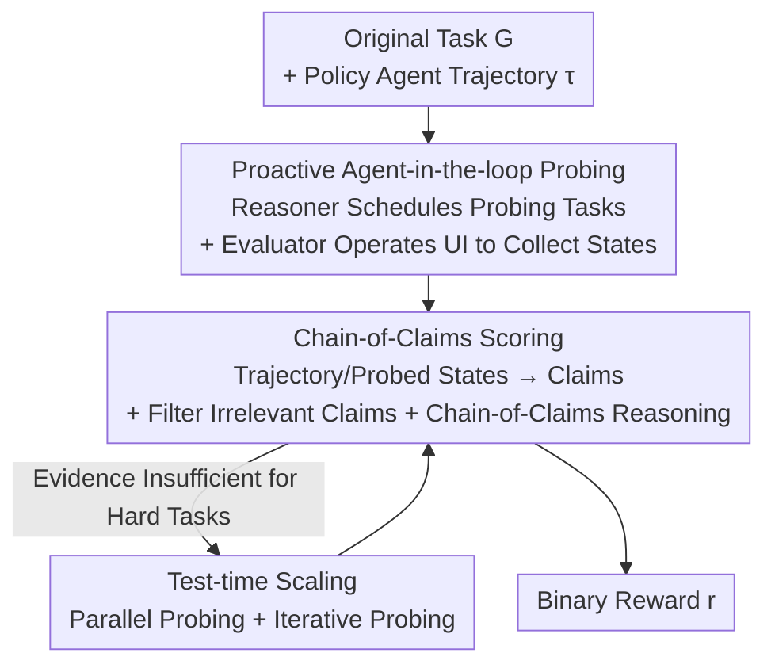

# ProRe: A Proactive Reward System for GUI Agents via Reasoner–Actor Collaboration

**Conference**: ICLR 2026  
**OpenReview**: [https://openreview.net/forum?id=xtysskccFc](https://openreview.net/forum?id=xtysskccFc)  
**Code**: https://github.com/V-Droid-Agent/ProRe  
**Area**: Agent  
**Keywords**: GUI Agent, Reward Model, Proactive Probing, Reasoner-Actor, Test-time Scaling

## TL;DR
To address the difficulty of obtaining verifiable rewards for GUI agents, ProRe utilizes a general reasoner to schedule "state probing tasks," which are then executed by a domain-specific evaluator agent (actor) to proactively collect key interface states. The task success is determined via chain-of-claims reasoning, achieving a reward accuracy of 93.7% (the first GUI reward system to exceed 90%) and improving policy agent success rates by up to 22.4%.

## Background & Motivation

**Background**: Continuous evolution of LLM-driven GUI agents (operating mobile, web, or desktop environments) requires verifiable reward signals (RLVR). The simplest and most effective reward is a binary judgment of "task completion." Existing methods fall into two categories: **rule-based**, which use manual unit tests to check target states (e.g., AndroidWorld with 116+ scripts, WindowsAgentArena with 150+), being accurate but unscalable; and **LLM-as-a-Judge**, which use models like GPT-4o to analyze trajectories (usually image sequences), being scalable but insufficiently accurate.

**Limitations of Prior Work**: The authors identify two root causes for the failure of LLM-as-a-Judge in GUI scenarios. First is **incomplete state observability**: GUI states are passively monitored via modality like screenshots. Given the complexity and dynamism of interfaces, many success indicators do not appear in snapshots (e.g., "taking two photos" might not show a second thumbnail), and fixed-interval sampling may miss critical state transitions. Second is the **lack of domain knowledge in general LLMs**: Judging GUI task states requires specialized understanding of apps and UI interactions. General models like GPT-4o/Gemini perform poorly on GUI-related tasks, and post-training them as domain reward models requires labeled data, reverting to the scalability bottleneck.

**Key Challenge**: Passive monitoring fails to capture critical evidence for success verification, while requiring a general reasoner to handle low-level GUI details exceeds its capabilities—both observational and domain capacities are insufficient.

**Goal**: To output accurate and verifiable binary rewards for any GUI agent without relying on ground-truth trajectories, manual test scripts, or training domain-specific reward models.

**Key Insight**: Instead of passively observing the trajectory left by a policy agent, it is more effective to **proactively "probe" the environment**. The most reliable way to determine if "File A was deleted" is not by staring at the deletion action's screenshot, but by initiating a new task to "search for A in the target app." Furthermore, such probing tasks are typically much simpler than execution tasks (with a higher success rate of 23.8% and 50.3% shorter trajectories in testing).

**Core Idea**: Replace "general LLM judging static trajectories" with "reasoner scheduling + actor proactive probing + chain-of-claims reasoning." This decouples general reasoning from domain execution: the reasoner decides "what to verify" and checks "evidence consistency," while the domain evaluator agent "retrieves key states from the interface."

## Method

### Overall Architecture

ProRe takes a trajectory $\tau$ produced by a policy agent $\pi$ performing an original task $G$ and outputs a binary reward $r$ (success/failure). Rather than direct LLM-as-a-Judge on $\tau$, it introduces a general LLM reasoner $J$ and a set of domain-specific evaluator agents (actors) $\pi_e$ working in collaboration:

1. **Scheduling Probing Tasks**: The reasoner analyzes the expected outcome of task $G$, identifies "key states required to verify success," and generates a set of state probing tasks $G_e$.
2. **Proactive State Probing**: The evaluator agent executes $G_e$ in the environment **after the policy agent concludes**, navigating to relevant pages and collecting key state observations.
3. **Summarization into Claims**: The evaluator condenses both the original policy trajectory and the probed states into a set of high-level, verifiable "claims" to avoid overwhelming the reasoner with low-level GUI details.
4. **Chain-of-Claims Scoring**: The reasoner analyzes relationships (confirmation, contradiction, complementarity, or irrelevance) between policy claims and evaluator claims using chain-of-claims reasoning to output the final reward $r$.

Additionally, for difficult tasks where a single probe is insufficient, ProRe provides **test-time scaling** (parallel and iterative probing) to enhance probing quality.

### Key Designs

**1. Proactive Agent-in-the-loop Probing: From Passive Monitoring to Active Evidence Retrieval**

This is the core shift of ProRe, addressing "incomplete state observability." The reasoner (general LLM) analyzes the original instruction $G$ to generate probing tasks:

$$G_e \sim J(G \mid \text{Exp}, E, L),\quad \text{Exp} = J(G),\ G \in \mathcal{G}$$

where $\text{Exp}$ is the analysis of the expected outcome, $E$ represents few-shot examples, and $L$ provides guidelines. For instance, if the policy agent is to "delete file A," the probing task $G_e$ becomes "search if file A still exists in the target app." This step relies on the general reasoning capability to analyze user intent and **does not require deep UI domain knowledge**. Subsequently, the evaluator agent interacts with the environment to collect states:

$$s^e_{t+1} = F(s^e_t, a^e_t),\quad a^e_t = \pi_e(s^{\pi_e}_t, G_e)$$

where $F$ is the state transition. This step utilizes UI domain knowledge but has low reasoning requirements for user intent. This approach works due to the **"execution-probing gap"**: probing tasks only require navigation and do not require continuous error-free execution for modification, making them simpler than creation/deletion tasks (Table 1: V-Droid achieves 66.7% success on probing vs. 53.6% on execution).

**2. Reasoner–Actor Decoupling: Assigning Logic to the General LLM**

This addresses the "lack of domain knowledge in general LLMs." ProRe splits reward generation into two roles: a general reasoner (Gemini-1.5-Pro) handles high-level scheduling and final logic consistency, while a domain-specific evaluator agent (V-Droid) handles concrete GUI operations. This avoids the need for domain-specific post-training and protects the general model from incomprehensible low-level UI details.

**3. Chain-of-Claims Scoring + Claim Filtering: Abstracting Low-level Details into Reasoning Chains**

To prevent the reasoner from being overwhelmed by raw GUI states, the evaluator summarizes the policy trajectory and probed states into structured claims: $C_\pi = \{c^\pi_1,\dots\}$ and $C_{\pi_e} = \{c^{\pi_e}_1,\dots\}$. The reasoner then performs chain-of-claims reasoning:

$$r = J(G, \text{Exp}, C),\quad C = \{(c^\pi_i, c^{\pi_e}_j, r_{ij})\}$$

where $r_{ij}$ characterizes the relationship—confirmation, contradiction, complementarity, or irrelevance—between claims. A **claim filter** is also implemented to remove misleading claims unrelated to the original task, improving accuracy by 1.7% on AndroidWorld.

**4. Test-time Scaling: Parallel and Iterative Probing for Hard Tasks**

**Parallel Probing**: After the policy agent finishes, the final state is distributed across multiple simulator instances to perform proactive probing in parallel. **Iterative Probing**: New probing tasks are generated based on previous rounds of tasks and claims for $N$ rounds:

$$G_e(n) \sim J(G \mid \text{Exp}, E, L, G_e(n-1), \tau_e),\quad n = 1,\dots,N$$

## Key Experimental Results

### Main Results

Evaluated on 3K+ trajectories from AndroidWorld, AndroidLab, and MobileAgentBench, ProRe is compared against SOTA reward methods (DigiRL, DistRL, WebRL, StepCritic).

| Method (Best Config) | Avg Acc | Avg F1 |
|--------|------|------|
| DistRL (Full) | 86.1 | 60.9 |
| DigiRL (Full) | 84.6 | 59.9 |
| WebRL (Full) | 86.9 | 62.8 |
| Step-Critic (Full) | 88.4 | 63.6 |
| **ProRe (Proactive)** | **93.7** | **83.0** |

ProRe achieves an average accuracy of 93.7%, which is 5.3% higher than the strongest baseline, and an F1 score 19.4% higher. In cross-platform tests (Table 3), ProRe reached 92.0% on OSWorld (PC) and 93.5% on OSWorld-Chrome (Web).

### Ablation Study

| Configuration (Incremental) | Acc | Description |
|------|---------|------|
| Baseline (Passive) | 88.8 | Passive judging baseline |
| + Proactive State Probing | 89.5 | Rule-based probing, limited gain |
| + Probing Task Scheduling | 91.4 | Reasoner-scheduled probing, largest jump |
| + Chain-of-Claims | 93.1 | Structured claim analysis |
| + Iterative Probing | 94.8 | Multi-round refinement |

### Key Findings

- **Reasoner scheduling is the most significant contributor**: The jump from rule-based probing (89.5%) to reasoner scheduling (91.4%) validates the decoupling of planning from execution.
- **Reward accuracy directly determines policy gains**: Using ProRe for test-time scaling, V-Droid success rates rose from 56.5% to 67.2%, and M3A (GPT-4o) improved by 22.4%.
- **Sensitivity to model choices**: Replacing Gemini-1.5-Pro with GPT-4o as the reasoner dropped accuracy from 93.1% to 85.0%.

## Highlights & Insights
- **"Execution-probing gap" as a foundation**: Verifying a task is inherently easier than completing it, allowing the reward system to generalize better than the policy agent.
- **Upgrading rewards from "observing evidence" to "seeking evidence"**: By giving the "judge" hands to operate the interface, ProRe fundamentally solves the problem of incomplete observability.
- **Co-evolution potential**: As the evaluator agent (similar to the policy agent) improves, the reward system also becomes more accurate, creating a positive feedback loop.

## Limitations & Future Work
- **Reliance on interactive sandboxes**: Probing requires operating the environment after execution, which may be difficult for non-reversible real-world environments.
- **Dependency on model capabilities**: The system does not generate its own domain capability and relies heavily on the quality of existing strong models.
- **Efficiency costs**: Running an additional probing agent for every trajectory increases inference costs compared to static judging.

## Related Work & Insights
- **vs. LLM-as-a-Judge**: Passive judges are limited by static trajectories; ProRe's proactive probing solves observability issues and outperforms them significantly (+5.3% Acc / +19.4% F1).
- **vs. Rule-based Testing**: ProRe automates task generation via a reasoner, maintaining accuracy while removing the need for manual scripting.

## Rating
- Novelty: ⭐⭐⭐⭐⭐ First introduction of proactive state probing and reasoner-actor decoupling to GUI rewards.
- Experimental Thoroughness: ⭐⭐⭐⭐⭐ Extensive tests over 3K+ trajectories, multiple benchmarks, cross-platform validation, and detailed ablations.
- Writing Quality: ⭐⭐⭐⭐ Clear motivation and methodology; complex notations in some sections.
- Value: ⭐⭐⭐⭐⭐ First GUI reward system to reach >90% accuracy with significant practical impact on policy success rates.

<!-- RELATED:START -->

## Related Papers

- [\[ICLR 2026\] FingerTip 20K: A Benchmark for Proactive and Personalized Mobile LLM Agents](fingertip_20k_a_benchmark_for_proactive_and_personalized_mobile_llm_agents.md)
- [\[ICLR 2026\] GUI-Shift: Enhancing VLM-Based GUI Agents through Self-supervised Reinforcement Learning](gui-shift_enhancing_vlm-based_gui_agents_through_self-supervised_reinforcement_l.md)
- [\[ACL 2026\] Taming Actor-Observer Asymmetry in Agents via Dialectical Alignment](../../ACL2026/llm_agent/taming_actor-observer_asymmetry_in_agents_via_dialectical_alignment.md)
- [\[ICLR 2026\] Collaborative Gym: A Framework for Enabling and Evaluating Human-Agent Collaboration](collaborative_gym_a_framework_for_enabling_and_evaluating_human-agent_collaborat.md)
- [\[ICLR 2026\] PRISM: Festina Lente Proactivity—Risk-Sensitive, Uncertainty-Aware Deliberation for Proactive Agents](prism_festina_lente_proactivityrisk-sensitive_uncertainty-aware_deliberation_for.md)

<!-- RELATED:END -->
