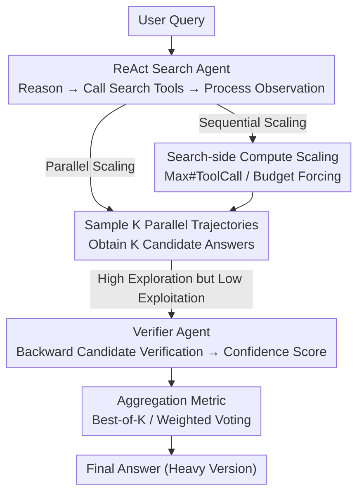

# Pushing Test-Time Scaling Limits of Deep Search with Asymmetric Verification

**Conference**: ICLR 2026  
**OpenReview**: [https://openreview.net/forum?id=hxL4Uf9tR3](https://openreview.net/forum?id=hxL4Uf9tR3)  
**Code**: https://github.com/hkust-nlp/deepsearch-tts  
**Area**: Agent / LLM Reasoning  
**Keywords**: Deep Search Agents, Test-Time Scaling, Asymmetric Verification, Best-of-K, Compute-Optimal

## TL;DR
This paper systematically investigates test-time compute scaling for deep search agents. Identifying the "hard to search, easy to verify" asymmetry, it proposes allocating compute from the search agent to a verifier agent to efficiently filter candidate answers. This approach upgrades open-source models like GLM-4.5, K2, Qwen3-2507, and Tongyi-DeepResearch to "Heavy" versions, achieving improvements of up to 20+ percentage points on benchmarks like BrowseComp, reaching performance levels comparable to OpenAI Deep Research and o3.

## Background & Motivation

**Background**: Test-time scaling is a core pillar of contemporary state-of-the-art AI systems (Grok 4 Heavy, GPT-5 Pro, Gemini-2.5 Pro Deep Think). It follows two complementary paths: **sequential scaling** (extending a single chain-of-thought/trajectory, e.g., o1, DeepSeek-R1) and **parallel scaling** (sampling multiple trajectories and aggregating via methods like Best-of-K). "Deep Research" tasks—which require recursive searching, browsing hundreds of pages, and locating information that meets user needs—serve as representative scenarios for testing test-time scaling.

**Limitations of Prior Work**: The authors discovered through experiments that simply dumping compute into the search agent hits two walls. First, **sequential scaling suffers from diminishing returns**: using "budget forcing" to compel the model to make more tool calls initially raises the $Pass@1$ of GLM-4.5 on BrowseComp from 19% to 27%, but performance drops as trajectories lengthen because the model struggles to maintain coherent long-range reasoning. Second, **parallel scaling increases "exploration" but not "exploitation"**: GLM-4.5 reaches a $Pass@32$ of 67% (indicating a correct answer exists in 32 trajectories), but K2's $Maj@16$ is only ~12%, far below its $Pass@16$ of 34%. The model can "explore" the correct answer but cannot "identify and select" it from a candidate pool.

**Key Challenge**: Expanding the exploration space increases the probability of hitting the correct answer, but the search agent itself lacks the ability to select the optimal answer from candidates. Continuing to scale compute for search results in sharp marginal utility decay and high costs (GLM-4.5 requires ~500 additional tool calls to raise accuracy from 30% to 40%).

**Key Insight**: The authors leverage the "Asymmetry of Verification"—the observation that **verifying an answer is often much easier than generating it** (e.g., Sudoku, N-Queens). Deep search exhibits this property: forward search requires navigating a vast, sparse information space, while backward verification only needs to check if a candidate answer meets specific conditions, significantly compressing the search space. Empirically, on BrowseComp, GLM-4.5 averages ~75 tool calls to find a candidate but only ~18 to verify it.

**Core Idea**: Instead of investing all compute into endlessly expanding the number of candidates, a significant portion should be allocated to **verification**. A "verifier agent," nearly isomorphic to the search agent, assigns confidence scores to candidate answers, followed by Best-of-K or weighted voting. This achieves accuracy gains equal to or greater than scaling search but at a much lower cost.

## Method

### Overall Architecture

Ours does not propose a new model but establishes a unified framework for "how to spend test-time compute." Scaling is decomposed into three orthogonal dimensions: **extension target** (Search Agent vs. Verifier Agent), **scaling strategy** (Max # Tool Call / Budget Forcing / Parallel Sampling), and **aggregation metric** (Pass@1 / Maj@K / Best-of-K / Weighted Voting). The pipeline is as follows: a minimalist ReAct search agent generates multiple trajectories and candidate answers; when identifying the "high exploration, low exploitation" bottleneck, a verifier agent (differing only in its system prompt) performs several rounds of backward verification and outputs confidence scores; finally, these scores are used for aggregation. By finding the "compute-optimal" allocation across these dimensions, open-source models are upgraded to "Heavy" versions.

### Key Designs

**1. Minimalist ReAct Search Agent: Making "Search Compute" Controllable and Quantifiable**

To study test-time scaling under controlled conditions, Ours designed a streamlined, general ReAct search agent. It iteratively performs "reasoning → generating/executing actions → processing observations from real web environments." The action space is limited to giving the final answer or calling search tools. The search tools reuse WebThinker's retrieval and browsing functions, with an internal fixed auxiliary model (K2 is used throughout to isolate variables) deciding how to organize content. Crucially, Ours uses **actual tool call counts** as a proxy for test-time compute, as deep research fundamentally involves repeated interaction with external tools. This makes "search compute" a quantifiable and controllable axis.

**2. Sequential and Parallel Scaling on the Search Side: Exposing the "Exploration vs. Exploitation" Bottleneck**

Ours categorizes scaling search compute into two types. Sequential scaling加码 along a single trajectory, including Max # Tool Call (relaxing limits in the system prompt) and Budget Forcing (forcing the model to continue exploring alternative paths after an initial answer). Experiments show Max # Tool Call has low utility (performance often plateaus or regresses as the quota increases from 15 to 50), whereas Budget Forcing actively consumes compute (doubling GLM-4.5 tool usage and raising $Pass@1$ from 19% to 27%), though it saturates if the trajectory becomes too long. Parallel scaling samples $K$ independent trajectories. While $Pass@K$ rises rapidly (GLM-4.5 goes from 16% to 67%), a bottleneck appears: the high $Pass@K$ vs. low $Maj@K$ (K2 $Pass@16 \approx 34\%$ but $Maj@16 \approx 12\%$) suggests that majority voting without verification **cannot pick out the correct answer**. This is the primary motivation for the verifier.

**3. Asymmetric Verifier Agent: Leveraging Low Compute for High Gains**

This is the core contribution. Ours transforms the search agent into a verifier agent by **sharing the same framework and tools but changing only the system prompt**. The model uses search tools specifically to verify whether a predicted answer holds true and provides a confidence score. This is effective due to the asymmetry of deep search verification: it takes ~75 tool calls to search for a BrowseComp candidate but only ~18 to verify it (Table 1). For example, finding a game with specific 1992 release dates and Guinness World Records requires traversing a massive space, but verifying a specific game against those criteria is easy. Shifting compute to verification allows raising GLM-4.5 from 35.7% ($Maj@8$) to 45% (weighted voting) with ~100 extra calls, whereas scaling search alone would require ~560 calls to reach only 40.8% ($Maj@32$).

**4. Verifier Scalability + Aggregation Metrics: Triple-Axis Compute-Optimal Configuration**

The verifier itself can be scaled via Max # Tool Call, Budget Forcing, or Parallel Sampling (averaging scores from multiple verification trajectories to reduce sampling bias). Aggregation uses confidence scores for **Best-of-K** (selecting the highest-scored trajectory) or **Weighted Voting**. Gains are highly dependent on the model-strategy combination: GLM-4.5 benefits most from "Parallel Scaling + Best-of-8" (reaching 42%), while K2 achieves better results with Budget Forcing at lower compute. The conclusion is that in practical deployment, **target, strategy, and metric should be jointly selected based on model characteristics and compute budget** to maximize "performance per unit of compute." Applying these triple-axis configurations to open-source models yields their respective Heavy versions.

## Key Experimental Results

### Main Results

On four difficult information retrieval benchmarks (BrowseComp, BrowseComp-zh, GAIA, xbench-DeepSearch), the Heavy versions significantly outperform original models and match top closed-source systems († indicates authors' empirical Max $Pass@1$):

| Model | BrowseComp | BrowseComp-zh | GAIA | xbench-DeepSearch |
|------|-----------|---------------|------|-------------------|
| OpenAI DeepResearch | 51.5 | 42.9 | 70.5 | 66.7 |
| OpenAI o3† | 55.0 | 59.0 | 68.0 | 68.0 |
| GLM-4.5† | 19.0 | 27.0 | 58.0 | 58.0 |
| **GLM-4.5 Heavy** | **54.0 (+35.0)** | 49.0 (+22.0) | 66.0 (+8.0) | 68.0 (+10.0) |
| Tongyi DeepResearch† | 43.0 | 39.0 | 70.6 | 68.0 |
| **Tongyi DeepResearch Heavy** | **69.0 (+26.0)** | 55.0 (+16.0) | 72.8 (+2.2) | 80.0 (+12.0) |
| Qwen3-2507 Heavy | 29.0 (+21.0) | 42.0 (+19.0) | 53.4 (+8.7) | 63.0 (+17.5) |
| K2 Heavy | 24.0 (+13.0) | 36.0 (+14.0) | 58.3 (+8.3) | 57.0 (+3.0) |

GLM-4.5 Heavy, as an open-source system, reached 54.0% on BrowseComp, comparable to OpenAI DeepResearch and o3; Tongyi DeepResearch Heavy pushed BrowseComp further to 69.0%.

### Ablation Study

Evidence for asymmetric verification (Table 1, average tool calls for Search vs. Verification):

| Model | BrowseComp Search | BrowseComp Verify | GAIA Search | GAIA Verify |
|------|-----------------|-----------------|-----------|-----------|
| GLM-4.5 | 75.3 | 18.0 | 17.4 | 10.6 |
| Qwen3-2507 | 32.4 | 11.3 | 9.7 | 7.9 |
| K2 | 27.8 | 11.2 | 6.2 | 5.8 |

Comparison of verifier scaling strategies (using GLM-4.5 starting from vanilla $Maj@8$):

| Configuration | Qwen3-2507 | K2 | GLM-4.5 |
|------|-----------|-----|---------|
| Vanilla (Search Only $Maj@8$) | 16.9 | 10.0 | 30.6 |
| + Max # Tool Call | 20.0 | 18.0 | 39.0 |
| + Budget Forcing | 19.0 | 20.0 | 39.0 |
| + Parallel Scaling | 21.0 | 19.0 | 42.0 |

### Key Findings
- **Verification offers a much better "accuracy-cost" trade-off than scaling search**: A 10-point gain requires ~100 extra calls with a verifier vs. ~500 calls by scaling search; asymmetry yields disproportionate gains.
- **Exploration $\neq$ Exploitation**: The gap between $Pass@K$ and $Maj@K$ confirms the bottleneck is "identifying the correct answer," justifying the introduction of a verifier.
- **Optimal strategies vary by model**: GLM-4.5 prefers "Parallel + Best-of-8," while K2 finds Budget Forcing more cost-effective. There is no one-size-fits-all configuration.
- **Sequential scaling has a ceiling**: Budget Forcing is initially effective but degrades if over-applied due to the difficulty of maintaining long-range reasoning.

## Highlights & Insights
- **"Shifting compute from search to verification" is an underrated orthogonal scaling dimension**: While prior test-time scaling focused on the search/generation side, ours provides a cheaper path—the verifier is isomorphic to the search agent and reusable with prompt changes, offering high returns for low engineering cost.
- **Quantifying compute via tool calls rather than tokens** is highly suitable for agent scenarios, making the "search expensive, verification cheap" asymmetry measurable and comparable.
- **The triple-axis decoupling (Goal/Strategy/Metric)** provides a clear "test-time compute allocation map," unifying scattered scaling techniques into a framework that can guide deployment decisions for other "generate-verify" agent tasks.

## Limitations & Future Work
- Asymmetric verification only holds for tasks where "verification is easier than generation"; it may not work for nearly symmetric tasks (e.g., matrix multiplication) or hard-to-verify tasks (e.g., code security audits).
- Due to cost constraints, BrowseComp/BrowseComp-zh evaluations used 100 random samples (though robustness was checked via mutually exclusive subsets); stability on full-scale benchmarks remains to be confirmed.
- The verifier relies on the search agent's framework and a fixed auxiliary model (K2); the optimal configuration requires extensive per-model tuning. The combinatorial space of models/strategies/metrics is large, and an automated selection mechanism is lacking.

## Related Work & Insights
- **vs. Budget Forcing (Muennighoff et al., 2025)**: That work improves performance by forcing longer generations in reasoning tasks; ours applies this to agent search and notes it can degrade if over-applied, necessitating a verifier.
- **vs. Majority Voting / Self-Consistency (Wang et al., 2022)**: Majority voting requires no external verifier, but ours shows $Maj@K$ is far lower than $Pass@K$ in open deep search; thus, Best-of-K/Weighted Voting based on verifier scores is a superior alternative.
- **vs. WebThinker / ReAct (Yao et al., 2023)**: Ours reuses their search-browse tools and ReAct paradigm as the search agent scaffold; the contribution lies not in the scaffold itself but in how to scale efficiently along the test-time compute dimension and integrate verification.

## Rating
- Novelty: ⭐⭐⭐⭐ Systematically introduces "Asymmetric Verification" into test-time scaling for deep search agents; fresh and practical perspective.
- Experimental Thoroughness: ⭐⭐⭐⭐ Covers 4 benchmarks and 4 open-source models with a complete chain of evidence, though some evaluations use sampling.
- Writing Quality: ⭐⭐⭐⭐ Clear logic from phenomenon (exploration vs. exploitation) to mechanism (asymmetry) to framework (triple-axis).
- Value: ⭐⭐⭐⭐⭐ Enables open-source models to match o3/OpenAI Deep Research with low engineering overhead and high deployability.

<!-- RELATED:START -->

## Related Papers

- [\[ICLR 2026\] GTA1: GUI Test-time Scaling Agent](gta1_gui_test-time_scaling_agent.md)
- [\[ICLR 2026\] Test-Time Adaptation for LLM Agents via Environment Interaction](test-time_adaptation_for_llm_agents_via_environment_interaction.md)
- [\[ICLR 2026\] EvoTest: Evolutionary Test-Time Learning for Self-Improving Agentic Systems](evotest_evolutionary_test-time_learning_for_self-improving_agentic_systems.md)
- [\[ACL 2025\] METAL: A Multi-Agent Framework for Chart Generation with Test-Time Scaling](../../ACL2025/llm_agent/metal_a_multi-agent_framework_for_chart_generation_with_test-time_scaling.md)
- [\[ICLR 2026\] Open Data Synthesis for Deep Research](open_data_synthesis_for_deep_research.md)

<!-- RELATED:END -->
