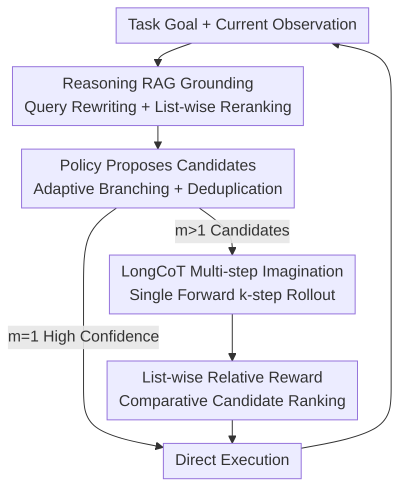

# R-WoM: Retrieval-augmented World Model for Computer-use Agents

**Conference**: ICLR 2026  
**OpenReview**: [https://openreview.net/forum?id=5ZaoXB3MdP](https://openreview.net/forum?id=5ZaoXB3MdP)  
**Code**: To be confirmed  
**Area**: Agent / Computer-use Agent / World Model / Retrieval-augmented  
**Keywords**: World Model, Computer-use Agent, Retrieval-augmented, Long-horizon Planning, List-wise Reward

## TL;DR
The authors systematically verify that "LLMs as World Models" work for short-term but fail for long-term horizons. They propose R-WoM, which uses external tutorial retrieval to "ground" the multi-step imagination and reward estimation of the world model, achieving up to a 23.4% improvement over the strongest baselines on OSWorld / WebArena, with increasing advantages for longer trajectories.

## Background & Motivation
**Background**: World models allow agents to simulate future states "in their mind" and estimate action consequences before execution, avoiding irreversible or high-cost trial-and-error in computer/browser environments. Early approaches like Dreamer or MuZero utilized MBRL to learn dynamics in latent spaces, while recent trends shift toward using LLMs directly as world models, leveraging large-scale pre-training for reasoning about action consequences.

**Limitations of Prior Work**: LLMs are prone to hallucinations and rely on static knowledge fixed during training, making their world modeling inherently "ungrounded." In OS environments, ungrounded agents generate steps that look coherent but are practically unfeasible. For example, in Figure 1 of the paper, when asked to copy a screenshot to a cursor location, an agent relying on internal knowledge might lose the cursor position and get stuck, whereas a tutorial-grounded agent uses the correct "Insert Image" operation and maintains the cursor position.

**Key Challenge**: Are LLMs qualified to serve as world models? The authors decompose world model capabilities into two core functions—future state prediction and reward estimation—and design three probing tasks: next-state identification, whole-trajectory planning alignment, and milestone transition identification. The critical finding is that while LLMs are strong at short-range tasks like "identifying the next state" (75%+ accuracy), they fail significantly at "whole-trajectory alignment" (rarely exceeding 65%). This suggests LLMs lack specific, up-to-date "procedural knowledge" for specific environments, leading to error accumulation in long-term simulations.

**Goal**: To augment LLM world models with missing procedural knowledge, ensuring they do not drift during long-horizon simulations.

**Key Insight**: Tutorials can be viewed as high-level abstractions of environmental dynamics. Retrieving relevant tutorials during simulation as "evidence" grounds both imagination and reward estimation. However, standard retrieval often yields noise or off-topic content. Therefore, the key to grounding is accurate retrieval.

**Core Idea**: Ground the LLM world model using "environment tutorials retrieved via reasoning-based RAG," combined with single-pass Long Chain-of-Thought (LongCoT) for multi-step imagination and list-wise relative rewards. This replaces the expensive policy-world model iterative rollouts and unstable absolute rewards of prior methods.

## Method

### Overall Architecture
The core loop of R-WoM at each decision step $i$ is: the policy model proposes $m$ candidate "thought-action" pairs based on the goal $g$ and current observation $o_i$. Grounded by retrieved tutorial evidence $E$, the world model performs a $k$-step imagination rollout for each candidate to simulate potential future trajectories. Finally, the world model uses list-wise relative scoring across all rollouts to select the best action for execution. Upon observing $o_{i+1}$, it proceeds to the next step until task completion. The tutorial evidence $E$ is retrieved once at the start and reused throughout the episode.

### Key Designs

**1. Reasoning-based RAG Grounding: Blocking Off-topic Retrieval**

Grounding requires accurate tutorial retrieval, but pure embedding similarity often misses fine-grained constraints or retrieves semantically similar but irrelevant content. R-WoM treats retrieval as a two-stage process: first, the goal $g$ is encoded into query $q=f_{enc}(g)$ to retrieve top-$k$ candidates $C_k$ via cosine similarity; then, the policy model acts as a list-wise reranker to score candidates conditioned on $(q, C_k)$, producing the final evidence set $E=f^*_{p\text{rank}}(C_k, q)$. The world model only uses $E$ for subsequent imagination. In experiments, query rewriting effectively handled vague tasks (e.g., "Fork ChatGPT"), while reranking filtered irrelevant candidates across benchmarks, yielding the highest recall when combined.

**2. LongCoT Single-pass Multi-step Imagination: Replacing Iterative Rollouts**

Previous world model methods (e.g., WebDreamer, WebEvolver) repeatedly call the world model to generate multi-step rollouts, which is slow and prone to error accumulation. Inspired by DeepSeek-R1, R-WoM utilizes Long Chain-of-Thought: given evidence $E$, it expands the entire $k$-step trajectory $\hat{\tau}_i^{(j)}=\pi_w^{LongCoT}(o_i, t_i^{(j)}, a_i^{(j)}; E)$ for a candidate $(t_i^{(j)}, a_i^{(j)})$ in a single forward pass. To further reduce costs, it employs **Adaptive Action Branching**, allowing the policy to propose only one high-confidence action when certain, and **Action Deduplication**, which uses the policy model as a validator to prune redundant candidates before rollout.

**3. List-wise Relative Reward: Distinguishing Similar Candidates**

Prior works used absolute sparse rewards for each rollout, which can be insensitive when candidates differ only slightly. R-WoM adopts a list-wise ranking mechanism where all candidate trajectories $\hat{\tau}_i^{(j)}$ are compared using LongCoT reasoning to assign relative preference scores:

$$(t_i^*, a_i*) = \arg\max_{(t_i^{(j)}, a_i^{(j)}) \in A_c}\left[f_w\left(R(\hat{\tau}_i^{(j)}, g, E)\right)\right]$$

Each rollout is scored within the context of all candidates, suppressing bias from absolute reward signals and stabilizing action selection.

**4. Self-play Synthesized Tutorials: Extending to Domains Without Tutorials**

R-WoM relies on external tutorials, but these may be unavailable in some scenarios. The authors synthesize "empirical tutorials" from self-play trajectories: using ~2k trajectories from AgentNet, they synthesize ~1.3k tutorials potentially useful for OSWorld tasks (with no overlap with test tasks). Across Claude-3.7/4/4.5 models, this grounding via synthesized tutorials consistently outperformed baselines, demonstrating that R-WoM can function using synthesized knowledge when official documentation is scarce.

## Key Experimental Results

### Main Results
On OSWorld (sampled 87/361) and WebArena (sampled 113/301), R-WoM was compared against Vanilla, RAG, and WebDreamer baselines. R-WoM achieved the best performance across all backbones (mean of three runs):

| Model | Method | OSWorld | WebArena |
|------|------|---------|----------|
| Qwen-2.5-VL-72B | Strongest Baseline (RAG/WebDreamer) | 30.84 / 28.37 | 24.50 |
| Qwen-2.5-VL-72B | Ours | **37.48** ↑21.5% | **28.49** ↑16.3% |
| Claude-3.5-Sonnet | Strongest Baseline | 23.48 | 30.70 |
| Claude-3.5-Sonnet | Ours | **26.01** ↑10.8% | **33.15** ↑8.0% |
| Claude-3.7-Sonnet | Strongest Baseline | 31.24 | 32.75 |
| Claude-3.7-Sonnet | Ours | **38.54** ↑23.4% | **34.58** ↑5.6% |

### Ablation Study

| Configuration / Analysis | Key Metric | Description |
|------|---------|------|
| Retrieval: Rewriting + Reranking | Recall@5 > 85%(OS) / ~86%(Web) | Best recall when combined; complementary. |
| Grounding Quality: None → RAG → Oracle | Monotonic Performance Increase | Accurate procedural knowledge improves long-term simulation. |
| Horizon 1→4 (WebDreamer) | Stagnation/Drop after step 2 | Ungrounded methods suffer from error accumulation. |
| Horizon 1→4 (Ours) | Peaks around step 3 | Tutorial grounding stabilizes long-horizon rollouts. |
| Tutorial Scarcity (Self-play) | Stabilizes performance above baselines | Synthesized tutorials also provide effective grounding. |

### Key Findings
- **Greater Advantage in Long Horizon**: Ungrounded world models like WebDreamer stagnate after 2 steps due to error accumulation, whereas R-WoM's tutorial grounding extends viability to approximately step 3.
- **Grounding Quality Determines Ceiling**: Success rates increase monotonically from no grounding to retrieved tutorials to oracle tutorials, showing that accuracy in procedural knowledge translates directly to simulation quality.
- **Two-stage Retrieval is Essential**: Query rewriting recovers vague tasks, while reranking filters irrelevant candidates; both are necessary for optimal performance.

## Highlights & Insights
- **Evidence-driven Narrative**: Instead of presenting the method immediately, the paper first quantifies the capability boundaries of "LLMs as World Models" (strong short-term, weak long-term), providing a solid diagnosis-based motivation for grounding.
- **Compression of Rollouts via LongCoT**: Replacing iterative communications between the policy and world model with a single LongCoT expansion optimizes efficiency and reduces cumulative errors.
- **List-wise Relative Rewards**: By ranking candidates relative to each other, the model effectively distinguishes between similar, reasonable-looking rollouts that might receive identical absolute scores.
- **Self-play Tutorial Synthesis**: This decouples "retrieval augmentation" from a dependency on existing documentation, expanding the method's applicability to tasks where tutorials must be learned through interaction.

## Limitations & Future Work
- **Dependency on Knowledge Base Quality**: The performance ceiling is bound by the quality of the retrieved tutorials; the gap between automated retrieval and oracle settings suggests room for improvement in RAG.
- **Sample Subset Evaluation**: Experiments were conducted on subsets of OSWorld/WebArena where tutorials are available, leaving the performance on tasks without any possible tutorial coverage unclear.
- **Horizon Limits Remaining**: Although R-WoM delays the performance drop from step 2 to step 3, it does not fully solve error accumulation in extremely long simulations.
- **Future Directions**: Exploring tighter co-evolution between the world model and the policy, or dynamically triggering re-retrieval within rollouts, may further extend the simulation horizon.

## Related Work & Insights
- **vs. WebDreamer**: WebDreamer pioneered LLM world model simulation but uses iterative rollouts and lacks external grounding; R-WoM replaces this with LongCoT and tutorial retrieval for better long-term stability.
- **vs. WMA**: WMA uses natural language state summaries as internal knowledge; R-WoM emphasizes external, up-to-date procedural knowledge.
- **vs. WKM / WebEvolver**: These focus on co-evolution and fine-tuning; R-WoM is a lighter-weight inference-time grounding approach.
- **vs. Synatra / AgentTrek**: These use tutorials offline for trajectory generation; R-WoM uses tutorials online to ground the world model during inference.

## Rating
- Novelty: ⭐⭐⭐⭐ The combination of "grounded world model + LongCoT single-pass rollout + list-wise relative reward" is novel for computer-use agents.
- Experimental Thoroughness: ⭐⭐⭐⭐ Tested across three backbones, two benchmarks, and multiple ablation perspectives including grounding quality and tutorial scarcity.
- Writing Quality: ⭐⭐⭐⭐⭐ Clear structure that quantifies the problem before proposing the solution.
- Value: ⭐⭐⭐⭐ Provides a reusable paradigm for diagnosing and fixing long-horizon drift in LLM-based world models.

<!-- RELATED:START -->

## Related Papers

- [\[ICLR 2026\] Grounding Computer Use Agents on Human Demonstrations](grounding_computer_use_agents_on_human_demonstrations.md)
- [\[ICLR 2026\] VideoAgentTrek: Computer Use Pretraining from Unlabeled Videos](videoagenttrek_computer-use_pretraining_from_unlabeled_videos.md)
- [\[ICLR 2026\] ViMo: A Generative Visual GUI World Model for App Agents](vimo_a_generative_visual_gui_world_model_for_app_agents.md)
- [\[ICLR 2026\] SCUBA: Salesforce Computer Use Benchmark](scuba_salesforce_computer_use_benchmark.md)
- [\[ICLR 2026\] Efficient Agent Training for Computer Use](efficient_agent_training_for_computer_use.md)

<!-- RELATED:END -->
