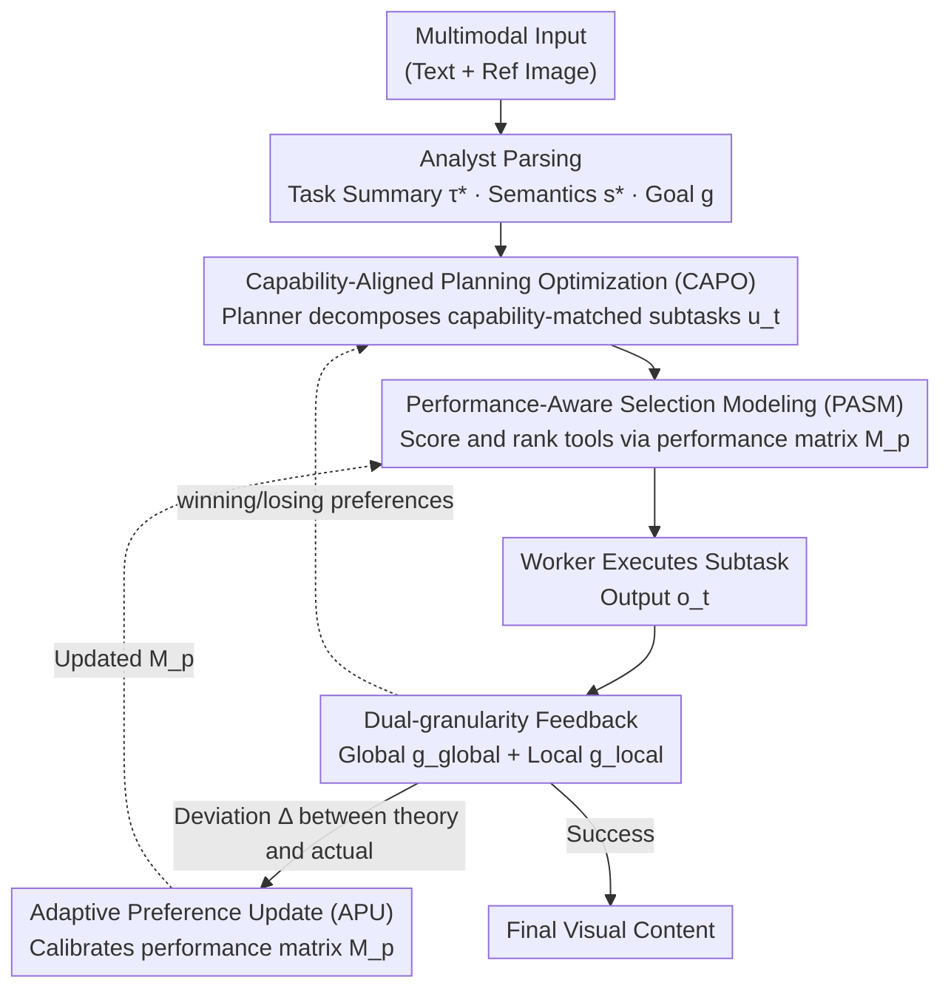

# PerfGuard: A Performance-Aware Agent for Visual Content Generation

**Conference**: ICLR 2026  
**arXiv**: [2601.22571](https://arxiv.org/abs/2601.22571)  
**Code**: [GitHub](https://github.com/FelixChan9527/PerfGuard)  
**Area**: AI Agent/Visual Content Generation  
**Keywords**: LLM Agent, Tool Selection, Performance Boundary Modeling, Visual Generation, AIGC, Preference Optimization

## TL;DR
PerfGuard is proposed as a performance-aware Agent framework for visual content generation. It replaces text descriptions with a multi-dimensional scoring matrix for Performance-Aware Selection Modeling (PASM), utilizes Adaptive Preference Update (APU) to dynamically calibrate deviations between theoretical rankings and actual execution, and employs Capability-Aligned Planning Optimization (CAPO) to guide the Planner in generating subtasks matched with tool capabilities. It outperforms SOTA methods such as GenArtist and T2I-Copilot in image generation and editing tasks.

## Background & Motivation

**Background**: LLM-driven Agents have achieved automated task processing through reasoning and tool invocation. In the field of Visual Content Generation (AIGC), multi-tool coordination systems like CompAgent and GenArtist have emerged.

**Limitations of Prior Work**: Existing research commonly assumes "tool invocation is always successful," lacking a systematic evaluation of actual tool execution success rates. The uncertainty in tool selection directly affects the overall accuracy of Agent planning and decision-making.

**Key Challenge**: Current systems rely on generic text descriptions to define tool capabilities (e.g., "capable of generating images aligned with text semantics"), making it impossible to distinguish fine-grained performance differences between different models and preventing precise tool matching.

**Goal**: Taking text-to-image generation as an example, models like FLUX, SD3, and DALL·E 3 exhibit significant performance variations across dimensions like color, shape, texture, and spatial relationships. However, Agents cannot perceive these differences, leading to uncertainty in planning and execution.

**Key Insight**: Predefined performance boundaries may deviate from actual task execution results even with benchmark scores. There is a need for dynamic adjustment based on real-world feedback.

**Core Idea**: The task planning process in existing methods does not consider the actual performance capabilities of tools. Planners may generate subtasks that tools find difficult to complete with high quality. Performance awareness must be integrated into the planning process.

## Method

### Overall Architecture

The core problem PerfGuard addresses is that existing visual generation Agents define "what a tool can do" using vague text descriptions, leading to inaccurate tool selection and planning that is detached from real tool capabilities. The breakthrough lies in replacing tool capabilities with a computable, self-correcting **performance matrix** that constrains tool selection and planning. The system consists of four roles forming a closed feedback loop: the Analyst parses multimodal input into a task summary $\tau^*$, target semantics $s^*$, and evaluation goal $g$; the Planner decomposes the task into subtasks $u_t$ matched with the performance profile $\mathcal{B}$ (optimized by CAPO); the Worker selects tools via the performance matrix score to produce output $o_t$ (selected via PASM); and the Self-Evaluator assesses the alignment between $o_t$ and $g$ using dual-granularity metrics. Deviations between theoretical rankings and actual performance are fed back to the performance matrix (APU), and winning/losing preferences are fed back to the planner (CAPO) until the output meets the criteria.

### Key Designs

**1. Performance-Aware Selection Modeling (PASM): Converting tool capabilities from text descriptions to a comparable numerical matrix**

Existing Agents rely on generic descriptions like "can generate images aligned with text semantics," failing to distinguish the real differences between FLUX, SD3, and DALL·E 3 in fine-grained dimensions. PASM establishes a multi-dimensional scoring system for each category of tools: image generation tools follow the 7 dimensions of T2I-CompBench (Color, Shape, Texture, 2D Spatial, 3D Spatial, Non-spatial, Numeracy), and image editing tools follow the 7 dimensions of ImgEdit-Bench. Benchmark scores are populated into a performance boundary matrix $M_p \in \mathbb{R}^{d \times l}$ ($d$ dimensions $\times$ $l$ tools). The Worker generates preference weights $\mathcal{W}_{task} = \pi_{\text{Worker}}(u_t, \mathcal{B}, \mathcal{D}) \in \mathbb{R}^{1 \times d}$ based on subtask features, then calculates suitability scores $S_{tools} = \mathcal{W}_{task} \cdot \text{Normalize}(M_p)^\top$ and ranks tools $\mathcal{R} = \text{argsort}(S_{tools})$.

**2. Adaptive Preference Update (APU): Self-correcting predefined performance boundaries based on actual execution**

Static benchmark scores often deviate from actual task execution. APU introduces an exploration-exploitation strategy: it executes top-$m$ high-scoring tools along with $n$ randomly sampled tools, then compares theoretical rankings $\mathcal{R}_{theory}$ with actual performance rankings $\mathcal{R}_{actual}$. The deviation is calculated as:

$$\Delta = \frac{\mathcal{R}_{theory} - \mathcal{R}_{actual}}{m+n}$$

The matrix is updated along the preference direction: $M_p^{\text{new}} = \text{Normalize}\big(M_p + \mathcal{W}_{task} \cdot \eta \cdot \Delta\big)$. If a tool's actual performance exceeds expectations, its boundary score is increased; otherwise, it is lowered. Experimental results shows $\eta=0.13$ is optimal.

**3. Capability-Aligned Planning Optimization (CAPO): Feeding tool capabilities back to the Planner**

CAPO transfers Step-aware Preference Optimization (SPO) from diffusion models to the Agent's autoregressive planning. For each step, it generates $k$ candidate subtasks $\{u_t^1, \ldots, u_t^k\}$. A fraction $\beta k$ are retrieved from successful histories using CLIP similarity, and $(1-\beta)k$ are randomly generated. The Self-Evaluator identifies winning/losing samples to optimize the Planner using a DPO variant objective:

$$\mathcal{L}(\theta) = -\mathbb{E}\Big[\log\sigma\big(\alpha(\log\tfrac{p_\theta(u_t^w | \tau^*, s^*, \mathcal{B}, h_{t-1})}{p_{\text{ref}}(u_t^w | \cdot)} - \log\tfrac{p_\theta(u_t^l | \cdot)}{p_{\text{ref}}(u_t^l | \cdot)})\big)\Big]$$

**4. Dual-granularity Feedback: Evaluating alignment through global and local scales**

The Self-Evaluator calculates both global semantic alignment $g^{global}$ and region-specific local semantic alignment $g^{local}_i$. This combined weighted score ensures the output matches the overall task intent while verifying that local details (e.g., "green glasses") are not missing, providing reliable reward signals for APU and CAPO.

## Key Experimental Results

### Main Results (T2I-CompBench)

| Method | Type | Color↑ | Shape↑ | Texture↑ | Spatial↑ | Non-Spatial↑ | Complex↑ |
|------|------|--------|--------|----------|----------|-------------|----------|
| FLUX | Diffusion | 0.7407 | 0.5718 | 0.6922 | 0.2863 | 0.3127 | 0.3771 |
| SD3 | Diffusion | 0.8132 | 0.5885 | 0.7334 | 0.3200 | 0.3140 | 0.3703 |
| GoT | CoT | 0.4793 | 0.3668 | 0.4327 | 0.2238 | 0.3053 | 0.3255 |
| T2I-R1 | CoT | 0.8130 | 0.5852 | 0.7243 | 0.3378 | 0.3090 | 0.3993 |
| GenArtist | Agent | 0.8482 | 0.6948 | 0.7709 | 0.5437 | 0.3346 | 0.4499 |
| T2I-Copilot | Agent | 0.8039 | 0.6120 | 0.7604 | 0.3228 | 0.3379 | 0.3985 |
| **Ours** | **Agent** | **0.8753** | **0.7366** | **0.8148** | **0.6120** | **0.3754** | **0.5007** |

### Main Results (OneIG-Bench)

| Method | Type | Alignment↑ | Text↑ | Reasoning↑ | Style↑ |
|------|------|-----------|-------|-----------|--------|
| FLUX | Diffusion | 0.786 | 0.523 | 0.253 | 0.368 |
| SD3 | Diffusion | 0.801 | 0.648 | 0.279 | 0.361 |
| T2I-R1 | CoT | 0.793 | 0.662 | 0.297 | 0.370 |
| T2I-Copilot | Agent | 0.821 | 0.679 | 0.318 | 0.386 |
| **Ours** | **Agent** | **0.834** | **0.684** | **0.350** | **0.395** |

### Main Results (Complex-Edit Level-3)

| Method | IF↑ | PQ↑ | IP↑ | Overall↑ |
|------|-----|-----|-----|----------|
| AnySD | 4.13 | 7.14 | 9.08 | 6.78 |
| Step1X_Edit | 7.95 | 8.66 | 7.70 | 8.10 |
| GenArtist | 6.14 | 7.24 | 6.19 | 6.52 |
| OmniGen | 7.52 | 8.86 | 8.01 | 8.13 |
| **Ours** | **8.95** | **9.02** | **8.56** | **8.84** |

## Key Findings

1. **Text descriptions fail to distinguish tools**: Selecting tools based solely on text descriptions leads to error rates as high as 77.8% (QWen3-14B). Performance matrices reduce this to 30.5%, and APU further reduces it to 14.2%.
2. **PASM is a core contribution**: Ablation studies show that PASM improves Color by 3.42% and Texture by 5.7%.
3. **APU provides significant adaptive effects**: The Complex metric improved from 0.4412 to 0.4738 through feedback-driven calibration.
4. **CAPO enables tool-aware planning**: The trained Planner perceives tool capability boundaries and understands optimal operation sequences.
5. **Update step size $\eta$ is critical**: $\eta=0.1$ converges too slowly, while $\eta=0.15$ causes oscillation. $\eta=0.13$ achieved the lowest error rate at step 800.
6. **Token efficiency advantage**: PerfGuard's token consumption remains stable as the tool count increases from 10 to 200, unlike traditional text-based methods.

## Highlights & Insights

- **Performance Boundaries**: Converting tool capabilities into precise multi-dimensional numerical matrices shifts tool selection from "guessing" to "computation."
- **Closed-loop Self-calibration**: APU creates a "prediction-execution-feedback-update" loop, allowing the system to improve without relying on fixed benchmarks.
- **SPO Extension**: Migrating Step-aware Preference Optimization from diffusion denoising to Agent planning demonstrates the potential of preference optimization in decision-making.
- **Scalability**: PerfGuard remains efficient for large-scale toolsets (200+ tools), suggesting a viable future for Agent tool management.

## Limitations & Future Work

- **Benchmark Dependency**: Initial performance matrices depend on T2I-CompBench and ImgEdit-Bench scores; new domains require additional evaluation.
- **Sample Requirements**: APU requires approximately 800 steps to reach optimality, which may be insufficient for infrequently used tools.
- **Toolbox Caps**: Advantages in Alignment and Text metrics are limited by the ceiling of the toolset's generative capabilities.
- **Inference Overhead**: Evaluating $k$ candidate subtasks per step increases computational costs compared to single-pass planning.
- **Visual Domain**: Effectiveness in other Agent tasks (e.g., code generation, data analysis) has not yet been verified.

## Related Work & Insights

### vs GenArtist (NeurIPS 2024)
GenArtist uses multimodal LLMs for tool coordination but lacks performance-aware selection, leading to increased inference time as the number of tools grows. PerfGuard's matrix-based selection outperforms GenArtist in Complex metrics (0.4499 vs. 0.5007).

### vs T2I-Copilot
T2I-Copilot uses multi-Agent collaboration for semantic decomposition but employs a fixed toolset, limiting diversity. PerfGuard automatically matches the best tools, improving Reasoning scores from 0.318 to 0.350.

### vs CLOVA (CVPR 2024)
CLOVA enhances tool success rates through self-reflection and prompt tuning. PerfGuard systematically models performance comparison across tools, providing a more comprehensive solution.

## Rating

- Novelty: ⭐⭐⭐⭐ The combination of boundary modeling, adaptive updates, and planning optimization is novel, though individual components are built on existing concepts.
- Experimental Thoroughness: ⭐⭐⭐⭐ Comprehensive evaluation across three benchmarks, including ablation and efficiency analysis.
- Writing Quality: ⭐⭐⭐⭐ Clear structure and formal notation.
- Value: ⭐⭐⭐⭐ Provides a feasible engineering solution for tool selection in Agent systems.

<!-- RELATED:START -->

## Related Papers

- [\[ACL 2026\] Supplement Generation Training for Enhancing Agentic Task Performance](../../ACL2026/llm_agent/supplement_generation_training_for_enhancing_agentic_task_performance.md)
- [\[ICLR 2026\] A$^2$FM: An Adaptive Agent Foundation Model for Tool-Aware Hybrid Reasoning](a2fm_an_adaptive_agent_foundation_model_for_tool-aware_hybrid_reasoning.md)
- [\[ICLR 2026\] TRAJECT-Bench: A Trajectory-Aware Evaluation Benchmark for Agent Tool Calling](traject-bencha_trajectory-aware_benchmark_for_evaluating_agentic_tool_use.md)
- [\[CVPR 2025\] SceneAssistant: A Visual Feedback Agent for Open-Vocabulary 3D Scene Generation](../../CVPR2025/llm_agent/sceneassistant_a_visual_feedback_agent_for_open-vocabulary_3d_scene_generation.md)
- [\[ICLR 2026\] ViMo: A Generative Visual GUI World Model for App Agents](vimo_a_generative_visual_gui_world_model_for_app_agents.md)

<!-- RELATED:END -->
