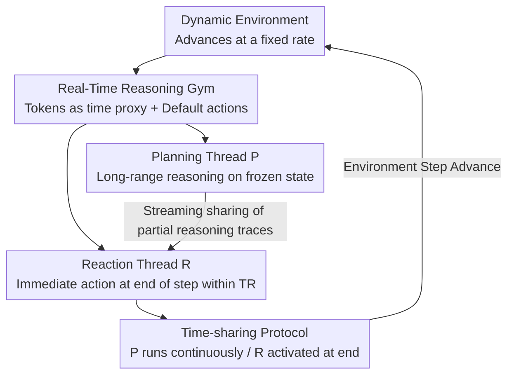

# Real-Time Reasoning Agents in Evolving Environments

**Conference**: ICLR 2026  
**OpenReview**: [https://openreview.net/forum?id=n1AvXiU2lu](https://openreview.net/forum?id=n1AvXiU2lu)  
**Code**: To be open-sourced (authors promise release upon publication)  
**Area**: Agent / LLM Reasoning  
**Keywords**: Real-time reasoning, dynamic environments, reactive agents, planning agents, dual-threading

## TL;DR
This paper introduces the new problem of "real-time reasoning"—where the environment continues to evolve while the agent is thinking—and constructs the Real-Time Reasoning Gym to measure it. Furthermore, it proposes AgileThinker, which runs a "planning thread" and a "reaction thread" in parallel. The reaction thread can read the ongoing intermediate thoughts of the planning thread, consistently outperforming single-paradigm agents as cognitive load and time pressure increase.

## Background & Motivation
**Background**: The vast majority of current LLM agent evaluations are built on an implicit assumption: the environment only advances after the agent produces an action (turn-based). Whether in ReAct-style reasoning-action loops or various planning enhancements, the environment "politely" stops to wait for the agent to complete its reasoning.

**Limitations of Prior Work**: The real world does not pause. While you are still deciding which lane to take while driving, the car ahead may have already braked, or the exit may have been passed. In such a world where "environment and computation evolve in parallel," agents face a challenge completely avoided by existing evaluations: they must be both logically correct and timely (logical **and** timely). Because existing methods assume the environment waits, their ability to "think while things change" has never been truly tested.

**Key Challenge**: A fundamental trade-off exists between reasoning depth and response latency. The deeper and more accurate the thinking, the more time it takes, and the more the environment changes. By the time reasoning is complete, the world is no longer what it was. Conversely, thinking faster allows one to keep up with changes but lacks foresight regarding future consequences. A single paradigm cannot satisfy both requirements simultaneously.

**Goal**: (1) Formalize "real-time reasoning" into a reproducible evaluation problem with adjustable difficulty; (2) Systematically compare the performance of reactive and planning agents under time pressure; (3) Design an agent that captures the benefits of both paradigms.

**Key Insight**: The authors draw on the Dual-Process Theory from cognitive science (System 1 fast intuition / System 2 slow deliberation). However, the key observation is that human dual systems do not run in isolation; the fast system can refer to the **uncompleted** thoughts of the slow system in real-time. Existing dual-system LLM methods either run the two systems independently or require one to finish before its output can be used, missing the essence of "shared intermediate states."

**Core Idea**: Enable two LLMs to run in true parallel—the planning thread performs continuous long-range reasoning, while the reaction thread is awakened at the last moment of each environmental step to read a **portion** of the planning thread's reasoning trajectory and produce an immediate action. This "shared incomplete thinking" bridges depth and speed.

## Method

### Overall Architecture
The paper is divided into two parts: defining the Real-Time Reasoning Gym evaluation platform, and then proposing three types of agent designs on top of it, culminating in AgileThinker.

The core modification in the Gym is changing the standard OpenAI Gym agent loop so that "the environment advances at a fixed rate and does not wait for the agent to finish thinking." In a conventional loop, `agent.think()` blocks until reasoning ends before calling `step`. In the real-time loop, `agent.think(timeout=T_E)` is given a fixed budget $T_E$; if a valid action is not produced before the timeout, a default action (e.g., continuing in the previous direction or staying put) is executed to force the environment forward. To remain hardware-agnostic and reproducible, the authors use the **number of generated tokens as a proxy for time**: decoding time $T = N_T \times \text{TPOT}$, where the environment advances one step for every $N_{T_E}$ tokens generated.

Three paradigms are compared on this platform: Reactive Agents (producing an action within the token budget $N_i \le N_{T_E}$ per step, ensuring timeliness but lacking depth), Planning Agents (generating multi-step action sequences or a code-policy at once, offering depth but being slow to react to environmental changes), and the parallel AgileThinker.

### Key Designs

**1. Real-Time Reasoning Gym: Formalizing Timeliness as a Reproducible Evaluation**

To address the issue that "existing evaluations assume the environment pauses," the authors reformulate the decision problem: the environment state updates at a fixed rate regardless of whether the agent has finished thinking. If no action is output, a default action is executed. To make the evaluation independent of specific hardware, the key move is **substituting wall-clock time with the number of generated tokens**. Since LLM decoding time is nearly linear with output length ($T = N_T \times \text{TPOT}$, with pre-filling time negligible for long sequences), "one step per $N_{T_E}$ tokens" becomes a hardware-independent unit. The Gym includes three games testing different aspects of dynamic environments: Freeway (dynamic hazards), Snake (fleeting opportunities), and Overcooked (collaboration with dynamic partners).

**2. Two Adjustable Knobs: Decoupling Cognitive Load and Time Pressure**

A dynamic environment alone is insufficient; one must systematically identify when systems fail. The authors designed two independent dimensions for each game. **Cognitive Load** controls task difficulty: Freeway uses the minimum steps $S$ to cross (longer roads require deeper planning), Snake uses obstacle density $N$, and Overcooked uses kitchen counter length $L$. Each game is categorized as easy, medium, or hard. **Time Pressure** controls the per-step token budget $N_{T_E}$, set at four levels: 32k, 16k, 8k, and 4k. Scores are normalized to $[0,1]$. Robust real-time reasoning is demonstrated not by absolute high scores, but by a **slower rate of decay** as load and pressure increase. Note that comparisons are made within a model family (e.g., DeepSeek-V3/R1).

**3. AgileThinker Dual-Thread Parallelism + Shared Incomplete Thinking: Combining Depth and Speed**

This is the core Mechanism of the paper, addressing the paradox that "a single paradigm cannot balance both." AgileThinker runs two parallel threads: a Planning Thread $P$ that continuously performs multi-step reasoning on the (frozen) game state, streaming its thought process; and a Reaction Thread $R$ that, under strict time constraints $T_R \le T_E$, provides an immediate action based on the **latest observation** and the **currently produced portion** of $P$'s reasoning trajectory. The fundamental difference from existing dual-system methods is that while others run systems in isolation or require System 2 to finish, $R$ can access $P$'s intermediate insights in real-time. $P$'s judgments about long-term goals are often valid over a duration, allowing $R$ to use them immediately without starting from scratch or waiting. The threads are coordinated via a **time-sharing protocol**: $P$ runs throughout the step, while $R$ is activated only during the final $T_R$ time units. The hyperparameter $T_R$ determines resource allocation; its balance is critical to success.

### Example: Comparative Study of Snake Step 3
In the same game of Snake, at step 3:

- **Reactive Agent (V3)**: Focusing only on the immediate state, it greedily rushes toward the nearest apple $(5,2)$, leading to certain death three steps later because it failed to calculate that this move traps the snake in a corner.
- **Planning Agent (R1)**: Still reasoning based on the **stale observation from step 1**. Although the snake has moved forward, it proceeds with an outdated plan and hits a wall. However, its reasoning **correctly identified** that the nearest apple has a long lifespan and should be eaten later to avoid entrapment.
- **AgileThinker**: The reaction thread reads the intermediate judgment from the planning thread ("don't rush to eat $(5,2)$") and chooses to move upward toward a safer food target $(3,5)$, avoiding the trap while keeping up with real-time changes.

This example illustrates how the planning thread provides foresight (but is slow), the reaction thread ensures timeliness (but is short-sighted), and how they complement each other through shared intermediate thinking.

### Loss & Training
This work does not involve model training; it is a framework for evaluation and inference-time agent architecture using fixed models (DeepSeek-V3 and R1). The key resource scheduling strategy is setting the reaction thread's token budget $N_{T_R}$. Experiments show performance peaks when $N_{T_R}$ approaches the "natural token upper bound" of $R$ (given by the CDF of $R$'s token usage when unforced). If too small, $R$ cannot digest $P$'s guidance; if too large, $R$ finishes early and waits while $P$ is still producing useful reasoning. While the optimal budget varies by environment, AgileThinker consistently outperforms baselines across a wide range, allowing for a rough upper-bound estimation.

## Key Experimental Results

### Main Results
Evaluations were conducted across two settings: (1) Fixed time pressure of 8k tokens/step with varying cognitive load; (2) Fixed medium load with varying time pressure (4k–32k). Each setting was averaged over 32 runs.

| Dimension Change | Paradigm | Starting Score | Ending Score | Interpretation |
| :--- | :--- | :--- | :--- | :--- |
| Cognitive Load Easy $\rightarrow$ Hard | Reactive | 0.89 | 0.15 | Crashes as difficulty rises due to lack of foresight |
| Cognitive Load Easy $\rightarrow$ Hard | AgileThinker | 0.88 | 0.50 | Decays significantly slower |
| Time Pressure Relaxed $\rightarrow$ Tight | Planning | 0.92 | 0.05 | Plan based on stale observations; fails under pressure |
| Time Pressure Relaxed $\rightarrow$ Tight | AgileThinker | 0.90 | 0.58 | Maintains high performance throughout |

Conclusion: The reactive paradigm sacrifices quality for efficiency, while the planning paradigm sacrifices efficiency for quality. Only AgileThinker remains robust as both dimensions deteriorate.

Wall-clock time validation ($T_E=6$ minutes, approx. 8k tokens/step, using measured TPOT=0.047 s/token) confirms that the advantage is not a simulation artifact:

| Environment | Reactive (V3) | Planning (R1) | AgileThinker |
| :--- | :--- | :--- | :--- |
| Freeway | 0.24 | 0.12 | 0.88 |
| Snake | 0.37 | 0.04 | 0.45 |
| Overcooked | 0.57 | 0.00 | 0.89 |

### Ablation Study

| Configuration | Key Performance | Description |
| :--- | :--- | :--- |
| AgileThinker (Full) | Consistently outperforms baselines | Dual-threading + shared intermediate thinking |
| R1 + Budget Forcing (Reactive variant) | 0.01 < 0.39 (vs V3) | Forced truncation often yields no-ops, performing worse |
| R1 + Code-Policy (Planning variant) | Effective only in Freeway-style tasks | Cannot compress complex tasks requiring Theory-of-Mind |
| $N_{T_R}$ too small (0.5k) | Low score | $R$ has insufficient time to digest $P$'s guidance |
| $N_{T_R}$ too large | Performance regression | $R$ waits idly, wasting $P$'s potential output |

### Key Findings
- The optimal reaction thread token budget $N_{T_R}$ is approximately the natural token usage upper bound for $R$, highlighting that "allowing $R$ enough time to process without wasting resources" is key.
- Token count and real reasoning time show a near-perfect linear relationship: $T = 0.0473 N + 334.55$ ($R^2 = 0.9986$), validating the abstraction of using tokens as a time proxy.
- Existing budget control methods fail to be effective across both relaxed and tight budgets, underscoring the necessity of the dual-LLM architecture.

## Highlights & Insights
- **The formalization of "non-pausing environments" is the greatest contribution**: A simple `think(timeout=T_E)` + default actions effectively addresses the "thinking while changing" problem ignored by the field.
- **Tokens as a hardware-independent time unit**: This avoids GPU/network jitter for reproducible results, while the $R^2=0.9986$ correlation proves its relevance to real wall-clock time.
- **"Reaction thread reading uncompleted planning thoughts" is a genuinely new mechanism**: Unlike previous dual-systems that are parallel-isolated or serial-dependent, "shared streaming intermediate trajectories" allows the fast system to gain foresight without the wait.
- **Evaluation philosophy**: Success is measured by the rate of decay under stress rather than absolute scores, a model useful for all time-constrained system evaluations.

## Limitations & Future Work
- **Validated only on DeepSeek**: The authors admit that open-source models are generally weaker, making system differences less pronounced. Furthermore, closed models (OpenAI/Google) do not provide reasoning traces, preventing AgileThinker from running on them.
- **Analogy to human dual-systems is heuristic**: There is no empirical proof that AgileThinker models System 1/2; the connections and differences require more rigorous evaluation.
- **Optimal $N_{T_R}$ requires empirical tuning**: While dynamic adjustment mechanisms exist, there is no universal adaptive solution across all environments.
- Environmental diversity is limited to grid-based games, which are far from the noise and complexity of the real world.

## Related Work & Insights
- **vs. Traditional RL Latency Modeling (Delay-Aware MDP / sticky-actions)**: While these handle computational delay, they are restricted to the RL domain. This paper formalizes real-time reasoning for LLM agents using token counts for fair, reproducible comparisons.
- **vs. Budget Control Methods (budget forcing / L1)**: These methods try to maximize LLM performance under fixed budgets but suffer when the budget deviates from the adapted range. This paper proves they cannot be effective across different pressure levels.
- **vs. Existing Dual-Process LLM Designs**: Most existing designs treat the two systems as sequential stages or isolated units. AgileThinker differs by allowing System 1 to access System 2's partial reasoning traces in real-time, bridging "classical real-time efficiency" with "modern LLM reasoning."

## Rating
- Novelty: ⭐⭐⭐⭐⭐ First to formalize real-time reasoning; "shared incomplete thinking" is a true innovation.
- Experimental Thoroughness: ⭐⭐⭐⭐ Extensive dual-dimension scanning and wall-clock validation, though limited to the DeepSeek model family.
- Writing Quality: ⭐⭐⭐⭐⭐ Problem motivation is exceptionally clear; case studies effectively illustrate the mechanism.
- Value: ⭐⭐⭐⭐⭐ Establishes a reproducible testbed for time-constrained AI systems with broad implications.

<!-- RELATED:START -->

## Related Papers

- [\[ICLR 2026\] Test-Time Adaptation for LLM Agents via Environment Interaction](test-time_adaptation_for_llm_agents_via_environment_interaction.md)
- [\[ICLR 2026\] Gaia2: Benchmarking LLM Agents on Dynamic and Asynchronous Environments](gaia2_benchmarking_llm_agents_on_dynamic_and_asynchronous_environments.md)
- [\[ICLR 2026\] ReVeal: Self-Evolving Code Agents via Reliable Self-Verification](reveal_self-evolving_code_agents_via_reliable_self-verification.md)
- [\[ACL 2026\] ZARA: Training-Free Motion Time-Series Reasoning via Evidence-Grounded LLM Agents](../../ACL2026/llm_agent/zara_training-free_motion_time-series_reasoning_via_evidence-grounded_llm_agents.md)
- [\[ICLR 2026\] MemGen: Weaving Generative Latent Memory for Self-Evolving Agents](memgen_weaving_generative_latent_memory_for_self-evolving_agents.md)

<!-- RELATED:END -->
