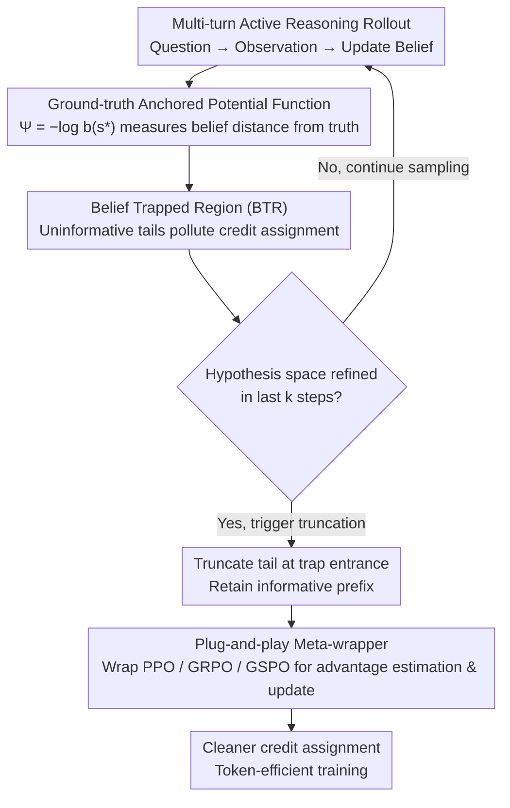

# Reducing Belief Deviation in Reinforcement Learning for Active Reasoning of LLM Agents

**Conference**: ICLR 2026 Oral  
**arXiv**: [2510.12264](https://arxiv.org/abs/2510.12264)  
**Code**: [https://github.com/unimpor/T3](https://github.com/unimpor/T3)  
**Area**: LLM Agent  
**Keywords**: active reasoning, reinforcement-learning, LLM agent, belief tracking, POMDP, credit assignment

## TL;DR

This paper proposes T³ (Truncating Belief-Trapped Trajectories), which analyzes the "belief trap" phenomenon in LLM agents during multi-turn active reasoning based on POMDP theory. By detecting belief deviation and truncating uninformative trajectory tails, it corrects credit assignment errors in RL training. T³ achieves performance gains of up to 30 points across five challenging tasks while saving 34% in token costs.

## Background & Motivation

1. **Core Challenges of Active Reasoning**: LLM agents must strategically ask questions and proactively acquire information to complete tasks in multi-turn interactions. This requires precise belief tracking—maintaining an accurate representation of the underlying state and uncertainty.
2. **Belief Deviation Problem**: Due to the limited reasoning capabilities of LLMs, internal beliefs often deviate from the true state of the problem, leading to loss of state awareness and uninformative or repetitive actions, termed "belief deviation."
3. **Vicious Cycle in RL Training**: Uninformative trajectory tails resulting from belief deviation pollute credit assignment in reinforcement learning. This causes valuable early exploration actions to be incorrectly penalized, potentially reversing advantage estimates.
4. **Multi-turn Dilemma of LLM Agents**: In practice, LLM agents frequently generate redundant, irrelevant, or uninformative actions during multi-turn reasoning, sometimes falling into invalid loops. Standard RL training does not fully resolve these issues.
5. **Imperfect Belief Updates in POMDP**: Classic POMDP assumes perfect Bayesian belief updates, but belief updates in LLM agents are inherently imperfect and prone to error, leading to cumulative bias.
6. **Limitations of Existing RL Methods**: Standard policy optimization (PPO, GRPO, etc.) ignores belief trap dynamics. The learned policies remain fragile in out-of-distribution (OOD) scenarios and lack generalization.

## Method

### Overall Architecture

T³ models active reasoning as a POMDP and utilizes a ground-truth anchored potential function to characterize the distance between the belief and the true state. The paper theoretically proves that the agent's belief falls into an inescapable "Belief Trapped Region (BTR)" after finite steps, which pollutes RL credit assignment. T³ uses an observable proxy signal to truncate trajectory tails at the trap entrance. This mechanism serves as a meta-wrapper applicable to any policy optimization algorithm (e.g., PPO, GRPO, GSPO). During rollout, it monitors sampling and truncates uninformative tails if no information gain is observed for $k$ consecutive steps, passing only the informative prefix to the base algorithm for advantage estimation.

### Key Designs

**1. POMDP Modeling & Ground-truth Anchored Potential Function: Quantifying Belief Deviation**

The difficulty of active reasoning lies in the agent's inability to see the true state $s^*$. The task is formalized as a POMDP $(S, A, O, T, R, \gamma)$, where the agent maintains a belief state $b_t \in \Delta(S)$. A potential function $\Psi(b) = -\log b(s^*)$ is introduced: it represents the negative log-probability of the true state under the current belief. $\Psi = 0$ indicates perfect localization of the truth, while higher values signify greater belief deviation. This reduces abstract reasoning progress to a monotonically comparable scalar.

**2. Belief Trapped Region (BTR) & Credit Assignment Failure: Troubleshooting Uninformative Tails**

While classic POMDPs assume perfect Bayesian updates, LLMs accumulate errors. Assumption 1 formalizes this: a constant $m_\theta > 0$ exists such that updates in high-uncertainty regions grow linearly with current deviation. Theorem 1 proves that under non-degenerate observations and Lipschitz policies, belief trajectories enter an absorbing region (BTR) in finite steps, where expected progress stagnates or worsens: $\mathbb{E}[\Psi_{t+1} \mid b_t] \geq \Psi_t$. In this region, agents output redundant or cyclic actions.

Theorem 2 highlights the fatal impact on RL: the uninformative tail distorts Generalized Advantage Estimation (GAE) for early exploration actions. The tail contributes cumulative negative drift that can dominate the positive contribution of valuable early actions, flipping their advantage estimates to negative and reversing the gradient direction. Corollary 1 provides the solution: truncating at the BTR entrance yields gradients with lower bias and corrected directions.

**3. T³ Truncation Conditions & Task Instantiation: Proxy Signals for Trap Entry**

Since $s^*$ is invisible during training, BTR entry must be detected via an observable proxy. Definition 2 introduces the T³ condition: truncation occurs at step $t$ if the refinement of the hypothesis space $d(H_\tau, H_{\tau+1}) \leq \Delta_{\min}$ for a window $[t-k, t)$. $H_t$ is the set of candidate hypotheses consistent with history. Proxy signals vary by task: for GuessNumbers, $d = |H_\tau| - |H_{\tau+1}|$ with truncation if the guess is outside the set ($k=1$); for CircuitDecoding, truncation occurs if the set doesn't shrink for $k=3$ steps; SituationPuzzles uses "unknown" feedback as a proxy ($k=5$); PreferenceEstimation and MovieRecommendation monitor similarity between estimated and ground-truth preferences, truncating if it decreases for $k=2$ steps.

**4. Plug-and-play Meta-wrapper: Zero-intrusion Integration**

T³ does not modify the underlying optimization logic. It only truncates rollouts during the sampling phase based on the defined conditions and feeds the truncated trajectories to the backbone RL algorithm. This meta-wrapper design ensures compatibility with PPO, GRPO, and GSPO without requiring changes to loss functions or network architectures, directly translating "informative prefix preservation" into cleaner credit assignment and reduced token consumption.

## Key Experimental Results

### Main Results (5 Tasks, 3 RL Algorithms)

| Method | CD (EM) | SP (F1-word) | GN (EM) | PE (Binary Sim) | MR (EM) | Avg Rank |
|------|---------|-------------|---------|-----------------|---------|----------|
| o3-mini | 92.67 | 20.64 | 95.28 | 44.67 | 83.33 | 4.67 |
| Gemini-2.5-Pro | 92.23 | 24.12 | 90.84 | 16.67 | 83.00 | 5.67 |
| PPO | 61.67 | 28.77 | 91.62 | 42.00 | 24.33 | 6.50 |
| **PPO + T³ (Ours)** | **77.83 (+16.2)** | **36.85 (+8.1)** | **93.98 (+2.4)** | **49.00 (+7.0)** | **38.00 (+13.6)** | **4.50** |
| GRPO | 79.33 | 36.46 | 61.26 | 51.67 | 12.00 | 5.50 |
| **GRPO + T³ (Ours)** | **81.33 (+2.0)** | **39.45 (+3.0)** | **91.36 (+30.1)** | **52.33 (+0.7)** | **32.67 (+20.7)** | **3.17** |
| GSPO | 77.67 | 36.63 | 96.07 | 59.00 | 14.67 | 4.33 |
| **GSPO + T³ (Ours)** | **81.00 (+3.3)** | **36.96 (+0.3)** | **99.74 (+3.7)** | **62.00 (+3.0)** | **55.67 (+41.0)** | **2.50** |

T³ achieves significant improvements in 14 out of 18 metrics. Maximum gains include GSPO+T³ on MR (+41.0 points) and GRPO+T³ on GN (+30.1 points). GSPO+T³ reaches near-perfect performance on GN (99.74).

### Ablation Study: OOD Generalization

| PE Task (PPO) | Vanilla | + T³ | CD Task (PPO) | Vanilla | + T³ |
|---------------|---------|------|---------------|---------|------|
| Ref Set S=5 | 40.0 | 44.3 (+4.3) | Candidate S=10 | 67.8 | 86.3 (+18.5) |
| S=10 | 42.0 | 49.0 (+7.0) | S=15 | 61.7 | 74.7 (+13.0) |
| S=20 | 41.0 | 53.7 (+12.7) | S=20 | 48.2 | 55.8 (+7.7) |
| S=30 | 42.3 | 46.3 (+4.0) | S=30 | 31.5 | 35.7 (+4.2) |

T³ demonstrates consistent improvements across all OOD settings, proving that the method learns generalizable active reasoning strategies.

### Training Efficiency

T³ reduces average tokens per rollout through early truncation. On PPO+CD, it reaches a reward of 0.65 using only 66.4% of the tokens required by the vanilla method. On GSPO+GN, reaching 0.96 reward requires only 76.3% of the original tokens. Training curves are more stable with monotonic or near-monotonic reward growth.

## Highlights & Insights

- **Theory Driven**: Rigorously derives the relationship between belief traps and credit assignment failure from POMDP theory.
- **Plug-and-play**: T³ can be integrated into PPO/GRPO/GSPO without modifying the underlying RL algorithm.
- **Multi-dimensional Improvement**: Simultaneously enhances final performance (up to +41 points), training stability, token efficiency (saving 34%), and OOD robustness.
- **Empirical Validation**: Provides empirical evidence for key theoretical assumptions (growth of update errors and advantage drift).
- **Insights for Frontier Models**: 7B models trained with RL+T³ can outperform o3-mini and Gemini-2.5-Pro on tasks with unbounded hypothesis spaces (SP, PE).

## Limitations & Future Work

- **Task-Specific Proxy Signals**: The T³ condition requires hand-designed observable proxies for each task, limiting immediate universality.
- **Hypothesis Space Construction**: Constructing $H_t$ and measuring $d(\cdot, \cdot)$ remains difficult for tasks with continuous or unbounded hypothesis spaces.
- **Theoretical Assumptions**: Assumption 1 (linear error growth) may only hold approximately in practice, and the threshold $U$ cannot be directly measured.
- **Evaluation Scope**: Primarily validated on information-gathering reasoning tasks; applicability to complex open-ended agent scenarios (e.g., web browsing, code generation) requires further verification.

## Related Work & Insights

### vs. Standard RL for LLM (GRPO / PPO without truncation)
Standard RL ignores belief trap dynamics, allowing uninformative tails to pollute training. T³ preserves correct credit assignment by truncating tails. The jump from 61.26 to 91.36 in GRPO on the GN task highlights the impact of truncation on gradient quality.

### vs. Frontier Reasoning Models (o3-mini, Gemini-2.5-Pro)
While frontier models excel in finite hypothesis spaces (GN, CD), they degrade significantly in large or unbounded spaces (SP, PE). This suggests that scaling RL with outcome rewards alone is insufficient for active reasoning, and mechanisms like T³ provide complementary gains.

### vs. Self-Correction Methods (Self-Refine, Reflexion)
Self-correction relies on internal reflection, which cannot solve the root problem of belief deviation if the model lacks the ability to detect its own imperfect updates. T³ intervenes at the training level by using external signals to prune harmful trajectories.

## Rating

- ⭐⭐⭐⭐⭐ Novelty: Rigorous derivation from POMDP theory to solve credit assignment via truncation.
- ⭐⭐⭐⭐ Experimental Thoroughness: Extensive coverage across 5 tasks, 3 algorithms, OOD analysis, and theoretical validation.
- ⭐⭐⭐⭐ Value: High practical value due to its plug-and-play nature and engineering benefits in token savings.
- ⭐⭐⭐⭐ Clarity: Natural transition between theoretical derivation and practical design with clear task instantiations.

<!-- RELATED:START -->

## Related Papers

- [\[ICML 2026\] On Information Self-Locking in Reinforcement Learning for Active Reasoning of LLM Agents](../../ICML2026/llm_agent/on_information_self-locking_in_reinforcement_learning_for_active_reasoning_of_ll.md)
- [\[AAAI 2026\] MoralReason: Generalizable Moral Decision Alignment For LLM Agents Using Reasoning-Level Reinforcement Learning](../../AAAI2026/llm_agent/moralreason_generalizable_moral_decision_alignment_for_llm_agents_using_reasonin.md)
- [\[ICLR 2026\] MobileRL: Online Agentic Reinforcement Learning for Mobile GUI Agents](mobilerl_online_agentic_reinforcement_learning_for_mobile_gui_agents.md)
- [\[ICLR 2026\] Language Agents for Hypothesis-driven Clinical Decision Making with Reinforcement Learning](language_agents_for_hypothesis-driven_clinical_decision_making_with_reinforcemen.md)
- [\[ICLR 2026\] WebSeer: Training Deeper Search Agents through Reinforcement Learning with Self-Reflection](webseer_training_deeper_search_agents_through_reinforcement_learning_with_self-r.md)

<!-- RELATED:END -->
