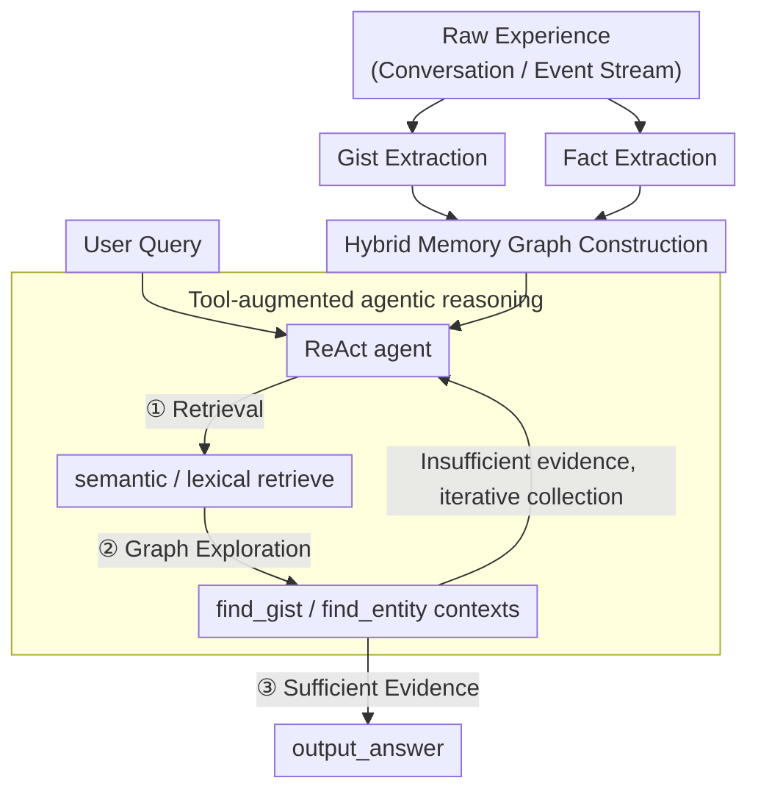

# REMem: Reasoning with Episodic Memory in Language Agents

**Conference**: ICLR 2026  
**arXiv**: [2602.13530](https://arxiv.org/abs/2602.13530)  
**Code**: [intuit-ai-research/REMem](https://github.com/intuit-ai-research/REMem)  
**Area**: LLM Agent  
**Keywords**: episodic memory, language agent, hybrid memory graph, temporal reasoning, agentic retrieval, gist extraction

## TL;DR

This paper proposes REMem, an episodic memory framework for language agents. By utilizing a hybrid memory graph (time-aware gist nodes + factual triplet nodes) and tool-augmented agentic reasoning, it outperforms SOTA methods by 3.4% and 13.4% on episodic recall and episodic reasoning tasks, respectively.

## Background & Motivation

Humans excel at remembering specific experiences and reasoning within spatio-temporal contexts (i.e., episodic memory), but current language agent memory systems exhibit significant deficiencies:

**Dominance of Semantic Memory**: Existing systems (parametric memory, RAG, GraphRAG) primarily store decontextualized semantic knowledge, lacking spatio-temporal dimensions.

**Missing Event Modeling**: Mem0 loses details due to over-filtering; Graphiti constructs entity-centric knowledge graphs that lose coherent event context; HippoRAG 2 lacks temporal dimension modeling.

**Retrieval Incapable of Supporting Reasoning**: Existing methods rely on simple similarity matching and cannot support complex cross-event reasoning (e.g., time range filtering, event sequencing, counting queries).

Core design principles of REMem:
- Cognitive science indicates that humans rely more on "gists" than verbatim memory for decision-making.
- Contextual dimensions such as time, location, and participants need to be explicitly bound to event representations.

## Method

### Overall Architecture

REMem aims to enable language agents to remember "what happened, when, and with whom" like humans, and to perform cross-event temporal reasoning over these experiences. It consists of two stages: **offline indexing**, which simultaneously extracts gists and structured factual triplets (both with timestamps) from experiences to build a "Hybrid Memory Graph"; and **online reasoning**, where a ReAct-style agent uses specifically designed retrieval and graph exploration tools to iteratively gather evidence on this graph until sufficient proof is found to answer. The entire process is LLM-driven without training any models.

### Key Designs

**1. Gist Extraction: Carrying events via "Gists" rather than verbatim memory**

Cognitive science suggests that human decision-making relies more on gists than verbatim recall. REMem generates one or more natural language gist sentences for each event or conversation, condensing core information (participants, actions, objects, locations, intentions, quantities) into atomic event descriptions. Each gist begins with a reference timestamp, and relative time expressions (e.g., "last Wednesday") are converted into absolute dates to provide temporal anchors. This step is crucial; removing gists causes the LLM-J on LoCoMo to crash from 76.2 to 48.9 (-27.3), the largest impact among all modules.

**2. Fact Extraction: Preserving structured evidence for temporal backtracking**

Gists alone are insufficient for precise reasoning tasks like counting and sequencing. REMem further extracts $(\text{subject},\text{predicate},\text{object})$ triplets from the source text and gists, attaching Wikidata-style temporal qualifiers: `point_in_time`, `start_time`, and `end_time`. Crucially, it does not delete "expired" facts but retains potential contradictions in historical records, enabling temporal queries that require looking back (e.g., "where someone lived last year vs. this year"). Facts contribute significantly to reasoning; their removal leads to a 2.4 drop in Complex-TR LLM-J.

**3. Hybrid Memory Graph Construction: Unifying conceptual and contextual information**

Pure entity graphs lose event context, while pure vector databases lose structure. REMem weaves the outputs of the previous steps into a single graph to balance both. Gist nodes carry context-level episodic representations and link to phrase nodes extracted from the same text block; phrase nodes represent concept-level information, with subject and object nodes connected by predicate edges. Following HippoRAG 2, synonym edges are added between gist nodes with embedding similarities $> 0.8$. This allows the graph to support both entity association and navigational narrative reconstruction.

**4. Tool-augmented agentic reasoning: Turning retrieval into an iterative evidence collection process**

Instead of single-step similarity matching, REMem uses a ReAct-style agent for multi-round evidence collection on the graph. It is equipped with three categories of tools: retrieval tools (`semantic_retrieve`, `lexical_retrieve`) for finding seed nodes with temporal filtering; graph exploration tools (`find_gist_contexts`, `find_entity_contexts`) for directed expansion; and a flow control tool (`output_answer`).

| Tool Category | Tool Name | Core Parameters |
|---------|--------|---------|
| Retrieval | `semantic_retrieve` | query, start_time, end_time, time operator |
| Retrieval | `lexical_retrieve` | query, start_time, end_time, time operator |
| Graph Exploration | `find_gist_contexts` | gist_id, time range |
| Graph Exploration | `find_entity_contexts` | subject, object, predicate, time range, limit, ordering, offset, aggregation |
| Flow Control | `output_answer` | answer |

The agent follows a "Retrieve → Explore → Answer" protocol. `find_entity_contexts` supports logical operations like temporal filtering, ordering, offset, and aggregation, making queries like "find the third event after sorting by time" no longer dependent on fragile similarity matching. This is the primary reason REMem achieves $> 90\%$ EM on Test of Time.

## Key Experimental Results

### Main Results — Episodic Recall

| Method | LoCoMo LLM-J | REALTALK LLM-J |
|------|-------------|---------------|
| NV-Embed-v2 (RAG) | 73.0 | 59.5 |
| Mem0 | 49.7 | 14.3 |
| Graphiti | 52.5 | 35.3 |
| HippoRAG 2 | 74.0 | 55.8 |
| **REMem-S** | **77.5** | **65.3** |
| **REMem-I** | 76.2 | 63.7 |

REMem-S achieves 77.5% LLM-J on LoCoMo (+3.5 vs. HippoRAG 2) and 65.3% on REALTALK (+9.5 vs. HippoRAG 2).

### Main Results — Episodic Reasoning

| Method | Complex-TR LLM-J | Test of Time EM |
|------|-----------------|----------------|
| NV-Embed-v2 (RAG) | 80.4 | 68.9 |
| NV-Embed-v2 + TISER | 88.3 | 68.9 |
| HippoRAG 2 | 81.5 | 66.9 |
| **REMem-I** | **89.6** | **93.1** |
| REMem-I + TISER | 92.0 | 90.6 |

REMem-I reaches an EM of **93.1%** on Test of Time, the only method to exceed 90%. Compared to Full-Context (79.7%), it provides a **+13.4pp** gain.

### Ablation Study

| Variant | LoCoMo LLM-J | Complex-TR LLM-J |
|------|-------------|-----------------|
| REMem-I (Full) | 76.2 | 89.6 |
| w/o Gists | 48.9 | 80.9 |
| w/o Facts | 74.1 | 87.2 |
| w/o Synonym Edges | 76.4 | 89.2 |
| w/o semantic_retrieve | 72.8 | 88.1 |
| w/o lexical_retrieve | 76.8 | 87.5 |

- **Removing Gists has the greatest impact**: LLM-J on LoCoMo dropped from 76.2 to 48.9, confirming gists are the core of episodic memory.
- **Facts are more important for reasoning**: Removing facts led to a -2.4 drop on Complex-TR.
- **Retrieval tools are complementary**: Semantic retrieval aids conceptual association, while lexical retrieval improves surface form coverage.

### Key Findings

1. **Rejection Behavior**: REMem achieves F1 = 64.0% (Precision 73.3%) on unanswerable questions, significantly better than Graphiti (F1 53.1%) and Mem0 (F1 13.5%).
2. **Token Efficiency**: LoCoMo queries average 9K tokens (REMem-I) or 0.9K tokens (REMem-S), compared to 26K tokens for Full-Context.
3. **Human Evaluation**: LLM-as-judge scores show 93% agreement with humans, validating the evaluation scheme.
4. **Error Analysis**: Main error types include selection/localization errors (46%), temporal/numerical reasoning errors (19%), and rejection despite evidence (18%).

## Highlights & Insights

1. **Cognitive Science Driven**: Engineers psychological concepts based on gist-based memory and situation model theories.
2. **Hybrid Graph Flexibility**: Unified representation of conceptual (fact triplets) and contextual (gists) levels balances granularity and global understanding.
3. **90%+ EM Breakthrough**: The only method exceeding 90% EM on Test of Time, demonstrating powerful temporal reasoning capabilities.
4. **Iterative Reasoning vs. Single-step Retrieval**: REMem-I significantly outperforms REMem-S on reasoning tasks (EM 93.1 vs 72.5), though the difference is smaller in recall tasks.
5. **Precise Tool Interfaces**: `find_entity_contexts` supports filtering, sorting, and aggregation, which are critical for reasoning.

## Limitations

1. Indexing depends on LLM extraction; quality is limited by the LLM’s capability.
2. Uses offline batch indexing; streaming memory construction remains an engineering challenge.
3. Multi-step tool calling in agentic reasoning increases latency and cost.
4. Primarily tested with GPT-4o-mini; generalization to other models is not fully verified.
5. Ablation shows synonym edges have a marginal impact (LLM-J -0.2~-0.4).

## Related Work & Insights

- **Vs. HippoRAG**: HippoRAG is inspired by the hippocampus for associative retrieval but lacks temporal/event dimensions; REMem explicitly models timelines.
- **Vs. Mem0**: Mem0’s over-filtering leads to sparse memory; REMem preserves comprehensive gist and fact records.
- **Vs. TISER**: TISER is a prompt-based method for temporal reasoning; it is complementary to REMem (+TISER improves Complex-TR LLM-J from 89.6 to 92.0).
- **Inspiration for Agents**: Episodic memory is the foundation for personalization and continuous learning; REMem provides a practical engineering solution.

## Rating

- **Novelty**: ⭐⭐⭐⭐ — Innovative hybrid graph; clear agentic reasoning logic.
- **Utility**: ⭐⭐⭐⭐⭐ — Directly applicable to long-term memory enhancement for conversational agents.
- **Experimental Thoroughness**: ⭐⭐⭐⭐⭐ — Four benchmarks, comprehensive comparisons, ablations, and human eval.
- **Writing Quality**: ⭐⭐⭐⭐ — Clear structure and dense information.
- **Overall Rating**: ⭐⭐⭐⭐ — Establishes a strong baseline in episodic memory; engineering contribution outweighs theoretical contribution.

<!-- RELATED:START -->

## Related Papers

- [\[ICLR 2026\] MEM1: Learning to Synergize Memory and Reasoning for Efficient Long-Horizon Agents](mem1_learning_to_synergize_memory_and_reasoning_for_efficient_long-horizon_agent.md)
- [\[ICML 2026\] AdaMEM: Test-Time Adaptive Memory for Language Agents](../../ICML2026/llm_agent/adamem_test-time_adaptive_memory_for_language_agents.md)
- [\[ICLR 2026\] Nemotron-Research-Tool-N1: Exploring Tool-Using Language Models with Reinforced Reasoning](nemotron-research-tool-n1_exploring_tool-using_language_models_with_reinforced_r.md)
- [\[ICLR 2026\] Real-Time Reasoning Agents in Evolving Environments](real-time_reasoning_agents_in_evolving_environments.md)
- [\[ICML 2026\] Scaling, Benchmarking, and Reasoning of Vision-Language Agents for Mobile GUI Navigation](../../ICML2026/llm_agent/scaling_benchmarking_and_reasoning_of_vision-language_agents_for_mobile_gui_navi.md)

<!-- RELATED:END -->
