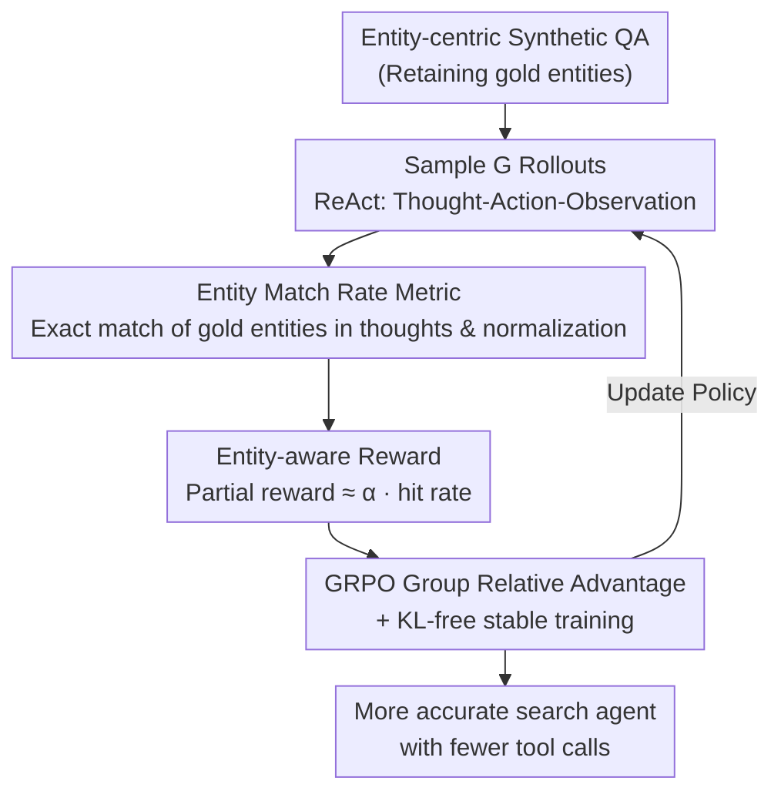

# Repurposing Synthetic Data for Fine-grained Search Agent Supervision

**Conference**: ICLR 2026  
**OpenReview**: [https://openreview.net/forum?id=CByVWPpb8T](https://openreview.net/forum?id=CByVWPpb8T)  
**Code**: To be confirmed  
**Area**: LLM Agent / Reinforcement Learning / Search Agent  
**Keywords**: Search Agent, GRPO, Entity-aware Reward, Dense Reward, Synthetic Data

## TL;DR
"Gold entities" used during synthetic data generation are repurposed as process supervision signals to propose entity-aware E-GRPO. Partial rewards are assigned to "near-miss" samples (incorrect answers with partially correct reasoning) based on entity hit rates, consistently outperforming GRPO on multiple QA and deep retrieval benchmarks while learning strategies with fewer tool calls.

## Background & Motivation
**Background**: LLM search agents increasingly rely on "entity-centric" synthetic data for training. Typically, a simple seed question is transformed through operations like fact injection and fuzzing to replace named entities with convoluted descriptions, creating nested, difficult problems. These replaced entities constitute the factual skeleton of the correct answer. The current mainstream RL method for training is Group Relative Policy Optimization (GRPO).

**Limitations of Prior Work**: GRPO employs outcome-based sparse rewards—assigning 1 for correct answers and 0 for incorrect ones—thereby discarding the entity information meticulously embedded during the data synthesis stage. This results in reward sparsity: a "near-miss" sample that correctly identifies actors (e.g., Leonardo) and movies (e.g., Titanic) but fails the final answer receives a 0, treated identically to a total failure that misunderstood the question entirely. Consequently, the model fails to learn valuable signals hidden within partially correct reasoning and is forced to relearn steps it may have already mastered.

**Key Challenge**: Search agents require fine-grained process supervision, yet methods used in mathematical or coding domains are inapplicable here. Web search is open-ended, making the cost of annotating steps for a Process Reward Model (PRM) prohibitively high. Furthermore, with trajectories often involving dozens of tool calls, step-level sampling based on tree search is computationally unattainable. This leaves a gap: how to obtain reward signals that are fine-grained, informative, and computationally inexpensive?

**Key Insight**: The authors observe that the answer is "hidden in plain sight"—the synthetic entities discarded by GRPO. They performed an empirical analysis: running 8 rollouts for each question and calculating the average gold entity hits for correct vs. incorrect rollouts. Correct rollouts hit gold entities at an overwhelming ratio of approximately 4:1 (1939 vs. 487) compared to incorrect ones. This proves that entity hit rate is a strong proxy for answer correctness.

**Core Idea**: Reuse the gold entities from synthetic data to construct a dense entity-aware reward. Instead of assigning a uniform 0 to incorrect samples, partial rewards are granted based on the proportion of entities hit during reasoning. This ensures "near-misses" score higher than "total failures."

## Method

### Overall Architecture
E-GRPO maintains the optimization backbone of GRPO but rewrites the reward function. The workflow is: take an entity-centric synthetic QA pair (retaining gold entities) and sample a set of $G$ rollouts. For each trajectory, calculate the "entity matching rate"—the exact string matching of gold entities within the agent's thought text. A dense reward is then constructed: full points for correct answers, partial rewards for incorrect answers based on the normalized matching rate, and 0 for formatting or length errors. Finally, these rewards are converted into training signals using group relative advantage to update the policy. This modification incurs almost zero extra computational cost as entity matching is merely string comparison.

### Key Designs

**1. Entity Match Rate: Quantifying fine-grained signals from discarded entities**

To reuse entities, one must quantify "how correct the reasoning is." Given a synthetic QA $(q, gt)$, let $E_q=\{e^{(1)},\dots,e^{(m)}\}$ be the set of $m$ gold entities used during generation. For a rollout $H^{(i)}$, the entity match rate is calculated by matching these entities within the concatenated thought snippets:

$$\gamma_i = \frac{|E^{(i)}_{matched}|}{|E_q|} = \frac{|E^{(i)}_{matched}|}{m}.$$

To account for varying difficulty across questions, group-wise normalization is applied by dividing by the maximum hit rate observed in the group $\gamma_{max}=\max_j \gamma_j$, yielding $\hat{\gamma}_i = \gamma_i / \gamma_{max}$ (taking 0 if $\gamma_{max}=0$). This scales all rollouts to a 0–1 range, ensuring stable advantage calculation across groups. Analysis of the normalized match rate distribution shows correct samples (green) peak at 1.0, while incorrect samples (red) are bimodal—one peak at 0.0 (total failure) and another spread across mid-to-high ranges (valuable "near-misses"), indicating this metric effectively distinguishes near-misses from total failures.

**2. Entity-aware Reward: Creating a dense spectrum for negative sample quality**

With the match rate, the reward function is redefined. Unlike GRPO where $R_i\in\{0,1\}$ (yielding zero gradients for groups where all samples are incorrect), E-GRPO uses a three-tier reward:

$$R_i = \begin{cases} 1 & H^{(i)} \text{ is correct} \\ \alpha \cdot \hat{\gamma}_i & H^{(i)} \text{ is incorrect} \\ 0 & H^{(i)} \text{ has errors (format/length)} \end{cases}$$

Here, $\alpha\in[0,1]$ is a hyperparameter balancing "correctness" and "entity hits." This design provides two benefits: first, it creates a dense reward spectrum among incorrect samples—a near-miss hitting 'Leonardo' receives $\alpha\cdot 0.5$, outscoring a total failure (0). Second, even if an entire group is incorrect, non-zero reward differences exist if entities were hit, providing learning signals where standard GRPO would have none. This reward is converted into token-level advantage $\hat{A}_{i,j} = (R_i - \text{mean}(\{R_k\})) / \text{std}(\{R_k\})$ for the GRPO objective.

**3. KL-free Training & Error Handling: Ensuring policy stability**

To stabilize training under dense rewards, cold-start SFT (11K SailorFog-QA samples) is performed first so the model learns the agent's output format. Following DAPO, the KL regularization term is removed, and a clip-higher bound $\varepsilon_{high}$ is used to encourage exploration. Regarding error handling, rollouts with formatting errors are strictly penalized with 0 reward. Over-length rollouts also receive 0 but are included in the group mean/std calculation while being excluded from the final loss to prevent policy collapse.

## Key Experimental Results

### Main Results
Evaluated across 11 benchmarks (single/multi-hop QA + 4 deep retrieval tasks) using Qwen2.5-7B-Instruct and Qwen3-30B-A3B (dense and MoE architectures) in Local (Wiki corpus) and Web (live internet) environments. Qwen2.5-72B served as LLM-as-Judge, reporting Pass@1 / Pass@3.

| Setting | Model | Average | Relative Gain (vs GRPO) |
|------|------|------|----------|
| Local QA | Local-7B-SFT | 60.2 | — |
| Local QA | Local-7B-GRPO | 61.4 | baseline |
| Local QA | Local-7B-E-GRPO | **64.2** | +2.8 (+4.0 vs SFT) |
| Web QA | Local-7B-GRPO | 66.2 | baseline |
| Web QA | Local-7B-E-GRPO | **67.8** | +1.6 |

On deep retrieval benchmarks (Web environment), E-GRPO consistently outperformed GRPO at both scales:

| Model | GAIA P@1 | BrowseComp | BrowseComp-ZH | xbench-DS |
|------|----------|-----------|---------------|-----------|
| WebSailor-32B | 53.2 | 10.5 | 25.5 | 53.3 |
| Web-30B-GRPO | 47.6 | 12.3 | 25.7 | 45.3 |
| Web-30B-E-GRPO | **48.5** | **12.9** | **26.4** | **46.7** |

Web-30B-E-GRPO achieved the best performance among open-source agents $\le$32B on BrowseComp (12.9) and BrowseComp-ZH (26.4), even surpassing Claude-4-Sonnet (12.2) on BrowseComp.

### Ablation Study

| Configuration | Key Result | Description |
|------|---------|------|
| $\alpha=0.0$ | Reverts to GRPO | No entity reward provided |
| $\alpha=0.1$ | General improvement | Slight entity rewards provide gains |
| $\alpha=0.3$ | **Peak** | Optimal across various benchmarks |
| $\alpha=0.5$ | Performance drop | Excessive entity reward distracts from "correctness" |
| Pass@3 (GAIA) | GRPO 44.7 $\rightarrow$ E-GRPO 51.5 | +6.8, most significant gain in Pass@3 |

### Key Findings
- **Entity match rate is a valid proxy**: Training dynamics show entity match rate and accuracy curves correlate; by incentivizing entity hits, E-GRPO translates this sub-goal into final accuracy gains.
- **More efficient policies**: E-GRPO consistently completes rollouts with fewer tool calls; rewards for hitting key entities guide the agent toward more direct, informative paths.
- **Significant Pass@3 gains**: While GRPO's outcome rewards tend to polish existing successful strategies, E-GRPO encourages exploration of "promising but incomplete" paths, building a more diverse set of solutions.
- **Optimal $\alpha$**: A value of 0.3 is the "sweet spot"; 0.5 can cause the model to deviate from the primary objective of answering correctly.

## Highlights & Insights
- **Repurposing Perspective**: Entities discarded during synthesis, previously considered "trash," are identified as free process supervision. This requires no PRM training or tree search, only string matching, making the computational cost nearly zero.
- **Statistical Evidence First**: The authors established empirical evidence (the 4:1 ratio) showing entity hit rates correlate with correctness before designing the reward, ensuring methodological consistency.
- **Transferability**: The strategy of using intermediate artifacts from synthetic data as rewards can be generalized. Any task with programmatic data synthesis (e.g., intermediate variables in synthetic code, steps in math problems) could potentially adopt similar dense rewards.

## Limitations & Future Work
- **Dependency on Synthetic Metadata**: The method requires training data to have recorded gold entities during generation; it is inapplicable to real-world datasets lacking these intermediate artifacts.
- **Exact Matching Constraints**: Synonyms, abbreviations, or cross-lingual entities might fail string matching, potentially underestimating the true hit rate.
- **Restricted to Thought Text**: Entities appearing in tool calls or observations but omitted from the 'thought' text are ignored.
- **Limited RL Scale**: To validate the algorithm, a relatively small RL pool (1k samples) was used. While it validates the approach, performance at a much larger scale remains to be verified.

## Related Work & Insights
- **vs. GRPO / DAPO**: All belong to group-relative policy optimization. E-GRPO differentiates negative sample quality by inserting the $\alpha\cdot\hat\gamma$ dense term, whereas GRPO treats all incorrect samples equally.
- **vs. PRM / Tree Search**: Mathematics and coding rely on PRMs or tree search for process rewards. In open-ended web search, annotation is too expensive and trajectories too long. E-GRPO provides a lightweight alternative by bypassing expensive labeling.
- **vs. ASearcher / SailorFog-QA**: These are entity-centric data synthesis methods. E-GRPO closes the loop between "data synthesis" and "reward design" by reusing the entities generated by these methods.

## Rating
- Novelty: ⭐⭐⭐⭐⭐ Elegant and simple approach to the sparse reward problem in GRPO by repurposing synthetic artifacts.
- Experimental Thoroughness: ⭐⭐⭐⭐ Extensive benchmarks and scales; however, the RL data size is somewhat small.
- Writing Quality: ⭐⭐⭐⭐⭐ Methodically sound, from correlation analysis to reward design.
- Value: ⭐⭐⭐⭐ A plug-and-play reward improvement with negligible cost, directly applicable to search agent training.

<!-- RELATED:START -->

## Related Papers

- [\[ACL 2026\] SynthAgent: Adapting Web Agents with Synthetic Supervision](../../ACL2026/llm_agent/synthagent_adapting_web_agents_with_synthetic_supervision.md)
- [\[ICLR 2026\] Search Self-Play: Pushing the Frontier of Agent Capability without Supervision](search_self-play_pushing_the_frontier_of_agent_capability_without_supervision.md)
- [\[ICLR 2026\] WebSailor-V2: Bridging the Chasm to Proprietary Agents via Synthetic Data and Scalable Reinforcement Learning](websailor-v2_bridging_the_chasm_to_proprietary_agents_via_synthetic_data_and_sca.md)
- [\[ICLR 2026\] Agent Data Protocol: Unifying Datasets for Diverse, Effective Fine-tuning of LLM Agents](agent_data_protocol_unifying_datasets_for_diverse_effective_fine-tuning_of_llm_a.md)
- [\[ICLR 2026\] Tree Search for LLM Agent Reinforcement Learning](tree_search_for_llm_agent_reinforcement_learning.md)

<!-- RELATED:END -->
