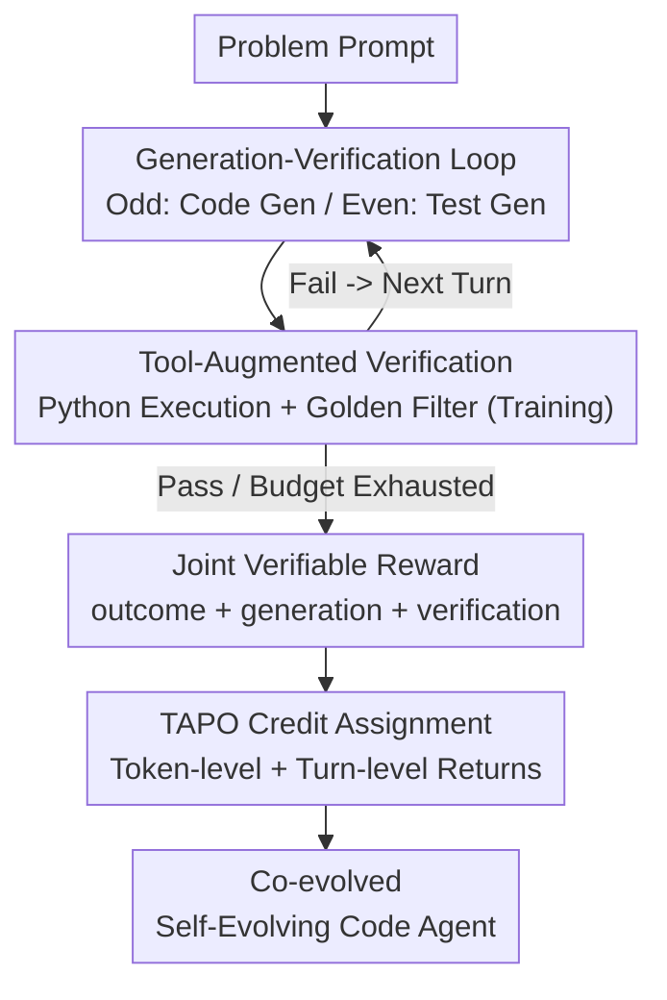

# ReVeal: Self-Evolving Code Agents via Reliable Self-Verification

**Conference**: ICLR 2026  
**OpenReview**: [https://openreview.net/forum?id=q56ZI1Co43](https://openreview.net/forum?id=q56ZI1Co43)  
**Code**: https://ReVeal.github.io/  
**Area**: Agent / LLM Reasoning / Reinforcement Learning  
**Keywords**: Code Generation, Self-Verification, Multi-turn RL, Test-time Scaling, Credit Assignment

## TL;DR
ReVeal organizes code generation into an alternating "generation-verification" multi-turn loop and explicitly optimizes self-verification capabilities using a turn-level reinforcement learning algorithm (TAPO). This allows a 32B model, trained for only 3 turns, to continuously self-correct for over 20 turns during inference, driving the Pass@1 on LiveCodeBench V6 from 34.8% up to 38.7%.

## Background & Motivation
**Background**: Reinforcement Learning from Verifiable Rewards (RLVR) is the dominant approach to enhancing LLM reasoning, as seen in DeepSeek-R1 and OpenAI's o-series, which foster "reflection + self-verification" capabilities. Recent analyses attribute these gains to **verification–generation asymmetry**: verifying a solution is generally easier than generating one from scratch, which serves as the underlying mechanism for test-time scaling.

**Limitations of Prior Work**: Existing RLVR methods primarily use **outcome rewards** (final correct/incorrect status) to supervise long reasoning chains, **never explicitly optimizing verification itself**. Consequently, model self-verification remains unreliable—producing verbose but uninformative "reflections" or relying on guesswork for difficult problems. Furthermore, performance often plateaus when test-time compute exceeds the reasoning step budget used during training.

**Key Challenge**: Complex problems (e.g., competitive programming) inherently require iterative "verification-revision" cycles, where accurate feedback is crucial for guiding revisions. Current methods either train a separate critic model for scoring (lacking tool feedback and adding inference overhead) or rely on pre-existing public test cases (which are rarely available in reality). Both paths provide limited, non-generalizable verification, leaving self-verification unreliable.

**Goal**: Transform "verification" from a byproduct into a **primary optimization objective** to actively **enlarge** the V-G asymmetry. By making verification more reliable and accessible, the model can leverage these signals to drive the evolution of increasingly difficult generation processes during inference.

**Key Insight**: Utilize the same policy to serve as both generator and verifier. The model constructs its own test cases, executes them via a Python interpreter to obtain fine-grained feedback from the real environment, and revises the code in subsequent rounds—eliminating dependence on external critics or pre-set tests.

**Core Idea**: Use dense, turn-level rewards to **explicitly supervise verification quality**, coupled with a credit assignment algorithm (TAPO) designed to prevent reward cheating. This ensures that code and tests **co-evolve** during training, turning verification signals into a reliable driver for continuous improvement.

## Method

### Overall Architecture
ReVeal addresses how a code agent can reliably verify and correct code autonomously without existing tests. It decomposes long-range reasoning into **alternating generation and verification turns**: odd turns (generation) produce candidate code `<generation-answer>`, while even turns (verification) synthesize and execute test cases `<verification-answer>`, interspersed with tool feedback `<tool-feedback>`. A shared policy LLM performs both tasks, allowing solutions and verification strategies to evolve together under a single training scheme. The loop continues until a valid solution is found or the turn budget $K$ is exhausted.

The training logic hinges on rewards and credit assignment: ReVeal splits rewards into outcome, generation, and verification components. TAPO then distributes these rewards **at both the token and turn granularities**, aligning with final correctness while providing dense supervision for intermediate verification steps and preventing "reward hacking" (generating junk code to trick verification rewards).

### Key Designs

**1. Alternating Generation-Verification Loop: Closing the Loop with Tool Feedback**

To address unreliable self-verification and the tendency for models to "guess" on hard problems, ReVeal structures reasoning into alternating turns. In each turn, the model thinks freely before providing structured output: executable code in `<generation-answer>` and executable tests in `<verification-answer>`. During verification, the model proactively assumes potential failure modes and boundary conditions to design diverse tests. The `<tool-feedback>` section records execution results—runtime errors, invalid tests, and for each valid test, the expected output, actual output, and pass/fail status. The model reads these traces and errors to diagnose root causes and adjusts both candidate code **and** the verification plan in the next turn. This closed loop requires no external critic or pre-set tests, linking "error identification → strategy revision → turn-by-turn refinement" via tool feedback.

**2. Tool-Augmented Verification + Golden Filter: Reliable Supervision via Execution**

Reliable verification requires credible test cases. ReVeal uses a Code Judge execution environment supporting both functional and SEO/standard I/O test formats. A critical asymmetric design exists between training and inference: **During training**, a filtering mechanism is used—test cases generated by the model are only executed against the candidate code if they first pass against the **golden solution**. This ensures execution traces provide valid supervision and direct exploration toward the correct solution. **During inference**, golden solutions are unavailable; all generated tests are executed directly, making verification entirely autonomous. This "golden-standard-backed training, autonomous inference" setup places high demands on the model's ability to generate high-quality tests, which is the primary focus of the RL algorithm. Tool feedback also expands the RL exploration space by exposing specific failure modes, pushing the policy toward more promising regions and helping it escape local optima, resulting in a higher Pass@k than the base model. Note that the `<tool-feedback>` section is excluded from the loss calculation during training; it serves only as input context to maintain stability and coherence across multi-turn rollouts.

**3. Joint Verifiable Rewards: Optimization of Verification Quality**

To train generation and verification simultaneously, ReVeal decomposes the reward into three complementary components. **Outcome reward** supervises the final solution: $r_{\text{outcome}} = r_{\text{format}} + r_{\text{passrate}}$, where $r_{\text{format}} \in \{1, -1\}$ ensures compliance with output tags, and $r_{\text{passrate}} = 5 \times \text{passrate}$, resulting in $r_{\text{outcome}} \in [-1, 6]$. **Generation reward** rewards "real improvement across turns": for turn $k$ (odd),

$$r^k_{\text{gen}} = \begin{cases} r^1_{\text{passrate}}, & k=1 \\ \text{abs} \cdot r^k_{\text{passrate}} + \text{imp} \cdot \big(r^k_{\text{passrate}} - r^{k-2}_{\text{passrate}}\big), & k \ge 3 \end{cases}$$

The paper sets $\text{abs}=0, \text{imp}=1$, meaning it rewards only the **gain** in code accuracy relative to the previous generation. **Verification reward** for turn $k$ (even) rewards the proportion of generated tests that pass on the golden code: $r^k_{\text{ver}} = \#\{\text{passed tests}\} / \#\{\text{generated tests}\}$. These three rewards naturally couple generation and verification into a co-evolving loop.

**4. TAPO Dual-Granularity Credit Assignment: Precise Rewards to Prevent Hacking**

Using only an outcome reward for long chains leads to imprecise credit for intermediate verification steps, often resulting in "blind reflection." TAPO (Turn-Aware Policy Optimization) retains the PPO actor-critic framework but modifies the advantage estimator with **turn-aware returns**. It combines two levels of returns: **Token-level return** uses $\lambda=\gamma=1$ (Monte Carlo), placing $r_{\text{outcome}}$ entirely on the final token ($R_t = r_t + R_{t+1}$) to align with final correctness. **Turn-level return** uses anti-cheating rules: each generation reward is assigned to its own generation turn **and the immediately preceding verification turn**, while each verification reward is restricted **only** to its own verification turn. This ensures generation turns earn rewards solely based on code quality rather than whether the verification "succeeded," closing the loophole of generating trivial code to hack verification rewards. The final return is the sum of both levels $\widetilde{R}_t = R_t + R^{\text{turn}}_t$, and the advantage $A_t = \widetilde{R}_t - V_t$ replaces the standard GAE. This design creates a positive feedback loop: stronger tests expose errors → drive code improvement → reinforced by generation rewards → better code raises the bar for verification → forcing the model to generate harder tests. TAPO is a general credit assignment algorithm applicable to any reasoning task where both generation and verification have verifiable rewards.

### A Complete Example
Using a competitive programming problem from LiveCodeBench: **Turn 1 (Generation)** the model thinks and outputs a candidate code; **Turn 2 (Verification)** it assumes failure modes and boundary conditions, generating several test cases; the Python interpreter executes them and `<tool-feedback>` reports a mismatch in a boundary case and a runtime error; the model diagnoses the boundary logic error from the trace, and in **Turn 3 (Generation)**, it revises the code while adjusting the verification plan. Training is limited to 3 turns, but this reliable self-verification capability extrapolates to 20+ turns during inference—increasing Pass@1 from 34.8% at turn 1 to 36.7% at turn 3, and eventually reaching 38.7% at turn 25. To manage context bloat, ReVeal uses a short-term memory mechanism, retaining only the 3 most recent turns.

### Loss & Training
The base model is DAPO-Qwen-32B (pre-strengthened with math data), further refined with RL on code data. Training data comes from TACO (26,443 problems), filtered to remove interactive/image-based problems and unified into two test formats, keeping only problems where golden solutions pass their own tests (11,151 for training, 509 for testing). The verl framework is used for training on 8/16 AMD Mi300x GPUs, with a maximum turn budget of 3 during RL training.

## Key Experimental Results

### Main Results
Comparison on LiveCodeBench V6 and CodeContests. Pass@1 denotes success rate, $\Delta\uparrow$ denotes the ratio of "initially wrong corrected to right," and $\Delta\downarrow$ denotes "initially right revised to wrong" (lower is better).

| Method | LCB V6 Pass@1 | LCB $\Delta\uparrow$ | LCB $\Delta\downarrow$ | CodeContests Pass@1 |
|------|------|------|------|------|
| Qwen2.5-32B-Instruct (base) | 24.8 | - | - | 13.3 |
| DAPO-Qwen-32B | 31.1 | - | - | 18.5 |
| w/ critic×5 CTRL | 33.4 | 3.75 | 0.89 | - |
| Single-turn RL (outcome-only) | 32.8 | - | - | 21.0 |
| **ReVeal×25** | **38.7** | **7.50** | **0.0** | **33.6** |

ReVeal significantly outperforms the single-turn RL baseline. Even at turn 1 (equal inference budget), its 34.8% Pass@1 is higher than single-turn RL, suggesting multi-turn training internalizes exploration gains into a stronger policy. Compared to critic-based methods (CTRL), ReVeal achieves higher revision rates and near-zero degradation ($\Delta\downarrow=0.0$) using only self-verification, demonstrating extremely high reliability.

### Ablation Study
Comparison of TAPO joint rewards at the same turn budget:

| Configuration | LCB V6 Pass@1 | $\Delta\uparrow$ | $\Delta\downarrow$ | CodeContests Pass@1 |
|------|------|------|------|------|
| ReVeal×8 w/ outcome reward | 36.1 | 4.69 | 1.32 | 27.4 |
| ReVeal×8 w/ TAPO joint reward | **37.7** | **5.62** | **0.0** | **30.4** |

TAPO joint rewards yield higher Pass@1, larger $\Delta\uparrow$, and reduce $\Delta\downarrow$ to 0. The higher $\Delta\downarrow$ for outcome-only rewards suggests that insufficient verification optimization drives erroneous revisions.

### Key Findings
- **Test-time Scaling Extrapolates**: Models trained on only 3 turns continue to improve up to 25 turns (34.8% → 38.7%); newly discovered solutions can be distilled back into the model.
- **Pushing Inference Boundaries**: ReVeal consistently outperforms the base and single-turn RL models across Pass@k (k=1–128), while single-turn RL gains vanish for $k \ge 32$. This is attributed to "verification-driven exploration."
- **Co-evolving Generation and Verification**: Test case accuracy increases from ~50% at step 40 to nearly 88% during training; the final solution accuracy is consistently better than turn 1 and the gap widens over training.
- **TAPO Yields Higher Gains on Longer Chains**: Outcome-only signals are too coarse for long chains; dense turn-level supervision provides significantly more gain in long-chain scenarios with strong base models.

## Highlights & Insights
- **Verification as a First-Class Objective**: While most RLVR only optimizes "correctness," ReVeal explicitly optimizes "verification accuracy," actively enlarging V-G asymmetry—a paradigm shift applicable to any task where verification is easier than generation.
- **Elegant Anti-Cheating Credit Assignment**: Assigning the generation reward to both the current turn and the previous verification turn, while restricting the verification reward to its own turn, effectively closes the loophole of generating trivial code.
- **Training/Inference Asymmetry**: Training uses golden filters to ensure supervision quality, while inference is fully autonomous. This setup stabilizes training without "cheating" during inference.
- **Single Policy for Generation + Verification**: This reduces the cost of training and coordinating external critic models and allows for cross-capability transfer.

## Limitations & Future Work
- **Domain Restricted to Executable Verification**: The method relies heavily on environments where tests are executable and feedback is verifiable (e.g., code), limiting transferability to open-ended tasks like creative writing.
- **Golden Label Dependency during Training**: Both the verification reward $r_{\text{ver}}$ and test filtering require golden solutions, limiting scaling on real-world data where such labels are scarce.
- **Computational Cost**: 32B models with multi-turn rollouts and tool execution involve significant training and inference overhead; short-term memory only limits context size, not the total turns.
- **Future Directions**: Distilling new solutions for continuous learning, combining with other tool-augmented RL methods, and scaling to smaller models and broader benchmarks.

## Related Work & Insights
- **vs. CTRL (Independent Critic)**: CTRL trains a separate critic for 5 rounds of critique-revision without tool feedback. ReVeal uses a single policy with tool execution, achieving a higher Pass@1 (38.7 vs 33.4) and lower degradation, proving joint optimization is more efficient.
- **vs. Single-turn RL (Outcome-only)**: Single-turn RL lacks explicit verification optimization, and gains vanish at large $k$; ReVeal’s dense rewards push the inference boundary further.
- **vs. ReAct / Reflexion (Prompt Heuristics)**: These rely on prompts for self-criticism without verifiable turn-level supervision, leading to unreliable verification on hard problems. ReVeal turns verification into a trainable RL objective.
- **vs. Search-R1 / ReTool / ToRL (Tool-augmented Multi-turn RL)**: These are mostly outcome-driven and do not explicitly optimize verification or assign credit across turns; ReVeal’s TAPO complements these by providing fine-grained rewards.

## Rating
- Novelty: ⭐⭐⭐⭐⭐ Explicitly optimizing verification as a first-class objective and dual-granularity credit assignment (TAPO) represent substantial innovations in the RLVR paradigm.
- Experimental Thoroughness: ⭐⭐⭐⭐ Solid across multiple benchmarks and models with comprehensive analysis, though additional baseline comparisons in main tables would be beneficial.
- Writing Quality: ⭐⭐⭐⭐ Clear logic from motivation to analysis; the theme of V-G asymmetry is well-maintained.
- Value: ⭐⭐⭐⭐⭐ Provides a practical, transferable training paradigm for self-evolving code agents and test-time scaling in long-range reasoning.

<!-- RELATED:START -->

## Related Papers

- [\[ICLR 2026\] Pushing Test-Time Scaling Limits of Deep Search with Asymmetric Verification](pushing_test-time_scaling_limits_of_deep_search_with_asymmetric_verification.md)
- [\[ICLR 2026\] Zephyrus: An Agentic Framework for Weather Science](zephyrus_an_agentic_framework_for_weather_science.md)
- [\[ICLR 2026\] Helmsman: Autonomous Synthesis of Federated Learning Systems via Collaborative LLM Agents](helmsman_autonomous_synthesis_of_federated_learning_systems_via_collaborative_ll.md)
- [\[ICLR 2026\] ToolTree: Efficient LLM Agent Tool Planning via Dual-Feedback Monte Carlo Tree Search and Bidirectional Pruning](tooltree_efficient_llm_tool_planning_via_dual-feedback_monte_carlo_tree_search_a.md)
- [\[ICLR 2026\] GTool: Graph Enhanced Tool Planning with Large Language Model](gtool_graph_enhanced_tool_planning_with_large_language_model.md)

<!-- RELATED:END -->
