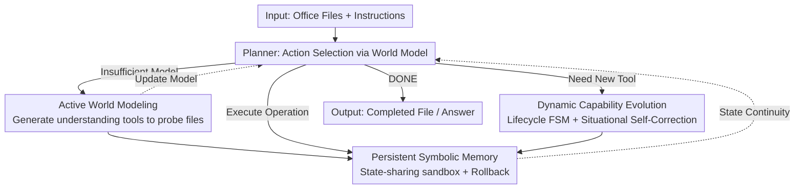

# ROGA: Scaling Generalist Agents for Office Productivity Tasks via Tool Generation

**Conference**: ICLR 2026  
**OpenReview**: [https://openreview.net/forum?id=KTyLxtODB9](https://openreview.net/forum?id=KTyLxtODB9)  
**Code**: https://github.com/morgen52/roga  
**Area**: Agent / Tool Generation / Office Automation  
**Keywords**: Generalist Agent, Automated Tool Generation, World Model, Symbolic Memory, Capability Evolution

## TL;DR
Addressing the severe performance drop of existing "Automated Tool Generation" (ATG) agents in long-horizon, stateful office tasks, ROGA restructures the agent paradigm. It utilizes active world modeling to complete partially observable file contexts, persistent symbolic memory to maintain cross-step states, and dynamic capability evolution to make generated tools reusable. ROGA improves task success rates by up to 13.64% on benchmarks like OSWorld, WindowsAgentArena, and GAIA-Office, even outperforming specialized agents on spreadsheet tasks.

## Background & Motivation

**Background**: LLM-based tool agents are shifting from "handcrafted fixed toolsets per task" toward "Generalist Agents + Automated Tool Generation (ATG)." ATG allows agents to write new tools on the fly when existing ones are insufficient (e.g., Craft, Trove, Creator) and has been integrated into generalist frameworks like AutoAgent and Alita to generalize to open tasks without extensive manual labor.

**Limitations of Prior Work**: The authors focus on the **office ecosystem** (Excel / Word / PowerPoint), a typical long-horizon, stateful, and partially observable scenario. A motivation experiment comparing three representative ATG agents (AutoAgent / OctoTools / OWL) with a domain-specialized agent, SheetAgent, finds that ATG agents lag behind specialized agents by as much as **27.43%** in Pass@1 (e.g., 24.04% for AutoAgent vs. 51.47% for SheetAgent on TableBench). Essentially, the current "reactive" ATG paradigm cannot handle real-world office tasks.

**Key Challenge**: The authors attribute the performance drop to three fundamental flaws in the existing paradigm: (1) **Failure to build a coherent world model**: Current methods rely on passively "reading the whole file," but LLM context windows cannot fit lengthy, partially observable office documents. (2) **Stateless execution model**: Tool calls are treated as isolated, stateless functions, breaking the state chain when operating on the same object across steps. (3) **Static capability generation**: Tools are generated one-off for immediate needs; similar steps are repeated, leading to waste and a lack of experience accumulation.

**Goal**: To enable generalist ATG agents to truly excel in long-horizon, stateful, and partially observable office tasks by solving the sub-problems of "world modeling, state persistence, and capability reuse."

**Key Insight**: Agent operation is modeled as a discrete-time decision process where the state $S_t=(F_t, M_t, T_t)$ includes file context, symbolic memory, and capability set. At each step, an action $a_t\sim\pi(S_t)$ is selected from $\{$tool generation, tool execution, finish$\}$, and the state is updated via $S_{t+1}=\delta(S_t,a_t)$. The flaws are addressed by strengthening the understanding of $F_t$, the continuity of $M_t$, and the evolution of $T_t$.

**Core Idea**: Upgrade the reactive loop into a structured, state-aware agent paradigm using a "triad": active probing for world modeling, persistent symbolic memory for state maintenance, and lifecycle-based capability evolution for reuse.

## Method

### Overall Architecture

ROGA organizes office task solving into a discrete decision loop driven by a Planner. The input consists of lengthy, partially observable office files $F_t$ and user instructions; the output is the completed file or answer. At each step, the **Planner** decides the next action based on the current world model (stored in symbolic memory $M_t$). When the world model is insufficient, it enters the **Understanding Phase**, generating "understanding tools" to probe files. When understanding is sufficient, it enters the **Operation Phase**, where the **Executor** runs "operation tools" in a state-sharing sandbox and records intermediate states. All tool generation, validation, reuse, and deprecation are managed by the **Tool Manager + Tool Generator/Validator** based on the capability lifecycle. These components strengthen $F_t$, $M_t$, and $T_t$ respectively until the Planner outputs DONE.

### Key Designs

**1. Active World Modeling (AWM): From "Passive Reading" to "Active Probing"**

To address the issue of context windows failing to accommodate entire documents, ROGA inserts a specialized **Understanding Phase** before operations. When the Planner identifies a gap in the world model within $M_t$, it enters a metacognitive loop: identifying the knowledge gap → formulating it as a specific information retrieval sub-goal (e.g., "Which worksheets contain pivot tables?") → dynamically generating and calling a **specialized understanding tool**. These tools have fixed signatures (input data, output metadata string, LLM dependency) used to extract Excel formulas, Word styles, or PPT layouts. The answers are merged into the world model in $M_t$, filling gaps block-by-block, while the generated tools are added to $T_t$ for reuse. This "probing" approach breaks partially observable environments into manageable questions, reducing omissions and modularizing functionality.

**2. Persistent Symbolic Memory (PSM): A State Ledger for Cross-Step Continuity**

To solve "stateless execution," ROGA introduces Persistent Symbolic Memory—not just shared memory, but an **explicit symbolic state ledger** $M_t$. It maintains symbolic handles for all intermediate products (code objects, file handles, dataframes, etc.) and tracks their evolution. This allows tools at step $t$ to directly reference and manipulate objects created at step $t-i\ (i\in[1,t-1])$, supporting temporal reasoning. Implementation relies on a **state-sharing sandbox** with a unified API for tools to save/load intermediate states, ensuring the ledger $M_t$ remains consistent. To ensure the integrity of the state chain, the sandbox enforces **Atomicity** and **Reversibility**: each tool call either succeeds fully and commits a new state $M_{t+1}$, or fails and rolls back to $M_t$. This record-and-replay mechanism prevents errors from polluting the state chain.

**3. Dynamic Capability Evolution: Managed Tool Lifecycle via "Retain-Refine-Reuse"**

Instead of one-off generation, ROGA treats tool creation as **continuous meta-learning** for the capability set $T_t$. This involves two components. First is the **Capability Lifecycle Formalization**, using a Finite State Machine (FSM) to track evolution: Generated (candidate template), Active (verified and reliable), In-use (mapped to current context), Modifying (targeted refinement after failure), and Deprecated (removed after repeated failures). Each "capability-to-task" mapping produces an **adaptability score** that guides retrieval and evolution. Second is **Situational Self-Correction (SSC)**, which performs state-aware validation in two channels: **State-aware functional testing** in a "shadow sandbox" that perfectly replicates $M_t$ (checking if it produces expected effects in the current state), and **Semantic intent verification** using an LLM to check alignment with user intent and file context. Success promotes a tool to Active, while failure triggers a transition to Modifying with precise context.

## Key Experimental Results

### Main Results

End-to-end execution success rate (Exec@1) and task success rate (Pass@1) on office tasks (using GPT-4.1 as the backbone LLM):

| Benchmark | Metric | ROGA | Strongest Baseline | Gain |
|------|------|------|----------|------|
| OSWorld | Exec@1 | 95.45 | 79.09 (OWL) | +16.36 |
| OSWorld | Pass@1 | 31.82 | 18.18 (OctoTools) | +13.64 |
| WindowsAgentArena | Exec@1 | 97.62 | 76.19 (OWL) | +21.43 |
| WindowsAgentArena | Pass@1 | 28.57 | 26.19 (OctoTools) | +2.38 |
| GAIA-Office | Exec@1 | 96.15 | 92.31 (OWL) | +3.84 |
| GAIA-Office | Pass@1 | 76.92 | 73.08 (OWL) | +3.84 |

On challenging spreadsheet-only tasks, ROGA outperforms specialized agents like SheetAgent:

| Benchmark | Metric | ROGA | SheetAgent |
|------|------|------|------------|
| TableBench | Exec@1 / Pass@1 | 95.03 / 56.09 | 89.39 / 51.47 |
| SheetCopilotBench | Exec@1 / Pass@1 | 100.00 / 25.91 | 98.64 / 23.53 |

### Ablation Study

Removing core components (Pass@1 on OSWorld / WAA / GAIA-Office using GPT-4.1):

| Configuration | OSWorld | WAA | GAIA-Office | Notes |
|------|---------|-----|-------------|------|
| Full ROGA | 31.82 | 28.57 | 76.92 | — |
| w/o AWM | 20.00 | 19.05 | 50.00 | Pass@1 drops significantly; Exec@1 steady |
| w/o SSC | 23.64 | 14.29 | 46.15 | Both metrics decline |
| w/o PSM | 19.09 | 21.42 | 46.15 | Largest drop across metrics |
| w/o Life Cycle | 29.09 | 26.19 | 53.85 | Inference steps increase to 1.54× |

### Key Findings
- **PSM is most critical**: Removing persistent symbolic memory causes the largest drop, confirming the necessity of maintaining state continuity for iterations on the same object.
- **AWM affects "Correctness" over "Executability"**: Without AWM, Pass@1 plummets while Exec@1 remains steady. This proves that while actions can run, the lack of an active world model leads to incorrect results due to partial observability.
- **Reuse reduces costs**: Removing lifecycle management increases average inference steps to 1.54×, showing that redundant generation increases both error probability and overhead.
- **Backbone Sensitivity**: ROGA performs best on GPT-4.1. Performance drops on Claude Sonnet 4 and crashes on OpenAI-o3 (OSWorld Pass@1 only 10.00), primarily due to smaller context windows or shorter reasoning chains in o3 failing to handle complex office states.
- **Cost vs. Value**: While ROGA uses more tokens, the authors argue this is an "upfront investment" in a superior reasoning paradigm that avoids the "expensive failures" of baselines built on incorrect assumptions.

## Highlights & Insights
- **Explicit Understanding Phase**: ROGA upgrades document reading from an implicit step to an iterative "probing-answering" cycle using generated tools. This "model before act" strategy is transferable to any long-context task.
- **State Ledger + Atomic Rollback**: Introducing database-like atomicity and reversibility to tool execution transforms isolated actions into coherent, error-tolerant workflows.
- **FSM-based Capability Management**: Managing generated tools as evolving "capabilities" with fitness scores allows the agent to learn from experience rather than reinventing the wheel.
- **Situational Validation**: Testing tools in a shadow sandbox that replicates the current state $M_t$ solves the "code runs but does the wrong thing" problem inherent in stateless validation.

## Limitations & Future Work
- **High Cost**: ROGA's token usage is significantly higher than baselines (e.g., 56.10k vs 15.35k on OSWorld). Success comes at a price.
- **Dependency on Context Window**: The failure on o3 suggests the method is highly sensitive to the backbone's context handling and reasoning length.
- **Office Domain Focus**: While it generalizes to math/MMLU-Pro, the primary gains are in document-heavy office tasks.
- **Future Directions**: Improving the Planner's strategy to better decide "when and what to probe" and implementing more active pruning of the capability library could further optimize costs.

## Related Work & Insights
- **vs. Tool Retrieval (Toolformer / ToolLLM)**: These improve selection from *predefined* sets. ROGA addresses the inadequacy of such sets by generating tools on the fly.
- **vs. Traditional ATG (Craft / Trove)**: These often require well-defined specs or validate code in a vacuum. ROGA infers needs from context and validates tools within the current state.
- **vs. ATG Agents (AutoAgent / Alita)**: These are often limited to stateless or simple tasks. ROGA uses PSM and evolution to handle the long-horizon, stateful nature of office work.
- **vs. Domain-Specialized Agents (SheetAgent / OWL sub-agents)**: These rely on predefined pipelines and lack cross-task generalization. ROGA, a generalist ATG, outperforms SheetAgent on its own turf.

## Rating
- Novelty: ⭐⭐⭐⭐⭐ Systematically integrates AWM, symbolic ledgers, and lifecycle FSMs to redefine the ATG paradigm.
- Experimental Thoroughness: ⭐⭐⭐⭐ Solid coverage across five benchmarks and four ablations; however, sample sizes on some benchmarks (like GAIA-Office) are small.
- Writing Quality: ⭐⭐⭐⭐ Clear mapping between challenges and designs, though dense technical terms require careful reading.
- Value: ⭐⭐⭐⭐⭐ Office automation is high-impact; the "understanding phase + state ledger" approach provides a blueprint for long-horizon stateful agents.

<!-- RELATED:START -->

## Related Papers

- [\[ICLR 2026\] AgentSynth: Scalable Task Generation for Generalist Computer-Use Agents](agentsynth_scalable_task_generation_for_generalist_computer-use_agents.md)
- [\[ICLR 2026\] Scaling Synthetic Task Generation for Agents via Exploration](scaling_synthetic_task_generation_for_agents_via_exploration.md)
- [\[ICLR 2026\] TaskCraft: Automated Generation of Agentic Tasks](taskcraft_automated_generation_of_agentic_tasks.md)
- [\[ICLR 2026\] OmniActor: A Generalist GUI and Embodied Agent for 2D&3D Worlds](omniactor_a_generalist_gui_and_embodied_agent_for_2d3d_worlds.md)
- [\[ICLR 2026\] MCP-Bench: Benchmarking Tool-Using LLM Agents with Complex Real-World Tasks via MCP Servers](mcp-bench_benchmarking_tool-using_llm_agents_with_complex_real-world_tasks_via_m.md)

<!-- RELATED:END -->
