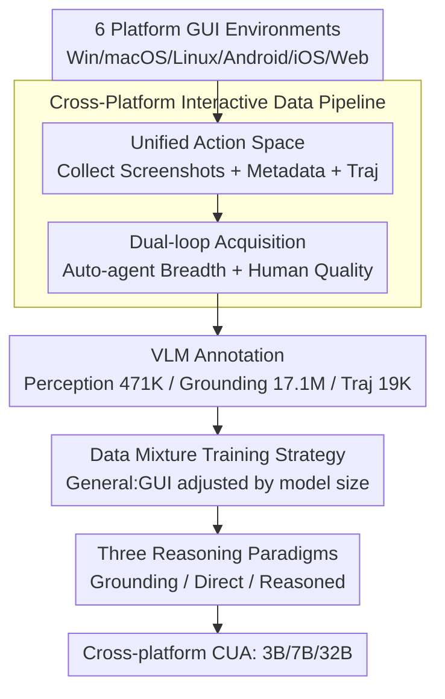

# ScaleCUA: Scaling Open-Source Computer Use Agents with Cross-Platform Data

**Conference**: ICLR 2026  
**OpenReview**: [https://openreview.net/forum?id=yBFUqdJFZn](https://openreview.net/forum?id=yBFUqdJFZn)  
**Code**: https://github.com/OpenGVLab/ScaleCUA  
**Area**: Agent / Multimodal VLM  
**Keywords**: Computer Use Agent, GUI Agent, Cross-platform data, Unified action space, Data scaling

## TL;DR
ScaleCUA utilizes a "dual-loop" data pipeline—combining automated agents and human experts—to collect and annotate a massive cross-platform GUI corpus (471K perception, 17.1M grounding, and 19K trajectories) spanning six operating systems. Based on this, it trains open-source computer use agents (CUAs) supporting three reasoning paradigms, achieving new SOTAs across multiple GUI benchmarks (WebArena-Lite-v2 +26.6, ScreenSpot-Pro +10.7).

## Background & Motivation
**Background**: Vision-Language Models (VLMs) have enabled Computer Use Agents (CUAs, or GUI agents)—autonomous systems capable of performing clicks, typing, and navigating desktop, mobile, and web applications based solely on screenshots. Most powerful current CUAs (e.g., UI-TARS, Claude Computer Use, OpenAI CUA) are built upon closed-source models or private datasets.

**Limitations of Prior Work**: For a CUA to be truly robust, the model must master extensive domain knowledge regarding software UI appearances and operational logic. Unlike the ubiquitous image-text pairs on the internet, **computer use data—especially fine-grained operational trajectories—is extremely scarce, expensive to collect, and not naturally archived online**. Furthermore, the rapid iteration of software and operating systems causes old trajectories to become obsolete quickly.

**Key Challenge**: There is a dilemma between "quality vs. scale/diversity" in data collection. Pure human collection yields high-quality trajectories but is expensive and hard to scale; pure automated exploration (e.g., random walk) is scalable but full of noise. Neither alone can satisfy the balance of quality and diversity required for training a general-purpose GUI agent. Simultaneously, existing open-source VLMs have limited cross-platform transferability, leaving the field bottlenecks by both data scale and model generalization.

**Goal**: This work pursues two objectives: (a) Constructing a large-scale, cross-platform, GUI-centric training corpus; (b) Training a family of scalable, general-purpose computer use foundation models.

**Key Insight**: The authors bet on "data-driven scaling." Since data is the bottleneck, the collection process is transformed into an industrial pipeline operating across six operating systems, where automated agents handle breadth while human experts ensure quality and verification.

**Core Idea**: Scaled cross-platform GUI data collection via a "dual-loop" pipeline (automated agent + human expert), combined with a unified action space, to train ScaleCUA—an open-source foundation model supporting three reasoning paradigms: "Grounding," "Direct Action," and "Reasoned Action."

## Method

### Overall Architecture
ScaleCUA consists of two parts: a **cross-platform interactive data pipeline** at the front end (for data generation) and a **family of agent models based on Qwen2.5-VL** at the back end (for data utilization). The pipeline operates across Windows, macOS, Linux, Android, iOS, and Web. It captures raw screenshots, structured metadata (A11y Tree / DOM / XML), and operational trajectories through two collaborative loops. Advanced VLMs (GPT-4o, Claude-3.7) are then used to annotate these materials into three task categories: GUI perception, GUI grounding, and task completion. On the model side, a unified action space is used to digest trajectories from all platforms, resulting in 3B, 7B, and 32B models, each supporting three reasoning paradigms to adapt to different agent frameworks.

The entire pipeline is a serial flow of "Acquisition → Annotation → Training," but the acquisition phase itself is a closed loop of automation and human intervention:

### Key Designs

**1. Cross-Platform Interactive Data Pipeline: Resolving the Quality-Scale Dilemma via Dual Loops**

This serves as the engine of the work, directly addressing the core conflict between expensive human labor and noisy automation. The pipeline consists of two collaborative loops. The first is the **Agent-Environment Interaction Loop**: it standardizes "observation acquisition" and "action execution" across six platforms—extracting metadata from A11y Trees for desktops, DOM for Web, and XML layout files for Android. When metadata is missing or restricted (e.g., iOS/iPadOS), OmniParser is used to estimate UI element bounding boxes. This abstraction decouples the frontend UI from the backend environment, allowing collectors to switch platforms efficiently. The second is the **Agent-Human Hybrid Acquisition Loop**: automated agents and human experts share the same interface to collect trajectories. For automation, the authors compared VLM-driven (GPT-4o/Claude-3.7) and rule-driven random-walk exploration. The former was **not used as the primary source** due to reliance on private VLMs and biases/hallucinations in computer use tasks. Instead, random walks perform depth-first exploration, randomly selecting actions from the space and using heuristic pruning to remove redundant or uninformative branches, thereby broadening GUI coverage. Although random-walk trajectories lack clear high-level goals, their sub-sequences provide valuable weak semantic supervision.

Quality is guaranteed by human experts: experts create task lists and manually collect high-quality trajectories, while also **randomly verifying 20% of automated trajectories** (once after acquisition and once after annotation). This defines "hybrid acquisition." Through this dual-loop system, the authors collected over 2M raw screenshots. The authors acknowledge that while the pipeline is conceptually straightforward, the engineering required to make it functional across heterogeneous operating systems and software ecosystems is non-trivial.

**2. Unified Action Space: Enabling Consistent Learning Across Six Platforms**

If each platform used a different action definition, the learned policies would fail to transfer, and data could not be mixed during training. The authors designed a unified action space that combines **universal operations** (e.g., `click`, `write`) with **platform-specific operations** (e.g., `long press` on mobile, `open app`). This ensures consistency in cross-platform behavior modeling and simplifies downstream policy learning. Formally, a single interaction step is defined as $a_t = \pi_\theta(\text{task}, o_t, h_{<t})$ and $o_{t+1} = E(a_t)$, where $\pi_\theta$ is the agent model and $E$ is the environment (VM or Docker container). Observation $o$ uses only screenshot pixels (deliberately ignoring noisy A11y Trees/DOM to mimic human behavior), while history $h_{<t}=\{(a_0,o_0),\dots,(a_{t-1},o_{t-1})\}$ is compressed into natural language descriptions to reduce inference costs. This unified action space acts as the interface layer that allows trajectories from all platforms to be annotated with the same semantics and trained in a single model.

**3. Three Reasoning Paradigms: Adapting One Model to Diverse Agent Frameworks**

CUA usage scenarios vary greatly—sometimes a simple "grounder" is needed for an external planner, sometimes rapid end-to-end response is required, and sometimes complex/long-horizon tasks require explicit reasoning. ScaleCUA unifies these needs into three paradigms: **Grounding Mode** outputs UI element coordinates (points/boxes) based on screenshots and text, acting as a modular "grounder" for stronger planners; **Direct Action Mode (DAM)** directly outputs executable low-level actions wrapped in `<operation>` and `<action>` tags given the current screen and history, providing a fast perception-action loop but risking drift in long tasks; **Reasoned Action Mode (RAM)** generates a Chain-of-Thought in a `<think>` tag before producing an action, trading latency and tokens for higher reliability and interpretability in complex tasks. All three share the same cross-platform semantics.

**4. Data Mixture Training Strategy: Scaling General Data Ratios with Model Size**

Feeding only GUI data leads to a loss of general multimodal capabilities, while too much general data dilutes GUI expertise. The authors' key strategy for the 3B/7B/32B models is to **increase the "General Data : GUI Data" ratio as the model size grows**: using 25% general data for 3B, 50% for 7B, and 75% for 32B. This is based on diagnostic observations: as the general data ratio increases, GUI benchmarks decline slowly while general benchmarks rise steadily (peaking around 75%). Larger models have higher memory capacity, allowing them to absorb more general data without diluting their GUI specialization. All models are trained with a learning rate of $1\times10^{-5}$ and a maximum token length of 40,960 on 128 A100/H200 GPUs.

### Loss & Training
The models are supervised fine-tuned (SFT) on Qwen2.5-VL using a mixture of perception, grounding, and task completion corpora. Training data is further diversified through data augmentation (element cropping, synthetic resolution scaling, and reasoning prompt enrichment). Hardware configurations varied by scale (3B: mini-batch 4 / grad-accum 1; 7B & 32B: mini-batch 2 / grad-accum 2), with general/GUI ratios increasing as described above.

## Key Experimental Results

### Main Results
Evaluation covers three dimensions—GUI perception, GUI grounding, and end-to-end task completion—all conducted under vision-only observation.

| Dimension / Benchmark | Metric | ScaleCUA-32B | Baseline | Gain |
|--------|------|------|----------|------|
| MMBench-GUI L1-Hard (Perception) | Acc | 94.4 | GUI-Owl-32B 94.2 | New SOTA |
| ScreenSpot-Pro (Grounding) | Acc | 59.2 | — | +10.7 vs Baseline |
| OSWorld-G (Grounding) | Acc | 60.6 | — | New SOTA |
| WebArena-Lite-v2 (Task, 50 steps) | SR | 47.4 | UI-TARS-72B-DPO 21.4 | +26.0 |

In GUI perception, even the lightweight ScaleCUA-3B achieved 89.9%, outperforming Qwen2.5-VL-72B by +25.3 points. In task completion, ScaleCUA-32B achieved 47.4% on WebArena-Lite-v2 under a 50-step budget, outperforming the strongest native baseline, UI-TARS-72B-DPO, by +26.0%. A workflow using GPT-4o as a planner and ScaleCUA-7B as a grounder reached 48.3% on AndroidWorld and 28.1% on OSWorld, surpassing other strong grounders like JEDI-7B.

### Ablation Study
Diagnostic analysis revealed several key trade-offs:

| Configuration / Factor | Key Findings | Description |
|------|---------|------|
| Data Scaling | Nearly linear growth on WebArena-Lite-v2 | Harder online tasks require more data |
| Reasoning Mode RAM vs DAM | RAM consistently outperforms DAM, absolute gain +1.4% to +8.2% | However, RAM is slower and uses more tokens |
| General Data Ratio | GUI metrics drop slowly while general metrics peak at ~75% | Larger models tolerate higher ratios |
| Input Resolution | Dependent on benchmark distribution | ScreenSpot-Pro (including 4K) benefits up to 2K, but drops at 4K |

### Key Findings
- **Data is the primary driver**: Performance increases monotonically from 3B to 32B across platforms, proving that cross-platform data + a unified action space scale effectively with model capacity.
- **Reasoning for reliability**: Reasoned Action Mode consistently outperforms Direct Action Mode, albeit at the cost of higher latency. Using ScaleCUA-7B as a grounder for GPT-4o planning yielded even higher results on OSWorld (28.1% vs 15.0%) compared to its own RAM, showing complementarity between ScaleCUA and general VLMs.
- **Resolution limits**: Performance saturates or drops if input resolution exceeds the training limit (1080p). Only ScreenSpot-Pro, which contains native 4K content, benefited from higher resolutions (up to 2K).
- **Honest assessment of planning**: Despite specialized data, the model's planning capability in agentic workflows still lags behind GPT-4o, leaving a gap compared to top-tier closed-source systems.

## Highlights & Insights
- **Industrializing cross-platform data collection**: The dual-loop design allows "automated agents for breadth, human experts for quality + 20% verification." This hybrid acquisition approach is transferable to any embodied or operational task requiring real interaction trajectories.
- **Unified Action Space + Screenshot-only Observation**: By deliberately discarding A11y Tree/DOM data and relying solely on screenshots, the model mimics human behavior and avoids the inconsistent noise present in various platform-specific metadata.
- **Practical scaling ratios**: The "larger model, higher general data ratio" rule (3B/7B/32B → 25%/50%/75%) provides an actionable heuristic for balancing general intelligence with domain specialization.
- One model, three reasoning paradigms: This design allows the same weights to function as a standalone end-to-end agent or a grounder for external planners, offering high engineering reusability.

## Limitations & Future Work
- The model's **planning capability remains significantly weaker than GPT-4o** in agentic workflows, showing a performance gap in end-to-end long-horizon tasks.
- Weak semantic trajectories from random walks lack clear high-level goals, providing softer supervision. High-quality goal-oriented trajectories (4K total) remain relatively scarce.
- The pipeline is "conceptually simple but engineering-heavy," with high maintenance costs across heterogeneous systems. Rapid software evolution also risks data obsolescence.
- Success rates on certain platforms like macOS (MacOSArena) remain low for all models (ScaleCUA-32B at 7.1%), indicating that desktop long-horizon tasks are still a major challenge.

## Related Work & Insights
- **vs. UI-TARS / AGUVIS (Native Agents)**: While they also use massive trajectories for end-to-end training, they mostly rely on private data. ScaleCUA distinguishes itself by open-sourcing all data, models, and code, with explicit 6-platform coverage and a unified action space, significantly leading UI-TARS-72B-DPO on Web tasks (+26.0).
- **vs. JEDI / OS-Atlas (Data/Grounding)**: These focus on specific data types (desktop grounding). ScaleCUA covers perception, grounding, and trajectories across Desktop, Mobile, and Web, with a more comprehensive scale (17.1M grounding tags + 19K trajectories).
- **vs. OS-Genesis (Automated Exploration)**: Purely automated methods like OS-Genesis are scalable but noisy. ScaleCUA achieves a better compromise via 20% human verification and weak semantic trajectory reuse.

## Rating
- Novelty: ⭐⭐⭐⭐ The individual components are not revolutionary, but the holistic system (dual-loop acquisition + unified action space + 6-platform open source) is highly impactful.
- Experimental Thoroughness: ⭐⭐⭐⭐⭐ Comprehensive coverage of perception, grounding, and tasks across 6 platforms, 3 model sizes, and 4 sets of diagnostic ablations.
- Writing Quality: ⭐⭐⭐⭐ Clear structure and honest about limitations.
- Value: ⭐⭐⭐⭐⭐ Fully open-sourcing data, models, and code provides a much-needed large-scale cross-platform foundation for the open-source CUA community.

<!-- RELATED:START -->

## Related Papers

- [\[ICLR 2026\] Efficient Agent Training for Computer Use](efficient_agent_training_for_computer_use.md)
- [\[ICLR 2026\] VideoAgentTrek: Computer Use Pretraining from Unlabeled Videos](videoagenttrek_computer-use_pretraining_from_unlabeled_videos.md)
- [\[CVPR 2026\] OS-Oracle: A Comprehensive Framework for Cross-Platform GUI Critic Models](../../CVPR2026/llm_agent/os-oracle_a_comprehensive_framework_for_cross-platform_gui_critic_models.md)
- [\[ICLR 2026\] Grounding Computer Use Agents on Human Demonstrations](grounding_computer_use_agents_on_human_demonstrations.md)
- [\[ICLR 2026\] SCUBA: Salesforce Computer Use Benchmark](scuba_salesforce_computer_use_benchmark.md)

<!-- RELATED:END -->
