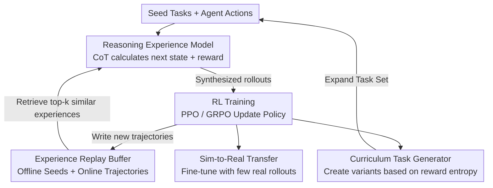

# Scaling Agent Learning via Experience Synthesis

**Conference**: ICLR 2026  
**OpenReview**: [https://openreview.net/forum?id=cf7qpBwttr](https://openreview.net/forum?id=cf7qpBwttr)  
**Area**: LLM Agent / Reinforcement Learning / Experience Synthesis  
**Keywords**: Experience Model, Synthetic Experience, Curriculum Learning, RL, sim-to-real

## TL;DR
DreamGym utilizes a "reasoning-based experience model" to synthesize agent-environment interactions (state transitions + rewards) within an abstract textual state space. Combined with an experience replay buffer and a reward-entropy-based curriculum task generator, it enables LLM agents to execute RL training with almost no real-world rollouts. It outperforms all baselines by 30%+ on the non-RL-ready WebArena and matches GRPO/PPO performance on RL-ready environments using purely synthetic data.

## Background & Motivation
**Background**: To truly enhance LLM agents (web navigation, embodied control, multi-turn tool calling), reinforcement learning (RL) is currently the most promising path—allowing agents to bootstrap better policies through interaction and self-experience.

**Limitations of Prior Work**: Applying RL to LLM agents is extremely expensive in terms of both engineering and data. The authors identify four main obstacles: (1) High rollout costs in real environments and low sample efficiency, where single trajectories often involve dozens of steps with high compute and sparse rewards; (2) Insufficient task diversity, as most environments provide only a small set of static instructions, and verifying new tasks requires manual effort; (3) Unstable reward signals, where dynamic environments like Web/GUI provide noisy, sparse, or even incorrect feedback, along with safety risks like irreversible actions (data deletion) and lack of reset mechanisms; (4) Heavy infrastructure requirements involving Docker/VMs for real environments, making large-scale sampling an engineering nightmare.

**Key Challenge**: RL requires "large-scale, diverse, informative, and reliable reward" interaction data, yet real environments fail to provide these—making scalable experience data collection the primary bottleneck.

**Goal**: To build a unified framework capable of scalably "synthesizing" diverse and useful experience data, enabling online RL training that can successfully transfer back to real environments.

**Key Insight**: The authors' key insight is that **agent training does not require a perfect reconstruction of the real environment**. It only needs interaction data that is "sufficiently diverse, informative, and causally sound" to acquire task-specific knowledge. Therefore, instead of reproducing environments verbatim in raw pixel/HTML spaces like traditional world models, one can leverage the reasoning capabilities of LLMs to "imagine" plausible next states and rewards within an abstract textual meta-representation space.

**Core Idea**: Replace the expensive real environment with a **reasoning-based experience model**. Consistent state transitions and feedback signals are produced via CoT reasoning, while stability is maintained through a replay buffer and diversity is ensured via a curriculum task generator, turning "experience collection" into an infinitely scalable synthesis process.

## Method

### Overall Architecture
DreamGym replaces the traditional "Agent ↔ Real Environment" loop with an "Agent ↔ Experience Model" loop. Given a set of seed tasks, a reasoning-based experience model $M_{exp}$ interacts with the agent over multiple turns. At each step, the agent outputs an action based on the current state. Instead of executing it in a real environment, the experience model "calculates" the next state $s_{t+1}$ and reward $r_{t+1}$ through CoT reasoning, combining interaction history, task instructions, and similar experiences retrieved from the replay buffer. The synthesized rollouts are fed to standard RL algorithms (PPO/GRPO) to update the policy. After each iteration, the experience model switches roles to act as a task generator, selecting "challenging yet feasible" tasks based on reward entropy to create more difficult variants and expand the task set. This "interaction-training-curriculum expansion" cycle continues until convergence or budget exhaustion. The three components—Reasoning Experience Model, Experience Replay Buffer, and Curriculum Task Generator—share the same base model, forming a scalable environment tailored for RL.

### Key Designs

**1. Reasoning Experience Model: "Imagining" transitions in abstract text space rather than replicating real environments**

This directly addresses the high cost and instability of real environments. $M_{exp}$ does not operate on raw observations (HTML, pixels) but synthesizes transitions in an abstract meta-representation text space $S$. For example, in a shopping task, it outputs a clean list of elements, discarding structural noise like headers and tags. This reduces dimensionality and token usage, making synthesized trajectories more informative than those extracted from raw observations. During reasoning, the authors found three types of context are crucial for state quality: interaction history $\{(s_i,a_i)\}_{i=0}^{t}$ for multi-turn consistency; task instructions $\tau$ for accurate transition/reward prediction; and top-k demonstrations $\{d_j\}_{j=1}^{k}=\text{Top}_k(\cos(\phi(s_t,a_t),\phi(s_i,a_i)))$ retrieved from the replay buffer to suppress hallucinations and improve factual accuracy. Given these inputs, the model first produces an explicit reasoning trace $R_t$, and then predicts:

$$(s_{t+1}, r_{t+1}) = M_{exp}\big(R_t \mid \{(s_i,a_i)\}_{i=0}^{t}, \{d_j\}_{j=1}^{k}, \tau\big)$$

Rewards follow an outcome-oriented scheme—$r=1$ only at task completion, otherwise $0$. Illegal actions lead to a failure state with zero reward. Training the experience model is highly sample-efficient: using public offline trajectory data (e.g., WebArena Leaderboard), each transition is labeled by an LLM with a reasoning trace $R_t^*$ explaining "why this action leads to this result," followed by joint SFT optimization:

$$L_{SFT} = \mathbb{E}\big[-\log P_\theta(R_t^* \mid s_t,a_t,H_t,D_k) - \log P_\theta(s_{t+1} \mid s_t,a_t,R_t^*,H_t,D_k)\big]$$

This allows the model to generalize reasoning and generate consistent states for rollouts not seen in expert data.

**2. Experience Replay Buffer: Anchoring with offline knowledge and evolving with online trajectories**

Synthetic experience risks two failures: hallucination (drifting from facts) and off-policy drift (decoupling from the current policy). The replay buffer addresses both. It uses offline real data as seeds to provide factual context for state prediction. During training, it is continuously updated with newly generated online trajectories. Thus, the buffer evolves alongside the agent’s policy, ensuring that synthesized rollouts remain aligned with the current agent. This creates a closed loop where the agent enriches the buffer, which in turn guides the experience model to predict more grounded states.

**3. Curriculum Task Generator: Automatic curriculum via reward entropy**

Diverse transitions are insufficient; tasks must also be diverse and increase in difficulty. Manually expanding tasks is expensive. The authors use the same experience model as a task generator $M_{task}$ to create variants $\tau_t = M_{task}(\{\tau_{t-1}^i\}_{i=1}^{m})$. Seed tasks are selected based on **intra-group reward entropy**: after $n$ rollouts for task $\tau$, the value is defined by reward variance $V_\tau = \frac{1}{n}\sum_{i=1}^{n}(r_i-\bar r)^2$. Non-zero variance indicates the task is "feasible but challenging" for the current agent. Maximum entropy (equal success/failure) provides the highest information gain for credit assignment—consistent with findings that LLMs learn fastest on medium-difficulty tasks. Feeding these high-entropy tasks back to $M_{task}$ creates a curriculum that scales with agent capability. A hyperparameter $\lambda$ limits the proportion of synthesized tasks to maintain stability while directing exploration to weak areas.

**4. Learning from Synthetic Experience + Sim-to-Real: Scalable warm-start for RL**

This defines how the synthesized loop is utilized. In purely synthetic mode, DreamGym runs the full loop to convergence (the authors provide an analytical lower bound for policy improvement). More practically, **DreamGym-S2R (Sim-to-Real)** uses diverse, curriculum-driven synthetic experience to train a strong initial policy before moving to small-scale RL in the real environment. Synthetic pre-training provides low-cost exploration coverage, significantly increasing sample efficiency. Mapping functions or lightweight fine-tuning ensures state space consistency during transfer. The result is a 40%+ improvement over training from scratch using <10% of the real data.

## Key Experimental Results

### Main Results
Evaluated on WebShop, ALFWorld, and WebArena-Lite across Llama-3.2-3B / Llama-3.1-8B / Qwen-2.5-7B (Success Rate %, experience model trained with Llama-3.1-8B):

| Algorithm | Real Data Volume | WebShop (L3.1-8B) | ALFWorld (L3.1-8B) | WebArena (L3.1-8B) |
|------|-----------|-------------------|--------------------|--------------------|
| SFT | 20K | 35.1 | 68.0 | 5.5 |
| DPO | 40K | 31.0 | 63.9 | 4.8 |
| GRPO (Real Env) | 80K | 65.0 | 70.9 | 6.1 |
| **DreamGym (GRPO)** | **0** | 63.9 | 66.3 | **9.1** |
| **DreamGym-S2R (GRPO)** | **5K** | **75.0** | **75.9** | **9.7** |
| PPO (Real Env) | 80K | 64.2 | 72.9 | 4.8 |
| **DreamGym (PPO)** | **0** | 58.1 | 70.8 | **10.9** |

**Key Findings**: On the non-RL-ready WebArena, purely synthetic DreamGym increases success rates from 4-7% to 9-14% (a 30%+ relative gain globally), whereas real-world RL fails due to sparse rewards and poor exploration. On RL-ready environments (WebShop/ALFWorld), DreamGym with zero real interactions matches GRPO/PPO trained on 80K real interactions. DreamGym-S2R with only 5K real rollouts outperforms all baselines. Training costs in WebArena were reduced to 1/3-1/5 of real RL time.

### Ablation Study
Average success rate % (removing components):

| Configuration | WebShop | WebArena | Description |
|------|---------|----------|------|
| DreamGym (Full) | 63.9 | 13.3 | — |
| w/o Exp. Replay | 59.2 | 9.7 | Remove replay buffer |
| w/o Exp. Reasoning | 55.8 | 7.3 | Experience model without CoT |
| w/o Task Generation | 57.3 | 7.3 | Remove curriculum generator |

### Key Findings
- **All three components are essential**: Removing reasoning causes the largest drop (WebShop -8.1, WebArena -6.0), proving CoT is core to synthesizing "informative and factual" states. Removing the task generator leads to early plateaus (WebShop -6.6, WebArena -6.0) as exploration stagnates.
- **Experience Model Quality**: GPT-4o evaluation (consistency/diversity/informativeness/hallucination) shows that removing history harms consistency, while removing reasoning harms informativeness and increases hallucinations. History ensures temporal causality; reasoning ensures depth and factuality.
- **Sample Efficient**: The experience model is efficient; on WebShop, Llama-3.1-8B requires only 10K offline samples to exceed 50% success rate. Smaller 3B backbones also work but scale slower.
- **Cross-domain Transferability**: Policies trained between WebShop ↔ WebArena transfer successfully and exceed SFT, indicating learning of domain-agnostic behavioral priors. However, transfers between Web and embodied ALFWorld see significant drops, exposing current limits of meta-representation domain gaps.

## Highlights & Insights
- **"Training doesn't need a real environment, just causally sound diverse experience"**: This insight frees world models from the burden of "pixel-perfect replication," focusing instead on "sufficient experience synthesis" to bypass engineering roadblocks like resets and security.
- **Single-model multi-role approach**: Having the same LLM act as the experience model and task generator is highly efficient. Synthesis, reward generation, and curricula are unified, removing heterogeneous environment bottlenecks.
- **Reward entropy as a curriculum signal**: Using intra-group reward variance to identify "feasible yet challenging" tasks automates "what to practice next," theoretically targeting samples with maximum information gain.
- **S2R provides a pragmatic path**: Synthetic training doesn't have to replace real RL; it acts as an extremely cost-effective mid-training stage, where <10% real data leverages 40%+ improvements.

## Limitations & Future Work
- Large domain gaps (Web → Embodied ALFWorld) lead to significant performance drops, suggesting current meta-representations have limited coverage. Cross-modal generalization remains an open problem.
- The upper bound of synthesis quality is limited by the experience model’s reasoning. Narrow offline seed data or weak reasoning could lead to systematic deviations from real dynamics. Outcome-oriented sparse rewards may also amplify error accumulation in long-horizon tasks.
- Evaluation is concentrated on structured text/web/embodied benchmarks. Applicability to open-world, vision-heavy, or adversarial environments is unverified.
- Future work: Introduce fine-grained/process rewards, implement real-environment validation loops, and explore universal cross-domain meta-representation spaces.

## Related Work & Insights
- **vs World Models (Dreamer / WebDreamer / WebEvolver)**: These replicate dynamics in raw observation spaces for planning/training, which is data-heavy and engineering-intensive. DreamGym uses reasoning in abstract text space for scalable RL training.
- **vs UI-Simulator**: While both use LLMs as step-wise simulators, UI-Simulator requires heavy expert engineering and targets SFT. DreamGym is a complete toolkit for general RL, supporting task generation and reward signals.
- **vs Synthetic Data (AgentSynth / SCA)**: These still rely on real environments for data collection. DreamGym moves collection entirely into the synthetic loop, removing real interaction dependency.

## Rating
- Novelty: ⭐⭐⭐⭐⭐ Systematizes "experience synthesis" into a unified RL framework; the combination of abstract reasoning + reward entropy curriculum is a clear contribution.
- Experimental Thoroughness: ⭐⭐⭐⭐⭐ Three environments × three backbones × PPO/GRPO, including pure synthetic/S2R/ablation/quality/efficiency/cross-domain analysis.
- Writing Quality: ⭐⭐⭐⭐ Motivation and component roles are clear; some math/appendix details benefit from cross-referencing.
- Value: ⭐⭐⭐⭐⭐ Directly addresses the cost and infrastructure pain points of LLM agent RL; S2R warm-starting has strong practical utility.

<!-- RELATED:START -->

## Related Papers

- [\[ICLR 2026\] Helmsman: Autonomous Synthesis of Federated Learning Systems via Collaborative LLM Agents](helmsman_autonomous_synthesis_of_federated_learning_systems_via_collaborative_ll.md)
- [\[ICLR 2026\] GTA1: GUI Test-time Scaling Agent](gta1_gui_test-time_scaling_agent.md)
- [\[CVPR 2026\] Learning to Select Visual Tools from Experience](../../CVPR2026/llm_agent/learning_to_select_visual_tools_from_experience.md)
- [\[ICLR 2026\] Dyna-Mind: Learning to Simulate from Experience for Better AI Agents](dyna-mind_learning_to_simulate_from_experience_for_better_ai_agents.md)
- [\[ICLR 2026\] A Benchmark for Deep Information Synthesis (DeepSynth)](a_benchmark_for_deep_information_synthesis.md)

<!-- RELATED:END -->
