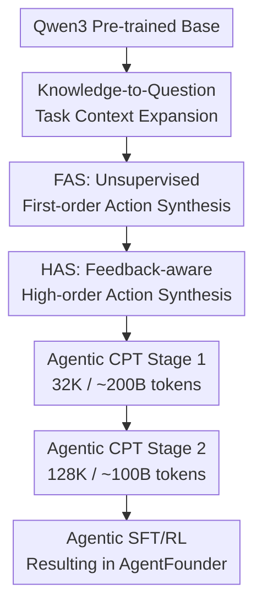

# Scaling Agents via Continual Pre-training

**Conference**: ICLR2026  
**OpenReview**: [https://openreview.net/forum?id=Dru5mm9anE](https://openreview.net/forum?id=Dru5mm9anE)  
**Code**: Not released / To be confirmed  
**Area**: LLM Agent  
**Keywords**: Agentic CPT, Deep Research Agent, Tool Calling, Synthetic Trajectories, Continual Pre-training  

## TL;DR
This paper shifts the learning of agent capabilities to the continual pre-training stage by proposing Agentic Continual Pre-Training. Using two types of large-scale synthetic data, FAS and HAS, the authors train AgentFounder. This allows an open-source 30B-class deep research agent to achieve strong performance across 10 benchmarks, including BrowseComp, GAIA, and HLE.

## Background & Motivation
**Background**: Deep research agents have evolved beyond chat models that answer single-turn questions. They must now navigate between tools—such as web browsers, search engines, code interpreters, academic search engines, and file parsers—to perform multi-step retrieval, evidence synthesis, reasoning, and report generation. Most current open-source systems follow a general LLM training trajectory: starting with a general base model and then incorporating ReAct trajectories, tool-call formats, and task preferences through SFT or RL.

**Limitations of Prior Work**: This "general base + agent post-training" approach struggles with difficult agent tasks. The issue is not simply insufficient data, but rather that post-training carries a dual burden: the model must learn how to plan, when to search, how to read web pages, and how to synthesize evidence, while simultaneously aligning with expert trajectories and reward signals. Agent trajectories are long and the action space is vast; SFT can easily lock a model into a few demonstration patterns, while RL provides only delayed trajectory-level feedback, making it difficult to stably shape intermediate decisions.

**Key Challenge**: Deep research agents require an "agentic inductive bias." Before entering SFT/RL, a model should already be accustomed to long contexts, tool responses, step-by-step decision-making, and factual synthesis. If a base model lacks this prior, post-training merges capability learning and behavior alignment, creating optimization conflicts. If agent foundation capabilities are established first via continual pre-training, post-training functions more as a mechanism to release and calibrate existing capabilities.

**Goal**: The authors aim to address three questions: First, can agent capabilities be treated as a continual pre-training objective rather than a post-training remedy? Second, how can diverse agent training corpora be synthesized at scale without expensive real-world tool API calls? Third, can the resulting agentic base model stably adapt to different SFT data and outperform open-source models of the same size on deep research tasks?

**Key Insight**: The paper approaches this from the perspective of "data modality." Instead of collecting only complete successful trajectories, the authors transform static knowledge, tool responses, abandoned trajectories, and historical retrieval results into agent behavior text suitable for next-token prediction. Some samples train initial planning actions, others focus on logical synthesis once information is sufficient, and others decompose real trajectories into step-by-step multiple-choice decisions.

**Core Idea**: Use large-scale Agentic CPT to train a "pre-aligned agent base" before standard agent SFT/RL. This shifts agent capability learning from the fragile post-training phase to the more stable and scalable continual pre-training phase.

## Method

### Overall Architecture
The training pipeline for AgentFounder involves inserting a two-stage Agentic CPT after a Qwen3-series pre-trained model, followed by general and agent-specific post-training. Agentic CPT still utilizes standard next-token prediction, but the training corpus is restructured around agent behaviors: tool calling, planning, evidence synthesis, and trajectory decisions.

The first stage uses approximately 200B tokens with a 32K context window, aimed at teaching the model tool-calling formats, multi-step planning, and knowledge reasoning. The second stage uses approximately 100B tokens with a 128K context window, focusing on long trajectories, long evidence chains, and complex action spaces. Once the AgentFounder-Base is obtained, it is trained using various SFT configurations to create AgentFounder-30B.

### Key Designs
**1. Agentic CPT: Shifting Agent Alignment from Post-training to Continual Pre-training**

The core premise is that the difficulty for deep research agents is not merely learning a tool-call format, but the need for stable habits in planning, retrieval, reading, synthesis, and self-correction in open environments. Thus, the authors place Agentic CPT between pre-training and post-training, exposing the model to large-scale agent behavior text using next-token prediction. The training objective remains $L=-\sum_{t=1}^{T}\log P(x_{t+1}\mid x_1,\ldots,x_t)$, but the content of $x$ is a mixed sequence of questions, thoughts, tool calls, tool responses, candidate actions, and final judgments.

This design resolves the "double burden" of post-training. Without Agentic CPT, SFT/RL must teach both agent capabilities and expert preferences. With Agentic CPT, post-training only needs to calibrate an existing agent behavior prior. Analysis of SFT loss supports this: on the same SFT-A dataset, the final loss for the AgentFounder series is significantly lower than that of the baseline directly fine-tuned from Qwen3 base, and the loss decreases as CPT tokens increase.

**2. FAS: Stretching Agent Action Spaces via Knowledge-to-Question-to-Action Chains**

First-order Action Synthesis (FAS) addresses the scarcity of complete agent trajectories. The authors first convert static knowledge from web pages, tool responses, CommonCrawl, offline Wikipedia, and historical trajectories into entity-anchored open-world memories. These entities are not nodes in a fixed schema but associations of factual statements with timestamps, sources, and tones. Subsequently, different styles of questions—including factual retrieval, numerical calculation, multi-hop reasoning, web navigation, and report synthesis—are synthesized from these memories.

Rather than running full search trajectories—which consumes expensive APIs—FAS synthesizes "Planning Actions" and "Reasoning Actions." Planning actions train the LLM to generate initial analysis and the first tool call or answer. To avoid repetitive paraphrasing, $K$ inquiries with different styles are generated from the same memory. Reasoning actions simulate the synthesis of an answer after information is gathered: the model generates an initial draft $A_1$ based on internal knowledge, and then refines it into $A_2$ after being provided with the question and the mapped necessary knowledge. Both types of samples undergo reject sampling via LLM-as-Judge, improving the accuracy of planning data from approximately 50% to 82%.

**3. HAS: Rewriting Abandoned Trajectories into Step-by-Step Multiple-Choice Decisions**

High-order Action Synthesis (HAS) targets the vast amount of trajectories in post-training that are not fully successful but contain useful intermediate signals. Traditional methods usually keep or discard data based on trajectory-level success, wasting failed trajectories. HAS transforms every step of an original trajectory into a decision sample with context, candidates, and a final trajectory judgment.

Given a question $Q$ and trajectory $T=\{(S_1,R_1),\ldots,(S_K,R_K)\}$, the conditional context for step $k$ is $C_k=(Q,S_1,R_1,\ldots,S_{k-1},R_{k-1})$. Without real tool execution, the authors synthesize $N$ alternative "thoughts and invocations" for $C_k$, mix them with the original step $S_k$, and shuffle them. The training text presents multiple candidates, requests the selection corresponding to the original expert trajectory, follows with the real tool response $R_k$, and appends the final success/failure result of the entire path. This allows the model to observe local decision alternatives for a given state and learn from the expert's choices within the candidate space.

**4. Two-stage Long-context Curriculum: From Basic Agent Behavior to Complete Trajectories**

The second stage of Agentic CPT focuses on context length and data quality. Stage 1 uses a 32K context with ~200B tokens to establish a foundation, including ~110B Planning Action tokens, ~30B Reasoning Action tokens, and ~40B HAS tokens, while mixing in general data (math, code) to mitigate forgetting. Stage 2 uses a 128K context with ~100B tokens, focusing on long trajectories and complex action spaces while replaying a ~20B subset of Stage 1 to maintain distribution stability.

This curriculum corresponds to the actual scenarios of deep research agents: difficult tasks often involve dozens of tool calls and long report organization. Ablation studies show that the combination of Stage 1 & 2 outperforms Stage 1 alone on BrowseComp and GAIA, particularly with an 8.0-point Pass@3 gain on BrowseComp-zh, demonstrating that long-context trajectories are essential.

### Loss & Training
Agentic CPT does not introduce new reinforcement learning objectives. Instead, it serializes complex agent behaviors into language modeling data to optimize next-token prediction. This allows large-scale training to leverage mature pre-training infrastructure without the need for online rewards or unstable interactive RL during the CPT phase.

Total training data is ~300B tokens. Stage 1 uses 32K context for planning, reasoning, HAS, and general capability retention. Stage 2 expands to 128K context for long-context HAS, general tool-use, and Stage 1 replay. Post-training uses three SFT configurations: SFT-A (general chat + ReAct trajectories), SFT-B (mixed general chat and ReAct in every stage), and SFT-C (ReAct with summarized reasoning). Inference uses a temperature of 0.85, top-p of 0.95, and a maximum of 128 tool calls with a 128K context.

## Key Experimental Results

### Main Results
AgentFounder-30B was evaluated on two categories of benchmarks: general web/deep search and scenario-based deep research. It achieved significant advantages over most open-source deep research agents and approached or exceeded commercial systems on several tasks.

| Benchmark | Metric | AgentFounder-30B | Strong Open-source Comp. | Commercial Comp. | Key Conclusion |
|-----------|--------|------------------|--------------------------|------------------|----------------|
| BrowseComp-en | Accuracy | 39.9 | DeepSeek-V3.1 30.0 | OpenAI Deep Research 51.5 | Significantly exceeds open-source SOTA |
| BrowseComp-zh | Accuracy | 43.3 | GLM-4.5 37.5 / DeepSeek-V3.1 49.2 | OpenAI-o3 58.1 | Exceeds GLM-4.5; lags behind DeepSeek-V3.1 |
| GAIA-text | Accuracy | 72.8 | GLM-4.5 66.0 / DeepSeek-V3.1 63.1 | OpenAI-o3 70.5 | Outperforms listed baselines on text subset |
| xbench-DeepSearch | Accuracy | 73.0 | DeepSeek-V3.1 71.0 / GLM-4.5 70.0 | Kimi-Researcher 69.0 | Highest result on deep search tasks |
| WebWalkerQA | Accuracy | 71.9 | GLM-4.5 65.6 / Kimi-K2 63.0 | OpenAI-o3 71.7 | Slightly higher than OpenAI-o3 |

In specialized tasks, AgentFounder-30B excelled on HLE, Frames, and AcademicBrowse. Specifically, the 31.5 Pass@1 on HLE is a key highlight.

| Benchmark | Metric | AgentFounder-30B | Strong Open-source Comp. | Commercial Comp. | Key Conclusion |
|-----------|--------|------------------|--------------------------|------------------|----------------|
| HLE | Pass@1 | 31.5 | DeepSeek-V3.1 29.8 / GLM-4.5 21.2 | OpenAI Deep Research 26.6 | One of the first open-source results over 30 |
| DeepResearch Bench | RACE Overall | 47.9 | GLM-4.5 39.2 / DeepSeek-V3.1 35.4 | Gemini Deep Research 49.7 | Close to Gemini; exceeds OpenAI report |
| Frames | Pass@1 | 89.6 | DeepSeek-V3.1 83.7 / GLM-4.5 78.9 | OpenAI-o3 84.0 | Strong multi-perspective integration |

### Ablation Study
The authors validated Agentic CPT via SFT adaptation, training strategies, and data scaling. Crucially, the same post-training data performs consistently better on the AgentFounder-Base than on the Qwen3-30B-Base, proving CPT provides a general benefit.

| Experiment | Configuration | Key Metric | Description |
|------------|---------------|------------|-------------|
| SFT Adaptation | Qwen3 Base vs AgentFounder Base (SFT-A) | HLE 23.5 → 30.4 | Overall gains under same SFT-A |
| SFT Adaptation | Qwen3 Base vs AgentFounder Base (SFT-B) | BrowseComp-en 28.6 → 39.9 | Largest gains on SFT-B |
| Stages | Stage 1 Only vs Stage 1&2 | BrowseComp-zh Pass@3 50.5 → 58.5 | Stage 2 improves complex search |
| Data Types | Non-CPT vs FAS vs FAS+HAS | BrowseComp-zh Pass@1 29.8 → 37.0 → 40.1 | HAS provides complementary gains |
| General Capability | Qwen3 Base vs AgentFounder Base | MMLU 81.38 → 80.11 | Slight regression in general capabilities |

### Key Findings
- Agentic CPT's benefits extend beyond final scores. Under the same SFT corpus, AgentFounder has a lower SFT loss, indicating better representation and behavior priors for agent tasks.
- FAS's value lies in scalability and low cost: it synthesizes large volumes of planning and reasoning samples without real-world API calls.
- HAS utilizes local decision signals from failed trajectories. It avoids the need for precise step rewards by teaching the model decision structures through candidate comparison.
- Stage 2's 128K long-context training is vital for deep research tasks, which often require dozens of tool calls.
- A slight decline in general capabilities (e.g., GPQA) is an acceptable trade-off for significantly improved agent performance.
- Tool-calling analysis shows the model adjusts invocation density according to task complexity rather than simply "searching more."

## Highlights & Insights
- The most valuable conceptual contribution is the distinction between agentic alignment and traditional instruction alignment. Agentic alignment involves reasoning chains, tool invocations, and feedback handling.
- Agentic CPT is a practical training innovation that uses existing pre-training infrastructure for complex behavior modeling via data rewriting.
- FAS's "entity-anchored open-world memory" is more representative of web information flows than fixed knowledge graphs, capturing timestamps and diverse sources.
- HAS's approach to failed trajectories is insightful. Instead of discarding data, it transforms steps into multiple-choice decisions, retaining local action space information without unreliable step rewards.
- The results suggest the existence of a scaling law for agent capabilities regarding both model size and Agentic CPT data volume.

## Limitations & Future Work
- High training costs (300B tokens with 128K context) make it difficult for smaller research teams to replicate.
- Data synthesis relies on LLM-as-Judge, which may inherit biases from the generator models.
- There is a performance gap in Chinese tasks, potentially due to insufficient Chinese training data and sub-optimal search results.
- General capability regression suggests data mixture ratios need further optimization.
- HAS relies on original trajectory steps as "correct," which may not be locally optimal. Integration with step verifiers could improve this.

## Related Work & Insights
- **vs WebSailor / WebSailor-V2**: While WebSailor focuses on RL/SFT for web agents, this work emphasizes building an agentic foundation model before post-training.
- **vs WebThinker / ASearcher**: These focus on long-horizon search and RL. AgentFounder transforms these into offline CPT corpora to shape behavior priors.
- **vs Toolformer / Tool Learning**: Toolformer focuses on learning tool calls; AgentFounder treats tool calls as one part of a larger research behavior set involving planning and synthesis.
- **Insight for Future Work**: To train specialized agents, one should consider incorporating environmental logs and failed attempts into CPT data rather than relying solely on post-training SFT/RL.

## Rating
- Novelty: ⭐⭐⭐⭐⭐ Systematizes Agentic CPT for deep research agents.
- Experimental Thoroughness: ⭐⭐⭐⭐⭐ Comprehensive evaluation across 10 benchmarks and extensive ablation.
- Writing Quality: ⭐⭐⭐⭐☆ Clear main claims, though some synthesis details require appendix consultation.
- Value: ⭐⭐⭐⭐⭐ Highly valuable paradigm for the "agent foundation model" direction.

<!-- RELATED:START -->

## Related Papers

- [\[CVPR 2026\] WebGym: Scaling Training Environments for Long-Horizon Visual Web Agents with Realistic Tasks](../../CVPR2026/llm_agent/webgym_scaling_training_environments_for_long-horizon_visual_web_agents_with_rea.md)
- [\[ICLR 2026\] PolySkill: Learning Generalizable Skills through Polymorphic Abstraction for Continual Agents](polyskill_learning_generalizable_skills_through_polymorphic_abstraction_for_cont.md)
- [\[ICLR 2026\] Cyber-Zero: Training Cybersecurity Agents without Runtime](cyber-zero_training_cybersecurity_agents_without_runtime.md)
- [\[ICML 2026\] Position: Modular Memory is the Key to Continual Learning Agents](../../ICML2026/llm_agent/position_modular_memory_is_the_key_to_continual_learning_agents.md)
- [\[ICLR 2026\] Scaling Synthetic Task Generation for Agents via Exploration](scaling_synthetic_task_generation_for_agents_via_exploration.md)

<!-- RELATED:END -->
