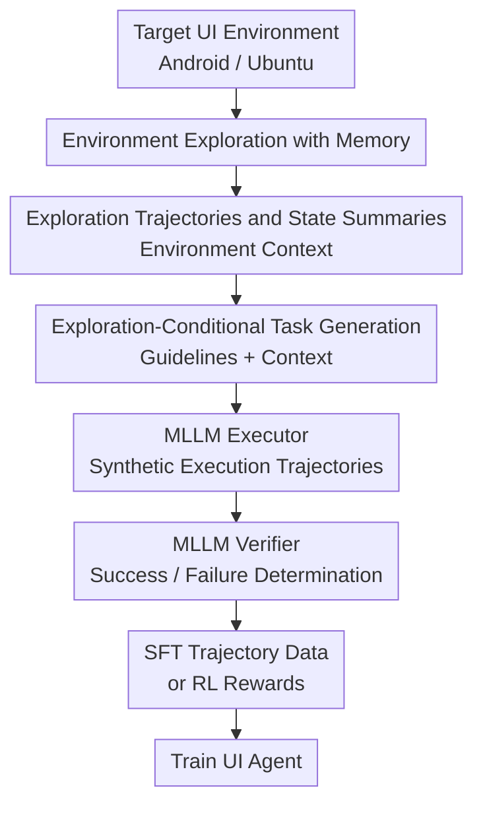

# Scaling Synthetic Task Generation for Agents via Exploration

**Conference**: ICLR 2026  
**OpenReview**: [https://openreview.net/forum?id=ng4KgSRAW8](https://openreview.net/forum?id=ng4KgSRAW8)  
**Code**: No public code  
**Area**: LLM Agent / UI Agent / Synthetic Task Generation  
**Keywords**: Synthetic Task Generation, UI Agent, Environment Exploration, Multimodal LLM, Reinforcement Learning  

## TL;DR
AUTOPLAY automatically constructs large-scale training data for UI agents by having Multimodal Large Language Models (MLLMs) first proactively explore Android and Ubuntu UI environments, then generating executable tasks based on exploration trajectories and task guidelines. It significantly improves task success rates for mobile and desktop agents after SFT and RL.

## Background & Motivation
**Background**: Multimodal LLMs (MLLMs) have been increasingly deployed as interactive agents in scenarios such as computer-use, web navigation, mobile-use, and robotics. A typical training paradigm involves providing the model with a screenshot, a natural language goal, and action history, enabling it to perform step-by-step actions (clicking, typing, scrolling, returning) to complete real-world tasks.

**Limitations of Prior Work**: The bottleneck for such agents lies not only in model capacity but also in the lack of downstream interactive task data. A usable training sample typically consists of two parts: a natural language task (e.g., "Delete all entries for next Tuesday") and an interactive trajectory to complete it. In reality, such data is often hidden within mobile apps, desktop software, or personal devices, failing to accumulate naturally at internet scale like web text. Relying on manual task writing and human demonstrations is costly and struggles to cover the granular features of every application.

**Key Challenge**: To be truly useful, synthetic tasks must simultaneously satisfy three conditions: diversity, feasibility, and verifiability. Simply prompting an LLM to invent tasks based on app descriptions or initial screenshots often results in instructions that "look reasonable but do not exist in the current environment" (e.g., asking to delete an event not present in the screenshot). Conversely, simply relabeling an exploration trajectory as a task (hindsight relabeling) is limited by the single trajectory and fails to cover combinable features within the same environment.

**Goal**: The authors aim to automatically generate a large-scale agentic task dataset $D$, where each task is a combination of a natural language goal $g$ and an initial state $s_0$. This dataset should cover real features in Android and Ubuntu applications, drive a downstream executor to generate demonstrations, and allow a verifier to filter SFT data or serve as RL rewards.

**Key Insight**: The core observation of the paper is that before task generation, one must first know "what is currently there" and "what can be done" in the environment. This information is not stable knowledge within model parameters but must be acquired through interaction: which events are in the calendar, what options exist in settings, which entities are in the file manager, and which buttons open which forms. AUTOPLAY thus transforms "environment exploration" from an implicit byproduct into the primary stage of task generation.

**Core Idea**: A memory-equipped MLLM explorer systematically explores the UI environment to convert trajectories into environment context. A task generator then generates grounded, feasible, and verifiable agent tasks in batches, constrained by specific context and task guidelines.

## Method
AUTOPLAY targets interactive environments representable as a POMDP. The state space is $S$, the observation space is $O$, the action space is $A$, and target goals come from a natural language goal distribution $G$. The training objective is to obtain a goal-conditioned policy $\pi(a_t \mid o_t, g)$. In UI agent instantiations, the observation $o_t$ is a device screenshot, actions include clicking, typing, scrolling, or opening apps, and the goal $g$ is a user's natural language task.

### Overall Architecture
The core pipeline of AUTOPLAY is divided into two layers. The first layer explores each application without a specific goal, allowing the explorer to visit new states and features while compressing multi-turn exploration into a memory that fits within the context. The second layer treats the exploration trajectories as environment context and, combined with various task guidelines, enables the task generator to produce large volumes of natural language tasks. Subsequently, an executor attempts to perform these tasks, and a verifier judges the success of the trajectories. Successful trajectories are used for SFT, while the tasks themselves can be paired with verifier rewards for RL.

Formalized, AUTOPLAY generates a task dataset $D = \{(g, s_0)\}$. Here, $g$ is the generated natural language task, and $s_0$ is the initial state corresponding to the exploration trajectory. For SFT, the executor samples a trajectory $\tau = (o_0, a_0, \ldots, o_T)$, and the verifier filters for successful demonstrations. For RL, rollouts are performed starting from $(g, s_0)$ in the environment, with the verifier providing a binary reward $R(\tau, g) \in \{0,1\}$ for the entire trajectory.

### Key Designs
**1. Environment Exploration with Memory: Discovering Real Actionable Space First**

The first stage of AUTOPLAY does not involve task drafting. Instead, it provides the explorer with a general goal: "Explore the features, states, and existing data of this application as completely as possible." At each step, the explorer perceives the current screenshot and historical interaction memory to select the next UI action. The resulting trajectory $\tau = (o_1, a_1, \ldots, o_K, a_K)$ is not treated as a demonstration for a specific task but as environment context, revealing which pages exist, which buttons are clickable, and which entities can be edited or deleted.

The key lies in "multi-turn exploration + summarized memory." An app is explored for $M$ turns. Before turn $i$, the system does not force all high-dimensional screenshot trajectories into the context. Instead, a summarizer MLLM compresses each old trajectory into a text memory $m_i = \mathrm{MLLM}(\mathrm{summary\_prompt}, \tau_i)$. These memories record visited pages, discovered features, and existing data, helping the next explorer avoid re-opening the same pages and focus on finding new states. This design directly addresses the long-tail feature coverage problem in UI environments.

**2. Exploration-Conditional Task Generation: Transforming Trajectories into Task Material**

The second stage utilizes a task generator MLLM, but its input is not a vague app description; it is the exploration trajectory and task guidelines. For each exploration context $\tau \in E$, the system samples a guideline $p \in P$, prompting the model to generate a set of tasks $(g_1, \ldots, g_K)$. Each task is paired with the initial state $s_1$ of that trajectory, forming $(g_i, s_1)$. Consequently, a single exploration trajectory can derive multiple tasks: a single exploration that opened a calendar to create a form can result in tasks like "create a meeting," "edit an existing event," "delete a specific event," or "query meetings on a certain day."

The distinction from the hindsight relabeling approach is crucial. Prior methods summarized an exploration trajectory into one long task, binding the task space strictly to the trajectory itself. AUTOPLAY treats the trajectory as "evidence of features and states" and generates multiple executable goals under guideline constraints, preserving grounding while breaking the "one trajectory, one instruction" limitation.

**3. Task Guidelines: Controlling Diversity via Constraints**

AUTOPLAY does not leave "diverse task generation" entirely to model creativity; it explicitly prepares task guidelines. In mobile experiments, four types of guidelines are used: Feature-Use, Feature-Composition, Information Retrieval, and Subtask Repetition. These encourage the generation of basic feature usage, combinations of multiple features, info retrieval, and repetitive operations, respectively. The desktop version uses feature-use and composition guidelines for Ubuntu apps, defining primitives like search, filter, edit, delete, form-filling, multi-hop reasoning, and repetition.

The role of these guidelines exceeds mere stylistic prompting; they constrain task feasibility. For example, tasks involving creation, editing, or deletion must specify parameters; for deletion or editing, parameters must come from entities actually visible in the exploration screenshots. Info retrieval tasks must require the agent to answer in natural language rather than "show how to view." These constraints push tasks toward being "actually executable and verifiable in the current environment" rather than just "looking like a user request."

**4. Executor-Verifier Loop: From Task Sets to Trainable Data and RL Rewards**

Generated tasks alone cannot train an agent. AUTOPLAY further employs a modular MLLM executor to attempt the tasks. The mobile executor uses GPT-4o as a high-level planner and reflection model, with UI-TARS-1.5 7B for grounding. The desktop version uses GPT-4o plus GTA1-7B for grounding, adding heuristic actions for expert execution in complex UIs. The planner generates high-level actions based on the goal, screenshot, history, and previous reflection, while the grounding model maps click actions to pixel coordinates.

The verifier acts as the quality gate. It reads the task instruction and the interleaved image-action trajectory, summarizes screen changes, reasons whether the task is complete, and outputs success or failure. During SFT, only trajectories determined successful by the verifier enter the training set. During RL, the verifier acts as a reward model, providing binary rewards for each rollout. This lacks the need for privileged environment state or manual labeling, allowing synthetic tasks to scale into trainable supervision and RL signals.

### Loss & Training
SFT training identifies successful trajectories from the executor after filtering by the verifier. The authors generated approximately 20k tasks across 20 apps in AndroidWorld, resulting in roughly 8k successful trajectories. In Ubuntu, 10k tasks across 13 apps yielded about 3.5k successful trajectories. Base models are Qwen2.5-VL Instruct 3B, 7B, and 72B, with the fine-tuned versions denoted as AUTOPLAY-3B, AUTOPLAY-7B, and AUTOPLAY-72B.

RL training uses the AUTOPLAY tasks and the MLLM verifier as a reward. Each environment worker samples a task $(g, s_0)$, allows the current policy to complete it, and uses a Qwen2.5-VL-32B verifier to assign a reward of $1$ or $0$. To stabilize training, RL only uses the ~8k mobile tasks that the executor successfully completed at least once. GRPO is used for optimization with a group size of 8, using 32 H100s, a learning rate of $1 \times 10^{-6}$, and 120 GRPO updates.

## Key Experimental Results

### Main Results
The authors evaluated the trained UI agents on AndroidWorld and OSWorld. Pass@1 denotes the average success rate over 5 independent trials, and Pass@5 denotes the portion of tasks where at least one out of five trials succeeded. Evaluation verifiers for these benchmarks utilize privileged environment information (ground truth), whereas the data generation phase does not.

| Benchmark | Model | Pass@1 | Pass@5 | Gain over Base |
|--------|------|------|------|------|
| AndroidWorld | Qwen2.5-VL 7B | 19.5 | 27.7 | - |
| AndroidWorld | AUTOPLAY-7B | 40.1 | 58.4 | Pass@1 +20.6, Pass@5 +30.7 |
| AndroidWorld | Qwen2.5-VL 72B | 35.0 | 43.5 | - |
| AndroidWorld | AUTOPLAY-72B | 47.9 | 68.2 | Pass@1 +12.9, Pass@5 +24.7 |
| OSWorld | Qwen2.5-VL 7B | 3.7 | 4.1 | - |
| OSWorld | AUTOPLAY-7B | 11.4 | 12.1 | Pass@1 +7.7, Pass@5 +8.0 |
| OSWorld | Qwen2.5-VL 72B | 4.4 | 5.4 | - |
| OSWorld | AUTOPLAY-72B | 14.5 | 16.0 | Pass@1 +10.1, Pass@5 +10.6 |

These results demonstrate that AUTOPLAY data does not merely make the model memorize fixed scripts but improves general UI operation capabilities. Notably, AUTOPLAY-3B's Pass@1 on AndroidWorld reached 34.2, nearly rivaling Qwen2.5-VL-72B's 35.0. AUTOPLAY-72B even exceeded the 43.1 score of the GPT-4o + UI-TARS executor used for data collection, suggesting that verifier-filtered synthetic data can distill an end-to-end agent stronger than the expert sampling policy.

### Ablation Study
The ablation compared exploration methods and guidelines. All ablations generated 5k tasks on AndroidWorld, used the same executor/verifier, and fine-tuned Qwen2.5-VL-7B.

| Task Generator | Exec Pass@1 | DS AndroidWorld Pass@1 | DS AndroidWorld Pass@5 | Note |
|------|------|------|------|------|
| No Exploration | 21.3 | 28.8 ± 1.5 | 49.2 | Only static descriptions/initial screenshots; prone to task hallucinations |
| Iterative Exploration | 56.4 | 21.6 ± 1.7 | 33.6 | Progressive execution and hindsight relabeling; tasks are easier but lack diversity |
| AUTOPLAY w/o guidelines | 43.5 | 26.7 ± 2.7 | 38.9 | Exploration without structural constraints leads to poor coverage |
| AUTOPLAY | 46.0 | 38.2 ± 3.1 | 58.5 | Retains both grounding and diversity |

An interesting observation is that Iterative Exploration achieved the highest execution success rate (56.4) but trained the weakest agent. This suggests that "easier for the executor" does not equal "higher training value." If tasks are concatenations of short sub-goals, the difficulty and coverage may be too narrow. AUTOPLAY has a slightly lower execution success rate but trains a significantly stronger downstream agent, indicating its state coverage and guidelines are more aligned with real benchmark distributions.

### Key Findings
- **Scale Invariance**: AUTOPLAY is effective across various model sizes (3B to 72B), outperforming base versions on both AndroidWorld and OSWorld.
- **Grounding**: Exploration context solves grounding. "No Exploration" often fails due to tasks involving non-existent entities; AUTOPLAY binds parameters to real UI content.
- **Diversity**: Guidelines serve distribution and coverage. Without them, tasks lack structural categories like composition or info retrieval, degrading downstream performance.
- **Verifier Bottleneck**: Human evaluation shows verifiers are optimistic, often misidentifying partially completed long tasks as successes. This places a ceiling on the quality of SFT and RL signals.
- **Desktop Complexity**: Desktop coverage is less complete than mobile. OSWorld results suggest current guidelines for computer-use (cross-app, bash, web search) are insufficient, though the exploration framework remains sound.

## Highlights & Insights
- AUTOPLAY cleverly redefines the role of exploration trajectories: they are not just demonstrations to be labeled, but state evidence for generating many tasks. This allows a single trajectory to expand into multiple grounded tasks, increasing data efficiency.
- The evaluation of synthetic task generation is moved from "does the task look human" to "does it train a stronger agent." Ablations show that the method with the highest execution success rate is not necessarily the best; what matters is coverage, difficulty, and distribution matching.
- Memory-based exploration is a practical engineering design. Features are often buried in deep menus; summarized memory provides a reasonable tradeoff between coverage and context budget.
- The Executor-Verifier loop creates an automated pipeline. This approach is transferable to web agents, office agents, and even robotics if a verifier and simulation environment are available.

## Limitations & Future Work
- **Dependency**: AUTOPLAY relies on strong MLLMs (like GPT-4o) for exploration, generation, execution, and verification. While Qwen2.5-VL works as a verifier, the cost and dependency on closed-source models remain.
- **Verifier Error**: Verifiers are optimistic (low precision, high recall). Roughly 60% human agreement means many failed trajectories are labeled as successes. Future work could introduce state-difference checks or API verification.
- **Guideline Design**: Guidelines still require manual design. Desktop performance was limited by guideline granularity, showing that expert overhead is still present when moving to new domains.
- **Exploration Objective**: Exploration is currently driven by prompts and memory. Future work could define UI state novelty or feature coverage as explicit optimization targets.

## Related Work & Insights
- **Comparison to No Exploration**: Approaches using only app descriptions or static screenshots suffer from hallucinations. AUTOPLAY's grounding via interaction yields tasks that actually exist in the environment.
- **Comparison to AgentSynth**: Iterative exploration/hindsight approaches bind the task space to the executed path. AUTOPLAY decouples exploration from generation, enabling a single context to produce diverse tasks.
- **Future Directions**: The four modules—exploration, constraints, execution, and verification—can be individually scaled. Key opportunities lie in learnable guidelines, coverage-driven exploration, and more reliable multimodal verifiers.

## Rating
- **Novelty**: ⭐⭐⭐⭐☆ Redefining trajectories as state evidence is elegant; the main innovation is the scalable pipeline and data loop.
- **Experimental Thoroughness**: ⭐⭐⭐⭐☆ Covers two major benchmarks, SFT and RL, and provides detailed ablations. Further analysis on the impact of verifier noise on training would be beneficial.
- **Writing Quality**: ⭐⭐⭐⭐☆ Clear structure and diagrams. Some variable naming (e.g., $K$) in algorithms could be more distinct.
- **Value**: ⭐⭐⭐⭐⭐ Highly valuable for UI agent training, especially for new environments where human demonstrations are unavailable.

<!-- RELATED:START -->

## Related Papers

- [\[ICLR 2026\] AgentSynth: Scalable Task Generation for Generalist Computer-Use Agents](agentsynth_scalable_task_generation_for_generalist_computer-use_agents.md)
- [\[ICLR 2026\] ROGA: Scaling Generalist Agents for Office Productivity Tasks via Tool Generation](roga_scaling_generalist_agents_for_office_productivity_tasks_via_tool_generation.md)
- [\[ICLR 2026\] Meta-RL Induces Exploration in Language Agents](meta-rl_induces_exploration_in_language_agents.md)
- [\[ICLR 2026\] Go-Browse: Training Web Agents with Structured Exploration](go-browse_training_web_agents_with_structured_exploration.md)
- [\[ACL 2026\] Supplement Generation Training for Enhancing Agentic Task Performance](../../ACL2026/llm_agent/supplement_generation_training_for_enhancing_agentic_task_performance.md)

<!-- RELATED:END -->
