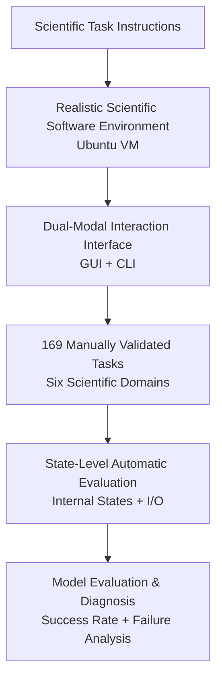

# ScienceBoard: Evaluating Multimodal Autonomous Agents in Realistic Scientific Workflows

**Conference**: ICLR 2026  
**OpenReview**: [https://openreview.net/forum?id=bJvwJahJeF](https://openreview.net/forum?id=bJvwJahJeF)  
**Code**: ScienceBoard Homepage  
**Area**: LLM Agent / Multimodal Autonomous Agent Evaluation  
**Keywords**: Scientific Workflows, Computer-using Agents, GUI/CLI Interaction, Multimodal Evaluation, Scientific Discovery  

## TL;DR
ScienceBoard constructs an Ubuntu virtual machine environment integrated with real scientific software and 169 cross-disciplinary tasks. By utilizing state-level execution evaluation, it examines the capabilities of multimodal computer-using agents in realistic scientific workflows. The results show that the success rate of even the strongest models remains significantly lower than that of humans.

## Background & Motivation
**Background**: LLM/VLM Agents have expanded from QA, code generation, and web operations to more open computer-using scenarios. New computer-using agents can perceive screens, read accessibility trees, click GUIs, and input command lines, theoretically enabling them to operate professional software such as ChimeraX, GrassGIS, and Celestia much like researchers.

**Limitations of Prior Work**: Scientific discovery is not as simple as "answering a scientific question." Real research workflows often require installing and configuring software, reading files, invoking specialized functions, observing visualization results, and switching between GUI and CLI to eventually produce verifiable states. Many existing benchmarks are either static QA, single-step code tasks, or general desktop software operations, failing to reflect the difficulty inherent in dense UIs, complex I/O, domain knowledge, and long-horizon execution found in scientific software.

**Key Challenge**: The evaluation of scientific agents must be realistic enough to expose bottlenecks in software operation and scientific reasoning. However, higher realism makes automation harder, as the final result may not be a text string but rather whether a molecule was correctly selected, a map layer was properly displayed, astronomical time fell within tolerance, or if an intermediate file was generated as required.

**Goal**: The authors aim to fill the gap in "autonomous agent evaluation in realistic scientific workflows." Specifically, the paper addresses three sub-problems: first, how to build a reproducible, scalable desktop environment containing professional scientific software; second, how to organize daily software operations of scientists into high-quality tasks; and third, how to determine task completion without relying on subjective human scoring.

**Key Insight**: ScienceBoard chooses to approach the problem from the perspective of a computer-using agent rather than merely testing the scientific knowledge of the model. This angle is critical because the practical value of a scientific assistant lies not just in explaining concepts but in grounding natural language goals—such as "predict this protein structure," "display a specific geographic layer," or "set astronomical simulation time"—into actual software actions.

**Core Idea**: Replace static QA-style scientific benchmarks with a "real VM + professional scientific software + manually curated tasks + state-level automatic evaluation" to directly measure whether multimodal autonomous agents can complete scientific workflows.

## Method

### Overall Architecture
The overall architecture of ScienceBoard can be understood as a closed-loop testbed for scientific agents: tasks are initialized in a virtual machine, agents interact with software via screenshots, accessibility trees (a11y tree), GUI actions, and CLI commands, and finally, an evaluator reads the internal software state and key I/O to judge success. Its contribution lies not in training a new model but in developing the environment, tasks, and automated evaluation into a reproducible infrastructure.

In terms of implementation, ScienceBoard binds each task to a set of initialization files, configuration functions, and evaluation functions. The agent perceives the natural language goal and current desktop observation, executing unified actions like click, drag, keyboard input, wait, submit answer, run code, call API, or report DONE/FAIL. The evaluator, meanwhile, observes the internal VM state, runtime variables exposed by the software, files, and command outputs.

The paper formalizes the interaction process as a POMDP: the goal is $g$, state space is $S$, action space is $A$, observation space is $O$, and state transition is $T: S \times A \to S$. The agent's policy $\pi$ generates actions based on the goal, current state, and memory $m_t$ consisting of historical observations and actions. The trajectory probability is written as:

$$
p_{\pi}(\tau)=p(s_0)\prod_{t=0}^{T}\pi(a_t|g,s_t,m_t)T(s_{t+1}|s_t,a_t)
$$

The value of this formalization is that it treats scientific software operation as a partially observable, long-horizon decision-making problem with dynamic feedback, rather than a one-time answer prediction.

### Key Designs
**1. Realistic Scientific Software Environment: Placing Agents in Toolchains Researchers Actually Use**

ScienceBoard does not simplify scientific tasks into text problems but integrates open-source or freely available professional software into an Ubuntu 22.04 VM. Six domains correspond to different tools: Biochemistry uses UCSF ChimeraX, Algebra uses KAlgebra, Theorem Proving uses Lean 4, GIS uses GrassGIS, Astronomy uses Celestia, and Scientific Documentation uses TeXstudio. These tools cover molecular structures, symbolic math, formal proofs, geospatial analysis, astronomical simulation, and scientific document preparation.

This step addresses the issue of "evaluation carriers being too toy-like." The difficulties of scientific workflows are often hidden within the software: numerous buttons, deep menu hierarchies, complex input formats, and outputs that are visualizations or internal states rather than simple text. Thus, the authors require that software not only be representative but also open-source or free, and support accessibility trees or adaptation for agent observation and state reading.

**2. GUI + CLI Unified Action Space: Covering Realistic Hybrid Operation Strategies**

Real scientific software often exposes both a GUI and a CLI. For example, in ChimeraX, the same task might be completed via command line or through menus and panels; GrassGIS similarly has graphical and command interfaces. ScienceBoard does not restrict agents to a single interaction mode but designs a unified action space. This includes GUI operations like `click(x,y)`, `dragTo(x,y)`, `doubleClick(x,y)`, and keyboard input, as well as system commands, in-app scripts, `CODE`, `API`, `ANS`, `DONE`, `FAIL`, and `WAIT[n]`.

This design is crucial because "competence in CLI" does not equate to "competence in software," and "clicking a screen" does not equate to "completing a scientific task." Subsequent analysis shows that hybrid GUI + CLI is generally more stable than GUI-only; meanwhile, some models can plan but cannot ground accurately, while some GUI action models click accurately but lack domain knowledge. The unified action space allows these capability differences to be observed.

**3. Manually Curated Multi-Domain Tasks: Moving from Tutorial Learning to Cross-Validation**

The 169 tasks in ScienceBoard were designed by annotators with disciplinary backgrounds. The process included studying tutorials and manuals, curating tasks, standardizing instructions, writing configuration functions, writing evaluation functions, and conducting two-person cross-validation. Task types cover configuration, simulation, QA, domain knowledge, software operation, and cross-application document generation, with difficulties categorized into Easy, Medium, Hard, and Open Problems.

The core of this process is not the pursuit of task quantity but ensuring tasks resemble the daily actions of scientists. For instance, predicting a protein structure in ChimeraX, selecting water molecules and plotting the centroid; setting Julian dates or showing planetary orbits in Celestia; displaying specific layers in GrassGIS; or organizing upstream experimental results into a report in TeXstudio. Each task must be executable, have a unique or determinable answer, and be reliably validated via automatic evaluation.

**4. State-Level Evaluator: Verifying Completion with Internal Software States**

The most critical engineering aspect of ScienceBoard is evaluation. The paper notes that correctness in scientific software often cannot be judged by a final screenshot or a natural language answer. For example, protein rotation should not affect the correctness of a visualization task, but astronomical simulations are affected by the current time state; map layer tasks might require "showing only one specific layer," which cannot be verified simply by checking for keywords.

To this end, the authors adapted the software: they injected a lightweight server alongside the main UI process to expose runtime internal states via HTTP requests. If the software lacked a native remote-control API, they modified and recompiled the source code. Evaluation functions then select templates such as exact match, set equality, range checks, numerical tolerance, file comparison, predicate satisfaction, or Lean compilation success based on the task. In this way, completion status can be directly determined by internal VM states and key I/O, rather than relying on the model's self-report of "DONE."

### Mechanism Example
Suppose the task is "Predict the protein structure of a given amino acid sequence using AlphaFold in ChimeraX." The task initialization script opens or prepares the ChimeraX environment and provides a natural language instruction to the agent. The agent observes the screenshot or a11y tree, finds the AlphaFold widget, inputs the sequence, waits for the prediction to complete, and judges whether further action is needed based on the interface or command-line feedback.

If the agent only generates the text "I have finished the prediction," it will not pass the evaluation. The ScienceBoard evaluator reads the internal state exposed by ChimeraX to check if the target structure truly exists, if the relevant models were loaded, and if necessary elements meet the preset conditions. Similarly, GrassGIS tasks check the layer list, Celestia tasks check simulation time and object visibility, and Lean tasks check if the proof code compiles. Thus, what appears to be a "desktop operation" task is converted into a repeatable, automated state verification.

## Key Experimental Results

### Main Results
The paper evaluates several types of agent backbones, including GPT-4o, GPT-5, Claude-3.7-Sonnet, Claude-Opus-4.6, Gemini series, Qwen2.5-VL, InternVL3, QvQ, and GPT-oss, as well as GUI action models like UI-TARS, OS-Atlas, UGround, and GUI-Actor. Observation settings include pure screenshot, a11ytree, screenshot + a11ytree, and Set-of-Mark.

| Observation Setting | Model | Algebra | Biochem | GIS | ATP | Astron | Doc | Overall |
|----------|------|---------|---------|-----|-----|--------|-----|---------|
| Screenshot + a11ytree | GPT-5 | 41.93% | 62.07% | 5.88% | 7.69% | 15.15% | 12.50% | 24.20% |
| Screenshot + a11ytree | Gemini-2.5-Pro | 16.13% | 55.17% | 2.94% | 0.00% | 15.15% | 12.50% | 16.98% |
| Screenshot + a11ytree | Claude-3.7-Sonnet | 12.90% | 41.37% | 8.82% | 3.85% | 9.09% | 18.75% | 15.79% |
| Screenshot | Claude-Opus-4.6 | 3.23% | 68.97% | 2.94% | 0.00% | 6.06% | 6.25% | 14.58% |
| Human Performance | Human | 74.19% | 68.97% | 55.88% | 42.31% | 51.52% | 68.75% | 60.27% |

The most striking conclusion from this table is that even GPT-5, under the most favorable screenshot + a11ytree setting, achieves an overall success rate of only 24.20%, far below the human performance of 60.27%. Models perform relatively better in Biochemistry but struggle significantly in GIS, ATP, and Astronomy, indicating that dense UIs, spatial understanding, formal proof, and domain software operation remain major bottlenecks.

| Statistic | Value | Meaning |
|--------|------|------|
| Total Tasks | 169 | Covers six scientific domains |
| GUI Tasks | 38 (22.5%) | Primarily dependent on GUI operations |
| CLI Tasks | 33 (19.5%) | Primarily dependent on command line or scripts |
| GUI + CLI Tasks | 98 (58.0%) | Requires or allows hybrid interaction |
| Easy / Medium / Hard / Open | 91 / 48 / 28 / 2 | Clear difficulty stratification |
| Avg. Instruction Length | 20.0 | Short user goals but long execution chains |
| Avg. Agentic Prompt Length | 374.9 | Each domain requires software background and action constraints |
| Avg. Execution Steps | 9.0 | Not a single-step QA task |
| Avg. Duration | 124s | Tasks include real software waiting and operation costs |

Task statistics indicate that ScienceBoard focuses on being "manageable yet realistic." While 169 tasks are not a massive quantity, each requires initialization, execution, and verification in a VM, and most support or require hybrid GUI + CLI operations, resulting in high evaluation costs and high information density.

### Ablation Study
Rather than model architecture ablation, the paper conducts multiple analyses around Agent design principles. A representative case is the decoupling of "Planner + Grounding Model": using GPT-4o for high-level planning and letting different VLMs or GUI action models ground the plans into screen actions.

| Planner | Grounding model | Algebra | Biochem | GIS | Astron | Overall |
|---------|-----------------|---------|---------|-----|--------|---------|
| GPT-4o | OS-Atlas-Pro-7B | 6.25% | 10.34% | 0.00% | 3.03% | 4.92% |
| GPT-4o | UGround-V1-7B | 0.00% | 3.45% | 0.00% | 3.03% | 1.62% |
| GPT-4o | Qwen2.5-VL-72B | 12.50% | 34.48% | 11.76% | 9.09% | 16.96% |
| GPT-4o | UI-TARS-72B | 3.23% | 10.34% | 5.88% | 6.06% | 6.38% |
| GPT-4o | GUI-Actor-7B | 21.88% | 44.83% | 2.94% | 12.12% | 20.44% |
| GPT-4o | GPT-4o | 3.23% | 0.00% | 0.00% | 0.00% | 0.81% |

This analysis suggests that a single strong model is not necessarily proficient in both planning and action grounding. GPT-4o is nearly unusable when performing screenshot grounding on its own, but improves significantly when paired with GUI-Actor-7B or Qwen2.5-VL. Based on this, the paper proposes that future scientific agents might require heterogeneous multi-agent architectures: one for scientific planning, one for GUI grounding, and one for domain knowledge or software manual retrieval.

| Setting | Modality | Reasoning Intensity / token | Algebra | Biochemistry | GIS |
|------|----------|------------------|---------|--------------|-----|
| GPT-5 | Screenshot | max_tokens 1500 | 41.90% | 62.10% | 11.80% |
| GPT-5 | Screenshot | max_tokens 2500 | 41.90% | 65.52% | 14.70% |
| GPT-5 | Screenshot + a11ytree | Reasoning medium | 48.39% | 68.96% | 14.70% |
| GPT-5 | Screenshot + a11ytree | Reasoning high | 51.61% | 72.41% | 17.64% |

Increasing test-time compute helps, but the Gain is limited. It slightly improves Biochemistry and GIS performance but does not fundamentally alter the overall difficulty, suggesting the bottleneck is not solvable just by "thinking longer," but by the instability in the chain between perception, localization, software knowledge, and executable actions.

### Key Findings
- Screenshot + a11ytree is generally the strongest observation setting, as screenshots provide visual layout while a11ytree provides structured text attributes; screenshots alone lead to grounding errors, while a11ytree alone misses dense visual information.
- Models perform relatively better in Biochemistry and Algebra because these software tools are easier to operate via CLI or structured actions; GIS and Astronomy rely more on dense maps, star charts, and 3D spatial understanding, resulting in lower success rates.
- Hybrid GUI + CLI capability is a key competency for scientific agents. Future systems should not just optimize for "clicking the screen" or "writing commands" but should learn to judge which interface is more reliable for the current software and task.
- Hard tasks are essentially unsolved by current models, indicating that long-horizon scientific workflows remain far beyond the stable capabilities of existing computer-use agents.

## Highlights & Insights
- The greatest highlight of ScienceBoard is pushing scientific agent evaluation from "knowledge questions" to "realistic software tasks." This allows the benchmark to expose very practical problems: wrong button clicks, wrong file openings, incorrect CLI parameters, improper handling of waiting states, and output states that never actually took effect.
- State-level evaluation is more credible than screenshots or text answers. In scientific tasks, correctness often exists only within the internal software state—such as layer lists, molecular selection sets, simulation time, or Lean compilation status; reading these states directly reduces subjective judgment.
- Ours clarifies the shortcomings of multimodal agents across different axes: planning, visual grounding, GUI/CLI selection, domain knowledge, and software knowledge. A model's strong performance on a general benchmark like OSWorld does not guarantee automatic transfer to scientific software.
- The task curation process is reusable. Having annotators study tutorials, design tasks, write initialization/evaluation functions, and perform cross-validation is a more reliable pipeline than simple LLM-based task generation.
- Insights for future AI co-scientists: A truly usable scientific assistant will likely not be a single end-to-end model, but a composable system including manual retrieval, a planner, an action model, domain tool invocation, and a state verifier.

## Limitations & Future Work
- Current evaluation primarily provides binary success/failure labels, making it difficult to reflect partial completion. If an agent completes 7 out of 8 steps but fails the final save, it is marked as a failure, just like an agent that never started. The paper notes that partial credit is a future direction.
- Task scale and software coverage remain limited. Six domains and 169 tasks are sufficient for a start, but scientific workflows are far richer, involving wet lab instruments, HPC clusters, data management systems, Jupyter workflows, and collaborative writing platforms.
- Environment adaptation costs are high. To read internal states, the authors had to inject lightweight servers and modify and recompile software; while this improves evaluation credibility, it means that extending to new software requires significant engineering effort.
- Evaluation may still be affected by environmental stability. The stability analysis mentioned that Biochemistry tasks can be affected by network connections or system latency; such dynamic environment issues make repetitive experiments more complex.
- Current analysis mainly demonstrates that "existing agents are not good enough" without providing a system-level training solution. Subsequent work could convert ScienceBoard's failure trajectories into training data to reinforce GUI grounding, interface selection, and scientific software operation strategies.

## Related Work & Insights
- **vs OSWorld / AndroidWorld / WebArena**: These benchmarks evaluate general desktop, mobile, or web agents. ScienceBoard inherits the idea of real-environment interaction but pushes the task domain into professional scientific software, requiring more domain knowledge and complex I/O verification.
- **vs ScienceQA / SciCode / ScienceAgentBench**: These works focus more on scientific QA, scientific programming, or data-driven discovery. ScienceBoard emphasizes GUI automation, hybrid CLI operation, and dynamic software states, representing a different category of "realistic execution" evaluation for scientific tasks.
- **vs Spider2-V**: Spider2-V also focuses on multimodal agents in data science and engineering workflows. ScienceBoard differs by covering more scientific software and domains and placing internal state evaluation at its core design.
- **vs AgentBench / AgentBoard**: These work from the perspective of general multi-turn agent capabilities. ScienceBoard specifically places agents within scientific exploration processes, thus demanding higher software knowledge, visual grounding, and state verification.
- **Insights for Research**: Developing scientific agents cannot rely solely on stacking stronger reasoning models; it also requires researching "how task states become observable," "when to use GUI vs CLI," "how to learn software operations from manuals," and "how to convert failure trajectories into trainable signals."

## Rating
- Novelty: ⭐⭐⭐⭐⭐ First systematic evaluation of multimodal computer-using agents within real scientific software workflows; problem definition and environment construction are pioneering.
- Experimental Thoroughness: ⭐⭐⭐⭐ Covers models, observation modalities, interface modes, planner/action decoupling, and test-time compute scaling, though task quantity and software scope have room for expansion.
- Writing Quality: ⭐⭐⭐⭐ Clear structure with distinct levels for environment, tasks, and experimental analysis; relies slightly on external materials for future model naming and homepage details.
- Value: ⭐⭐⭐⭐⭐ Direct reference value for scientific agents, GUI agents, multimodal evaluation, and AI co-scientists; particularly suitable as a platform for subsequent training and diagnosis.

<!-- RELATED:START -->

## Related Papers

- [\[ICLR 2026\] Towards Multimodal Data-Driven Scientific Discovery Powered by LLM Agents](towards_multimodal_data-driven_scientific_discovery_powered_by_llm_agents.md)
- [\[ICML 2025\] Evaluating Retrieval-Augmented Generation Agents for Autonomous Scientific Discovery in Astrophysics](../../ICML2025/llm_agent/evaluating_retrieval-augmented_generation_agents_for_autonomous_scientific_disco.md)
- [\[ICLR 2026\] NewtonBench: Benchmarking Generalizable Scientific Law Discovery in LLM Agents](newtonbench_benchmarking_generalizable_scientific_law_discovery_in_llm_agents.md)
- [\[ICLR 2026\] MC-Search: Evaluating and Enhancing Multimodal Agentic Search with Structured Long Reasoning Chains](mc-search_evaluating_and_enhancing_multimodal_agentic_search_with_structured_lon.md)
- [\[ICLR 2026\] TusoAI: Agentic Optimization for Scientific Methods](tusoai_agentic_optimization_for_scientific_methods.md)

<!-- RELATED:END -->
