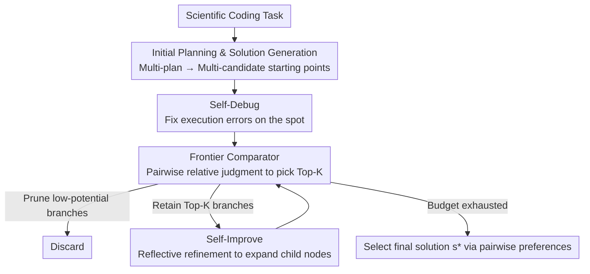

# SciNav: A General Agent Framework for Scientific Coding Tasks

**Conference**: ICLR 2026  
**OpenReview**: [https://openreview.net/forum?id=8iEsrg51Fs](https://openreview.net/forum?id=8iEsrg51Fs)  
**Code**: https://github.com/OSU-NLP-Group/SciNav  
**Area**: Agent / Scientific Coding / Test-time Search  
**Keywords**: Scientific Agent, Tree Search, Relative Judgment, Test-time Scaling, Code Generation

## TL;DR
SciNav embeds "pairwise relative judgment" into Top-K Tree Search (TKCTS), enabling LLM agents to solve scientific coding tasks under realistic conditions where predefined evaluation metrics are absent and search budgets are limited. By choosing branches, pruning, and expanding based on "which of the two is better" rather than "absolute scores for each solution," it significantly outperforms baselines such as Self-Debug and OpenHands on ScienceAgentBench and DA-Code.

## Background & Motivation
**Background**: LLM-based "scientific agents" have gained significant attention recently. Systems like Agent Laboratory, ResearchAgent, and AI Scientist aim to automate the entire research workflow end-to-end—proposing hypotheses, designing experiments, and writing reports. However, they target open-ended scientific problems where outputs (hypotheses/experimental plans/analyses) are inherently subjective. Evaluating such outputs objectively is difficult, often requiring expert review or expensive human studies.

**Limitations of Prior Work**: In contrast to open-ended problems, "scientific coding tasks"—represented by benchmarks like DSBench, DA-Code, SciCode, and ScienceAgentBench—produce **executable programs** that can be objectively scored against ground truth. Currently, agents tackling these benchmarks either use general-purpose agents (OpenHands, Auto-GPT) or engineering-oriented pipelines (managing Bash environments, file I/O). These are essentially "engineering-driven pipelines" that lack a **structured framework design for efficient exploration of the solution space**. Even AIDE, specialized for ML programming, assumes two premises rarely held in reality: (i) the existence of explicit evaluation metrics (e.g., leaderboard accuracy) for direct optimization, and (ii) a massive exploration budget (e.g., 24-hour exhaustive search).

**Key Challenge**: In real-world scientific tasks, different problems require different evaluation criteria, many of which are unknown beforehand; furthermore, long-duration searches are prohibitively expensive. A gap exists: **there is no end-to-end, structured agent framework capable of solving scientific coding tasks with high quality under "no predefined metrics + limited budget."**

**Goal**: To build a scientific programming agent that produces high-quality executable solutions under limited search budgets without relying on pre-given success metrics.

**Key Insight**: The authors leverage a robust finding from psychometrics and evaluation: **relative judgments (comparing which of two outputs is better) are more reliable and discriminative than absolute scoring (assigning a score to a single output)**. Absolute scoring by LLMs suffers from high noise and scale drift; however, using "A as an anchor and asking why B is better/worse than A" provides sharper, more stable signals that better align with task instructions.

**Core Idea**: Replace "absolute scoring" with "pairwise relative judgment" as the evaluation signal for tree search. By repeatedly comparing candidate solutions in pairs during the search, the framework retains Top-K high-potential branches, prunes low-potential ones, and expands child nodes along retained branches, thereby directing computation toward high-quality solutions within a limited budget.

## Method

### Overall Architecture
SciNav treats scientific reasoning as a "trajectory-driven" process: instead of a single-shot decision, it explores multiple candidate paths simultaneously, using mutual comparison for selection, pruning, and refinement. This mechanism is called **Top-K Comparative Tree Search (TKCTS)**. Given a scientific coding task $T$, it first generates a batch of initial candidate solutions $S_0$ for a priority queue $Q$. Within a comparison budget $B$, it loops: selecting pairs of candidates for LLM pairwise comparison, updating rankings, retaining the $\text{TOPK}$ (beam size $K$), pruning the rest, and expanding the retained branches into child nodes (via self-debug/self-improve) to be pushed back into the queue. Once the budget is exhausted, the final solution $s^\star$ is selected based on pairwise preferences.

The framework is supported by four interlocking components: **Initial Planning and Solution Generation** (broad starting points), **Self-Debug** (on-the-spot fixing of execution errors), **Self-Improve** (reflective iterative refinement), and the **Frontier Comparator** (the "navigator" using pairwise relative judgment to select branches). The first three handle "generation + correction," while the last determines "who to keep, who to expand, and who to prune."

### Key Designs

**1. Top-K Comparative Tree Search (TKCTS): Navigating search with pairwise comparisons instead of absolute scores**

This is the backbone of SciNav, addressing the pain points of noisy absolute scoring and irreversible single-shot decisions. It organizes search as a tree: maintaining a priority queue $Q$, selecting candidate pairs $(s_i, s_j)$ each round, and calling $\text{COMPARE}(T, s_i, s_j)$ to let the LLM decide "which is better and why." Results update the rankings in the queue; the $\text{TOPK}(Q, K)$ are retained, $S_{drop}$ are pruned, and retained branches are $\text{EXPAND}$-ed into child nodes then $\text{INSERT}$-ed back. The budget $B$ decrements per comparison until $\text{SELECTFINAL}$ returns the optimal solution. This Top-K design achieves two goals: first, **controlled backtracking**—retaining $K$ candidates means if the current best path stalls, the agent can return to previously lower-ranked candidates; second, **cost control**—limiting pairwise comparisons to the Top-K restricts the overhead of pairwise judgment.

**2. Frontier Comparator: Benchmarking candidates against each other rather than in isolation**

This is the critical evaluation module in TKCTS, implementing the "relative judgment > absolute scoring" insight. Instead of assigning individual absolute scores (which suffer from scale drift and noise), it directly contrasts candidates. For a given pool, it identifies promising branches via iterative pairwise comparisons. New child nodes generated as the search deepens enter the pool and are evaluated using the same pairwise approach. This relative evaluation provides sharper differentiation and higher stability. After each round, a sorting algorithm (Appendix F) updates the quality order in the priority queue. Its efficacy is empirically validated: relative judgment improves Success Rate (SR) from 16.2% (absolute scoring) to 18.6% without requiring ground truth—making it more practical than solutions dependent on ground-truth rubrics.

**3. Initial Planning + Solution Generation: Increasing the probability of "at least one near-correct solution" via test-time expansion**

This addresses the risk of a single inference path going entirely off-track. The authors follow the **test-time expansion** observation (seen in PlanSearch, CodeMonkeys): as the number of candidate solutions increases, the percentage of tasks "solved by at least one candidate" grows approximately log-linearly (Pass@K improvement). SciNav first directs the LLM to generate multiple high-level plans (feeding back existing plans to ensure diversity) and then generates one program per plan as a candidate, creating a diverse initial pool. Ablations show that increasing initial solutions from 1 to 5 raises the average "number of successful initial solutions" from 0.24 to 0.98 and the overall success rate from 40.5% to 45.2%.

**4. Self-Debug + Self-Improve: Execution feedback for error correction + Reflective refinement**

These are the engines for improving candidates along retained branches. Self-Debug uses a code interpreter to detect and fix bugs during tree search, allowing the agent to correct specific errors without discarding the entire trajectory. Self-Improve goes further—it prompts the model to identify a **specific refinement point** within a selected frontier solution based on the task description, simulating the human process of polishing a crude solution toward completion. In ablations, Self-Improve shows the most significant impact: with 5 initial solutions, its activation nearly doubles the "average successful nodes" from 1.14 to 2.69 and increases the success rate from 45.2% to 57.1%. To control the budget, the authors set initial solutions to 5, max debug steps to 3, and total exploration steps to 10 (Self-Improve occurs if debugging hasn't exhausted the budget).

## Key Experimental Results

### Main Results
On ScienceAgentBench ("no expert knowledge" setting), comparing across four base models for SR (Success Rate, primary) and VER (Valid Execution Rate):

| Base Model | Method | SR | VER | Cost ↓ |
|--------|------|------|------|------|
| GPT-4o (0513) | Direct Prompting | 7.50 | 42.2 | 0.011 |
| GPT-4o (0513) | OpenHands | 13.1 | 62.8 | 1.093 |
| GPT-4o (0513) | Self-Debug | 14.7 | 71.2 | 0.057 |
| GPT-4o (0513) | **SciNav** | **16.1** | 66.0 | 0.512 |
| GPT-4o (1120) | Self-Debug | 15.0 | 67.0 | 0.030 |
| GPT-4o (1120) | **SciNav** | **18.6** | **69.9** | 0.342 |
| Claude-3.7 | Self-Debug | 22.5 | 84.3 | 0.066 |
| Claude-3.7 | **SciNav** | **25.5** | 72.5 | 0.893 |
| DeepSeek-R1 | Self-Debug | 18.6 | 59.8 | 0.023 |
| DeepSeek-R1 | **SciNav** | **19.6** | **67.6** | 0.298 |

SciNav outperforms the strongest baseline, Self-Debug, across all four base models: on GPT-4o(1120), it achieves a 24% relative improvement in SR and a +2.9 absolute increase in VER. Note that SciNav uses only 3 debug steps while Self-Debug uses 10, which explains why Self-Debug occasionally has higher VER (e.g., GPT-4o 0513, Claude-3.7). SciNav is more expensive than Self-Debug but significantly cheaper and more effective than OpenHands. On DA-Code, SciNav significantly exceeds Self-Debug in data manipulation (+29 pts), statistical analysis (+29), and overall average (+13), with particularly notable gains on hard tasks (+23).

### Frontier Comparator Comparison
Using GPT-4o(1120) while varying the solution selection strategy:

| Frontier Comparator | SR | VER | Description |
|------|------|------|------|
| Random Selection | 15.2 | 64.7 | Randomly picking candidates |
| LLM-Absolute | 16.2 | 69.1 | Isolated absolute scoring |
| **Relative Judgments (Ours)** | **18.6** | **69.9** | Pairwise relative judgment |
| Rubric-Absolute (w/ GT) | 21.1 | 74.5 | Scoring via Ground Truth rubric (Upper bound) |

Relative judgment yields the highest SR/VER among strategies not using ground truth. Rubric-Absolute is higher but relies on privileged information (GT scoring steps), which is unavailable in reality. This confirms the practical value of relative judgment.

### Ablation Study
On 40 tasks from ScienceAgentBench (solved by at least one agent), analyzing initial solutions and Self-Improve:

| Initial Solutions | Self-Improve | Avg. Successful Nodes | Success Rate |
|------|---------|------|------|
| 1 | No | 0.40 | 40.5 |
| 2 | No | 0.57 | 40.5 |
| 5 | No | 1.14 | 45.2 |
| 5 | Yes | **2.69** | **57.1** |

### Key Findings
- **Self-Improve is the primary driver**: Enabling it with 5 initial solutions nearly doubles successful nodes (1.14 → 2.69) and boosts SR (45.2% → 57.1%), proving reflective refinement can "save" flawed initial solutions.
- **Multiple initial solutions raise the floor**: Increasing from 1 to 5 raises the average successful initial solutions (0.24 → 0.98), validating the test-time scaling logic.
- **Robustness across models**: SciNav consistently outperforms Self-Debug across diverse models (Claude for generation, R1 for reasoning), showing relative judgment is model-agnostic.
- **Higher gains on hard tasks**: On DA-Code, improvements are most pronounced for difficult tasks (hard +23), where structured search and comparison prevent "single-shot derailment."

## Highlights & Insights
- **Engineering an evaluation insight into a search signal**: While many know pairwise comparisons are more accurate than absolute scores, SciNav is the first to systematically embed it into Top-K tree search as a frontier comparator, bypassing the need for predefined metrics.
- **Top-K as a dual-purpose mechanism**: Retaining K candidates enables controlled backtracking (retreating to lower-ranked solutions when stalled) while capping pairwise comparison costs, balancing performance and efficiency.
- **Designed for "realistic budget + no ground truth"**: Unlike AIDE's assumptions of leaderboard metrics and 24-hour budgets, SciNav targets the real-world scenario where metrics are unknown and budgets are tight.
- **Transferable trick**: In any agent scenario where candidate scoring is noisy, the absolute-scoring selector can be replaced with pairwise relative judgment + Top-K queue sorting.

## Limitations & Future Work
- **High cost**: SciNav is significantly more expensive than Self-Debug or Direct Prompting (e.g., 0.512 vs 0.057). Cost-efficiency must be balanced when budgets are extremely tight.
- **VER trade-off**: Due to the 3-step debug limit, SciNav's VER is sometimes lower than Self-Debug's (which uses 10 steps), indicating a priority of "task success" over "mere execution."
- **Low absolute numbers**: Even the best SR remains in the 16%–25% range, reflecting the fact that scientific coding is far from solved.
- **Reliance on LLM judgment**: The quality of relative judgment is capped by the base model's comparative capabilities. If the model is unfamiliar with a domain, the signal may degrade.

## Related Work & Insights
- **vs. AIDE**: AIDE uses tree search for ML coding but requires explicit leaderboard metrics for optimization and high exploration budgets; SciNav navigates via relative judgment without predefined metrics.
- **vs. OpenHands / Auto-GPT**: These are engineering-driven ReAct agents lacking structured search; SciNav's TKCTS provides systematic exploration and backtracking, yielding higher SR more efficiently.
- **vs. Self-Debug**: Self-Debug performs single-trajectory debugging; SciNav adds trajectory search, relative judgment selection, and Self-Improve.
- **vs. Test-time Scaling (PlanSearch/CodeMonkeys)**: These show that increasing candidates improves coverage; SciNav adopts this and adds a frontier comparator to select/refine candidates without gold signals.

## Rating
- Novelty: ⭐⭐⭐⭐ Systematically embedding relative judgment into Top-K search for "no-metric + limited budget" scenarios is a novel combination.
- Experimental Thoroughness: ⭐⭐⭐⭐ Comprehensive evaluation across two benchmarks, four base models, and detailed ablations. Cost analysis could be even deeper.
- Writing Quality: ⭐⭐⭐⭐ Clear motivation and component descriptions; algorithm pseudocode is intuitive.
- Value: ⭐⭐⭐⭐ Provides a reusable search+comparison paradigm for scientific agents in realistic, low-signal environments.

<!-- RELATED:START -->

## Related Papers

- [\[ICLR 2026\] Huxley-Gödel Machine: Human-Level Coding Agent Development by an Approximation of the Optimal Self-Improving Machine](huxley-godel_machine_human-level_coding_agent_development_by_an_approximation_of.md)
- [\[ICLR 2026\] FeatureBench: Benchmarking Agentic Coding for Complex Feature Development](membership_privacy_risks_of_sharpness_aware_minimization.md)
- [\[ICLR 2026\] TaskCraft: Automated Generation of Agentic Tasks](taskcraft_automated_generation_of_agentic_tasks.md)
- [\[ICLR 2026\] TusoAI: Agentic Optimization for Scientific Methods](tusoai_agentic_optimization_for_scientific_methods.md)
- [\[ICLR 2026\] Zephyrus: An Agentic Framework for Weather Science](zephyrus_an_agentic_framework_for_weather_science.md)

<!-- RELATED:END -->
