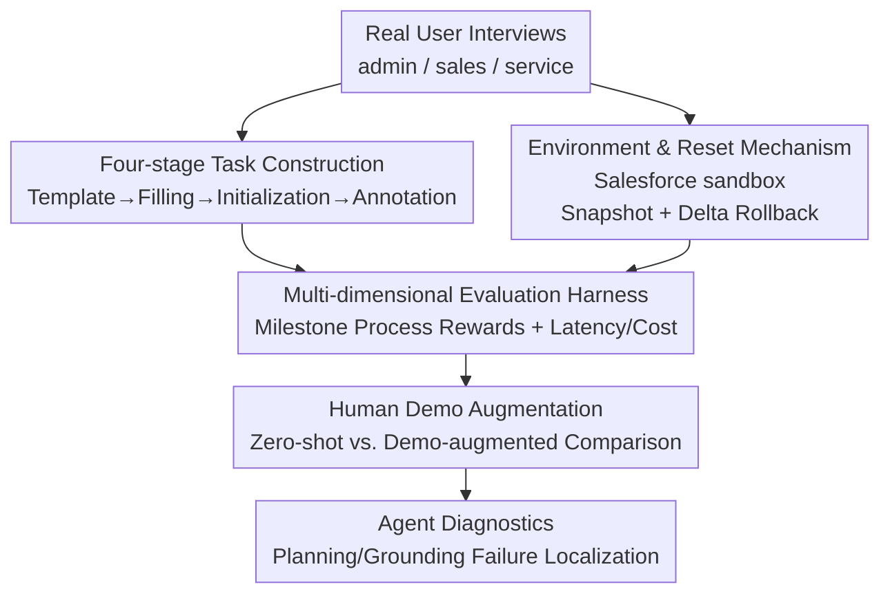

# SCUBA: Salesforce Computer Use Benchmark

**Conference**: ICLR 2026  
**OpenReview**: [https://openreview.net/forum?id=bkjKnO9s7T](https://openreview.net/forum?id=bkjKnO9s7T)  
**Code**: https://github.com/SalesforceAIResearch/SCUBA  
**Area**: Agent / Computer-Use Agent / Benchmark  
**Keywords**: Computer-use Agents, CRM Workflows, Enterprise Software, Process Rewards, Demonstration Augmentation

## TL;DR
SCUBA is a benchmark for computer-use agents built on authentic Salesforce sandbox environments, containing $300$ CRM tasks derived from real-world user interviews. It features resettable environments, fine-grained milestone evaluations, and human demonstrations. The study reveals a significant performance gap between open-source and closed-source models, as well as between browser-based and desktop-based agents (open-source success rates are $<5\%$ in zero-shot settings, whereas closed-source models reach $39\%$; with demonstrations, success rates reach $50\%$ while reducing costs and improving speed).

## Background & Motivation

**Background**: Vision-Language Models (VLMs) are being adapted into autonomous agents capable of automating complex workflows through Graphical User Interfaces (GUIs). These agents primarily take screenshots as input and output executable actions like clicks, typing, and code blocks, demonstrating capabilities on benchmarks such as WebArena and OSWorld.

**Limitations of Prior Work**: Existing benchmarks suffer from a systemic disconnect from real enterprise software scenarios. WebArena and OSWorld evaluate web navigation and general desktop applications, failing to capture the complexity of enterprise-grade platforms. The WorkArena series is limited to customer service scenarios within ServiceNow. While the CRMArena series utilizes Salesforce, it primarily targets tool-use agents and focuses exclusively on information retrieval—failing to **write or modify** data records and configurations within the environment. Consequently, no benchmark currently tests an agent's ability to perform actual "work" in enterprise software.

**Key Challenge**: In real enterprise deployments, task completion is only one dimension; **latency and cost are also decisive factors**. Existing evaluations typically provide only binary ($0/1$) success signals, making it impossible to pinpoint where an agent fails or to measure its efficiency costs.

**Goal**: To build a realistic, interpretable, and efficient enterprise CRM workflow benchmark covering five key enterprise capabilities: UI navigation, data manipulation, workflow automation, information retrieval, and troubleshooting, while incorporating latency, cost, and milestone progress into the metrics.

**Key Insight**: The authors utilize official Salesforce sandbox developer orgs, which provide UIs identical to production environments. The free-tier features are sufficient to support all tasks, ensuring "authenticity." Additionally, the challenge of resetting enterprise environments is addressed through a snapshot and delta rollback mechanism.

**Core Idea**: A computer-use agent arena featuring read-write tasks driven by real interviews, rule-based milestone evaluators, and human demonstrations to enable "realistic business simulation, fine-grained diagnostics, and high execution speed."

## Method

### Overall Architecture

SCUBA consists of three components: environment, tasks, and evaluation, supported by a pipeline that converts user interviews into evaluable tasks. The environment is a parallelizable, task-level resettable Salesforce sandbox. The $300$ task instances are distributed across three personas: administrator (admin, $57\%$), sales ($25\%$), and service ($18\%$). Each task includes an initialization script and a rule-based evaluator that provides binary success scores, milestone process rewards, and latency/cost metrics. The tasks are produced via a four-stage pipeline: template extraction from interviews $\rightarrow$ value-filled query generation $\rightarrow$ initialization and evaluator preparation $\rightarrow$ human labeling and quality control.

### Key Designs

**1. Mechanism: Turning enterprise sandboxes into large-scale evaluable environments via snapshot and delta rollback**

Authenticity requirements forced the authors to use Salesforce sandbox developer orgs instead of synthetic websites. However, this introduced a reset problem: resetting by restarting Docker containers (as in WebArena/OSWorld) is unfeasible because recreating a Salesforce org is too costly for large-scale evaluation. The solution involves taking a snapshot of the org’s initial state (downloading a set of configuration files). After an agent's run, the modified state is compared with the initial state, and **only the altered configuration files are rolled back**. Since the expected modifications for each task are known, resets can be performed at the **task-level** without rebuilding the entire org. Combined with parallelizable infrastructure (multiple headless browser sessions or Docker desktop containers), agents can be evaluated asynchronously, allowing a full evaluation run to complete within $90$ minutes. The environment supports screenshots, accessibility trees, and flattened DOM strings, alongside Playwright and PyAutoGUI atomic actions.

**2. Task Construction: Transforming interview-based workflows into reproducible, evaluable, and difficulty-controlled tasks**

Tasks were distilled from interviews with real Salesforce users (solution engineers, admins, sales reps, etc.). **Stage 1 (Template Creation)**: Workflows are abstracted into templates with placeholders (e.g., "Configure organization-wide default visibility for the {object name} object..."). Each template is linked to a Trailhead knowledge article and labeled by difficulty (easy/medium/hard). **Stage 2 (Query Generation)**: Each template generates $5$ queries with different values, introducing difficulty variances (e.g., requiring scrolling or alphabetic indexing). Queries are rewritten using GPT-5 for linguistic diversity and manually verified. **Stage 3 (Initialization & Evaluation)**: Most tasks have prerequisites (uploading synthetic data, enabling permissions). Evaluation methods are manually written for each query using Salesforce’s Metadata API and Tooling API. **Stage 4 (Human Annotation)**: Instances are sent to an internal labeling team for quality control and to produce annotation trajectories for agent enhancement. This results in $300$ instances ($60$ templates).

**3. Multi-dimensional Evaluation Harness: Decomposing "Failure" via Milestone Process Rewards**

Binary success scores are insufficient in enterprise scenarios where a task might be $80\%$ complete but still receive a $0$. SCUBA assigns each task a rule-based evaluator giving a **milestone score (process reward)**: tasks are split into weighted rubrics. For example, a "Create queue and add members" task is split into "Create queue with correct name ($0.3$ weight) / Bind to correct object type ($0.2$) / Send email notification ($0.25$) / Add specified members ($0.25$)." If the agent misses only the members, it receives a $0.75$ milestone score with a specific failure reason. This allows for precise localization of where an agent gets stuck. The harness also tracks efficiency metrics like time, steps, token consumption, and cost.

**4. Human Demonstration Augmentation: "On-the-job training" via Trailhead-style tutorials**

The authors observed that agent failures often stem from a lack of domain knowledge regarding Salesforce UI design—much like humans require training. SCUBA includes knowledge articles and human demonstration trajectories, creating a **demonstration-augmented** setting. Task queries are prepended with human demonstrations of similar or identical tasks. For most agents, this improves success rates while reducing time, steps, tokens, and costs. However, some exceptions exist (e.g., UI-TARS-1.5-7B and OpenCUA-7B could not effectively utilize demonstrations, showing increased success rates but also increased overhead).

## Key Experimental Results

Tests covered $9$–$11$ agents across two categories: **Browser-Use** (using Set-of-Mark (SOM) + DOM text, $19$ actions) with backbones like GPT-5/o3/Claude-4-sonnet/Gemini-2.5-pro; and **Computer-Use** (full-screen screenshots only, $15$ actions) including UI-TARS-1.5-7B, OpenCUA-7B, GUI-Owl-7B, OpenAI-CUA, Claude-4-sonnet(computer), Agent-S2.5, and MobileAgentV3. Max steps: $50$, max task length: $90$ minutes, resolution: $1920 \times 1080$, temperature: $1.0$.

### Main Results (Zero-shot Setting)

| Agent | Type | Milestone Score ↑ | Success Rate ↑ | Time (min) ↓ | Cost ($) ↓ |
| :--- | :--- | :--- | :--- | :--- | :--- |
| GPT-5 | Browser-Use | $0.73$ | $51.33\%$ | $19.31$ | $0.55$ |
| o3 | Browser-Use | $0.65$ | $45.67\%$ | $21.37$ | $0.56$ |
| Agent-S2.5 (w/GPT-5) | Desktop Framework | $0.58$ | $39.00\%$ | $25.13$ | $1.17$ |
| Claude-4-sonnet | Browser-Use | $0.56$ | $34.67\%$ | $11.25$ | $1.16$ |
| Gemini-2.5-Pro | Browser-Use | $0.47$ | $31.00\%$ | $7.27$ | $0.24$ |
| Claude-4-sonnet(computer) | Computer-Use | $0.48$ | $27.00\%$ | $8.02$ | $1.44$ |
| OpenAI-CUA | Computer-Use | $0.29$ | $16.00\%$ | $5.80$ | $0.59$ |
| MobileAgentV3 | Computer-Use | $0.11$ | $3.10\%$ | $21.47$ | $1.17$ |
| UI-TARS-1.5-7B | Computer-Use | $0.10$ | $2.67\%$ | $6.14$ | - |
| GUI-Owl-7B | Computer-Use | $0.05$ | $1.00\%$ | $12.96$ | - |
| OpenCUA-7B | Computer-Use | $0.05$ | $0.67\%$ | $20.48$ | - |

Open-source desktop agents (UI-TARS, OpenCUA, GUI-Owl) that perform well on OSWorld show nearly zero success on SCUBA ($<5\%$), while closed-source backbones achieve up to $39\%$ (Agent-S2.5) or $51\%$ (Browser-based GPT-5).

### Ablation Study: Demonstration Augmentation vs. Zero-shot

| Agent | Zero-shot SR | Demo-augmented SR | Time Change |
| :--- | :--- | :--- | :--- |
| GPT-5 (BU) | $51.33\%$ | $53.85\%$ | $19.31 \rightarrow 17.76$ |
| o3 (BU) | $45.67\%$ | $50.00\%$ | $21.37 \rightarrow 17.05$ |
| Gemini-2.5-Pro (BU) | $31.00\%$ | $46.15\%$ | $7.27 \rightarrow 10.02$ |
| Claude-4-sonnet(computer) | $27.00\%$ | $47.69\%$ | $8.02 \rightarrow 7.33$ |
| OpenAI-CUA | $16.00\%$ | $28.85\%$ | $5.80 \rightarrow 5.29$ |
| UI-TARS-1.5-7B | $2.67\%$ | $9.16\%$ | $6.14 \rightarrow 6.52$ |

Demonstrations generally improve success rates and typically reduce latency and cost.

### Key Findings
- **Observation/Action Space Design > Specialized Training**: Browser-based agents (SOM+DOM) outperform specialized desktop agents due to richer observations and more efficient action spaces combined with stronger planning capabilities. However, this requires significant customization of DOM parsers for the Salesforce platform.
- **Generalization Challenges for Desktop Agents**: Desktop agents experience a drastic drop in success rates when moving from OSWorld to SCUBA (without demos)—OpenCUA-7B drops $97.6\%$, GUI-Owl-7B drops $96.9\%$, and UI-TARS drops $90.1\%$. The primary failures are in **planning and grounding**.
- **The "No Free Lunch" Theorem**: Gemini-2.5-pro (augmented) achieves the best balance between success rate, latency, and cost. A substantial gap remains between closed-source and open-source models.

## Highlights & Insights
- **Task-level Delta Rollback** is a key engineering innovation for enterprise sandboxes: it avoids full environment reconstruction by comparing states and rolling back only modified items, making large-scale evaluation feasible.
- **Milestone Process Rewards** transform a black-box evaluation into a diagnostic progress bar, identifying exactly which step in a multi-page workflow failed—crucial for enterprise reliability assessments.
- **Demonstrations as "On-the-job Training"** highlights the potential of using unstructured tutorials or documentation to enhance agents when structured demonstrations are unavailable.

## Limitations & Future Work
- **Evaluators only check the final state**: Like OSWorld, SCUBA verifies the end state but does not detect if an agent "secretly" modified or deleted unrelated data during the process.
- **Subset Coverage**: Real enterprise workflows often span multiple platforms (HubSpot $\rightarrow$ LinkedIn $\rightarrow$ Salesforce). Some Salesforce features like AI-lead scoring were excluded due to sandbox limitations.
- **Template Diversity**: $300$ instances come from only $60$ templates, meaning template-level diversity is limited, and expanding to new tasks remains labor-intensive.

## Related Work & Insights
- **vs. WebArena / OSWorld**: These benchmarks evaluate general web and desktop tasks with full container resets. SCUBA focuses on enterprise CRM with task-level delta rollbacks and read-write tasks.
- **vs. WorkArena Series**: Both use production sandboxes, but WorkArena is restricted to customer service. SCUBA covers admin/sales/service personas through $60$ template-based read-write tasks.
- **vs. CRMArena Series**: CRMArena targets tool-use agents for information retrieval (no state changes). SCUBA is the first to satisfy the criteria of "read-write tasks + process rewards + human annotations + cross-departmental scenarios."

## Rating
- Novelty: ⭐⭐⭐⭐ First benchmark for Salesforce read-write CRM workflows; delta rollback and milestone evaluation are solid engineering innovations.
- Experimental Thoroughness: ⭐⭐⭐⭐⭐ Comprehensive comparison of $11$ agents across two settings, including generalization analysis and cost/latency trade-offs.
- Writing Quality: ⭐⭐⭐⭐ Clear motivation, precise categorization in Table 1, and detailed engineering descriptions.
- Value: ⭐⭐⭐⭐⭐ Directly addresses pain points in enterprise automation; interpretable evaluation and demonstration augmentation offer high industrial relevance.

<!-- RELATED:START -->

## Related Papers

- [\[ICLR 2026\] AgentSynth: Scalable Task Generation for Generalist Computer-Use Agents](agentsynth_scalable_task_generation_for_generalist_computer-use_agents.md)
- [\[ICLR 2026\] Efficient Agent Training for Computer Use](efficient_agent_training_for_computer_use.md)
- [\[ICLR 2026\] Programming with Pixels: Can Computer-Use Agents do Software Engineering?](programming_with_pixels_can_computer-use_agents_do_software_engineering.md)
- [\[ICLR 2026\] OSWorld-MCP: Benchmarking MCP Tool Invocation in Computer-Use Agents](osworld-mcp_benchmarking_mcp_tool_invocation_in_computer-use_agents.md)
- [\[ICLR 2026\] VideoAgentTrek: Computer Use Pretraining from Unlabeled Videos](videoagenttrek_computer-use_pretraining_from_unlabeled_videos.md)

<!-- RELATED:END -->
