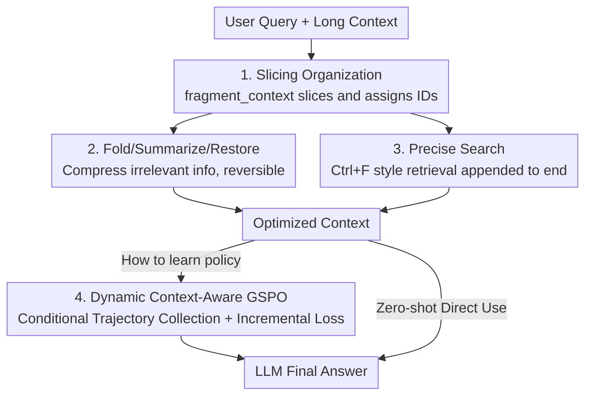

# Sculptor: Empowering LLMs with Cognitive Agency via Active Context Management

**Conference**: ICLR 2026  
**OpenReview**: [https://openreview.net/forum?id=HPeiH7da0Z](https://openreview.net/forum?id=HPeiH7da0Z)  
**Code**: TBD  
**Area**: LLM Agent / Long Context / Working Memory Management  
**Keywords**: Active Context Management, Proactive Interference, Long Context, Tool Calling, Reinforcement Learning

## TL;DR
This paper proposes the Sculptor framework, which equips LLMs with a reversible set of "Active Context Management (ACM)" tools—slicing, folding/summarizing/restoring, and precise search. This allows models to actively remove irrelevant information and focus on key content like a sculptor. Combined with a GSPO reinforcement learning method designed for dynamic contexts, the average score of a 13B model on multiple long-context benchmarks was improved from 39.4 to 73.8.

## Background & Motivation
**Background**: Mainstream approaches for handling long context involve either expanding the context window or introducing external memory systems (RAG, Mem0, MemAgent, etc.) to increase the volume of information accessible to the model. These methods focus on "letting the model see more."

**Limitations of Prior Work**: Merely extending the window exposes issues such as positional bias (lost in the middle), information overload, and interference. Although external memory systems can store more information, they do not solve a fundamental problem—**proactive interference**, where earlier, outdated, or irrelevant information in the context continuously interferes with subsequent reasoning and memory retrieval. Furthermore, RAG/memory methods perform **irreversible** filtering: they filter once based on the final query. If information labeled "irrelevant at first glance but critical later" is discarded, it cannot be retrieved, which is fatal in multi-hop reasoning.

**Key Challenge**: Information capacity and information curation are distinct. Existing methods focus on capacity but fail to give models the ability to "actively curate their own working memory." Human experts maintain focus in complex tasks by using selective attention, summarizing key points, temporarily setting aside secondary details, and retrieving them when needed. Current LLMs lack this cognitive agency.

**Goal**: Instead of increasing the token window, the goal is to enable LLMs to actively shape their **internal working memory** (the immediate context where attention operates and reasoning occurs) to (1) suppress proactive interference, (2) be applicable in both zero-shot and training settings, and (3) ensure the curation process is fully reversible without permanent info loss.

**Key Insight**: The authors analogize the "context" to a block of marble and the LLM to a sculptor—revealing the desired shape by selectively "removing material." This process is termed Active Context Management (ACM). A key observation is that modern LLMs already possess strong tool-calling and instruction-following capabilities, so context operations can be encapsulated as tools for the model to decide when to use.

**Core Idea**: Provide LLMs with a set of **deterministic, reversible context-operation tools that do not change the number or order of messages** (slice/fold/summarize/restore/search). This allows multi-step tool calling within a single turn to manage working memory. A RL training method (GSPO) adapted to the non-monotonic property of "context being changed by tools" is then designed to optimize the strategy.

## Method

### Overall Architecture
The operation of Sculptor is divided into three layers: **Tool Design Principles** (defining tool properties) → **Sculptor Tool Suite** (six tools in three categories) → **Training the Model** (Zero-shot prompting + Dynamic Context-Aware GSPO). At runtime, after receiving a user message, the model performs multi-step tool calls: first using `fragment_context` to slice the long dialogue into fragments with unique IDs, then folding/summarizing these fragments as needed to compress irrelevant content, or using precise search to pull information from the middle to the end. This iterative process transforms an "overloaded context" into an "optimized context" where all modifications are reversible.

### Key Designs

**1. Four Tool Design Principles: Making context operations "clean operators" for RL**

These tools are not designed arbitrarily but follow four strict rules to ensure they are both intuitive for zero-shot use and stable for RL training. First, **Determinism and Self-containment**: Each tool is a deterministic operator independent of external components (e.g., embedding models), ensuring deployment stability and isolating "cognitive agency" for pure evaluation—search uses exact matching rather than semantic retrieval to leave semantic understanding to the LLM. Second, **Cognitive Alignment**: Tools mimic effective human strategies; `search_context` is a "Ctrl+F" style exact match with low overhead. Third, **Structure Preservation**: Tools are strictly constrained to **never change the count or sequence of messages**, maintaining a stable state representation—a key prerequisite for "credit assignment" in RL. Fourth, **Reversibility and Graceful Degradation**: All context modifications are non-destructive and fully reversible (`fold` is undone by `expand`), ensuring the framework is a **strict superset** of the baseline model's capabilities—if no tools are called, the behavior is identical to the original state. These four rules ensure ACM does not destabilize training due to "chaotic context modifications."

**2. Six Tools in Three Categories: Reversible Slicing, Folding, and Retrieval**

The tool suite consists of six tools categorized by function, working together within a single turn. **① Context Slicing** is handled by `fragment_context`, which uses start/end markers to cut long dialogues into manageable fragments, each assigned a 6-character unique ID for reference. **② Compression and Restoration** consist of three complementary tools: `summarize_fragment` generates a focused summary of a fragment based on user-specified focus points (e.g., technical details, key decisions, TODOs), compressing content while retaining essentials; `fold_fragment` temporarily hides fragment content, displaying only a fold marker to reduce visual clutter; `restore_fragment` provides a unified restoration capability to revert summarized or folded fragments to their original text. **③ Precise Search and Retrieval** use two tools: `search_context` performs exact keyword matching (like Ctrl+F) in user messages, assistant replies, or all content, returning up to 50 matches with a configurable context window; `get_search_detail` retrieves longer context around a specific search result. A key technique is that search results are **appended to the end of the dialogue history**, mitigating the "lost in the middle" effect by moving buried information to the position most accessible to the model.

**3. Dynamic Context-Aware GSPO: Solving Credit Assignment in Self-Rewriting Contexts**

Equipping tools is insufficient; models must learn efficient strategies through training. However, traditional multi-step RL faces a challenge: it assumes each trajectory $\tau_t$ is a prefix of $\tau_{t+1}$, allowing training on the final trajectory. ACM tools **actively delete/modify information**, meaning $c_t \not\subset c_{t+1}$—the context state branches, and the prefix assumption fails. This paper uses GSPO (Group Sequence Policy Optimization) as the backbone, which optimizes at the sequence level via importance ratios, suitable for stable training in long contexts: for query $x$ and a set of sampled trajectories, the objective is $J_{\mathrm{GSPO}}(\theta)=\mathbb{E}_{x\sim D}\big[\frac{1}{G}\sum_i \min(s_i(\theta)\hat{A}_i,\ \mathrm{clip}(s_i(\theta),1-\varepsilon,1+\varepsilon)\hat{A}_i)\big]$, where the sequence-level importance ratio is $s_i(\theta)=\big(\pi_\theta(\tau_i|x)/\pi_{\theta_{old}}(\tau_i|x)\big)^{1/|\tau_i|}$, and the advantage $\hat{A}_i=(r-\mathrm{mean})/\mathrm{std}$ is normalized within the group.

Building on this, the authors propose **Conditional Trajectory Collection + Incremental Loss Assignment**. Whenever a tool call changes the context, a new training instance is sliced at that "rewrite step" (e.g., D1, D2), and the final reward propagates to all sub-trajectories in the same rollout. During training, **loss is computed only for newly generated completions (loss=1), while previously learned completions are masked (loss=0)**. Thus, each tool call receives **exactly one gradient signal** across all completions, preventing redundant learning and avoiding training collapse caused by "spurious self-triggering rewrite patterns." Notably, this method applies to both SFT and RL, providing a unified framework for dynamic context training.

### Loss & Training
Training involves two stages: First, successful tool-use trajectories are collected using Claude-4-Sonnet with task-specific prompts on BABILong and GSM-Infinite. **SFT** is performed using conditional trajectory collection and incremental loss to create Sculptor-M3 (learning basic ACM tool capabilities). Then, **Dynamic Context-Aware GSPO** is applied on the same data to produce Sculptor-M3-RL (discovering optimal tool strategies). The tool call limit per turn is set to 20, aligning with the effective usage of Claude-4-Sonnet while ensuring rollout efficiency.

## Key Experimental Results

### Main Results
Evaluation covers five long-context benchmarks: PI-LLM (proactive interference), NeedleBench multi-needle reasoning, MRCR (multi-round coreference), LongBenchV2, and FRAMES. The following table compares normalized average scores for the 13B in-house base model M3 and the open-source MoE GLM-4.5-air (M3 is the no-tool baseline, Sculptor-* denotes tools added, -RL denotes further GSPO training):

| Method | PI-LLM | NeedleBench-M-RS | MRCR | LongBenchV2 | FRAMES | Average |
|------|--------|------------------|------|-------------|--------|------|
| M3 (baseline) | 22.5 | 30.0 | 46.3 | 33.0 | 65.2 | 39.4 |
| M3 + RAG(BM25) | 17.9 | 12.5 | 6.6 | 25.8 | 33.6 | 19.3 |
| M3 + Mem0 | 39.2 | 19.0 | 9.2 | 29.0 | 52.8 | 29.8 |
| M3 + MemAgent | 41.5 | 24.0 | 22.1 | 29.6 | 61.5 | 35.7 |
| **Sculptor-M3** | 71.8 | 67.6 | 79.1 | 29.2 | 51.2 | 59.8 |
| **Sculptor-M3-RL** | **99.4** | **84.8** | **85.7** | 34.5 | 64.6 | **73.8** |
| GLM-4.5-air (baseline) | 29.4 | 24.5 | 43.1 | 46.9 | 76.0 | 44.0 |
| **Sculptor-GLM-4.5-air-RL** | 86.0 | 84.0 | **99.0** | 50.7 | 79.2 | **79.8** |

Key finding: **Only the Sculptor + RL path consistently matches or exceeds the full-attention baseline**, whereas traditional methods (RAG/Mem0/MemAgent) score **lower than their respective baselines** on average—this is due to irreversible filtering losing "eventually critical" information. Sculptor-M3-RL raised M3 from 39.4 to 73.8, and GLM-4.5-air from 44.0 to 79.8.

Zero-shot results for frontier models (with task-specific prompts) (Average of NeedleBench-M-RS / PI-LLM):

| Model | NeedleBench Avg | Gain | PI-LLM Avg | Gain |
|------|-----------------|-----|------------|-----|
| Claude-4-Sonnet | 67.0 → 94.0 | +27.0 | 84.04 → 89.94 | +5.90 |
| GPT-4.1 | 48.0 → 71.0 | +23.0 | 73.29 → 79.87 | +6.58 |
| DeepSeek-V3 | 50.0 → 58.0 | +8.0 | 57.39 → 57.27 | −0.12 |

### Ablation Study

| Configuration | Average (M3) | Description |
|------|---------|------|
| M3 Baseline | 39.4 | No tools, full attention |
| Sculptor-M3 (SFT only) | 59.8 | Tools + ACM data fine-tuning, +20.4 |
| Sculptor-M3-RL | 73.8 | Added Dynamic Context GSPO, +14.0 |

Prompt engineering comparisons (Claude-4-Sonnet) show: under a unified general prompt, tool selection is poor (90.7% of PI-LLM calls were search-heavy, exhausting the budget). With task-specific prompts, PI-LLM shifted from "search-centric" to "slice-then-fold" (fold calls rose from minimal to 1206), and NeedleBench search rose from 77 to 206—average scores for PI-LLM rose from 72 to 89.9, and NeedleBench from 74 to 94.0.

### Key Findings
- **RL provides clear contributions**: SFT alone improved the M3 average by +20.4, and adding Dynamic Context GSPO added another +14.0, indicating that "teaching tool usage" and "learning efficient strategies" are two independent gains.
- **Reversibility is the win condition**: RAG/MemAgent dragged down baselines because of one-time irreversible filtering; Sculptor retains information accessibility by allowing restoration after folding.
- **Attention analysis confirms mechanism**: In 46 key KV pairs of PI-LLM, after folding irrelevant content, attention to key values increased in 93.5% (43/46) of cases, with an average increase of 9.9%. This confirms that explicit removal of interference enhances focal attention—LLMs do not naturally learn to ignore irrelevant info perfectly.
- **Significant token savings**: Average context length decreased by 81.4% on NeedleBench/PI-LLM/MRCR (e.g., PI-LLM 72.4K→8.0K, −89.0%), showing that active management reduces costs while improving performance.
- **Greater gains on harder tasks**: As needles increased from 2 to 5 in NeedleBench, the relative gain of Sculptor-Claude over the baseline rose from +23% to +80%. The more interference, the higher the value of active curation. However, DeepSeek-V3 showed −0.12 on PI-LLM, indicating gains depend on the base model's tool-calling ability.

## Highlights & Insights
- **Converting "context management" into model actions**: Unlike prior work modifying architectures or using external memory, this paper treats context curation as reversible tools for the model to call autonomously during reasoning—shifting the paradigm from "passively processing longer context" to "active curation."
- **Reversibility + Structure Preservation for RL**: Rules like "never change message sequence" and "fold can be undone" are not just engineering constraints; they are specifically designed to make credit assignment manageable and ensure the framework is a strict superset of the baseline.
- **Conditional Trajectory Collection + Incremental Loss**: This elegantly solves the training problem where prefix assumptions fail due to context rewriting. Each tool call receives gradient signal exactly once, preventing self-triggering collapse. This approach is transferable to any scenario where an agent rewrites its own history.
- **Attention enhancement proof**: The quantitative analysis of folding confirms that "explicit interference removal > expecting attention to learn ignoring" with token-level evidence.

## Limitations & Future Work
- The authors admit that zero-shot settings rely heavily on task-specific prompt engineering (tool choice is poor with a unified prompt). While this motivated the use of RL, it highlights the limited robustness of the training-free version.
- DeepSeek-V3 showed zero or slight negative gains in zero-shot PI-LLM, indicating that ACM tool effectiveness depends strongly on the base model's inherent tool-calling and instruction-following skills.
- Search uses exact matching (Ctrl+F), avoiding semantic retrieval to maintain determinism. This may be a disadvantage in tasks requiring semantic proximity recall, placing the entire burden of semantic understanding on the LLM's own reasoning.
- Evaluation benchmarks are still synthetic/retrieval-heavy (PI-LLM, NeedleBench, MRCR); generalization to open-ended real-world long document reasoning requires more validation. Positioned as single-turn working memory, it still requires external systems for cross-session long-term memory.

## Related Work & Insights
- **vs. External Memory Systems (Mem0 / MemAgent)**: These target cross-session persistence or external storage with irreversible filtering. Sculptor focuses on single-session internal working memory and is fully reversible, preserving "eventually critical" information. The paper positions them as complementary.
- **vs. RAG (BM25 / Dense Retrieval)**: RAG performs one-time retrieval based on the final query, introducing information loss—its average scores were significantly lower than full-attention baselines in experiments. Sculptor maintains accessibility via restoration.
- **vs. Context Compression**: Compression work proves that foregrounding key info improves accuracy and reduces cost; Sculptor goes further by letting the model dynamically decide "what to compress" during reasoning while keeping restoration possible.
- **vs. Window Scaling**: This supports the claim that "explicit context control > merely larger token windows" is the key to robustness.

## Rating
- Novelty: ⭐⭐⭐⭐⭐ The combination of context management as reversible tools and specialized RL credit assignment for dynamic contexts is rare and self-consistent.
- Experimental Thoroughness: ⭐⭐⭐⭐⭐ Five benchmarks, two base model types, and multiple settings (Zero-shot/SFT/RL), including attention-level and cost-level analyses.
- Writing Quality: ⭐⭐⭐⭐ The sculptor analogy is effective and mechanisms are clear, though some tool naming (summary_by_id vs summarize_fragment) has minor inconsistencies.
- Value: ⭐⭐⭐⭐⭐ Provides a new path for long-context robustness based on "active curation" rather than "token stacking," while saving 80%+ of context tokens.

<!-- RELATED:START -->

## Related Papers

- [\[ICLR 2026\] Empowering LLM Tool Invocation with Tool-call Reward Model](empowering_llm_tool_invocation_with_tool-call_reward_model.md)
- [\[CVPR 2026\] ReFAct: Empowering Multimodal Web Agents with Visual and Context Focusing](../../CVPR2026/llm_agent/refact_empowering_multimodal_web_agents_with_visual_and_context_focusing.md)
- [\[AAAI 2026\] Verification-Guided Context Optimization for Tool Calling via Hierarchical LLMs-as-editors](../../AAAI2026/llm_agent/verification-guided_context_optimization_for_tool_calling_via_hierarchical_llms-.md)
- [\[ICML 2026\] Internalizing Agency from Reflective Experience](../../ICML2026/llm_agent/internalizing_agency_from_reflective_experience.md)
- [\[ICLR 2026\] Web-CogReasoner: Towards Multimodal Knowledge-Induced Cognitive Reasoning for Web Agents](web-cogreasoner_towards_multimodal_knowledge-induced_cognitive_reasoning_for_web.md)

<!-- RELATED:END -->
