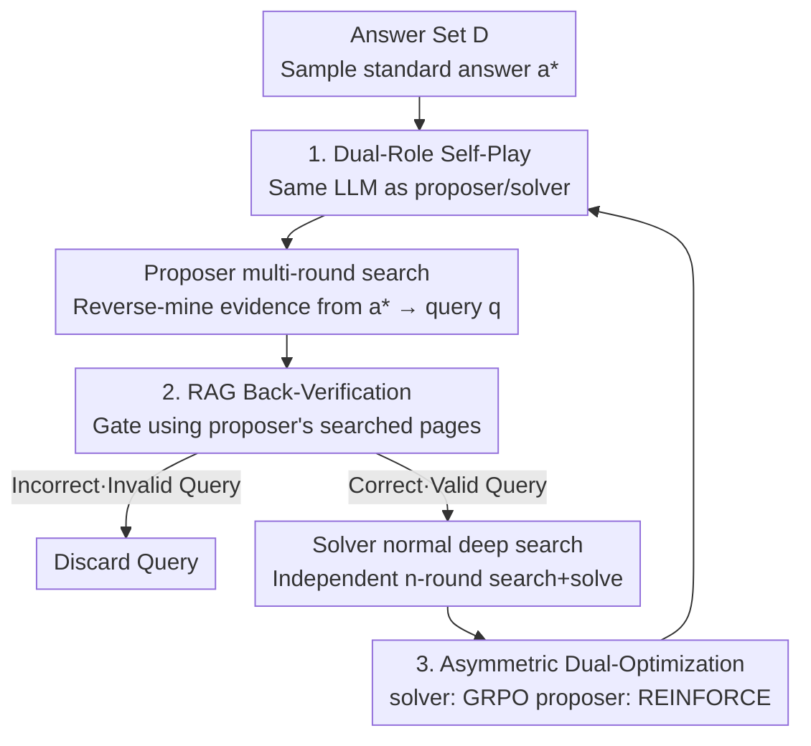

# Search Self-Play: Pushing the Frontier of Agent Capability without Supervision

**Conference**: ICLR 2026  
**OpenReview**: [https://openreview.net/forum?id=ZmGirmNJqE](https://openreview.net/forum?id=ZmGirmNJqE)  
**Code**: https://github.com/Qwen2-5-Applications/SSP  
**Area**: Agent / Reinforcement Learning / Deep Search  
**Keywords**: Self-Play, Deep Search Agent, RLVR, RAG Verification, Unsupervised Training

## TL;DR
The same LLM plays both "proposer" and "solver" roles in a self-play framework for deep search tasks: the proposer generates increasingly difficult search queries with verifiable answers, while the solver attempts to answer them. RAG-based reverse verification using the proposer's retrieved pages ensures the validity of the questions. This end-to-end process requires no human annotation and significantly improves search agent performance across seven QA benchmarks (averaging +26.4 points for Qwen2.5-7B-Base).

## Background & Motivation
**Background**: The current mainstream paradigm for training LLM agents (specifically "deep search agents" that call search engines over multiple rounds) is RLVR (Reinforcement Learning with Verifiable Rewards). Tasks are paired with ground-truth answers, and rewards are issued based on the final answer's correctness after multi-step exploration. This avoids the need for manual annotation of intermediate trajectories and serves as the foundation for open-source works like Search-R1, ZeroSearch, and R-Search.

**Limitations of Prior Work**: The bottleneck of RLVR has shifted from "annotating trajectories" to "annotating question-answer pairs." Massive, carefully designed query-answer pairs with verifiable answers are required to scale. In agentic scenarios, trajectories for different toolsets are not interchangeable, making manual question generation extremely costly. While some use offline query-synthesis, it requires rigorous verification of answer correctness and logical consistency, limiting scalability. Crucially, offline synthesis cannot **dynamically adjust difficulty** during training; generated questions are often either too easy (providing no gradient) or too difficult (unverifiable).

**Key Challenge**: There is a fundamental conflict between the need for a continuous unsupervised supply of "difficulty-adapted, credible" training tasks and the "uncontrollable difficulty/high verification cost" of offline synthesis. AlphaGo Zero-style self-play is a natural solution—achieving infinite self-improvement without external supervision—but it has primarily been used for LLM reasoning, alignment, or safety, and **never applied to agentic scenarios requiring external tools**. This is because proposers typically rely on internal knowledge, failing to generate questions requiring external retrieval or ensuring answer accuracy.

**Goal**: Design a self-play mechanism for deep search that simultaneously achieves three objectives: (1) the proposer generates search questions with clearly verifiable ground-truth; (2) question difficulty adapts to the solver's level; (3) the entire process requires zero human supervision.

**Key Insight**: A **Search Self-Play (SSP)** game replaces offline synthesis. The same LLM alternates between proposer and solver, evolving through a combination of competition and cooperation. Competition arises from the zero-sum confrontation where the proposer aims to challenge the solver, while cooperation is enforced by a "RAG back-verification" constraint that compels the proposer to generate solvable questions.

## Method

### Overall Architecture
SSP models deep search agent training as a **zero-sum adversarial game with verification constraints**. The input is a predefined answer set $D$ (answers only, no questions), and the output is a refined LLM policy $\pi_\theta$ with enhanced search capabilities. The same parameters $\pi_\theta$ switch roles using two system prompts ($x_{\text{propose}}$ / $x_{\text{solve}}$).

The data flow in one training round: Sample a ground-truth answer $a^*$ from $D$ → **proposer** receives $a^*$, performs multi-round search to "reverse-mine" implicit evidence supporting the answer, and generates a difficult query $q$ (hiding the known answer in a multi-hop reasoning problem) → The question passes through a **RAG back-verification** gate: all webpages $O_T$ retrieved by the proposer are collected as RAG context; the solver **must answer without searching**, using only these materials. If correct, the question is deemed "solvable with unique evidence" and proceeds; otherwise, it is discarded → Verified questions are given to the **solver** to solve independently $n$ times using the standard deep search process (multi-round search + reasoning) → Rewards are issued to both roles: the solver receives positive reward for correct answers, while the proposer receives positive reward when the solver fails (min-max adversity).

### Key Designs

**1. Dual-Role Self-Play: Co-evolution Mechanism for Competition and Cooperation**

This directly addresses the "unsupervised, uncontrollable difficulty" challenge. SSP uses the same $\pi_\theta$ for both roles: the proposing strategy is $u(\cdot|a)=\pi_\theta(\cdot|x_{\text{propose}},a)$, and the solving strategy is $v(\cdot|q)=\pi_\theta(\cdot|x_{\text{solve}},q)$. The base game is zero-sum: the proposer seeks to generate questions that stump the solver, while the solver tries to answer correctly regardless of difficulty. The min-max objective is:

$$\min_u \max_v\ \mathbb{E}_{a^*\sim D,\ \tau\sim u(\cdot|a^*),\ \rho\sim v(\cdot|q=Q(\tau))}\big[r(A(\rho),a^*)\big]$$

where $Q(\cdot)$ and $A(\cdot)$ extract the "query" and "predicted answer" from proposer trajectory $\tau$ and solver trajectory $\rho$, respectively. $r$ is a binary LLM-as-judge. As the solver improves, the proposer must create harder questions to gain reward, forming an **adaptive curriculum** that prevents overfitting and avoids unsolvable tasks.

**2. RAG Back-Verification: Using Search Evidence as a Gateway to Prevent Cheating**

A pure adversarial game has a loophole: the proposer could generate unsolvable or incorrect questions to ensure the solver fails, thereby gaining high rewards and causing the game to collapse. SSP solves this by adding a cooperative constraint: collect all webpages $O_T=O(\tau)$ from the proposer's search and treat them as RAG context. The solver must answer **without tools**, relying only on these materials. The logic: if the answer is unique and the proposer found necessary evidence, the solver should succeed. The equality constraint is:

$$\max_u\ \mathbb{E}\big[r(A(\sigma),a^*)\big]\quad\text{s.t.}\ \mathbb{E}_{\sigma\sim v(\cdot|q,O_T)}\big[r(A(\sigma),a^*)\big]=1$$

Only questions passing RAG verification are valid. To prevent the proposer from exploiting scenarios where evidence is sufficient for fixed documents but insufficient for open search, **random irrelevant webpages from other trajectories in the same batch** are mixed into the verification context. Ablation shows that mixing **4 noise pages** is optimal.

**3. Asymmetric Dual-Algorithm Optimization: Solver with GRPO, Proposer with REINFORCE**

For each verified query $q_i$, the solver performs $n$ rollouts $\{\rho_i^j\}$ to generate binary rewards $\{r_{\text{solve},i}^j\}$. Since the reward structures differ, different algorithms are used. The solver uses **GRPO** to reduce variance using group relative advantage $\hat A_i^j = r_{\text{solve},i}^j-\frac1n\sum_k r_{\text{solve},i}^k$. The proposer's reward is $R(\tau_i)=1-\frac1n\sum_j r_{\text{solve},i}^j$ (the complement of the solver's success rate), optimized via **REINFORCE** to increase the probability of generating trajectories that lower solver success rates.

### Key Experimental Results

#### Main Results
Evaluated on 7 QA benchmarks (NQ, TriviaQA, PopQA, HotpotQA, 2Wiki, MuSiQue, Bamboogle) using pass@1 accuracy. SSP consistently outperforms all baselines.

| Configuration / Model | Avg (Base) | +SSP | Gain | Single Best |
|------|------|------|------|------|
| Qwen2.5-7B-Base (From scratch) | 22.3 | 48.7 | **+26.4** | TriviaQA +40.4 |
| Qwen2.5-7B-Instruct | 41.5 | 49.5 | +8.0 | PopQA +15.4 |
| LLaMA-3.1-8B (Cross-architecture) | 36.7 | 46.3 | +9.6 | 2Wiki +15.0 |
| Qwen3-8B | 52.5 | 56.3 | +3.8 | Bamboogle +8.8 |
| Search-R1-7B (Continual training) | 53.9 | 55.7 | +1.8 | Bamboogle +4.0 |
| R-Search-7B (Continual training) | 52.8 | 54.6 | +1.8 | TriviaQA +3.2 |
| Qwen2.5-32B-Instruct (Scaling) | 55.1 | 58.5 | +3.4 | HotpotQA +5.8, 5/7 SOTA |

#### Ablation Study
**(a) Self-Play vs. Fixed Opponent** (Avg of 7 benchmarks):

| Config | Avg Score | Description |
|------|------|------|
| Base | 41.5 | No training |
| Solver-Only | 44.2 | Fixed proposer, train solver only |
| Proposer-Only | 41.7 | Fixed solver, train proposer only |
| **SSP (Full)** | **49.5** | Proposer/Solver co-evolution |

## Key Findings
- **Co-evolution is the fundamental driver**: In Solver-Only settings, in-game rewards saturate at ~0.9 quickly, suggesting overfitting to a static distribution. In full SSP, solver rewards slightly **decrease** over time—not due to degradation, but because the proposer successfully increases difficulty, maintaining a steady improvement on held-out tests.
- **RAG Verification is essential**: Removing it leads to significant performance drops on GeneralQA, confirming it filters out invalid/incorrect questions.
- **Noise injection prevents hacking**: Mixing 4 irrelevant documents forces the proposer to generate robust questions where the answer is uniquely supported by evidence.

## Highlights & Insights
- **Training the proposer is critical**: Unlike works that use a fixed generator, training the proposer parameters co-evolves the difficulty curriculum, which is the core of bringing self-play to agentic scenarios.
- **RAG Back-Verification as a "Cheating-Proof Oracle"**: Using the proposer's own evidence as a criterion ensures verifiable answers without human labels and blocks the path to degenerate "unsolvable question" solutions.
- **Asymmetric algorithm design**: Using GRPO for multi-trajectory solver groups and REINFORCE for single-trajectory proposer rewards is a practical engineering detail that aligns with their respective reward distributions.

## Limitations & Future Work
- **Domain restricted to retrieval-based QA**: All experiments used Wiki corpora and factual QA benchmarks; generalization to GUI or coding agent tasks is unverified.
- **Dependence on LLM-as-judge**: Rewards and verification rely on Qwen2.5-32B as a judge, which might introduce systematic bias.
- **Diminishing returns for strong models**: Gains for models like Qwen3-8B and Search-R1 are smaller (+1.8~3.8), indicating a potential ceiling for the current iteration.

## Related Work & Insights
- **vs Search-R1 / ZeroSearch / R-Search**: These rely on fixed query-answer pairs; SSP allows agents to generate their own tasks, serving as an effective strategy for continual training on top of these models.
- **vs Query-synthesis (WebDancer/WebSailer)**: These use offline pipelines with fixed difficulty; SSP provides online self-play with real-time difficulty adaptation and more credible verification.
- **vs Early LLM Self-Play**: SSP breaks the "internal knowledge ceiling" by allowing the proposer to interact with an external search environment to gather evidence for question generation.

## Rating
- Novelty: ⭐⭐⭐⭐⭐ First application of self-play to tool-using agents with a RAG-based solution to the proposer's cheating problem.
- Experimental Thoroughness: ⭐⭐⭐⭐ Broad coverage across benchmarks and models; although limited to factual QA.
- Writing Quality: ⭐⭐⭐⭐ Clear motivation and rigorous formulation of game objectives.
- Value: ⭐⭐⭐⭐⭐ Provides a viable path for unsupervised, difficulty-adaptive agentic RL scaling.

<!-- RELATED:START -->

## Related Papers

- [\[ICLR 2026\] DeepScientist: Advancing Frontier-Pushing Scientific Findings Progressively](deepscientist_advancing_frontier-pushing_scientific_findings_progressively.md)
- [\[ICLR 2026\] Expanding the Capability Frontier of LLM Agents with ZPD-Guided Data Synthesis](expanding_the_capability_frontier_of_llm_agents_with_zpd-guided_data_synthesis.md)
- [\[ICLR 2026\] Repurposing Synthetic Data for Fine-grained Search Agent Supervision](repurposing_synthetic_data_for_fine-grained_search_agent_supervision.md)
- [\[ICLR 2026\] Pushing Test-Time Scaling Limits of Deep Search with Asymmetric Verification](pushing_test-time_scaling_limits_of_deep_search_with_asymmetric_verification.md)
- [\[ICLR 2026\] WebSeer: Training Deeper Search Agents through Reinforcement Learning with Self-Reflection](webseer_training_deeper_search_agents_through_reinforcement_learning_with_self-r.md)

<!-- RELATED:END -->
## Related Papers

- [\[ICLR 2026\] Pushing Test-Time Scaling Limits of Deep Search with Asymmetric Verification](pushing_test-time_scaling_limits_of_deep_search_with_asymmetric_verification.md)
- [\[ICLR 2026\] DeepScientist: Advancing Frontier-Pushing Scientific Findings Progressively](deepscientist_advancing_frontier-pushing_scientific_findings_progressively.md)
- [\[ICLR 2026\] Expanding the Capability Frontier of LLM Agents with ZPD-Guided Data Synthesis](expanding_the_capability_frontier_of_llm_agents_with_zpd-guided_data_synthesis.md)
- [\[ICLR 2026\] Repurposing Synthetic Data for Fine-grained Search Agent Supervision](repurposing_synthetic_data_for_fine-grained_search_agent_supervision.md)
- [\[ICLR 2026\] WebSeer: Training Deeper Search Agents through Reinforcement Learning with Self-Reflection](webseer_training_deeper_search_agents_through_reinforcement_learning_with_self-r.md)

<!-- RELATED:END -->
