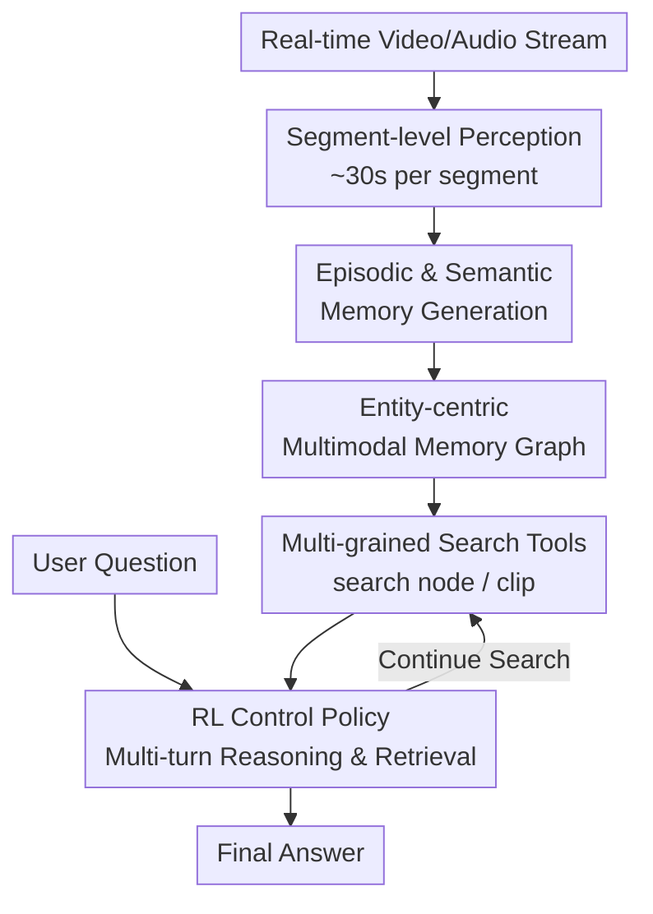

# Seeing, Listening, Remembering, and Reasoning: A Multimodal Agent with Long-Term Memory

**Conference**: ICLR2026  
**OpenReview**: [https://openreview.net/forum?id=PMz29A7Muq](https://openreview.net/forum?id=PMz29A7Muq)  
**Code**: https://github.com/ByteDance-Seed/m3-agent  
**Area**: Multimodal Agent / Long-term Memory / Video Understanding  
**Keywords**: Multimodal Agent, Long-term Memory, Memory-Augmented Reasoning, Long Video QA, Reinforcement Learning  

## TL;DR
M3-Agent converts real-time visual and audio streams into entity-centric multimodal long-term memory, utilizing a reinforcement learning-trained control model for multi-turn retrieval and reasoning. It outperforms prompt-based closed-source agents and online long video understanding baselines on M3-Bench and VideoMME-long.

## Background & Motivation
**Background**: Long video understanding and multimodal agents are evolving from "answering after watching a video" toward "continuously perceiving the environment, accumulating experience, and invoking past experiences when needed." Existing approaches generally fall into two categories: extending context windows/compressing visual tokens to ingest longer videos at once, or segmenting videos to generate textual descriptions/feature memories for Retrieval-Augmented Generation (RAG).

**Limitations of Prior Work**: These methods fall short of real-world agent requirements. Real robots or home assistants face near-infinite streaming experiences rather than fixed offline videos. They need to remember world knowledge such as "who this person is, what she likes, her relationships, and where items are usually placed." Writing independent captions for each segment loses identity consistency across clips; single-turn RAG often fails to retrieve all necessary clues for complex, multi-hop reasoning.

**Key Challenge**: The difficulty in long video QA lies not just in context length, but in "how memory is formed" and "how memory is used." Without an entity-centric structure, faces, voices, names, and preferences remain scattered across segments. If the control process merely stuffs top-k segments into the context, closing the loop on multi-hop clues, cross-modal evidence, and character attribute inference remains difficult.

**Goal**: The authors decompose the problem into three sub-tasks: first, continuously processing video/audio streams to generate cumulative memory online; second, organizing events, people, speech, faces, and semantic knowledge into a consistent long-term memory; third, enabling the agent to autonomously decide what to search for, how many rounds to search, and when to answer.

**Key Insight**: This work draws inspiration from human episodic and semantic memory: episodic memory records specific occurrences, while semantic memory extracts stable knowledge such as "people, relationships, preferences, and rules." This perspective is promising because agents do not need a full replay of all videos but rather a world model that preserves retrievable, associable, and updatable information from long-term experience.

**Core Idea**: Replace single-turn video RAG with "Entity-centric Multimodal Long-term Memory + RL-trained Multi-turn Retrieval Controller," enabling the multimodal agent to memorize while watching and reason while searching.

## Method

### Overall Architecture
M3-Agent consists of a multimodal long-term memory database and two policy models: a memorization policy responsible for generating memory from continuous video/audio segments, and a control policy responsible for retrieving memory to answer questions. The system operates via two parallel flows: 'memorization' continuously writes environmental input into long-term memory, while 'control' invokes memory search tools for multi-turn reasoning upon receiving instructions.

The key difference from standard long video QA pipelines is that M3-Agent treats segments (approx. 30s) as persistent memory nodes instead of temporary context. These nodes are linked into a graph by entity, time, and modality. During inference, the control model generates "reasoning + action + parameters," repeatedly executing `[Search]` to append results to the trajectory until selecting `[Answer]`.

### Key Designs
**1. Entity-centric Multimodal Memory Graph: Transforming Experience into Associable Knowledge**

Long-term memory in M3-Agent is a multimodal graph rather than a simple text caption library. Each node stores a unique ID, modality type, content, reliability weight, embedding, and timestamp. Undirected edges represent relationships (e.g., linking a face, voice, name, and related knowledge of the same entity). This ensures that "Alice's face," "voice_3," and "Alice likes coffee" converge into a single character memory cluster.

This design addresses identity drift. Plain language descriptions often refer to the same person as "lady in red," "person with glasses," or "Bob's friend," making alignment difficult over time. M3-Agent uses face recognition, speaker identification, and `search node` to link new faces/voiceprints to existing nodes. Matches activate or weight existing nodes/edges, while new nodes are created for non-matches. Conflicting information is handled via weighted voting during reasoning.

**2. Episodic + Semantic Memory: Retaining "What Happened" and "What is Known"**

The memorization process generates two types of text memory per segment. Episodic memory records events (e.g., who said what, where an object was placed). Semantic memory extracts general knowledge (e.g., preferences, relationships, rules). Semantic memory is not a mere summary but a distillation of knowledge for future tasks.

These are complementary: episodic memory answers "what happened at a specific moment," while semantic memory answers "what this person is usually like." Cross-modal reasoning during generation links faces and voices to a shared `<character id>`, allowing consistent reasoning during retrieval.

**3. Multi-turn Control and Retrieval Tools: Planning Memory Access**

The control flow takes the question, memory, and maximum rounds $H$ as input. In each round, the policy $\pi_\theta$ generates reasoning, an action, and parameters. `search node` accepts text/image/audio queries to return nodes, while `search clip` returns relevant segment histories. This allows the agent to use intermediate findings to inform subsequent queries, which is essential for multi-hop questions like "Where did they go after visiting the cafe?".

**4. Task Specialization and DAPO Reinforcement Learning**

Memorization and control models are trained separately. The memorization model (Qwen2.5-Omni-7B) handles multimodal perception, while the control model (Qwen3) focuses on language reasoning. The memorization phase is trained via supervised fine-tuning (SFT) on synthetic data.

The control phase uses Direct Advantage Preference Optimization (DAPO). For each QA pair $(q, a)$, the policy rollouts trajectories. A GPT-4o evaluator judges the final answer $y_i$, providing a binary reward:

$$
R_i = \begin{cases}
1, & \text{GPT-4o evaluator}(q, a, y_i)=\text{True} \\
0, & \text{otherwise}
\end{cases}
$$

Optimization applies only to model-generated tokens, using intra-group reward normalization for advantage estimation. This encourages the model to learn when and what to search.

### Loss & Training
The `memory-7b-sft` model uses SFT on data from 500 long videos and 2,736 QA pairs. Training involves 3 epochs with a learning rate of $1e-5$ and a batch size of 16 across 16 GPUs.

The control model utilizes DAPO. Only trajectories judged correct by the GPT-4o evaluator receive a reward. Loss is computed strictly on LLM-generated tokens to avoid optimizing over user inputs or retrieved results. The final model is denoted as `control-32b-rl`.

## Key Experimental Results

### Main Results
M3-Agent was compared against Socratic Models, online video models, and prompt-based agents on M3-Bench and VideoMME-long. M3-Agent achieved state-of-the-art results, outperforming Gemini-GPT4o-Hybrid by 7.7% on M3-Bench-web and 5.3% on VideoMME-long.

| Method | M3-Bench-robot All | M3-Bench-web All | VideoMME-long | Remarks |
|------|-------------------|------------------|---------------|------|
| GPT-4o Socratic Model | 8.5 | 28.7 | 38.8 | Chunk descriptions + RAG |
| MA-LMM | 24.4 | 24.3 | 17.3 | Online baseline |
| Gemini-Agent | 16.9 | 34.1 | 55.1 | Gemini for both |
| Gemini-GPT4o-Hybrid | 24.0 | 41.2 | 56.5 | Gemini memory + GPT-4o control |
| M3-Agent | 30.7 | 48.9 | 61.8 | Memory SFT + Control RL |

M3-Agent excels in tasks requiring stable entity memory and cross-modal binding. On M3-Bench-web Person Understanding, it scored 59.3 compared to 43.8 for the Hybrid baseline.

| Dataset / Type | Prev. SOTA | Prev. SOTA Score | Ours | Gain |
|---------------|----------|--------------|----------|------|
| M3-Bench-robot / All | MA-LMM | 24.4 | 30.7 | +6.3 |
| M3-Bench-robot / Cross-modal | MA-LMM | 22.7 | 31.2 | +8.5 |
| M3-Bench-web / Person | Hybrid | 43.8 | 59.3 | +15.5 |
| VideoMME-long | Hybrid | 56.5 | 61.8 | +5.3 |

### Ablation Study
Ablations on memory (fixed `control-32b-rl`) show that `memory-7b-sft` outperforms prompted Gemini or base Qwen. Removing semantic memory caused a massive drop from 30.7 to 13.6 on M3-Bench-robot.

| Memory Model | M3-Bench-robot | M3-Bench-web | VideoMME-long | Note |
|----------|----------------|--------------|---------------|------|
| memory-7b-sft | 30.7 | 48.9 | 61.8 | Full system |
| w/o equivalence | 19.5 | 39.7 | 52.1 | No ID linking |
| w/o semantic memory | 13.6 | 29.7 | 48.7 | No distilled knowledge |

Ablations on control (fixed `memory-7b-sft`) show that DAPO provides significant gains across 8B, 14B, and 32B models. Removing reasoning tokens or inter-turn instructions led to substantial performance degradation.

| Control Model | M3-Bench-robot | M3-Bench-web | VideoMME-long | Note |
|----------|----------------|--------------|---------------|------|
| control-32b-prompt | 20.7 | 40.9 | 52.5 | No RL |
| control-32b-rl | 30.7 | 48.9 | 61.8 | With DAPO |
| w/o reasoning | 19.0 | 40.1 | 52.3 | Direct action/answer |

### Key Findings
- Semantic memory is the most critical component; its removal causes the largest performance drops.
- Entity equivalence (linking faces/voices) significantly improves consistency in long-term scenarios.
- RL-based multi-turn control benefits models of all sizes, showing that searching strategies can be learned.
- M3-Bench effectively tests agent-specific capabilities like cross-modal reasoning and character understanding.

## Highlights & Insights
- Implementing long-term memory as an entity-centric graph is superior to storing linear text histories for agents. It captures relationships and preferences that improve character-centric reasoning.
- The split between episodic and semantic memory is highly practical, balancing raw fidelity with abstract utility.
- Training the controller via RL to treat search as an action allows the strategy to scale, moving beyond simple prompt engineering.

## Limitations & Future Work
- Memory is still primarily text-centric; fine-grained visual information or spatial relationships might be lost in translation.
- Semantic memory quality depends on the underlying model's summarization capability; error correction and forgetting mechanisms are not yet explored.
- Automatic evaluation relies on GPT-4o, which may introduce biases.
- High training and inference costs for 32B-level RL models may hinder deployment on edge devices.
- M3-Bench-robot uses head-mounted cameras (passive observation) rather than active robot-environment interaction.

## Related Work & Insights
- **vs Socratic Models / VideoAgent**: While these use text-based RAG, M3-Agent introduces a structured entity graph and multi-turn RL control.
- **vs MA-LMM / MovieChat**: Online understanding focuses on feature compression, whereas M3-Agent focuses on sustainable world knowledge.
- **Insight**: Future work should transition from "passive recording" to "active maintenance," where agents observe or ask questions specifically to clarify or update their long-term memory.

## Rating
- Novelty: ⭐⭐⭐⭐⭐ (Integrates entity-centric memory with multi-turn RL for multimodal agents.)
- Experimental Thoroughness: ⭐⭐⭐⭐ (Extensive benchmarks and ablations, though active interaction is missing.)
- Writing Quality: ⭐⭐⭐⭐ (Clear structure, though some details are in appendices.)
- Value: ⭐⭐⭐⭐⭐ (Directly advances long-term memory and embodied intelligence research.)

<!-- RELATED:START -->

## Related Papers

- [\[ICLR 2026\] From Single to Multi-Granularity: Toward Long-Term Memory Association and Selection of Conversational Agents](from_single_to_multi-granularity_toward_long-term_memory_association_and_selecti.md)
- [\[ICLR 2026\] MEM1: Learning to Synergize Memory and Reasoning for Efficient Long-Horizon Agents](mem1_learning_to_synergize_memory_and_reasoning_for_efficient_long-horizon_agent.md)
- [\[ACL 2026\] HiGMem: A Hierarchical and LLM-Guided Memory System for Long-Term Conversational Agents](../../ACL2026/llm_agent/higmem_a_hierarchical_and_llm-guided_memory_system_for_long-term_conversational_.md)
- [\[ICLR 2026\] MC-Search: Evaluating and Enhancing Multimodal Agentic Search with Structured Long Reasoning Chains](mc-search_evaluating_and_enhancing_multimodal_agentic_search_with_structured_lon.md)
- [\[ICLR 2026\] Memory-T1: Reinforcement Learning for Temporal Reasoning in Multi-session Agents](memory-t1_reinforcement_learning_for_temporal_reasoning_in_multi-session_agents.md)

<!-- RELATED:END -->
