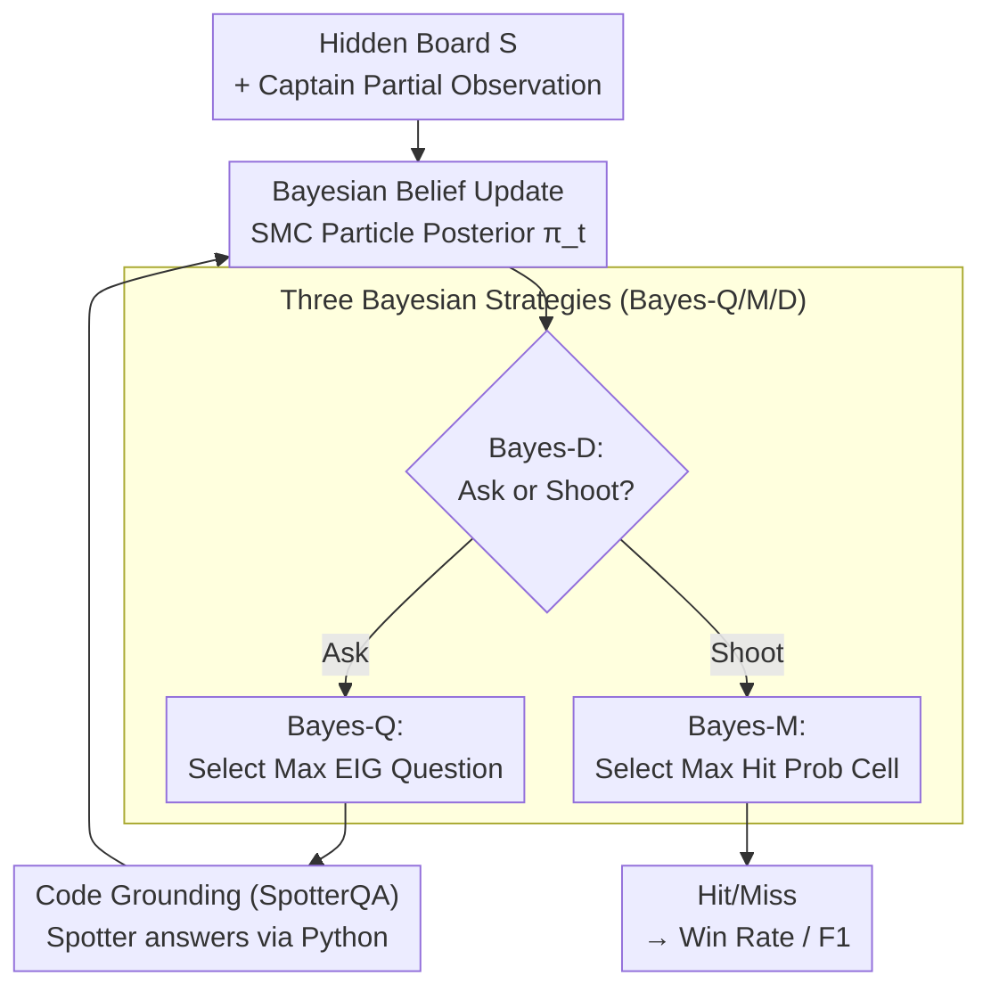

# Shoot First, Ask Questions Later? Building Rational Agents that Explore and Act Like People

**Conference**: ICLR 2026  
**arXiv**: [2510.20886](https://arxiv.org/abs/2510.20886)  
**Code**: [Project Page](https://gabegrand.github.io/battleship)  
**Area**: LLM Agents / Cognitive Science  
**Keywords**: Information-seeking agents, Bayesian experimental design, language model reasoning, exploration-exploitation trade-off, Monte Carlo inference

## TL;DR
The authors propose the Collaborative Battleship task to evaluate the information-seeking capabilities of language models. They design three Bayesian inference strategies (Bayes-Q/M/D) to enhance LM questioning, acting, and decision-making, enabling a weak model (Llama-4-Scout) to achieve superhuman performance (82% win rate) at approximately 1% of the cost of GPT-5.

## Background & Motivation
- High-stakes AI applications (e.g., scientific discovery, medical diagnosis) require agents to strategically acquire information: forming hypotheses, asking targeted questions, and making decisions under uncertainty.
- While current LMs are primarily optimized to answer user queries, it remains unclear whether they can formulate effective questions for themselves.
- There is a need to evaluate and enhance the ability of frontier models to ask goal-oriented questions and take actions within dynamic environments.
- **Key Motivation**: Drawing on the theory of resource rationality from human cognition, this work uses Bayesian experimental design to enhance the information-seeking capabilities of LMs.

## Method

### Overall Architecture
The authors frame information seeking as a Collaborative Battleship game: the Captain only sees a partial board and must balance "exploration via questioning" with "exploitation via shooting," while the Spotter sees the full board and only answers yes/no. Around this game, the BattleshipQA benchmark is established using 126 human games (N=42). Bayesian experimental design is then applied to the LM, injecting Bayesian optimal inference into the questioning, acting, and decision-making phases. Finally, the strategies' transferability is verified on Guess Who?. The entire pipeline forms a loop: the Captain maintains a belief distribution over the hidden board; in each round, the decision module determines whether to ask or shoot. If asking, the question with the maximum information gain is selected, answered by the Spotter via code execution, and used to update the belief. If shooting, the cell with the highest hit probability is chosen. All enhancements occur at inference time without any training.

### Key Designs

**1. Bayesian Belief Update: Compressing dialogue history into a posterior over the hidden board**

The foundation of the method is a belief distribution over the hidden board $S \in \mathcal{S}$, denoted as $\pi_t(s) = \Pr(S=s \mid x, \mathcal{H}_{1:t})$, where $\mathcal{H}_{1:t}$ is the history. Since the Spotter may make mistakes, observations are modeled as a Binary Symmetric Channel $\text{BSC}(\varepsilon)$ (with $\varepsilon=0.1$). Upon receiving an answer $\tilde{a}_t$, the update follows $\pi_{t+1}(s) \propto \pi_t(s)\big[(1-\varepsilon)\mathbf{1}\{\tilde{a}_t = f_{q_t}(s)\} + \varepsilon\mathbf{1}\{\tilde{a}_t \neq f_{q_t}(s)\}\big]$. If the answer matches the hypothesis $s$, it is multiplied by $1-\varepsilon$; otherwise, by $\varepsilon$. Given the vast hypothesis space, Sequential Monte Carlo (SMC) particles are used to approximate $\pi_t$.

**2. Three Bayesian Strategies: Optimal selection at three critical junctures**

With the belief distribution, the agent can invoke Bayesian optimal solutions:
- **Bayes-Q**: The LM samples a set of candidate questions $\mathcal{Q}$ (up to 10), and the one with the highest expected information gain is selected: $q_t^* = \arg\max_{q \in \mathcal{Q}} \text{EIG}_\varepsilon(q \mid x, \mathcal{H}_{1:t})$. Under BSC noise, EIG has a closed-form solution: $\text{EIG}_\varepsilon = H_b(\varepsilon + (1-2\varepsilon)p_t) - H_b(\varepsilon)$, which is maximized when the question splits the posterior in half ($p_t \approx 1/2$).
- **Bayes-M**: Instead of the LM "guessing" where to fire, the cell with the highest hit probability is selected: $u_t^* = \arg\max_u p_t^{\text{hit}}(u \mid x, \mathcal{H}_{1:t})$.
- **Bayes-D**: This performs a one-step look-ahead to decide whether to ask or shoot. If the expected hit probability after asking $\gamma \cdot \widehat{p_{t+1}^{\text{hit}}}(q_t^*)$ exceeds the current hit probability $p_t^{\text{hit}}(u_t^*)$, the agent continues questioning; otherwise, it fires. Here, $\gamma = 0.95$ provides a slight bias toward immediate action.

**3. Code Generation Grounding (SpotterQA): Using programs instead of intuition**

Belief updates rely on the Spotter's accuracy, but LMs often struggle with complex natural language questions. The authors require the Spotter to translate questions into Python programs. Executing these programs against the hypothesis space provides a yes/no answer, turning ambiguous linguistic judgment into executable formal logic. This improves accuracy by approximately 14.7% compared to CoT baselines.

## Key Experimental Results

### Main Results (CaptainQA - Full Game)

| Captain Strategy | Llama-4-Scout F1 | GPT-4o F1 | GPT-5 F1 | Notes |
|-------------|-----------------|-----------|----------|------|
| LM only | 0.367 | 0.450 | 0.716 | Pure LM baseline |
| +Bayes-Q | 0.388 | 0.476 | 0.717 | Questioning only |
| +Bayes-M | 0.621 | 0.663 | 0.731 | Action only |
| +Bayes-QM | 0.733 | 0.753 | 0.734 | Q + Action |
| +Bayes-QMD | 0.764 | 0.782 | — | Full (Superhuman) |
| Human Avg | — | — | — | F1 ≈ 0.6-0.7 |

### SpotterQA Accuracy

| Model | Base | CoT+Code | Gain |
|------|------|----------|------|
| GPT-4.1 | 75.2% | 90.9% | +15.7% |
| Claude 4 Opus | 86.8% | 94.4% | +7.6% |
| Llama-4-Scout | 62.2% | — | — |
| Human | 92.5% | — | — |

### Key Findings
- **Weak models achieve superhuman performance via Bayesian enhancement**: Llama-4-Scout's win rate jumps from 8% to 82% (vs. human) and from 0% to 67% (vs. GPT-5), at ~1% of the cost.
- **High EIG questioning is insufficient**: Bayes-Q alone only slightly improves performance; Bayes-M (action enhancement) is the critical driver.
- **Elimination of redundant questions**: Bayes-Q reduces Llama-4-Scout's zero-EIG questions from 18.5% to 0.2%.
- **GPT-5 possesses efficient internal strategies**: Bayesian enhancements have negligible impact on GPT-5, suggesting it has already internalized similar reasoning strategies.
- **Strategic players balance asking and shooting**: Humans and GPT-5 ask an average of 8 questions (limit 15), but each question is more informative.

## Highlights & Insights
- Elegant experimental design using Battleship as a controlled testbed for Bayesian experimental design.
- The "resource rationality" perspective is unique—prioritizing utility under finite resources over global optimality.
- A prime example of inference-time scaling: significant performance gains achieved through sampling and reranking without retraining.
- Grounding via code generation transforms fuzzy linguistic questions into deterministic executable programs.

## Limitations & Future Work
- The environment is relatively simple ($8 \times 8$ board); generalization to complex real-world scenarios requires further verification.
- The Spotter noise $\varepsilon$ is fixed at 0.1; it should ideally be estimated adaptively.
- Bayesian strategies rely on a "world model" that can be efficiently sampled; domains where manual implementation is impossible would require learned generative models.
- Pragmatics in human dialogue (context-dependent questioning) remains a challenge.
- While validation on Guess Who? is promising, the task complexity remains limited.

## Related Work & Insights
- The Battleship task originates from cognitive science (Gureckis 2009, Rothe 2017-2019); this work extends it to multi-turn dialogue.
- Modern LM instantiation of Bayesian Experimental Design (BED) theory (Lindley 1956, Chaloner 1995).
- Strategy design is guided by Resource Rationality theory (Anderson 1990, Lieder 2020), seeking "good enough" rather than absolute optimal.

## Rating
- Novelty: ⭐⭐⭐⭐⭐ Unique intersection of CogSci, BED, and LMs.
- Experimental Thoroughness: ⭐⭐⭐⭐⭐ Human experiments, 15 LMs, ablation, and Guess Who? generalization.
- Writing Quality: ⭐⭐⭐⭐⭐ Fluid narrative, perfect integration of theory and experiments.
- Value: ⭐⭐⭐⭐⭐ Provides critical insights for building rational information-seeking agents.

<!-- RELATED:START -->

## Related Papers

- [\[ICML 2025\] From Passive to Active Reasoning: Can Large Language Models Ask the Right Questions under Incomplete Information?](../../ICML2025/llm_agent/from_passive_to_active_reasoning_can_large_language_models_ask_the_right_questio.md)
- [\[ACL 2025\] AndroidGen: Building an Android Language Agent under Data Scarcity](../../ACL2025/llm_agent/androidgen_agent_data_scarcity.md)
- [\[ICML 2026\] Think Twice Before You Act: Enhancing Agent Behavioral Safety with Thought Correction](../../ICML2026/llm_agent/think_twice_before_you_act_enhancing_agent_behavioral_safety_with_thought_correc.md)
- [\[ACL 2026\] Don't Act Blindly: Robust GUI Automation via Action-Effect Verification and Self-Correction](../../ACL2026/llm_agent/don39t_act_blindly_robust_gui_automation_via_action-effect_verification_and_self.md)
- [\[ACL 2026\] AnchorMem: Anchored Facts with Associative Contexts for Building Memory in Large Language Models](../../ACL2026/llm_agent/anchormem_anchored_facts_with_associative_contexts_for_building_memory_in_large_.md)

<!-- RELATED:END -->
