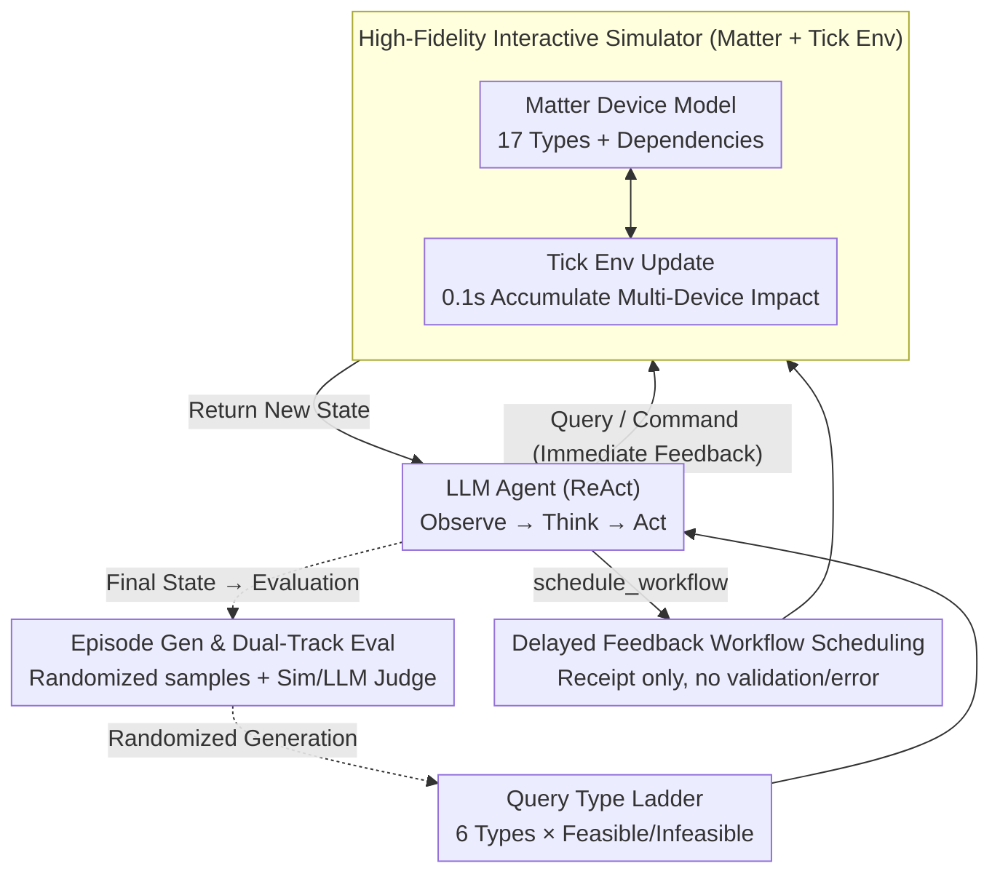

# SimuHome: A Temporal- and Environment-Aware Benchmark for Smart Home LLM Agents

**Conference**: ICLR 2026  
**arXiv**: [2509.24282](https://arxiv.org/abs/2509.24282)  
**Code**: [https://github.com/holi-lab/SimuHome/](https://github.com/holi-lab/SimuHome/)  
**Area**: LLM Agent  
**Keywords**: Smart Home, LLM Agent, Workflow Scheduling, Temporal Reasoning, Interactive Simulator

## TL;DR
SimuHome is proposed as a time-accelerated smart home simulator and a 600-episode benchmark based on the Matter protocol. It is the first to simulate the continuous impact of device operations on environmental variables and evaluate workflow scheduling capabilities. Findings indicate that workflow scheduling remains the most significant challenge for current LLM agents (including GPT-5.1).

## Background & Motivation
**Background**: Smart home agents (e.g., Amazon Alexa, Google Home) were among the first tool agents to be commercialized at scale. However, many daily household requests still exceed their capabilities. Current research leverages LLMs to build more robust smart home agents that must handle multi-level tasks ranging from simple commands to complex temporal coordination.

**Limitations of Prior Work**:
- **Lack of Environment Simulation**: Benchmarks like HomeBench, Sasha, and SAGE do not simulate how device operations continuously affect environmental variables (e.g., temperature, humidity). Setting an AC to 25°C does not change the temperature instantly; it is a gradual process that an agent needs to observe.
- **Lack of Operation Dependencies**: Real-world devices have operation dependencies (e.g., an AC must be powered on before adjusting temperature), which existing benchmarks fail to model.
- **No Support for Temporal Scheduling Evaluation**: Tasks such as "turn on the kitchen light after the dishwasher finishes" require the agent to query remaining time, calculate completion moments, and register scheduled tasks—capabilities existing benchmarks cannot evaluate.
- **Insufficient Static Data**: A single user request may have multiple valid operation sequences, which fixed annotations cannot cover. Agents need to operate in an interactive environment to verify results.

**Key Challenge**: LLM agents need to perform complex temporal reasoning in dynamic environments with physical constraints, but there is no suitable simulator and benchmark to train and evaluate this ability.

**Goal**: Build a high-fidelity, interactive, time-accelerated smart home simulator and a systematic benchmark covering 6 query types (including feasible/infeasible variants).

**Key Insight**: Model device behavior based on the Matter protocol (the global standard for smart home communication) to ensure that device operation constraints in the simulator align with real physical devices, supporting sim-to-real transfer.

**Core Idea**: Matter protocol + tick-based deterministic environment simulation + time acceleration + 6 query types × [feasible/infeasible] = Assessment of the full capabilities of LLM agents in real smart home scenarios.

## Method

### Overall Architecture
SimuHome addresses the limitations of existing benchmarks that treat environments as static and device operations as atomic transactions, failing to test temporal reasoning under physical constraints. The solution consists of two components: an **interactive simulator** based on the Matter protocol (where device operations continuously change environmental variables and support time acceleration to run long processes like "waiting for the dishwasher" in seconds) and a **600-episode benchmark** (6 query types × feasible/infeasible, totaling 12 evaluation categories). During runtime, the agent interacts with the simulator in a ReAct loop: receiving a user query, observing device and environment states, issuing commands or registering scheduled workflows, and receiving new states as the simulator advances in deterministic time steps until the task is complete. Scoring is performed by the simulator or an LLM judge.

### Key Designs

**1. Query Type Ladder: 6 Queries × Feasible/Infeasible, Scaling Temporal Reasoning Burden**

Fixed annotations and single-difficulty levels cannot capture the capability span from reading a value to coordinating multiple devices. Thus, the benchmark arranges tasks into a six-level ladder: QT1 State Query ("What is the kitchen humidity?") → QT2 Implicit Intent Inference ("It feels stuffy" → infer dehumidification needed → turn on dehumidifier) → QT3 Explicit Device Control (specified device and target value, must follow dependencies) → QT4-1 Temporal Scheduling ("Turn off light in 10 mins") → QT4-2 Event-Driven Scheduling ("Turn off light after dishwasher finishes," requires checking remaining time → calculating completion moment → registering workflow) → QT4-3 Coordinated Scheduling ("Finish dishwasher and laundry simultaneously," requires calculating both remaining times → back-calculating start times). From QT1 to QT4, the tasks progress from "reading a value" to "calculating precise moments for multiple devices and pre-registering." Each category includes an **infeasible variant** (non-existent device / physical limit exceeded / temporal contradiction) to force the agent to identify and explain why a task cannot be done, rather than hallucinating an action.

**2. High-Fidelity Interactive Simulator: Matter Protocol Modeling + Tick Environment Updates**

In previous benchmarks, devices were operated instantly without dependencies or simulation of physical processes (e.g., temperature gradually approaching 25°C). SimuHome integrates both: it uses the Matter protocol to define the behavior of 17 device types, where each device declares its supported Matter clusters (capability groups), and operations must follow protocol dependencies (e.g., an AC needs `PowerOn` before adjusting temperature). Simultaneously, it uses a tick (0.1s) as the minimum time step to advance the environment, accumulating the impact of all active devices on environmental variables (temperature, illuminance, humidity, air quality). Multiple device effects are additive (two ACs cool faster). Since updates are driven by deterministic time steps, evolution is reproducible; with time acceleration, processes taking minutes in the simulated world can finish in seconds.

**3. Delayed Feedback Workflow Scheduling Interface: The Structural Root of QT4 Difficulty**

The interface provides the agent with three tools: querying device status, executing Matter commands, and registering a scheduled workflow `schedule_workflow` (accepting an absolute start time and a sequence of commands). A critical design choice is that scheduling only returns an "already registered" receipt; it does not pre-validate if these commands will succeed at the execution time, nor does it return errors if they fail later. This mimics real smart home platforms where device states might change between "registration" and "execution." This "delayed feedback" makes QT4 structurally harder than QT3: in QT3, the agent sees immediate success or failure (immediate feedback), whereas in QT4, once a workflow is submitted, the feedback loop for error correction is lost.

**4. Episode Generation & Dual-Track Evaluation: Randomized Diversity and Objective Validation**

Episodes are constructed by randomizing home layouts, device states, and environment variables. The process includes: (a) Dependency-aware randomized initialization of device states; (b) Generation of structured goals and prerequisite action requirements (e.g., must call `get_room_devices()` first); (c) Generation of natural language queries using GPT-5 mini, followed by independent validation by two graduate students (Cohen's $\kappa=0.92$, indicating high reliability). Evaluation follows two tracks: feasible QT2–QT4 are verified by the simulator regarding the final state, while infeasible episodes and QT1 are handled by LLM-as-a-Judge using majority voting from three rounds.

### Loss & Training
The primary contribution is the benchmark; no new training objective is proposed. SFT experiments used 204 successful trajectories from GPT-5.1 to fine-tune Gemma3-4B-it and Qwen3-32B to test if "imitating success" could bridge the workflow scheduling gap.

## Key Experimental Results

### Main Results (Success Rate %)

| Model | QT1-F | QT2-F | QT3-F | QT4-1-F | QT4-2-F | QT4-3-F |
|------|-------|-------|-------|---------|---------|---------|
| Llama4-Maverick | 96 | 52 | 88 | 22 | 18 | 32 |
| Qwen3-235B | 86 | 32 | 84 | 26 | 38 | 28 |
| Gemini-2.5-Flash | 92 | 66 | 82 | 22 | 40 | 12 |
| GPT-4.1 | 98 | 44 | 84 | 50 | 46 | 34 |
| Gemini-2.5-Pro | 96 | 60 | 76 | 44 | 60 | 46 |
| **GPT-5.1** | **100** | **80** | **86** | **60** | **72** | **56** |

### Ablation Study (Reasoning vs. Latency Trade-off)

| Model | QT3-F Time(s) | QT4-2-F Time(s) | QT4-3-F Time(s) | Reasoning Model |
|------|-------------|-----------------|-----------------|------------|
| GPT-4.1 | 22.9 | 28.7 | 29.7 | No |
| Gemini-2.5-Pro | 66.1 | 57.7 | 53.7 | Yes |
| GPT-5.1 | 78.6 | 135.1 | 112.7 | Yes |

### Key Findings
- **Workflow scheduling is the most persistent challenge**: Even for GPT-5.1, the success rate for QT4-3 (coordinated scheduling) is only 56%.
- **Immediate feedback is key to QT3 success**: Over 40% of successful QT3 episodes recovered from initial errors via tool feedback; QT4's `schedule_workflow` lacks this, preventing self-correction.
- **Reasoning models provide significant gains at high cost**: GPT-5.1 improves QT4-2 by 26% over GPT-4.1 (46%→72%) but takes 3-5x longer, making it less suitable for real-time smart home applications.
- **SFT has limited improvement**: Fine-tuning improved infeasible request detection (up to +26%) but showed almost no improvement for feasible workflow scheduling (QT4-3-F remained at 0%), as temporal calculations vary per episode and cannot be learned through simple imitation.
- **Small models are largely incapable**: Models <7B had nearly 0% success on most tasks, with Gemma3-4B-it showing only limited success on QT1.

## Highlights & Insights
- **The "Delayed Feedback" philosophy is a core insight**: The performance gap between QT3 and QT4 is not just about task complexity, but the fundamental difference in feedback structure. This has implications for all agent system designs.
- **Practical value of time-accelerated simulation**: Beyond evaluation, the simulator can serve as a pre-verification environment—agents can test scheduling plans in acceleration before committing to the real environment.
- **Strategic adoption of Matter protocol**: Ensures simulated behaviors match real devices, providing real-world relevance to benchmark results.

## Limitations & Future Work
- The environment model is simplified—it only models device-environment interaction within a single room, ignoring cross-room impacts or complex cross-device interactions.
- 17 device types cover common cases but exclude more complex IoT devices like security systems.
- Infeasible designs cover three main scenarios; real-world constraints like energy limits or user preference conflicts are not yet addressed.
- The 600-episode scale is relatively small (50 per category), which may result in statistical variance.

## Related Work & Insights
- **vs HomeBench**: Evaluates via API sequence comparison without environment simulation. SimuHome provides an interactive environment.
- **vs SAGE**: Allows dynamic status but lacks continuous environmental variation and temporal scheduling.
- **vs AI2-THOR/ALFRED**: These are 3D environments for physical navigation, fundamentally different from API-based smart home control.
- **vs Sasha**: Focuses on creative intent (e.g., "make it comfortable") based on human surveys. SimuHome is more objective via simulator verification.

## Rating
- Novelty: ⭐⭐⭐⭐⭐ First smart home benchmark to simulate continuous device-environment interaction with time acceleration and workflow scheduling.
- Experimental Thoroughness: ⭐⭐⭐⭐⭐ 18 models, 6 query types, detailed error analysis, and multiple improvement attempts (SFT/Self-correction).
- Writing Quality: ⭐⭐⭐⭐⭐ Clear logical chain; the analysis of the delayed feedback mechanism is particularly insightful.
- Value: ⭐⭐⭐⭐ Significant push for smart home agent research, though the domain is vertically specialized.

<!-- RELATED:START -->

## Related Papers

- [\[ICLR 2026\] Test-Time Adaptation for LLM Agents via Environment Interaction](test-time_adaptation_for_llm_agents_via_environment_interaction.md)
- [\[ICLR 2026\] TRAJECT-Bench: A Trajectory-Aware Evaluation Benchmark for Agent Tool Calling](traject-bencha_trajectory-aware_benchmark_for_evaluating_agentic_tool_use.md)
- [\[ICLR 2026\] FutureX: An Advanced Live Benchmark for LLM Agents in Future Prediction](futurex_an_advanced_live_benchmark_for_llm_agents_in_future_prediction.md)
- [\[ICLR 2026\] FingerTip 20K: A Benchmark for Proactive and Personalized Mobile LLM Agents](fingertip_20k_a_benchmark_for_proactive_and_personalized_mobile_llm_agents.md)
- [\[ICLR 2026\] Orak: A Foundational Benchmark for Training and Evaluating LLM Agents on Diverse Video Games](orak_a_foundational_benchmark_for_training_and_evaluating_llm_agents_on_diverse_.md)

<!-- RELATED:END -->
