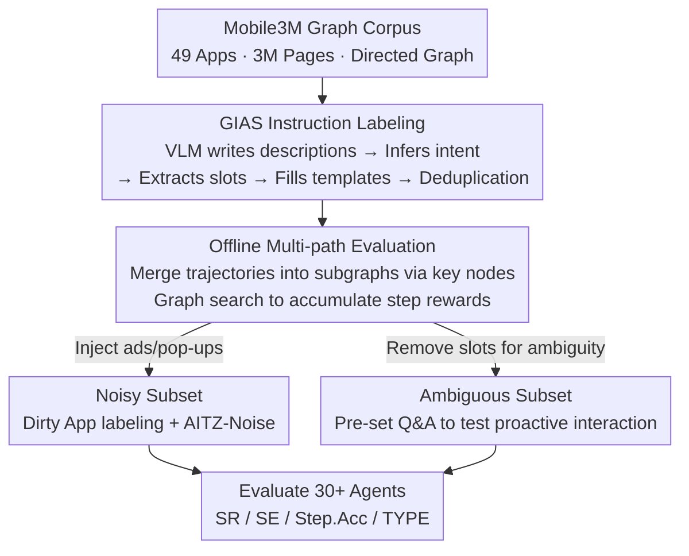

# SMAN-Bench: A Cross-System Benchmark for Mobile Agents under Single- and Multi-path, Ambiguous, and Noisy Tasks

**Conference**: ICLR 2026  
**OpenReview**: [https://openreview.net/forum?id=IWDpCaSF9Q](https://openreview.net/forum?id=IWDpCaSF9Q)  
**Code**: https://github.com/gezelligheid0314/SMAN-Bench  
**Area**: Agent / Multimodal VLM / Benchmark  
**Keywords**: Mobile GUI Agent, Multi-path Evaluation, Noise Robustness, Proactive Interaction, Slot Labeling

## TL;DR
SMAN-Bench transforms a 3-million-page graph-structured mobile operation corpus (Mobile3M) into a mobile agent benchmark. By using slot templates to automatically label multiple trajectories with the same instruction, it supports "offline multi-path" evaluation (where one instruction can have several correct solutions). It additionally constructs two subsets—one with advertising noise and one with ambiguous instructions—to systematically identify significant weaknesses in current VLM agents when facing real-world messy environments or requiring proactive clarification.

## Background & Motivation

**Background**: VLM-based mobile agents (interacting with GUIs via screenshots + XML) are proliferating. Existing benchmarks for evaluating them fall into two categories: online evaluation (running on real devices, determining success by widget values on the final page, allowing multiple paths) and offline evaluation (pre-recording "golden paths" of screenshots and actions, requiring agents to predict actions step-by-step to match the golden sequence).

**Limitations of Prior Work**: Both types have significant flaws. Online evaluation is affected by device environment fluctuations—system updates, app updates, and user preference caches cause step rewards to jitter, preventing stable fine-grained rewards. Furthermore, focusing only on the final page is unfair to different agents, as two failed tasks may have vastly different completion progress. Offline evaluation forces tasks into a "single path," which contradicts the inherent multi-solution nature of GUI tasks. An agent achieving high scores on such benchmarks might simply be fitting the labeling preference of the annotators and may fail in real scenarios. More critically, benchmarks like MobileAgentBench and AutoDroid are built on "clean" pages like Google Workspace, lacking ads, pop-ups, or irrelevant buttons, whereas real users often provide imprecise instructions that are not fully specified at once.

**Key Challenge**: There is a trade-off between single-path labeling (stable but biased) and multi-path authenticity (realistic but difficult to provide stable rewards). Simultaneously, existing benchmarks avoid two core real-world challenges: noisy environments and incomplete instructions.

**Goal**: To create a benchmark simultaneously covering **S**ingle-path, **M**ulti-path, **A**mbiguous, and **N**oisy settings (SMAN), capable of providing stable step rewards for multi-path tasks while incorporating advertising noise and ambiguous instructions into the evaluation.

**Key Insight**: The authors discovered an existing graph-structured corpus, Mobile3M, which contains 3 million UI pages and 20 million actions collected via random walks across 49 apps, with the exploration tree deduplicated into a directed graph (nodes as pages, edges as actions). This graph naturally encodes the "multiple paths converging to the same key state" structure needed for multi-path evaluation; the missing piece was pairing trajectories with instructions.

**Core Idea**: Use "slot template matching" to bind one instruction to multiple trajectories. Instructions are generated from templates filled with slot information extracted from key pages. As long as multiple trajectories pass through the same slot key nodes, they are considered valid solutions for the instruction. This upgrades single-path labeling to multi-path evaluation, supplemented by noise and ambiguity subsets to complete the realism.

## Method

### Overall Architecture
SMAN-Bench is not built from scratch but follows a pipeline of "leveraging existing graph corpus → automatic instruction labeling → refactoring evaluation protocols → adding two difficulty subsets." The main pipeline is data construction: sampling multiple trajectories with fixed start and end pages from the Mobile3M graph, using VLMs to write descriptions for each page, inferring action intent, and extracting slots. These slots fill instruction templates, which are then deduplicated and simplified. On the evaluation side, these discrete trajectories are merged into a subgraph based on "key node equivalence," allowing agents to search freely and accumulate step rewards (multi-path) or revert to step-by-step alignment with a golden path (single-path). Based on this, two specialized difficulty subsets—SMAN-Bench-Noisy (ad/pop-up pollution) and SMAN-Bench-Ambiguous (instruction slot removal + pre-set Q&A)—are created.

### Key Designs

**1. GIAS: Binding Instructions to Multiple Trajectories via Slots**

To turn unlabeled random walk trajectories into evaluable tasks, the difficulty lies in how to map one instruction to multiple paths. GIAS (Generating Instructions From Action Sequences) focuses on **action intent understanding** and **slot matching**. The former is necessary because coordinate-based actions lack semantic meaning without page context (e.g., the same "+" button might add a "Hazelnut Latte" on one page and a "Cookie Mocha" on another); page descriptions are used to reconstruct intent. The latter extracts variable information from key pages into slots to fill predefined templates, where slots also serve as reward anchors for key nodes. The algorithm (Algorithm 1) selects multiple trajectories $\sigma_i$ starting from the same nodes and ending at "homogeneous nodes" (determined by page similarity or shared UI element counts). For each page $s_{ij}$, a VLM generates a description $D_{s_{ij}}$, infers intent $T_{ij}$ from adjacent pages and actions, and extracts slots $C_{ij}$. Instructions $I_{ij} \sim \text{Uniform}(\gamma)$ are generated using slots and templates. Finally, instructions are deduplicated using similarity $\text{Sim}(I_i,I_j)\ge\tau$ and trajectories are verified to ensure no redundant steps. Except for one verification step using a closed-source model, the process uses open-source models with zero human intervention. Crucially, a single template can match multiple trajectories sharing key nodes, forming the foundation for multi-path evaluation.

**2. Offline Multi-path Evaluation: Merging Trajectories and Step Rewards**

This is the core protocol innovation, aiming to combine the "multi-path + process reward" of online evaluation with the "stability + reproducibility" of offline evaluation. Discrete single paths are merged into a unified subgraph within the pre-recorded graph corpus. Merged nodes correspond to key states of the instruction based on two criteria: ① Action space + pixel difference (BM25 threshold) to identify identical pages (main interfaces of the same app across sessions are treated as equivalent); ② Matching button values in Android XML/Accessibility trees for page equivalence. Agents can search freely within the subgraph up to a step limit, accumulating rewards upon reaching any equivalent key node. Since pre-recording cannot cover all search results, instructions are paired with a predefined query pool; searches outside this pool are invalid. Two modes are supported: Multi-path, which measures if the agent reaches the final state (SR) and efficiency $SE=S_{actual}/S_{min}$; and Single-path, which measures step-by-step alignment with golden actions ($Step.Acc=S_{tp}/S_{gt}$). Experiments show multi-path SR is generally higher than single-path, suggesting it better reflects true capability rather than overfitting to specific labels.

**3. Noisy Subset: Bringing Real Ads and Pop-ups to Evaluation**

Clean pages cannot test agent robustness in real-world messy environments. SMAN-Bench-Noisy creates data in two ways. First, manual labeling: 20 "dirty" apps with severe ads/pop-ups were selected from third-party markets. Interference like login prompts, updates, permissions, ads, and VIP subscriptions were intentionally left unhandled, and ads were sometimes clicked intentionally to see if agents could recover. All noise steps and jump pages are explicitly marked. Second, data pollution: at least one ad (sampled from 150+ Google Store ads) is randomly inserted into normal trajectories from AITZ (a high-quality subset of AITW), forming AITZ-Noise. This tests if the agent survives when only the background screenshot changes. The difficulties of real ads are categorized into: ads disappearing automatically after a countdown leading to misclicks, unskippable video ads, and accidental clicks triggering app jumps.

**4. Ambiguous Instruction Subset: Testing Proactive Interaction**

Real users often provide incomplete instructions. SMAN-Bench-Ambiguous tests proactive interaction by taking complete instructions with labeled trajectories, removing slot information to make them ambiguous, and attaching pre-set Q&A pairs to corresponding pages based on the missing slots. For example, a complete instruction "I want a 16GB+512GB Midnight MacBook Pro M4" becomes "I want to buy a MacBook," with specs treated as three slots. The agent must proactively ask questions (e.g., "Which app do you want to use?") and is only allowed to ask for missing instruction details, not for next-step decisions or button functions. Each trajectory has at least 5 sets of human Q&A strictly aligned with the missing slots.

## Key Experimental Results

### Data Scale
- **Common Main Set**: 12,854 instructions + 800 templates, divided into Simple (1–6 steps, 9,620 samples, avg. 5.62 steps) and Complex (7–15 steps, 3,234 samples, avg. 8.21 steps). The full library includes EN&CN, ~48k screenshots, avg. 7.28 steps, supporting both single/multi-path.
- Evaluation uses a **Random-800** subset (distribution identical to the full set, 800 instructions mapped 1:1 to 800 templates), with max steps set to 20/25 for simple/complex tasks.
- **Noisy subset**: 100 samples (20 dirty apps, avg. 12.74 steps); **AITZ-Noise**: 1 ad injected into each of 2,504 trajectories.
- **Ambiguous subset**: 100 samples (avg. 7.53 steps, ≥5 Q&A sets per sample).
- Quality Verification: Only 8% of complex data was judged sub-optimal (unnatural semantics after slot filling) and was manually corrected.

### Main Results (Random-800, SR Selection)

| Agent Framework / Model | Common-Simple SR | Common-Complex SR | Noisy SR | Ambiguous SR |
|---|---|---|---|---|
| AppAgent-v1 + Qwen2-VL-72B (Single) | 21.1 | 5.0 | 3.0 | 8.0 |
| MobileAgent-E + Qwen-VL-Max (Single) | 32.5 | 25.5 | 21.0 | 29.0 |
| MobileAgent-E + GPT-4o (Single) | 27.5 | 19.0 | 14.0 | 24.0 |
| OpenCUA-32B (Pre-trained Agent, Single) | 39.0 | 38.0 | 13.5 | 43.0 |
| UI-TARS-1.5-7B (Pre-trained Agent, Single) | 39.0 | 38.5 | 15.0 | 42.0 |
| Claude 4.5 Sonnet (Reasoning Model, Single) | 39.0 | 39.0 | 15.5 | 43.0 |

Key Observations: ① Regarding frameworks, AppAgent-v1 performs best in single-path (pre-set correct history allows focus on the current page), MobileAgent-v2 is more stable in multi-path due to reflection mechanisms, and Mobile-Agent-E leads overall due to dynamic knowledge injection + planning. ② Multi-path SR is consistently higher than single-path, confirming that multi-path better reflects actual capability. ③ Dedicated mobile agents (with stronger grounding) significantly outperform framework-only solutions and reduce reasoning steps to ~1/5. General "Slow Thinking" MLLMs (e.g., Doubao-1.5-Thinking-pro) now match dedicated agents (OpenCUA-32B), and adding reasoning models into frameworks yields no additional benefit, suggesting an equivalence between frameworks and intrinsic model reasoning.

### Noise Robustness (AITZ vs AITZ-Noise, Step.Acc)

| Agent | Normal Total | Noise Subset Total | Noise Step Step.Acc |
|---|---|---|---|
| Qwen2-VL-7B | 46.9 | 43.9 | 17.4 |
| OS-Atlas-7B | 48.6 | 45.1 | 21.7 |

From normal to in-domain noise, Step.Acc only dropped by an average of 3.0% / 3.5%, but Step.Acc on the noise steps themselves was only 17.4% / 21.7%. This indicates open-source agents have almost no understanding of ad features and zero generalization to noise; once trapped on irrelevant pages, they cannot continue.

### Ambiguous Instruction Ablation (Table 5, Type / StepAcc Gain after Q&A)

| Model | AppAgent Type Gain | MobileAgent Type Gain |
|---|---|---|
| InternVL2-40B (Weak) | +5.9 | +15.5 |
| Llama3.2-VL-90B (Mid) | +17.5 | +6.5 |
| GPT-4o (Strong) | +15.0 | +3.9 |

The proactive interaction module brings up to +17.5% improvement, but the gain is non-linear: Weak models (InternVL, +5.9%) fail to ask effective questions, strong models (GPT-4o, +3.9%) are already capable of planning, whereas **middle-tier models (Llama3.2-VL-90B, +17.5%) benefit the most**. End-to-end agents still struggle to form and explore questions according to pre-set configurations, a clear future direction.

### Key Findings
- Multi-path evaluation reflects true capability better than single-path, where high scores often stem from overfitting to labeling bias.
- Noise is the biggest weakness for current agents: lack of ad samples in training data leads to low accuracy on noise steps and near-zero generalization.
- The value of proactive clarification depends on model capability; middle-tier models benefit most. The grounding advantage of dedicated agents far outweighs differences in framework design.

## Highlights & Insights
- **Reverse-labeling instructions from existing graph corpora is efficient**: Instead of re-collecting on real devices, the "multi-path convergence" in the Mobile3M graph is utilized. Binding one instruction to multiple trajectories via slot templates allows a multi-path benchmark to be built with near-zero human labor—a method transferable to any graph GUI corpus.
- **Reusable criteria for multi-path merging**: Utilizing BM25 pixel differences for same-page identification and XML button values for equivalent nodes provides a general toolkit for aligning different paths that reach the same key state.
- **Elevating "Noise" and "Ambiguity" to first-class evaluation categories** with an actionable data recipe (leaving dirty apps un-preprocessed + AITZ ad injection; removing slots + pre-set Q&A) allows robustness and proactive interaction to be quantitatively compared for the first time.
- **The "middle-tier models benefit most from interaction" insight is counter-intuitive and useful**: Strong models don't need it as much, and weak models can't use it effectively, suggesting such auxiliary mechanisms should be applied selectively based on the agent's intelligence level.

## Limitations & Future Work
- Multi-path evaluation relies on pre-recorded graph data; search results outside the predefined query pool are invalid, meaning coverage is limited by the breadth of Mobile3M.
- To save costs, zero-shot evaluation was mainly performed on the Random-800 subset; performance on the long-tail tasks of the 12,000+ full set was not fully exposed.
- Ad noise is sampled from specific dirty apps and the Google Store; as ad formats drift across time or regions, the benchmark may become outdated.
- End-to-end agents struggle to ask questions according to pre-set Q&A, showing that "proactive interaction" evaluation is still somewhat constrained—pre-set Q&A is not yet true open-ended dialogue.

## Related Work & Insights
- **vs. Online Benchmarks (MobileAgentBench / Mobile-Bench)**: These evaluate final pages on real devices and allow multi-paths, but step rewards jitter due to environment instability. Ours uses pre-recorded graphs for offline multi-path evaluation, trading some real-world interaction for stable, reproducible process rewards.
- **vs. Offline Single-path Benchmarks (AITW / AITZ / GUI Odyssey)**: These lock tasks into single golden paths, encouraging overfitting to label preferences. Ours upgrades single-path labeling to multi-path using slot key nodes and directly utilizes/pollutes AITZ to create AITZ-Noise as a control.
- **vs. Clean Page Benchmarks (built on Google Workspace)**: Ours specifically introduces dirty apps with ads/pop-ups and ambiguous instruction subsets, addressing two core real-world challenges systematically ignored by existing benchmarks.

## Rating
- Novelty: ⭐⭐⭐⭐ The combination of labeling multi-path instructions from graph corpora and adding noise/ambiguity subsets is solid, though the underlying corpus is reused from Mobile3M.
- Experimental Thoroughness: ⭐⭐⭐⭐⭐ Covers 30+ models (frameworks / pre-trained agents / RL agents / reasoning models), four subsets + AITZ-Noise control + ambiguity ablation.
- Writing Quality: ⭐⭐⭐⭐ Many settings and dense tables; the main line is clear, but the naming of subsets and metrics requires careful reading.
- Value: ⭐⭐⭐⭐⭐ Provides a quantifiable, unified evaluation foundation for three real-world challenges: multi-path, noise robustness, and proactive interaction. Useful infrastructure for future GUI Agent research.

<!-- RELATED:START -->

## Related Papers

- [\[ICLR 2026\] FingerTip 20K: A Benchmark for Proactive and Personalized Mobile LLM Agents](fingertip_20k_a_benchmark_for_proactive_and_personalized_mobile_llm_agents.md)
- [\[ICLR 2026\] From Single to Multi-Granularity: Toward Long-Term Memory Association and Selection of Conversational Agents](from_single_to_multi-granularity_toward_long-term_memory_association_and_selecti.md)
- [\[ICLR 2026\] WARC-Bench: Web Archive based Benchmark for GUI Subtask Executions](warc-bench_web_archive_based_benchmark_for_gui_subtask_executions.md)
- [\[ICLR 2026\] MCP-Bench: Benchmarking Tool-Using LLM Agents with Complex Real-World Tasks via MCP Servers](mcp-bench_benchmarking_tool-using_llm_agents_with_complex_real-world_tasks_via_m.md)
- [\[ICLR 2026\] InfoMosaic-Bench: Evaluating Multi-Source Information Seeking in Tool-Augmented Agents](infomosaic-bench_evaluating_multi-source_information_seeking_in_tool-augmented_a.md)

<!-- RELATED:END -->
