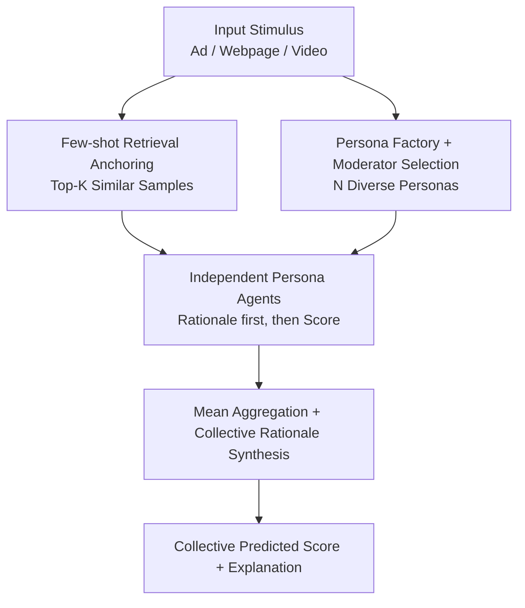

# Social Agents: Collective Intelligence Improves LLM Predictions

**Conference**: ICLR 2026  
**OpenReview**: [https://openreview.net/forum?id=73J3hsato3](https://openreview.net/forum?id=73J3hsato3)  
**Project Page**: [https://behavior-in-the-wild.github.io/social-agents](https://behavior-in-the-wild.github.io/social-agents)  
**Code**: To be confirmed (Paper released persona prediction datasets)  
**Area**: Agent / Multi-agent / Behavior Prediction  
**Keywords**: Wisdom of Crowds, Persona Agents, Multi-agent Ensemble, Behavior Prediction, Collective Decision Making

## TL;DR
This paper proposes **Social Agents**, which use different demographic/psychological personas to conditionalize a single LLM into a group of independent evaluators in a "virtual society." Each agent scores and provides rationales for stimuli (ads/webpages/videos), and these scores are aggregated by mean to bring the "Wisdom of Crowds" into LLMs. On 11 behavior prediction tasks, it achieves improvements of up to 164% on low-level tasks and 24% on high-level tasks relative to single LLM baselines, with an average improvement of 21.5% across 9 models.

## Background & Motivation
**Background**: In classic cases like estimating the weight of an ox, predicting elections, or financial markets, averaging a large number of independent guesses is often more accurate than a single expert—this is the "Wisdom of Crowds." It relies on four conditions: diversity of opinion, independence of judgment, decentralization of knowledge, and appropriate aggregation. However, LLMs by default output a **single** deterministic answer, a "unified voice" that erases the natural diversity of judgments human populations exhibit toward ads, videos, or webpages.

**Limitations of Prior Work**: To operationalize the Wisdom of Crowds, traditional methods require recruiting and incentivizing large groups of people, which is costly, difficult to scale, and cannot be run for every decision scenario. Even powerful single LLMs provide an "average persona" response, failing to characterize the divergence among different ages, professions, and values. Existing "persona prompting" research only proves that LLMs can play **a specific** given persona, but has not systematically organized them into an ensemble capable of generating collective intelligence.

**Key Challenge**: The ground truth of behavior prediction is essentially a **statistic of a population distribution** (e.g., CTR percentile of an ad, average webpage favorability). A single LLM call only samples one point from this distribution, and repeated resampling only reduces variance without eliminating bias caused by "systemic perspective gaps."

**Goal**: Can LLMs "operationalize" the Wisdom of Crowds—where each instance plays an independent persona and their responses are aggregated to improve LLM prediction and reasoning performance?

**Key Insight**: Foundation models are pre-trained on multi-persona corpora like Reddit and have implicitly seen how different demographic/psychological groups express opinions and weigh trade-offs. Thus, **conditionalizing the same backbone on different personas allows sampling systematically different perspectives from its latent space**, rather than just random noise.

**Core Idea**: Replace "single/repeated LLM calls" with a "persona-conditioned multi-agent ensemble." Map the four pillars of the Wisdom of Crowds (diversity, independence, decentralization, aggregation) onto the LLM framework, allowing structured inter-group differences (rather than intra-sampling noise) to drive prediction accuracy.

## Method

### Overall Architecture
Social Agents is a pipeline including "Society Construction → Individual Evaluation → Aggregation." Given a stimulus (ad, webpage screenshot, video, etc.), the system first computes its embedding and retrieves Top-K semantically similar samples from a corpus as few-shot examples to anchor the prediction. Simultaneously, a **moderator** selects N diverse personas from a **Persona Agent Factory** based on demographic (age, gender, region) and psychological (interests, values, lifestyle) dimensions, instantiating the same backbone LLM into N independent agents. Each persona agent receives the stimulus and few-shot examples, **writes a rationale in their persona's voice first, and then provides a quantitative score**. These scores are finally averaged by the moderator for a collective prediction, and all rationales are synthesized into a collective explanation. The key is that the N agents **do not interact and are independently prompted**; differences stem from personas rather than randomness.

### Key Designs

**1. Persona Agent Factory and Moderator Selection: Mapping "Diversity + Decentralization" to Backbone**

Wisdom of Crowds requires diversity of opinion and decentralization of knowledge. This is implemented via a **Persona Agent Factory** containing persona templates defined by demographic attributes and psychological traits. A moderator **selects a panel of N as diverse as possible**, then uses the **same backbone model** with different persona prompts to instantiate them. The key is not using different models, but different conditionalizations of the same model. At N≈10, the authors observed "young female students, veterans, fashion enthusiasts, teachers, high schoolers" giving scores ranging from 2.5 to 5.6 for the same webpage, covering inter-group differences that a single prompt could never sample. Each agent judges based on its assigned persona and context, providing a "decentralized" basis for judgment.

**2. Independent Prompting and "Rationale-then-Score" Chain-of-Decision: Preserving Independence and Preventing Groupthink**

Another pillar is independence of judgment; once agents influence each other, they collapse into "groupthink." In this work, N persona agents **never interact and are prompted separately**. Each agent **first generates a rationale from its persona perspective and then outputs a numerical score conditioned on that rationale**. This "rationale-first, score-later" approach is treated as an explicit chain-of-thought, allowing the persona's reasoning to land before the model commits to a number, which improves both reproducibility and interpretability. Because each agent's stochasticity comes from persona variation rather than copying others, the distribution of different personas is "complementary" rather than "redundant" during aggregation.

**3. Mean Aggregation and Collective Rationale Synthesis: Canceling Individual Errors**

The final prediction is obtained by a **simple mean** of all persona scores: $\hat{S} = \frac{1}{N}\sum_{i=1}^{N} s_i$, where $s_i$ is the score of the $i$-th persona and $\hat{S}$ is the collective estimate. This step provides three benefits: ① **Error Cancellation**—individual idiosyncratic overestimation or underestimation offsets each other in the average (e.g., scores of 66/52/60/42/66 average to 54, approaching the ground truth of 51); ② **Robustness through Diversity**—heterogeneous perspectives naturally resist systemic bias and outliers; ③ **Interpretable Group Dynamics**—the distribution of rationales reveals the sources of consensus and disagreement. Unlike classic ensembles that "assume independent judgments," persona conditionalization introduces **systemic variation**: each agent samples from related but different distributions. Following aggregation, the LLM in "neutral unconditional expert" mode synthesizes all rationales into a collective explanation for downstream interpretability.

**4. Few-shot Retrieval Anchoring and Fair Budget Constraints: Gains from Personas, Not Length**

To provide a basis for persona judgment, the system computes embeddings for the stimulus and retrieves the Top-5 nearest neighbors (excluding the target itself) using OpenAI `text-embedding-3` as few-shot examples. Except for the "behavioral attribute classification" task (zero-shot), all tasks use 5-shot. To rule out the confound that "improvements are just due to longer output," the authors **enforce a 300-token generation limit** for both the No-Persona baseline and Social Agents, attributing gains to structured persona diversity and the aggregation mechanism itself rather than increased generation space.

### An Example: Ad CTR Percentile Prediction
Taking the ad in Fig.2: it is visually clean and elegant, appealing to creative types but cool to trend-seeking young users. Social Agents evaluates it with multiple personas—a 34-45 year old female marketing graduate with a family gives 66, a 25-34 year old male marketing graduate gives 52, a 34-45 year old tech professional gives 60, an 18-24 year old fashion-forward female gives 42, and a 13-17 year old boy gives 66. These judgments diverge significantly, but the simple mean smooths out extremes to yield a collective score of 54, close to the ground truth of 51. In contrast, "No-Persona (10 trials with the same prompt)" relies solely on sampling randomness, achieving only 61.5% KDE overlap with the human distribution on webpage favorability, whereas Social Agents reaches 78.4%—proving that **structured inter-group differences** are the real drivers, not intra-group noise.

## Key Experimental Results

### Main Results
Covering 11 behavior tasks classified by Construal Level Theory (CLT) (low/medium/high construal) and 9 models (GPT-4o, LLaMA 3.3 70B, Qwen2 32B & VL, etc.), the primary comparisons are against No-Persona (single LLM as expert, 5-shot) and task-specific expert models (LCBM / Henry / Behavior-LLaVA / XGBoost).

| Task (Construal Level) | Metric | Improvement | Description |
|--------|------|------|------|
| Webpage Favorability (Low) | Pearson r | **+164.2%** | GPT-4o vs No-Persona; largest single-model gain |
| Ad CTR (Low) | MAPE↓ | 34.7% (GPT-4o) / 28.2% (Avg. across models) | Surpasses fine-tuned LCBM (34.4%) |
| Tweet Engagement (Low) | Accuracy | +21.75% | Average across backbones/industries |
| ROAS (Medium) | MAPE↓ | 27.9% Average; PE@20 +75% | GPT-4o ROAS MAPE↓39.8% in real estate domain |
| Long-term Memorability (High) | Spearman ρ | +24.2% (GPT-4o) / +13.2% (Avg. across models) | Only task still trailing expert model "Henry" |
| Overall Low-level | Average | **+30.5%** | Average across models |
| Overall High-level | Average | **+9.9%** | Average across models |
| All 11 Tasks × 9 Models | Average | **+21.5%** | Evidence of model-agnosticism |

Compared to experts: Surpasses fine-tuned LCBM in CTR (MAPE↓34.4%); Pearson on webpage favorability exceeds XGBoost by 10.45%; ROAS PE@30 in the creative domain exceeds XGBoost by 126.9%; and in behavior attribute classification, it outperforms Behavior-LLaVA (zero-shot) in persuasion by up to 55.3%.

### Ablation Study

| Configuration / Analysis | Key Metric | Conclusion |
|------|---------|------|
| Social Agents vs No-Persona (Mean of 10 Trials) | KDE Overlap 78.4% vs 61.5% | Persona difference > Repeated sampling |
| Number of Personas N | MAPE plateaus after N≈10-20 | N=10 default; diminishing returns beyond |
| Temperature Sensitivity | GPT-4o CTR ~47.5% MAPE (Multi-temp) vs 72.45% (No-Persona) | Gains not from stochastic decoding |
| Aggregation: Mean vs Median | Results robust | Gain stems from structured diversity |
| Clubbed-emotion Classification | 22.7% lower than Behavior-LLaVA (zero-shot) | Only systemic regression |
| Alignment with Humans | Pearson r up to 0.71 (18-24 M) → 0.22-0.25 (55+) | Best alignment with younger demographics |

### Key Findings
- **Gains stem from "Persona Diversity," not "Multiple Calls"**: No-Persona repeated calls plateau quickly with higher error. Even "Wisdom of the Silicon Crowd" (aggregating multiple LLMs without persona conditionalization) is inferior to a single model + multiple personas.
- **Model-agnostic and Scale-independent**: Even small models like LLaMA 8B and Qwen 7B show clear improvements relative to their respective No-Persona baselines, despite lower absolute accuracy.
- **Largest gains in Low/Medium Construal tasks**: Intuitive judgments (favorability, CTR) benefit more from group averaging. Tasks requiring abstract reasoning and long-term prediction (memorability) still favor specially trained experts.
- **Alignment decays with age**: LLM pre-training corpora favor younger digital natives. The tastes of the 55+ demographic are under-represented, making it harder for persona conditionalization to recover their judgments.

## Highlights & Insights
- **"Same model, different personas" is cheap Wisdom of Crowds**: No multi-model ensemble is needed; persona prompts alone conditionalize a single backbone into heterogeneous evaluators. This approach is efficient and captures the "structured inter-group differences" signal—the root cause for outperforming "repeated sampling" and "multi-model aggregation."
- **Rationale-then-score is a clever design**: Forcing rationales first acts as a mandatory chain-of-thought, enhancing both reproducibility and interpretability. The aggregated rationale distribution naturally provides an explanation for consensus or divergence.
- **300-token budget + Repeated sampling baseline are rigorous ablations**: These effectively block the most common criticisms—that improvements are due to longer outputs or simple variance reduction—cleanly attributing success to persona diversity.
- **Transferable**: This "persona-conditioned ensemble" can be transferred to any task requiring approximation of population statistics (user research, content A/B testing, subjective scoring), making LLMs a scalable "proxy population."

## Limitations & Future Work
- **High-construal tasks still trail specialist experts**: Long-term memorability remains behind "Henry" (trained on specialized corpora), suggesting persona diversity cannot fully compensate for specialized training on cognitively distant tasks requiring deep semantic reasoning.
- **Systemic regression in certain areas**: Performance on clubbed-emotion (coarse-grained sentiment) is consistently lower than Behavior-LLaVA by ~22.7%, likely because specialized fine-tuning offers a greater marginal advantage for coarse labels.
- **Poor alignment with under-represented groups**: Limited by pre-training data, alignment for the 55+ demographic is low (Pearson 0.22-0.25). "Wisdom of Crowds" for these groups may be distorted—a limitation that will naturally benefit as base models improve.
- **Small N and Simple Aggregation**: Due to budget constraints, N=10 and mean aggregation are defaults. More complex weighted aggregation, dynamic persona selection, and cross-task persona transfer remain unexplored.

## Related Work & Insights
- **vs No-Persona / Repeated Sampling (Law of Large Numbers)**: The latter reduces variance through randomness but cannot eliminate systemic perspective gaps. Social Agents uses personas to introduce structured differences, achieving 78.4% KDE overlap vs 61.5%.
- **vs Wisdom of the Silicon Crowd (Multi-LLM Aggregation)**: Aggregating diverse models without persona conditionalization is less effective than a single model + multiple personas, confirming that "diversity should come from personas, not model/sampling noise."
- **vs Task-specific Experts (LCBM / Henry / Behavior-LLaVA / XGBoost)**: Experts are trained on massive labeled datasets. This work achieves parity or improvement over most experts in low/medium tasks using only 5-shot prompts, offering a scalable alternative to massive task-specific training.
- **vs Single Persona Prompting (Santurkar et al.)**: Prior work shows LLMs can play single personas; this work systematically organizes them into an ensemble for Wisdom of Crowds, moving from "playing a person" to "simulating a society."

## Rating
- Novelty: ⭐⭐⭐⭐ Systematically maps the four pillars of Wisdom of Crowds to multi-agent LLM ensembles with a clean operationalization, although components (persona prompting, mean aggregation) are established.
- Experimental Thoroughness: ⭐⭐⭐⭐⭐ 11 tasks × 9 models, including multiple ablations on temperature, aggregation, N, and repeated sampling alongside human alignment analysis.
- Writing Quality: ⭐⭐⭐⭐ Narrative on motivation and the four pillars is fluid; diagrams are intuitive; dense metrics (multiple MAPE/PE@K variants) require careful reading.
- Value: ⭐⭐⭐⭐ Provides a scalable, interpretable "LLM Proxy Population" paradigm with strong utility for behavior/marketing prediction and subjective scoring tasks.

<!-- RELATED:START -->

## Related Papers

- [\[ICLR 2026\] When AI Agents Collude Online: Financial Fraud Risks by Collaborative LLM Agents on Social Platforms](when_ai_agents_collude_online_financial_fraud_risks_by_collaborative_llm_agents_.md)
- [\[ICLR 2026\] WebFactory: Automated Compression of Foundational Language Intelligence into Grounded Web Agents](webfactory_automated_compression_of_foundational_language_intelligence_into_grou.md)
- [\[AAAI 2026\] SoMe: A Realistic Benchmark for LLM-based Social Media Agents](../../AAAI2026/llm_agent/some_a_realistic_benchmark_for_llm-based_social_media_agents.md)
- [\[CVPR 2026\] ProactiveMobile: A Comprehensive Benchmark for Boosting Proactive Intelligence on Mobile Devices](../../CVPR2026/llm_agent/proactivemobile_a_comprehensive_benchmark_for_boosting_proactive_intelligence_on.md)
- [\[ICLR 2026\] Opponent Shaping in LLM Agents](opponent_shaping_in_llm_agents.md)

<!-- RELATED:END -->
