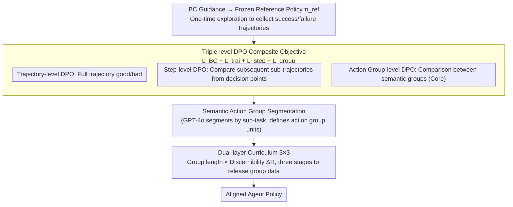

# Solving the Granularity Mismatch: Hierarchical Preference Learning for Long-Horizon LLM Agents

**Conference**: ICLR 2026  
**arXiv**: [2510.03253](https://arxiv.org/abs/2510.03253)  
**Code**: To be confirmed  
**Area**: Agent / Alignment  
**Keywords**: hierarchical DPO, preference learning, long-horizon agent, curriculum learning, action group

## TL;DR
The HPL framework is proposed to address the granularity mismatch in preference learning for long-horizon LLM Agents. By utilizing triple-level DPO (trajectory-level + step-level + action group-level) and dual-layer curriculum learning (sub-task complexity × sample difficulty), it significantly outperforms baselines such as ETO and IPR on ALFWorld/WebShop/InterCode-SQL (average 59.44 vs 55.43/55.49).

## Background & Motivation
**Background**: DPO (Direct Preference Optimization) has become the mainstream method for LLM alignment. However, a granularity mismatch exists in long-horizon Agent tasks—trajectory-level DPO signals are too coarse (unable to locate key decision points), and step-level signals exhibit excessive variance.

**Limitations of Prior Work**: Existing Agent preference learning methods use either outcome-level rewards (success/failure of the entire trajectory) or step-level rewards that require extensive rollouts to reduce variance. Both granularities have strengths and weaknesses, but a unified framework is lacking.

**Key Challenge**: Too coarse $\rightarrow$ inability to perform precise credit assignment; too fine $\rightarrow$ excessive variance and low sample efficiency. A "just right" granularity is required.

**Goal**: Design a multi-granularity preference learning framework that simultaneously utilizes trajectory-level, step-level, and action group-level preference signals.

**Key Insight**: Group action sequences based on semantic consistency (e.g., "navigate to the kitchen" as one group, "open the refrigerator to retrieve items" as another) and perform preference comparisons at the group level.

**Core Idea**: Triple-level DPO provides complementary credit assignment signals, combined with dual-layer curriculum learning to guide training from simple to complex.

## Method

### Overall Architecture
HPL addresses the "granularity mismatch" in preference learning for long-horizon LLM Agents: trajectory-level signals are too coarse to locate specific errors, while step-level signals suffer from variance explosion as sequence length increases. It first uses behavior cloning to derive a frozen reference policy $\pi_{ref}$, which explores and collects success and failure trajectories in a one-time process. Subsequently, trajectory-level, step-level, and action group-level preference pairs are constructed from the same batch of trajectories. Three DPO losses are then combined with a behavior cloning term to form a composite objective for joint training. The action group level is the core, filling the gap between "trajectories being too coarse and steps being too fine." The segmentation of action groups is handled via semantic segmentation (GPT-4o partitioning by sub-tasks), and the resulting group-level data is scheduled from easy to difficult through a $3 \times 3$ dual-layer curriculum, finally outputting the aligned Agent policy.

### Key Designs

**1. Triple-level DPO composite objective: Simultaneous credit assignment across three granularities**

In long-horizon tasks, trajectory-level preference only informs the model whether the "entire trajectory is good or bad," failing to pinpoint specific errors. While pure step-level preference provides precise localization, when the rollout budget is limited, supervision is scattered across numerous decision points; each step relies on a few noisy rollouts, causing variance to spiral out of control as sequence length $T$ increases. HPL stacks three types of signals: the trajectory-level loss $L_{traj\text{-}DPO}$ compares full successful/failed trajectories to provide global direction; the step-level loss $L_{step\text{-}DPO}$ follows the IPR approach by generating an alternative action at each decision point using the reference policy and completing the trajectory to compare with the expert's continuation; and the action group-level loss $L_{group\text{-}DPO}$ compares semantically consistent action groups (e.g., "navigate to kitchen" vs. "open fridge to retrieve items"), aggregating multi-step actions into a single supervisory unit. This approach spreads estimates over longer sub-trajectories within a fixed rollout budget, resulting in lower variance than step-by-step estimation. The final objective combines the three with a behavior cloning term:

$$L = L_{BC} + L_{traj} + L_{step} + L_{group}$$

Here, $L_{BC}$ is the behavior cloning term, preventing the policy from deviating too far from the reference distribution. Group-level rewards are estimated using $M=5$ Monte Carlo rollouts to determine the expected final return $\hat{r}(G_i)$ for each group. The authors provide theoretical support (Proposition 1): when the number of actions per group $k=\Theta(\log(1/\varepsilon))$, group-level DPO can improve variance by $\Omega(T/\log(1/\varepsilon))$ times compared to trajectory/step-level, with an additional bias not exceeding $\varepsilon$—providing a mathematical explanation for why group-level granularity is "just right."

**2. Semantic Action Group Segmentation: Segmentation quality determines group-level signal health**

The prerequisite for group-level DPO is partitioning action sequences into meaningful groups. The partitioning method directly determines signal quality. The authors compared four segmentation strategies: Fixed-N (partitioned into $N=3$ groups), Fixed-K (one group every $K=3$ steps), Uncertainty-based (segmenting where policy entropy exceeds the 80th percentile), and a Semantic scheme using GPT-4o to segment by sub-task semantics. In experiments, Semantic segmentation performed best (average 59.44, significantly higher than Fixed-N’s 58.45 and Fixed-K’s 56.74), as grouping by semantic boundaries ensures consistent intra-group goals, preventing the preference comparison between groups from being contaminated by noise from irrelevant actions. In other words, *how* groups are segmented is more critical than the number of groups.

**3. Dual-layer Curriculum Learning: Moving from simple to difficult along task complexity and sample difficulty axes**

Feeding all preference pairs to the model simultaneously can cause long groups and hard-to-distinguish samples to dominate gradients early on, slowing convergence. HPL maps training samples into a $3 \times 3$ difficulty matrix: the vertical axis is group length (representing sub-task complexity), and the horizontal axis is sample discernibility $\Delta R = \hat{r}(G_w) - \hat{r}(G_l)$, representing the estimated return difference between the winning and losing groups (larger $\Delta R$ is easier to distinguish). Training releases difficulty in three stages: Phase 1 uses only the easiest bucket $B_{1,1}$ (short groups + high discernibility); Phase 2 expands to $B_{1,1} \cup B_{1,2} \cup B_{2,1}$; Phase 3 releases all 9 buckets. This allows the model to establish a stable preference foundation on simple samples before gradually digesting long groups and difficult samples, avoiding being misled by high-variance samples at the start.

## Key Experimental Results

### Main Results (Qwen2.5-1.5B)

| Method | ALFWorld unseen | WebShop reward | InterCode-SQL | Average |
|------|----------------|----------------|---------------|------|
| ETO | 66.42 | 56.57 | 57.67 | 55.43 |
| IPR | 66.67 | 57.76 | 57.17 | 55.49 |
| **HPL(Semantic)** | **74.13** | **60.74** | **58.50** | **59.44** |
| GPT-4o zero-shot | 36.43 | — | — | — |

### Segmentation Strategy Comparison

| Strategy | Average Score |
|------|---------|
| **Semantic (GPT-4o)** | **59.44** |
| Fixed-N (3) | 58.45 |
| Uncertainty | 56.95 |
| Fixed-K (3) | 56.74 |

### Ablation Study

| Configuration | Effect |
|------|------|
| Full HPL | **Optimal** |
| w/o group-DPO | Performance degradation |
| w/o Curriculum Learning | Learning on long groups and difficult samples is impaired |
| w/o step-DPO | Coarsened credit assignment |

### Key Findings
- Semantic segmentation is significantly superior to other strategies (59.44 vs 56.74-58.45); semantic consistency is key to group-level DPO.
- HPL surpasses GPT-4o zero-shot (ALFWorld 74.13 vs 36.43); the 1.5B model far exceeds closed-source large models after training.
- Complementarity of triple-level DPO: removing any level reduces performance.
- Curriculum learning is particularly important for difficult samples and long action groups.

## Highlights & Insights
- **Action group-level DPO** represents a "sweet spot" between trajectory and step levels—the granularity matches sub-task boundaries perfectly.
- The finding that **Semantic segmentation > Fixed segmentation** suggests that the quality of grouping is more important than the method of grouping.
- The **dual-layer curriculum** design (3×3) is practical, considering both task complexity and sample difficulty dimensions simultaneously.
- Theoretical guarantees (variance improvement $O(T/\log(1/\varepsilon))$) provide mathematical support for the practical implementation.

## Limitations & Future Work
- Relies on one-time exploration by a frozen reference policy to collect data, rather than online RL.
- The number of Monte Carlo rollouts is limited ($M=5$), so variance in per-step estimation may still be high.
- Semantic segmentation relies on GPT-4o, increasing costs and external dependencies.
- Adaptive granularity selection (selecting different granularities for different steps based on uncertainty) has not been explored.

## Related Work & Insights
- **vs ETO**: ETO uses only trajectory-level signals and cannot precisely locate erroneous steps.
- **vs GRPO/GiGPO**: GRPO uses group-relative advantage; HPL uses group-level DPO. They are complementary.
- **vs RLHF**: HPL avoids reward model training by learning directly from preference pairs.
- Inspires the application of multi-granularity feedback in Agent training.

## Rating
- Novelty: ⭐⭐⭐⭐ The combination of triple-level DPO and dual-layer curriculum is well-designed and effective.
- Experimental Thoroughness: ⭐⭐⭐⭐ Three benchmarks with comparisons across multiple segmentation strategies.
- Writing Quality: ⭐⭐⭐⭐ Good integration of theory and experimentation.
- Value: ⭐⭐⭐⭐ Provides a practical framework for long-horizon Agent alignment.

<!-- RELATED:START -->

## Related Papers

- [\[ICLR 2026\] MEM1: Learning to Synergize Memory and Reasoning for Efficient Long-Horizon Agents](mem1_learning_to_synergize_memory_and_reasoning_for_efficient_long-horizon_agent.md)
- [\[ICLR 2026\] From Single to Multi-Granularity: Toward Long-Term Memory Association and Selection of Conversational Agents](from_single_to_multi-granularity_toward_long-term_memory_association_and_selecti.md)
- [\[ICLR 2026\] MobileIPL: Enhancing Mobile Agents Thinking Process via Iterative Preference Learning](mobileipl_enhancing_mobile_agents_thinking_process_via_iterative_preference_lear.md)
- [\[ACL 2026\] TiMem: Temporal-Hierarchical Memory Consolidation for Long-Horizon Conversational Agents](../../ACL2026/llm_agent/timem_temporal-hierarchical_memory_consolidation_for_long-horizon_conversational.md)
- [\[ICLR 2026\] AgentGym-RL: An Open-Source Framework to Train LLM Agents for Long-Horizon Decision Making via Multi-Turn RL](agentgym-rl_an_open-source_framework_to_train_llm_agents_for_long-horizon_decisi.md)

<!-- RELATED:END -->
