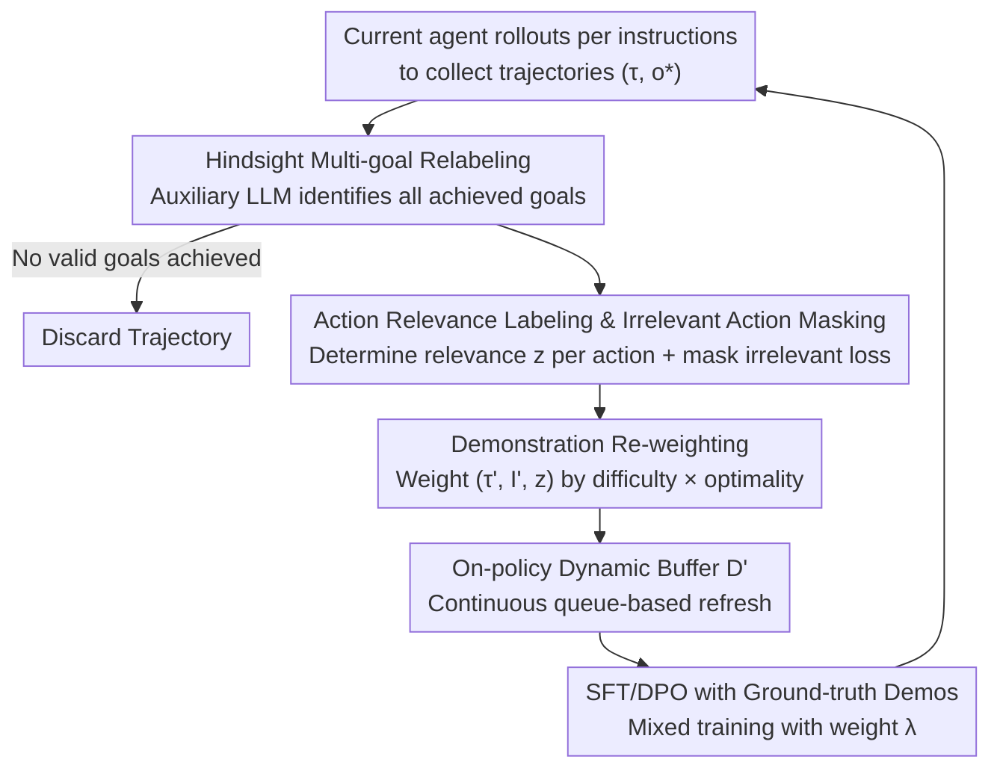

# Spinning Straw into Gold: Relabeling LLM Agent Trajectories in Hindsight for Successful Demonstrations

**Conference**: ICLR 2026  
**OpenReview**: [https://openreview.net/forum?id=QNfmqMSR7r](https://openreview.net/forum?id=QNfmqMSR7r)  
**Code**: None  
**Area**: Agent / LLM Post-training / Imitation Learning  
**Keywords**: LLM Agent, Hindsight Relabeling, SFT, Sample Efficiency, Goal-Conditioned Learning

## TL;DR
This work relabels "failed/sub-optimal" trajectories generated by LLM agents using an auxiliary LLM to identify **all goals actually achieved**. Combined with "irrelevant action masking + demonstration re-weighting," these discarded trajectories are transformed into successful demonstrations for fine-tuning. This approach provides plug-and-play performance gains on ALFWorld, PlanCraft, and WebShop, exceeding baselines trained on full datasets while using only one-fourth of the ground-truth demonstrations.

## Background & Motivation

**Background**: Training LLM agents primarily relies on Supervised Fine-Tuning (SFT) on expert demonstrations or Preference/Reinforcement Learning (DPO/PPO) from weaker supervision. SFT is stable but depends on expensive, low-diversity expert trajectories. RL theoretically learns from trial-and-error but struggles to "hit" high-reward trajectories in long-horizon, sparse-reward tasks.

**Limitations of Prior Work**: Existing methods fail to fully utilize the massive rollouts generated by agents. When an agent explores a POMDP (Partially Observable Markov Decision Process) environment and **fails the assigned task**, the entire trajectory is typically discarded. However, these trajectories often contain accomplishments the agent **unintentionally achieved**—they simply lack the correct labels.

**Key Challenge**: The supervision signal is the bottleneck, yet agent rollouts contain ignored supervision in the form of "unintended but successful" goals. The issue is not that the agent achieves nothing, but that no mechanism translates "what was actually achieved" into learnable demonstrations.

**Goal**: Extract all truly achieved goals from existing trajectories without relying on ground-truth actions or reward signals, converting them into successful demonstrations for training while addressing the inherent sub-optimality of these "borrowed" demonstrations.

**Key Insight**: Inspired by Hindsight Experience Replay (HER) in goal-conditioned RL—"If you didn't reach the blue flag but reached the red flag, the trajectory is a successful demonstration for 'reaching the red flag'." The authors' key hypothesis is that **relabeling is easier than solving the problem itself** because it occurs after the trajectory is collected, requiring only perception and reasoning (which LLMs excel at) rather than predicting environment dynamics.

**Core Idea**: Use an auxiliary LLM to relabel agent trajectories with "all truly achieved natural language goals" in hindsight, converting waste trajectories into successful demonstrations for fine-tuning (Hindsight Supervised Learning, HSL).

## Method

### Overall Architecture
HSL serves as a **parallel branch** that can be integrated with existing post-training pipelines (SFT or DPO). It performs three actions at each training step: collecting trajectories via agent rollouts based on training instructions $\to$ using a strong auxiliary LLM to relabel all achieved goals and determine action relevance $\to$ storing these "relabeled demonstrations" in a dynamic buffer $D'$. SFT is then performed using samples from this buffer with irrelevant action masking and re-weighting, mixed with the original loss on ground-truth demonstrations using weight $\lambda$. Crucially, this buffer is **on-policy and continuously refreshed**: trajectories are regenerated by the **current** agent at each step, ensuring the relabeled distribution evolves with the agent's capabilities.

### Key Designs

**1. Hindsight Multi-goal Relabeling: Extracting all "unintentionally achieved" goals**

To address the loss of supervision signals from failed trajectories, HSL uses an external auxiliary LLM $M$ (Llama-3.3-70B) to look back at the trajectory $\tau_T$ and the final observation $o^*$ in a zero-shot manner. It infers a set of goals $\{I'_1, \dots, I'_K\} = M_{inst}(\tau_T, o^*)$ actually achieved along the way. Each goal $I'_k$ is paired with the trajectory segment $\tau_{S(I'_k)}$ up to its first achievement point to form a successful demonstration.

The key difference from RL-based HER methods (like Cideron or GCSL) is that those typically relabel only **one final goal** for **failed trajectories**. HSL advocates for extracting **all** achieved goals—even if the original instruction succeeded, intermediate steps might have completed other tasks valuable for learning.

**2. Action Relevance Labeling & Irrelevant Action Masking: Preventing "junk" actions from polluting learning**

Trajectories $\tau_{S(I'_k)}$ originally collected for instruction $I$ often contain actions irrelevant to the relabeled goal $I'_k$ (e.g., an agent wandering before finishing). Naive SFT would imitate a sub-optimal "hindsight expert." HSL uses $M$ to assign a relevance label $z_u \in \{0, 1\}$ to each action: $z_{1:S(k)} = M_{relevance}(\tau_{S(k)}, o_{S(k)+1}, I'_k)$. During training, **losses for actions labeled as irrelevant ($z_t=0$) are masked**:

$$\mathcal{L}^{D'}_\theta = \mathbb{E}_{d'=(\tau,I',z)\sim P(\cdot)}\left[\frac{1}{T}\sum_{t=1}^{T} -z_t \cdot \log P_\theta(a_t|\tau_{t-1}, o_t, I')\right]$$

This directly reduces the "hindsight expert vs. true expert bias" $\delta_E$ identified in the theoretical analysis.

**3. Demonstration Re-weighting: Preventing "easy" goals from dominating training**

Some goals $I'$ are inherently easier to achieve and appear more frequently in the buffer, which might bias the agent toward simple tasks. HSL samples demonstrations using weights $w_d$ to prioritize those that solve difficult tasks optimally:

$$w_d = \left(\frac{n_d}{T_d}\right)^\alpha \cdot n_d$$

where $n_d$ is the number of relevant actions ($z_u=1$) and $T_d$ is the total number of actions. The ratio $n_d/T_d$ measures "optimality," and $n_d$ serves as a proxy for "task difficulty." The hyperparameter $\alpha$ balances the two.

**4. On-policy Buffer Refresh: Aligning the relabeling distribution with agent evolution**

Unlike offline data synthesis (e.g., BAGEL), which uses a fixed model to generate a static dataset, HSL uses the **same agent being trained** to regenerate trajectories at each step. The buffer $D'$ is maintained as a fixed-size queue. Theoretically, this allows the hindsight occupancy distribution $\rho_{\pi_H}$ to concentrate quality where the true expert $\rho_{\pi^*}$ has support as the agent improves, tightening the error bounds.

### Loss & Training
The overall loss $\mathcal{L}^{HSL}_\theta$ is a mixture of standard SFT loss on ground-truth demonstrations (weight $1-\lambda$) and masked SFT loss on relabeled demonstrations (weight $\lambda$):

$$\mathcal{L}^{HSL}_\theta = \lambda \mathcal{L}^{D'}_\theta + (1-\lambda)\,\mathbb{E}_{d=(\tau,I)\sim D_{train}}\left[\frac{1}{T}\sum_{t=1}^{T} -\log P_\theta(a_t|\tau_{t-1}, o_t, I)\right]$$

In the implementation, the agent uses Llama-3.2-1B, while the relabeler uses Llama-3.3-70B with $\lambda=0.3$ and $\alpha=0.8$.

## Key Experimental Results

### Main Results
Evaluation across three benchmarks: ALFWorld (embodied, $T=40$), PlanCraft (Minecraft synthesis, $T=30$), and WebShop (web shopping, $T=10$).

| Method | ALFWorld-seen | ALFWorld-unseen | PlanCraft | WebShop |
|------|------|------|------|------|
| ReAct (Llama-3.3-70B) | 33.57 | 20.90 | 59.17 | 48.37 |
| BehaviorClone | 83.57 | 88.81 | 64.38 | 65.19 |
| BAGEL | 84.29 | 91.79 | 69.17 | 62.18 |
| SFT | 82.14 | 78.36 | 70.00 | 63.81 |
| DPO (ETO) | 85.71 | 82.84 | 71.25 | 69.54 |
| **SFT+HSL (Ours)** | **93.57** | **97.76** | **75.12** | 66.97 |
| **DPO+HSL (Ours)** | 92.86 | 94.78 | **75.42** | **70.52** |

HSL provides plug-and-play gains for both SFT and DPO, with the largest improvement in the long-horizon ALFWorld tasks (unseen: 78.36 $\to$ 97.76).

### Ablation Study

| Configuration | ALFWorld-seen | ALFWorld-unseen | Notes |
|------|------|------|------|
| SFT+HSL (800 demos) | 85.0 | 83.6 | Full model, 1/4 data |
| SFT only (Full >3200) | 85.7 | 82.1 | Baseline with full data |
| RelabelFailure | 79.3 | 80.0 | Relabel final goal of failures only |
| UniWeight | 82.1 | 58.2 | Without re-weighting |
| NoMask | 62.9 | 58.2 | Without action masking |

### Key Findings
- **Action masking is crucial**: Removing the mask (*NoMask*) significantly degrades performance, especially with few demonstrations, as it forces the agent to imitate "wandering" actions.
- **Relabeling all goals vs. failures**: *RelabelFailure* (HER-style) performs worse and does not improve with more ground-truth demos, as stronger agents produce fewer failed trajectories to relabel.
- **High relabeling accuracy**: Human verification of 200 relabeled demos shows 90% accuracy, confirming that hindsight relabeling is easier than task execution.
- **Sample Efficiency**: DPO+HSL with 800 demos achieves 92.5% on ALFWorld-unseen, while standard DPO with 3200+ demos only reaches 82.8%.

## Highlights & Insights
- **Turning "Waste" into "Gold"**: Adapting HER to the LLM agent SFT pipeline, with the innovation of extracting *all* achieved goals rather than just the final failure goal.
- **Perception vs. Dynamics**: Decoupling environment dynamics (hard) from hindsight perception (easy) leverages LLM strengths.
- **On-policy Alignment**: Continuous buffer refreshing prevents distribution shift, a common failure point in offline data synthesis methods like BAGEL.
- **Theory-Practice Mapping**: Masking reduces $\delta_E$, while re-weighting and online refreshing improve coverage $\kappa$, matching the terms in the theoretical error bounds.

## Limitations & Future Work
- **Dependency on strong relabelers**: Relabeling quality caps performance; the method relies on a 70B model to teach a 1B agent.
- **Narrow Task Spaces**: In environments like WebShop where one trajectory equals one specific goal, there is little "extra" information to extract.
- **Long-tail Goals**: If an agent never "stumbles" upon a rare goal during exploration, relabeling cannot compensate for the lack of data.
- **Noise Sensitivity**: While 90% accurate, the 10% mislabeled cases still inject sub-optimal supervision into the training process.

## Related Work & Insights
- **Comparison with HER/GCSL**: While HER-based methods often use offline RL and focus on failures, HSL works in POMDPs, extracts multiple intermediate goals, and uses SFT with masking/re-weighting.
- **Comparison with BAGEL/BehaviorClone**: Unlike static offline synthesis, HSL's on-policy refreshing ensures the supervision distribution evolves with the agent.
- **Comparison with Self-Imitation**: HSL extracts goals the agent wasn't even assigned, providing a much richer signal than simply imitating its own successful runs of assigned tasks.

## Rating
- Novelty: ⭐⭐⭐⭐ Adapts HER into a "multi-goal + on-policy" post-training framework with strong theoretical grounding.
- Experimental Thoroughness: ⭐⭐⭐⭐ Comprehensive across three benchmarks, both SFT/DPO pipelines, and includes extensive ablations.
- Writing Quality: ⭐⭐⭐⭐ Clear motivation and well-structured technical explanations.
- Value: ⭐⭐⭐⭐ Significant for training long-horizon agents while reducing ground-truth data requirements.

<!-- RELATED:START -->

## Related Papers

- [\[ICLR 2026\] Grounding Computer Use Agents on Human Demonstrations](grounding_computer_use_agents_on_human_demonstrations.md)
- [\[ICML 2026\] Video2GUI: Synthesizing Large-Scale Interaction Trajectories for Generalized GUI Agent Pretraining](../../ICML2026/llm_agent/video2gui_synthesizing_large-scale_interaction_trajectories_for_generalized_gui_.md)
- [\[ICLR 2026\] Tree Search for LLM Agent Reinforcement Learning](tree_search_for_llm_agent_reinforcement_learning.md)
- [\[ICLR 2026\] Exploratory Memory-Augmented LLM Agent via Hybrid On- and Off-Policy Optimization](exploratory_memory-augmented_llm_agent_via_hybrid_on-_and_off-policy_optimizatio.md)
- [\[ICLR 2026\] Efficient Agent Training for Computer Use](efficient_agent_training_for_computer_use.md)

<!-- RELATED:END -->
## Related Papers

- [\[ICLR 2026\] Grounding Computer Use Agents on Human Demonstrations](grounding_computer_use_agents_on_human_demonstrations.md)
- [\[ICML 2026\] Video2GUI: Synthesizing Large-Scale Interaction Trajectories for Generalized GUI Agent Pretraining](../../ICML2026/llm_agent/video2gui_synthesizing_large-scale_interaction_trajectories_for_generalized_gui_.md)
- [\[ICLR 2026\] Tree Search for LLM Agent Reinforcement Learning](tree_search_for_llm_agent_reinforcement_learning.md)
- [\[ICLR 2026\] Exploratory Memory-Augmented LLM Agent via Hybrid On- and Off-Policy Optimization](exploratory_memory-augmented_llm_agent_via_hybrid_on-_and_off-policy_optimizatio.md)
- [\[ICLR 2026\] Your Agent May Misevolve: Emergent Risks in Self-evolving LLM Agents](your_agent_may_misevolve_emergent_risks_in_self-evolving_llm_agents.md)

<!-- RELATED:END -->
