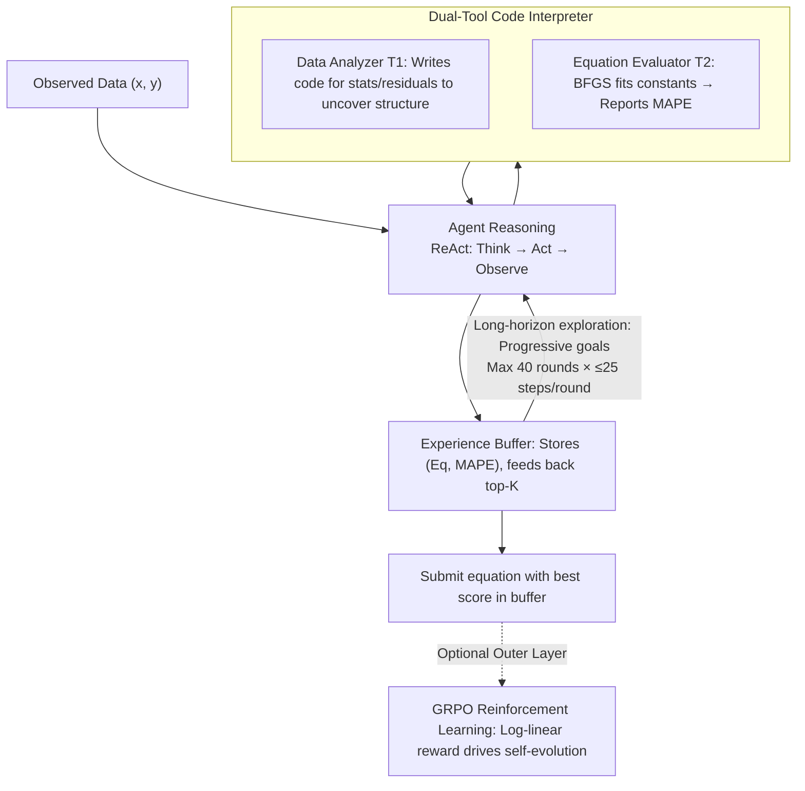

# SR-Scientist: Scientific Equation Discovery With Agentic AI

**Conference**: ICLR 2026  
**arXiv**: [2510.11661](https://arxiv.org/abs/2510.11661)  
**Code**: [GitHub](https://github.com/GAIR-NLP/SR-Scientist)  
**Area**: LLM Agent  
**Keywords**: symbolic regression, agentic AI, equation discovery, reinforcement-learning, scientific discovery

## TL;DR

Ours proposes the SR-Scientist framework, elevating LLMs from simple equation proposers to autonomous AI scientists. By utilizing code interpreter tools for data analysis and equation evaluation, the agent autonomously discovers scientific equations through long-horizon interactions, with capabilities further enhanced via reinforcement learning.

## Background & Motivation

Symbolic Regression (SR) aims to discover interpretable mathematical expressions from observed data and serves as a fundamental task in scientific discovery. Traditional methods are mainly categorized into:
- **Genetic Programming (GP)**: e.g., PySR, GPLearn, which use expression trees for combinatorial search.
- **Deep Learning**: e.g., E2E, NeSymReS, DSR, which learn mappings from numerical values to expressions via neural networks.
- **LLM-Augmented**: e.g., LLM-SR, LaSR, which embed LLMs into GP algorithms as equation proposers.

**Limitations of Prior Work**:
1. LLMs act only as equation generators within fixed pipelines, **lacking autonomy**.
2. They cannot directly analyze observed data using tools to gain insights.
3. Most work focuses solely on the inference stage and does not explore **self-evolution** through methods like RL.

**Goal**: Construct a scientific discovery framework centered on Agentic AI, where the LLM is no longer a passive tool but an autonomous agent driving the entire discovery lifecycle.

## Method

### Overall Architecture

The goal of SR is to infer the underlying mathematical expression from observed data $(\mathbf{x}, y)$. SR-Scientist wraps an LLM as an autonomous agent operating under the ReAct framework: rather than generating an equation in one shot, it iteratively performs "reasoning $\rightarrow$ tool use $\rightarrow$ observation" to explore the data. In each step, it can invoke two code interpreter tools to analyze data or evaluate equations. Validated optimal equations are stored in a cross-round experience buffer. The process iterates multiple rounds with progressive accuracy goals (configured for a maximum of $N=40$ rounds and $M=25$ interaction steps per round), finally submitting the best-scoring equation from the buffer. The evaluation metric is the Mean Absolute Percentage Error $\text{MAPE} = \frac{100\%}{n} \sum_{i=1}^{n} \left| \frac{y_i - f(\mathbf{x}_i)}{y_i} \right|$. A GRPO reinforcement learning layer can be added to enable self-evolution from the agent's exploration trajectories.

### Key Designs

**1. Dual-Tool Code Interpreter: Enabling "Hands-on" Analysis**

**Design Motivation**: The bottleneck of existing LLM-SR methods is that LLMs guess equations based only on text descriptions without seeing the raw data. SR-Scientist encapsulates two tools: the Data Analyzer $T_1$ links directly to observed data, allowing the agent to write code for statistics, residual plotting, and relationship mapping. The Equation Evaluator $T_2$ takes an equation skeleton with constant placeholders, fits them using BFGS, and reports the MAPE, decoupling "form proposal" from "parameter tuning." This loop allows the agent to observe, hypothesize, and verify like a human scientist. Removing $T_1$ results in a $\sim 28\%$ drop in accuracy for GPT-based variants.

**2. Experience Buffer: Bypassing Context Limits via Heap Structures**

Long-horizon exploration generates numerous candidate equations. SR-Scientist maintains a buffer $E = \{(e_i, s_i)\}_{i=1}^{N}$ recording explored equations $e_i$ and their MAPE scores $s_i$. At the start of each iteration, only the top-$K$ best equations are retrieved as context examples. This transfers valuable historical experience across iterations while keeping context length manageable, acting as an external memory of "best attempts."

**3. Long-Horizon Iterative Exploration: Depth of Search**

The discovery process is decomposed into $N=40$ iterations, each with a progressive accuracy goal $G_i$. The agent is allowed up to $M=25$ steps of reasoning-tool interaction per iteration. This high limit (exceeding typical 10–20 step agent loops) provides the budget necessary for repetitive trial-and-error, detailed data analysis, and equation refinement.

### Loss & Training

To enable self-evolution, SR-Scientist is trained using GRPO. Since SR performance is continuously measurable, a binary reward would lose gradient information. Thus, the reward is designed as a log-linear mapping:
$$\mathcal{R} = \text{clip}\left(\frac{\lg s_{\max} - \lg s}{\lg s_{\max} - \lg s_{\text{goal}}}, 0, 1\right)$$
where $s$ is the best MAPE in the trajectory, $s_{\max}$ is the upper bound for non-zero reward, and $s_{\text{goal}}$ is the target accuracy. The log scale ensures that "reducing error from 10% to 1%" and "from 1% to 0.1%" provide equal reward increments.

## Key Experimental Results

### Main Results

Accuracy results on the LSR-Synth benchmark (129 problems across 4 disciplines):

| Method | Overall Acc₀.₀₁ | Overall Acc₀.₀₀₁ | Materials Acc₀.₀₁ | Chemistry Acc₀.₀₁ | Biology Acc₀.₀₁ | Physics Acc₀.₀₁ |
|------|-----------------|-------------------|------------------|-------------|---------------|---------------|
| PySR | 29.46 | 14.47 | 53.33 | 25.93 | 16.67 | 25.76 |
| LLM-SR (Qwen-480B) | 41.08 | 18.09 | 80.00 | 36.11 | 30.56 | 28.79 |
| SR-Scientist (GPT-120B) | **63.57** | **49.35** | 74.67 | **81.48** | **66.67** | 40.91 |
| SR-Scientist (GLM) | 48.32 | 25.06 | 81.33 | 45.37 | 40.28 | 36.37 |
| SR-Scientist (Qwen-480B) | 49.09 | 24.55 | **86.67** | 40.74 | 50.00 | 34.09 |
| SR-Scientist (30B) | 32.30 | 16.02 | 81.33 | 22.22 | 22.22 | 18.18 |
| SR-Scientist (30B+RL) | 40.92 | 20.69 | 85.33 | 37.38 | 29.17 | 25.00 |

**Key Findings**: SR-Scientist outperforms baselines by 6%–35% across four models, with GPT-OSS-120B achieving the highest performance. RL training yields significant gains across all disciplines.

### Ablation Study

| Method | Acc₀.₀₁ | Acc₀.₀₀₁ |
|------|---------|----------|
| SR-Scientist (GPT) | 63.57 | 49.35 |
| w/o Data Analyzer $T_1$ | 35.66 | 16.28 |
| w/o Experience Buffer | 57.36 | 41.86 |
| w/o top-k (Random) | 58.14 | 41.86 |

Ablation analysis indicates that:
- The data analysis tool is most critical for the GPT model ($\sim 28$ point drop).
- The experience buffer is most critical for the Qwen model.
- Top-k sampling is superior to random sampling.

### Key Findings

1. **Symbolic Accuracy**: Ours achieves the best performance in recovering ground-truth equations (SA=7.75~8.00) vs. PySR (4.65) and LLM-SR (5.43).
2. **Noise Robustness**: SR-Scientist consistently outperforms others under varying levels of Gaussian noise.
3. **Exploration Horizon**: 25 steps is optimal; 10 steps is insufficient, while additional steps yield diminishing returns.
4. **Tool-Use Behavior**: GPT variants prefer writing residual analysis code, while Qwen/GLM variants rely more on data statistics.

## Highlights & Insights

1. **Paradigm Shift**: Transforms LLMs from passive equation proposers to autonomous AI scientists.
2. **Buffer Design**: Effectively solves context limits via a heap structure, enabling cross-iteration knowledge transfer.
3. **Continuous Reward**: Leverages the measurable nature of SR to design log-linear rewards, avoiding the sparsity issues found in binary (pass/fail) rewards.
4. **Self-Evolution**: RL training allows smaller 30B models to approach the performance of much larger non-RL models, validating the feasibility of agent self-improvement.

## Limitations & Future Work

1. Currently limits input to text, omitting multi-modal data like charts.
2. Significant performance degradation persists in high-noise scenarios.
3. The memory system could be optimized to prevent redundant exploration of known poor equations.
4. While designed for anti-memorization, benchmarks like LSR-Synth are still synthetic rather than real-world discovery scenarios.

## Related Work & Insights

- Compared to FunSearch or AlphaEvolve, SR-Scientist emphasizes agent autonomy and long-horizon interactions.
- The combination of experience buffers and GRPO provides a template for training agents in scientific discovery tasks.
- The modular design (swappable tools and backbones) is highly extensible for other scientific domains.

## Rating

- **Novelty**: ⭐⭐⭐⭐
- **Experimental Thoroughness**: ⭐⭐⭐⭐⭐
- **Value**: ⭐⭐⭐⭐
- **Writing Quality**: ⭐⭐⭐⭐
- **Overall**: ⭐⭐⭐⭐ (4/5)

<!-- RELATED:START -->

## Related Papers

- [\[ICLR 2026\] NewtonBench: Benchmarking Generalizable Scientific Law Discovery in LLM Agents](newtonbench_benchmarking_generalizable_scientific_law_discovery_in_llm_agents.md)
- [\[ICLR 2026\] Towards Multimodal Data-Driven Scientific Discovery Powered by LLM Agents](towards_multimodal_data-driven_scientific_discovery_powered_by_llm_agents.md)
- [\[ICLR 2026\] TusoAI: Agentic Optimization for Scientific Methods](tusoai_agentic_optimization_for_scientific_methods.md)
- [\[ICML 2025\] Evaluating Retrieval-Augmented Generation Agents for Autonomous Scientific Discovery in Astrophysics](../../ICML2025/llm_agent/evaluating_retrieval-augmented_generation_agents_for_autonomous_scientific_disco.md)
- [\[ICLR 2026\] ScienceBoard: Evaluating Multimodal Autonomous Agents in Realistic Scientific Workflows](scienceboard_evaluating_multimodal_autonomous_agents_in_realistic_scientific_wor.md)

<!-- RELATED:END -->
