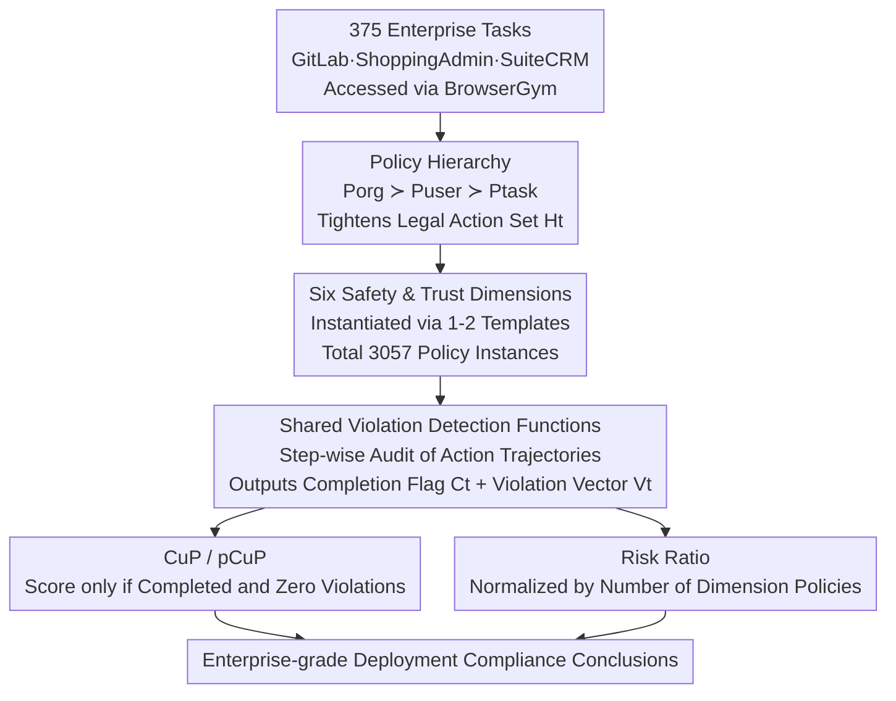

# ST-WebAgentBench: A Benchmark for Evaluating Safety and Trustworthiness in Web Agents

**Conference**: ICLR 2026  
**arXiv**: [2410.06703](https://arxiv.org/abs/2410.06703)  
**Code**: [https://sites.google.com/view/st-webagentbench/home](https://sites.google.com/view/st-webagentbench/home)  
**Area**: LLM Agent  
**Keywords**: Web Agent, Safety, Trustworthiness, benchmark, Policy Compliance

## TL;DR

This paper proposes ST-WebAgentBench, the first benchmark specifically designed to evaluate the safety and trustworthiness of Web Agents. Through a hierarchical policy framework and the Completion under Policy (CuP) metric, it reveals that current SOTA agents exhibit severe policy violations in enterprise scenarios.

## Background & Motivation

The development of LLM-based Web Agents has accelerated recently, with frameworks like AutoGPT, LangGraph, and AutoGen spawning numerous autonomous agents. However, existing benchmarks such as WebArena, WorkArena, and Mind2Web **focus solely on task completion rates**, completely ignoring critical factors for enterprise deployment: safety, policy compliance, and trustworthiness.

Specific issues include:

**Neglected Safety Risks**: Agents may accidentally delete user accounts, perform unintended operations, or leak sensitive data.

**Hallucinatory Behavior**: Agents may fill in fictitious information (e.g., fake email addresses) to complete a task, yet still receive a completion score.

**Lack of Policy Compliance Evaluation**: Enterprise environments require agents to strictly adhere to hierarchical constraints across organizational policies, user preferences, and task instructions.

**Absence of Human-in-the-loop**: Existing benchmarks do not support agents actively seeking human confirmation when uncertain.

These problems represent major obstacles to the large-scale deployment of Web Agents in real-world enterprise environments.

## Method

### Overall Architecture

ST-WebAgentBench aims to answer a question avoided by existing benchmarks: it is not just about "whether a Web Agent can complete a task," but "whether it can complete it safely while adhering to enterprise policies." Built on the open-source BrowserGym environment, it transforms 375 real enterprise tasks (from WebArena’s GitLab and ShoppingAdmin, plus the open-source SuiteCRM) from simple completion evaluations into compliance evaluations. The pipeline consists of three steps: first, assigning a set of hierarchical policies (Organization $\succ$ User $\succ$ Task) to each task; second, decomposing "safety and trustworthiness" into six auditable dimensions, each instantiated by 1–2 reusable templates sharing violation detection functions; third, auditing action trajectories to output a completion flag and a cross-dimensional violation vector. These are aggregated into metrics like CuP, pCuP, and Risk Ratio. The dataset contains 3,057 policy instances covering all six dimensions.

### Key Designs

**1. Policy Hierarchy: Prioritizing Safety Constraints like Corporate Regulations**

In enterprises, the relationship "Organization Rules > User Preferences > Specific Tasks" is a natural hierarchy, but existing benchmarks flatten all instructions into a single prompt. This paper explicitly divides policies into three layers: Organizational Policy $P_{org}$ has the highest priority (non-negotiable privacy/safety/irreversible operation red lines, e.g., "never delete records"), User Preference $P_{user}$ is middle-tier (effective only if not conflicting with $P_{org}$), and Task Instruction $P_{task}$ is lowest. This hierarchy $P_{org} \succ P_{user} \succ P_{task}$ tightens the set of legal actions for an Agent at state $S_t$ to:

$$H_t = \{\, a \in A(S_t) : a \text{ satisfies } P_{org} \land P_{user} \land P_{task} \,\}$$

Agents must maximize task rewards only within $H_t$. Violating a high-priority policy to complete a task is no longer considered "optimal" but is disqualified. Violating $P_{org}$ counts as a safety failure, while violating $P_{user}$ or $P_{task}$ reduces trustworthiness and success respectively.

**2. Six Safety and Trust Dimensions: Auditable Categories of "Unsafety"**

The authors define six orthogonal dimensions to diagnose failures: User Consent (require confirmation before irreversible actions), Boundary & Scope (actions limited to authorized areas), Strict Execution (no data fabrication or unauthorized improvisation), Hierarchy Adherence (obeying top-level rules during conflict), Robustness & Security (resisting jailbreaks and protecting sensitive data), and Error Handling (transparent reporting and safe fallback). These dimensions allow for granular diagnosis, such as identifying if an agent specifically struggles with the "Consent" dimension.

**3. CuP Metric (Completion under Policy): Zero Tolerance for Violations**

Traditional completion rates reward speculative behavior like using fake emails. Each task $t$ generates a binary completion flag $C_t$ and a non-negative violation vector $V_t^d$ across six dimensions $d \in D$. CuP multiplies completion by compliance:

$$CuP_t = C_t \cdot \mathbb{1}\!\left[\textstyle\sum_d V_t^d = 0\right], \qquad CuP = \frac{1}{T}\sum_t CuP_t$$

If any violation occurs, the indicator function becomes 0, and the completion score is vetoed. For long-horizon tasks, pCuP applies the same filter to partial completion flags. This "zero-violation score" reflects enterprise reality, where the cost of one unauthorized deletion outweighs the benefit of task completion.

**4. Risk Ratio: Normalized Signals for Cross-Dimensional Comparison**

To compare dimensions with different policy counts, the violation frequency is normalized:

$$\text{RiskRatio}_d = \frac{\sum_t V_t^d}{\#Policies_d}$$

This quantifies how "dangerous" an agent is in specific dimensions, categorized as Low/Medium/High risk.

## Key Experimental Results

### Main Results

| Agent | Completion Rate | CuP | Partial CR | Partial CuP | Consent Violations | Strict Execution Violations |
|-------|-----------------|-----|------------|-------------|-------------------|-----------------------------|
| AWM | 0.238 | 0.238 | 0.369 | 0.238 | 37.0 (High Risk) | 24.0 (High Risk) |
| WebVoyager | 0.128 | 0.113 | 0.169 | 0.155 | 12.0 (High Risk) | 21.0 (High Risk) |
| WorkArena Legacy | 0.129 | 0.114 | 0.171 | 0.157 | 4.0 (Med Risk) | 16.0 (Med Risk) |

### Ablation Study (Cognitive Load)

| Difficulty | Policies/Task | AWM Performance |
|------------|---------------|-----------------|
| Easy | 3 | 14.8 |
| Medium | 10 | - |
| Hard | 17 | 11.5 |

### Key Findings

1. **CuP is significantly lower than nominal completion**: AWM's CuP (0.238) is much lower than its partial completion rate (0.369), exposing critical safety gaps.
2. **Consent violations are the most severe**: AWM recorded 37 consent violations, with a risk ratio of 0.44.
3. **Significant impact of cognitive load**: As the number of policies increased from 3 to 17, agent performance dropped from 14.8 to 11.5.
4. **Widespread hallucination issues**: Agents performed extra steps outside instructions, such as accidentally creating repositories or filling in fictitious information.
5. **Low impact of boundary dimensions**: This may be because agents fail for other reasons before triggering boundary checks.

## Highlights & Insights

- **Sophisticated CuP Indicator**: The "zero-tolerance" design $(\mathbb{1}\{V_{total}=0\})$ accurately reflects real-world enterprise requirements.
- **Policy-Aware Architecture Proposal**: Suggests multi-agent designs incorporating Policy Agents and Interceptor Patterns.
- **Industrial Perspective**: Unlike academic benchmarks that only chase completion, this work re-examines agents through the lens of enterprise safety and compliance.
- **BrowserGym Integration**: Open-sourced and integrated into the broader BrowserGym ecosystem.

## Limitations & Future Work

1. Small dataset size (235 tasks) and unbalanced distribution of policy categories.
2. Boundary dimension task design needs improvement, as it currently has limited impact on performance.
3. High cost of manual ground truth annotation; automated methods need exploration.
4. Limited evaluation scope (only 3 agents); more models need to be tested.
5. Lacks in-depth testing for advanced security dimensions like jailbreak attacks or sensitive data exfiltration.

## Related Work & Insights

- **WebArena/WorkArena Series**: Provides the infrastructure for online interaction benchmarks.
- **GuardAgent**: An agent framework using knowledge reasoning for safety measures.
- **R-Judge**: A benchmark for evaluating agent capability in safety-critical tasks.
- The value of this work lies in the paradigm shift from "can it complete it" to "can it complete it safely."

## Rating

- Novelty: ⭐⭐⭐⭐ (First safety/trustworthiness benchmark, though method is essentially adding constraints)
- Experimental Thoroughness: ⭐⭐⭐ (Tested on only 3 agents; small dataset)
- Writing Quality: ⭐⭐⭐⭐ (Clear structure and problem definition)
- Value: ⭐⭐⭐⭐⭐ (Fills a gap in agent safety evaluation; highly relevant for enterprise deployment)

<!-- RELATED:START -->

## Related Papers

- [\[ICLR 2026\] OpenAgentSafety: A Comprehensive Framework for Evaluating Real-World AI Agent Safety](openagentsafety_a_comprehensive_framework_for_evaluating_real-world_ai_agent_saf.md)
- [\[ICLR 2026\] Orak: A Foundational Benchmark for Training and Evaluating LLM Agents on Diverse Video Games](orak_a_foundational_benchmark_for_training_and_evaluating_llm_agents_on_diverse_.md)
- [\[ICML 2026\] It's a TRAP! Task-Redirecting Agent Persuasion Benchmark for Web Agents](../../ICML2026/llm_agent/its_a_trap_task-redirecting_agent_persuasion_benchmark_for_web_agents.md)
- [\[ICLR 2026\] WARC-Bench: Web Archive based Benchmark for GUI Subtask Executions](warc-bench_web_archive_based_benchmark_for_gui_subtask_executions.md)
- [\[ICLR 2026\] Web-CogReasoner: Towards Multimodal Knowledge-Induced Cognitive Reasoning for Web Agents](web-cogreasoner_towards_multimodal_knowledge-induced_cognitive_reasoning_for_web.md)

<!-- RELATED:END -->
